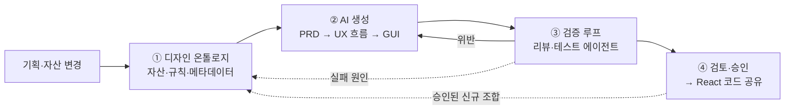
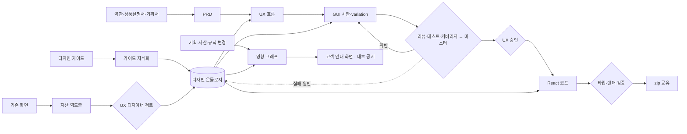

# 디자인 온톨로지 기반 AI UX·GUI 생성 PoC 요구사항

| 항목 | 내용 |
|---|---|
| 상태 | 초안 v0.7 (2026-09-23). 고객 목적(골) 중심으로 정리 |
| 근거 | 요구사항 인터뷰(2026-09-23), 고객 미팅 기록(M-0826 생성형 AI 과제, M-0903 UX AI 플랫폼, M-0922 과제 운영) |
| 성격 | 혁신금융 신청 전 PoC. 고객 운영 환경에는 반입하지 않음 |
| 실행 기반 | Amazon Bedrock AgentCore |
| 사용자 접점 | 웹 플랫폼 |
| 공개 등급 | 공개 가능. 고객사 식별 정보, 인명, 타사명을 적지 않음(§7) |

---

## 1. 고객이 풀고 싶은 문제

고객사 A(은행)의 신상품은 **약관·상품설명서 → 화면 기획 → 디자인 → 퍼블리싱 → 개발** 순서로 만들어지고, 단계마다 흐름이 끊깁니다.

- 현업은 화면설계서를 쓰는 데 2~3주를 씁니다. UX팀은 그 설계서를 "해석이 아니라 해독"해야 하고, 결국 다시 그립니다.
- 디자인 시스템에는 토큰과 기본 컴포넌트만 있습니다. 그 위의 조합 단위와 사용 규칙은 사람 머릿속에만 있습니다.
- AI로 화면을 만들면 겉보기에는 그럴듯하지만 가이드가 깨지고, 조건별 화면과 메뉴가 빠집니다. 결국 사람이 다시 검증하고 고칩니다.
- 디자인이 코드와 연결되어 있지 않아서, 개발로 넘어갈 때 또 한 번 다시 만듭니다.

고객이 원하는 최종 상태는 이렇습니다: **"디자인은 껍데기이고, 뒤에 코드가 모두 매핑되어 있어 개발은 데이터만 붙이면 된다."** (M-0903)

## 2. 고객의 골

| 골 | 내용 | 근거 |
|---|---|---|
| **G1. 화면 자산화** | 화면을 AI가 읽을 수 있는 자산 체계(디자인 온톨로지)로 만듭니다. 고객은 이것을 아키텍처나 RAG보다 앞서는 **진짜 병목**이라고 했습니다. 핵심은 "언제 어떤 데이터를 불러오는가"를 섬세하게 정의한 메타데이터입니다. | M-0903 |
| **G2. 설계서 없는 기획 → 화면** | 현업 화면설계서 대신 약관·상품설명서에서 바로 PRD와 UX 흐름을 만듭니다. | M-0903 |
| **G3. 믿을 수 있는 AI 생성** | 가이드가 깨지지 않고 조건별 화면이 빠지지 않아야 합니다. 사람이 다시 만지는 역기능 없이 사람 개입(HITL)을 최소화합니다. | M-0903, M-0826 |
| **G4. 코드가 붙은 디자인** | 승인된 화면은 실제 컴포넌트 기반의 React 코드로 개발에 넘어갑니다. 화면에서 동작하는 데모로 끝나면 다시 구축해야 합니다. | M-0903, M-0922 |
| **G5. 변경에 강한 구조** | 기획이나 공통 디자인이 바뀌면 영향받는 곳을 그래프로 찾아내고, 필요한 안내를 만듭니다. | 인터뷰, M-0903 |
| **G6. 한곳에서 함께** | 기획 → 디자인 → 개발의 순차 인계 대신, 한 작업공간에서 AI와 함께 동시에 논의하고 진행합니다. | 인터뷰 |

**PoC의 목표**는 대표 상품 1건으로 G1~G4가 **끝까지 이어지는 것**을 증명하는 것입니다: 온톨로지 → PRD → UX 흐름 → GUI → 검증 → 승인 → React 코드. G5와 G6은 그 위에서 보여 줍니다. 넓이보다 끝까지 이어지는 것이 우선입니다.

---

## 3. 해법의 구조: 네 개의 고리

1. **온톨로지가 출발점입니다(G1).** 생성 품질은 여기서 결정됩니다.
2. **AI는 온톨로지 안에서 조립합니다(G2).** 약관과 기획에서 PRD를 만들고, PRD에서 UX 흐름을, 흐름의 각 화면을 자산으로 조립해 GUI를 만듭니다.
3. **검증 루프를 통과한 것만 사람에게 갑니다(G3).** AI는 호출할 때마다 결과가 달라 규칙을 빼먹으므로, 리뷰와 테스트를 맡은 에이전트가 먼저 거릅니다(M-0903 합의).
4. **승인된 것만 React 코드가 되어 공유됩니다(G4).**

온톨로지는 두 방향의 되먹임으로 자랍니다.
- **실패에서 배우기**: 검증 실패와 반려 사유는 빠진 규칙이나 메타데이터로 돌아갑니다. "화면이 이렇게 나오려면 기획과 약관에 무엇이 있어야 하는가"라는 역산 지식도 여기서 쌓입니다.
- **성공에서 배우기**: 승인된 새 조합이 반복되면 공통 자산으로 승격됩니다.

---

## 4. 사용자와 역할

| 역할 | 하는 일 | 승인 |
|---|---|---|
| 기획자 | 약관·상품설명서·기획 입력, PRD 확정 | PRD 확정 |
| UX 디자이너 | 온톨로지 구축·검토, UX 흐름·GUI 검토와 수정 | 온톨로지 반영, UX·GUI 승인 |
| 퍼블리셔·개발자 | React 코드 검토와 수령 | 코드 수락 |
| 운영자 | 조직 단위 자산·규칙 공개(IAM 전용 경로) | 조직 공개 |
| AI 에이전트 | 추출, 생성, 검증, 리뷰, 영향 분석 | **없음.** 모든 승인은 사람이 합니다. |

- 1차 사용자는 UX팀과 기획팀입니다(M-0826). 개발자 없이도 모든 작업이 웹 UI에서 끝나야 합니다.
- 자산 열람은 기획·디자인 직원 전체에게 엽니다.

---

## 5. 기능 요구사항

우선순위: **P0** PoC 필수, **P1** PoC 목표, **P2** 이후.

### 5.1 디자인 온톨로지 (G1)

| 계층 | 의미 | 책임(UX SM 모델) |
|---|---|---|
| Foundation · Atom | 토큰과 기본 컴포넌트(디자인 시스템에 있음) | 형태와 상태 |
| Molecule | 재사용되는 작은 조합 | **인텐트**: 무엇을 위한 조합인가 |
| Organism · Pattern | 업무 영역. 상위 선택에 따라 하위 구성이 바뀌는 "코어 오가니즘" 포함 | **구성·룰·관계**: 어떤 조건에서 무엇이 붙고 빠지는가 |
| Page Template | 화면 전체 구조 | **구조·위치** |
| Screen · Procedure | 실제 화면과 업무 절차(단계 순서와 분기) | 단계 순서와 조건 |

계층 사이에 **상품 조건, 업무 규칙, 가이드라인 규칙**이 관계로 연결됩니다. 가이드라인에는 디자인 시스템, UI 가이드, UX 라이팅, 그래픽, 콘텐츠 운영 가이드가 포함됩니다. 모든 자산은 "언제 어떤 데이터를 불러오는가"를 메타데이터로 가집니다.

| ID | 요구사항 | 우선 |
|---|---|---|
| O-01 | 위 계층, 관계, 메타데이터를 담는 온톨로지를 제공합니다. 자산마다 **와이어프레임, GUI, 코드의 3개 레이어**를 한 묶음으로 가집니다(M-0826). | P0 |
| O-02 | **가이드라인 지식화**: 가이드 문서(텍스트, 표, 도식)를 페이지 인용이 붙은 규칙으로 바꿉니다. 조건부 필수 요소 규칙을 포함합니다. 예: "자격 미충족이면 사유와 대체 행동을 노출", "가입 절차에는 약관 동의 단계가 있어야 함" | P0 |
| O-03 | **기존 화면에서 역도출**: 운영 중인 화면에서 반복되는 조합을 AI가 찾아 몰큘, 오가니즘, 템플릿 후보로 제안합니다. 반복 사용 여부가 승격 기준입니다(M-0903). | P0 |
| O-04 | **AI는 초안, 확정은 사람**: 메타데이터와 규칙은 AI가 초안을 쓰고 UX 디자이너가 확정합니다. 고객 실험에서 AI만으로 정의한 메타데이터는 결과가 어긋났습니다(M-0903). | P0 |
| O-05 | **생성으로 검증**: 온톨로지를 바꾸면 기준 화면 세트를 다시 생성해, 결과가 좋아졌는지 나빠졌는지로 변경의 품질을 판단합니다. | P0 |
| O-06 | **버전과 변경 사유**: 자산과 규칙은 버전, 변경 사유, 승인자를 가지며, 두 버전의 차이를 볼 수 있습니다. 수명주기는 초안 → 활성 → 폐기 예정 → 보관입니다. AI 산출물은 스스로 활성이 될 수 없습니다. | P0 |
| O-07 | **자산 열람**: 계층, 업무, 화면 유형, 사용 화면 기준으로 자산을 찾아보고, 그 자산을 쓰는 실제 화면 예시를 함께 봅니다. | P0 |
| O-08 | **현업 확장**: UX팀이 개발자 없이 규칙, 자산, 메타데이터, 검증 항목을 추가하고 고칠 수 있습니다. 코드 배포 없이 다음 생성부터 반영되고, O-06의 절차를 거칩니다. | P0 |
| O-09 | **하이브리드 검색**: 약관과 가이드 본문은 의미 검색으로, 규칙·화면·자산의 관계는 그래프 순회로 찾아 생성 컨텍스트를 만듭니다. 정확도 차이는 PoC에서 직접 측정합니다. | P1 |
| O-10 | **브랜드 분리**: 고유 로고, 캐릭터, 브랜드 이미지는 공통 자산에서 분리하고, 공통 패턴만 재사용 자산으로 만듭니다. | P1 |
| O-11 | **운영 공수 측정**: 자산을 운영하는 공수가 사람이 하던 방식보다 가벼워지는지 측정합니다. 미팅에서 운영 공수가 결국 사람 수준으로 돌아온 타사 사례가 언급되었습니다. | P1 |

### 5.2 PRD와 UX 흐름 (G2)

| ID | 요구사항 | 우선 |
|---|---|---|
| P-01 | 약관, 상품설명서, 기획서에서 AI가 **PRD**를 만듭니다. PRD에는 상품 조건, 자격, 분기, 필수 고지, 흐름 초안이 들어가고, 모든 항목에 원문 인용이 붙습니다. 현업 화면설계서를 대체하는 것이 목적입니다. | P0 |
| P-02 | 금액, 금리, 기간은 원문의 값을 그대로 씁니다. AI가 바꾸어 쓰지 않습니다. | P0 |
| P-03 | 기획자가 PRD를 확인하고 확정합니다. | P0 |
| U-01 | PRD와 절차(Procedure) 자산으로 **UX 흐름**을 만듭니다. 흐름은 화면 노드와 조건 전이로 구성됩니다. | P0 |
| U-02 | **케이스별 흐름**: 조건 조합(우대 조건 유무, 자동이체 여부, 자격 미충족 등)을 고르면 해당 경로를 flowchart로 보여 줍니다. 모든 분기에는 도착 화면이 있어야 합니다. | P0 |
| U-03 | **화면 유형별 전략**: 정형은 템플릿에 값만 채웁니다. 반정형은 상품 조건에 따라 조건부 화면이나 오가니즘을 넣고 뺍니다. 비정형은 자산을 새로 조합합니다. 유형은 요청이 기존 자산으로 얼마나 덮이는지로 계산합니다. PoC는 정형·반정형 수신 상품부터 합니다(M-0903). | P0 |
| U-04 | 산출물은 파일이 아니라 **화면에서** 보여 주고, 버전마다 무엇이 왜 바뀌었는지 함께 보여 줍니다. | P0 |
| P-04 | 생성 실패 사례에서 "PRD와 약관에 무엇이 있어야 하는가"를 체크리스트로 쌓습니다. 이 체크리스트는 상품 출시 프로세스 재설계(약관 작성을 앞단으로 옮기는 것)에 쓰입니다. | P1 |

### 5.3 GUI 생성 (G2, G3)

| ID | 요구사항 | 우선 |
|---|---|---|
| G-01 | 흐름의 각 화면을 온톨로지 자산으로 조립해 GUI를 만듭니다. 온톨로지에 없는 구조는 "신규 자산 후보"로 표시합니다. | P0 |
| G-02 | **레이아웃 시안 N개**(기본 3개): 같은 요건으로 서로 다른 레이아웃을 만들어 나란히 비교하고 고릅니다. Figma 없이 플랫폼에서 variation을 만들어 Figma 의존도를 낮춥니다. 디자인 이미지는 참고 입력으로만 씁니다. | P0 |
| G-03 | **상태·케이스 variation**: 흐름의 분기에서 빈 상태, 오류, 미자격, 0건/N건, 로딩, 완료 화면을 자동으로 도출합니다. | P0 |
| G-04 | **부분 수정 안정성**: "이것 하나만 추가·변경" 요청은 지정한 곳 밖을 바꾸지 않습니다. 수정 전후를 비교해 다른 곳이 흔들리면 실패로 처리합니다. 고객이 가장 괴로워한 반복 작업입니다(M-0903). | P0 |
| G-05 | 화면에서 영역을 지정해 부분 수정을 지시할 수 있고, 모든 수정은 라운드로 기록됩니다. | P1 |
| G-06 | 고객 세그먼트별 콘텐츠·화면 순서 추천, 직원 아이디어 기반 프로세스 실험, A/B 변형 관리 | P2 |

### 5.4 검증 루프 (G3)

| ID | 요구사항 | 우선 |
|---|---|---|
| V-01 | **검증 그래프**: 리뷰 에이전트와 테스트 에이전트가 생성 결과를 검사하고, 마스터 에이전트가 결과를 종합합니다. 통과한 것만 사람의 검토 대기열에 올립니다. 최대 라운드를 넘으면 사람에게 넘깁니다. | P0 |
| V-02 | 리뷰 에이전트는 PRD 부합, 조건부 필수 요소, 가이드라인, UX 라이팅을 봅니다. 테스트 에이전트는 렌더링, 상호작용, 접근성, 큰글씨 모드, 부분 수정 회귀를 봅니다. 모든 지적에는 근거 규칙과 원문 인용이 붙습니다. | P0 |
| V-03 | **커버리지 검사**: 상품 조건 → 분기 → 화면 → 필수 요소를 온톨로지 그래프로 따라가며 빠진 것을 찾습니다. "이 조건이면 이 메뉴가 나와야 하는데 안 나오는" 문제를 잡는 것이 핵심입니다. | P0 |
| V-04 | Critical 위반이 남아 있으면 승인할 수 없습니다. | P0 |
| V-05 | **사람 개입 계측**: 산출물마다 사람의 수정 횟수, 수정 범위, 반려 사유를 기록합니다. 반려 사유는 온톨로지 보강 후보로 돌려보냅니다. | P0 |

### 5.5 승인과 React 코드 공유 (G4)

| ID | 요구사항 | 우선 |
|---|---|---|
| A-01 | UX 디자이너가 흐름과 GUI를 검토해 승인합니다. 승인은 정확한 산출물 버전에 묶이며, 입력이 바뀌면 다시 승인해야 합니다. | P0 |
| R-01 | 승인된 GUI를 입력으로, 온톨로지 자산의 코드 레이어(실제 컴포넌트 매핑)를 써서 **React 코드**를 만듭니다. 코드는 고객의 화면 식별 체계, 화면 메타정보, 컴포넌트 라이브러리 규약을 따릅니다. | P0 |
| R-02 | 생성된 코드는 타입 검사와 렌더 비교(승인된 GUI 대비)를 통과해야 합니다. | P0 |
| R-03 | **공유**: 화면 코드, 화면 목록(ID, 버전, 승인 기록), 변경 요약, 검증 리포트를 zip으로 개발팀에 전달합니다. | P0 |
| R-04 | 디자인 산출 코드가 어디까지 맡고 FE 개발 조직이 어디부터 맡는지는 합의로 정하고(Q-04), 플랫폼 설정에 반영합니다. | P1 |
| R-05 | Git 저장소로 전달 | P2 |

### 5.6 변경 영향과 안내 (G5)

| ID | 요구사항 | 우선 |
|---|---|---|
| C-01 | 상품 조건, 컴포넌트, 가이드라인 규칙, 공통 절차(인증, 약관 동의, 완료 등) 중 하나가 바뀌면, 영향받는 화면·자산·문구를 온톨로지 관계로 찾아 **그래프로** 보여 줍니다. 항목마다 왜 영향받는지 경로도 보여 줍니다. | P0 |
| C-02 | 영향받은 화면만 재생성 대상으로 표시하고, 역할별 작업 목록을 만듭니다. | P1 |
| C-03 | **고객용 안내 화면**: 고객에게 보이는 변경이면 안내 화면과 공지 초안을 만들어 같은 흐름(생성 → 검증 → 승인)으로 보냅니다. | P1 |
| C-04 | **내부 변경 안내**: 무엇이 왜 바뀌었는지, 영향 범위와 담당을 담은 공지를 관련 역할에게 보냅니다. | P1 |

### 5.7 한곳에서 함께 (G6)

| ID | 요구사항 | 우선 |
|---|---|---|
| W-01 | 상품 단위의 작업공간에서 PRD, 흐름, GUI, 코드, 검증 결과, 영향 그래프를 연결해 봅니다. 댓글은 화면, 흐름 노드, 규칙에 붙습니다. | P0 |
| W-02 | **역할별 AI 리뷰어**: 기획·디자인·개발 관점의 에이전트가 변경에 각자 의견을 답니다. 의견은 제안이며 승인 효력이 없습니다. | P1 |
| W-03 | **동시 진행**: 확정 전의 PRD로도 흐름, GUI, 코드 초안을 병렬로 만듭니다. PRD가 바뀌면 영향받은 부분만 다시 만듭니다. | P1 |
| W-04 | 논의에서 나온 결정은 변경 사유와 버전 기록으로 남습니다. | P1 |

---

## 6. AgentCore 아키텍처

> 구현 순서: AgentCore 실행 기반(B0 원장·입력 승인·공유 어댑터 → B1 권한·실측 게이트 → B2 서비스 연동)을 먼저 완성하고, 그 위에 이 PoC를 첫 수직 슬라이스(C)로 올립니다. 계획: [docs/superpowers/plans/2026-09-24-design-poc-roadmap.md](docs/superpowers/plans/2026-09-24-design-poc-roadmap.md)

기존 계약(`platform/workspace/AGENTCORE_CONTRACT.md`, `platform/docs/ARCHITECTURE.md`)의 실행 원칙을 따릅니다. 서명된 실행 권한, 전용 Gateway, Identity 기반 자격증명, 격리된 Interpreter·Browser, 권한 없는 Memory입니다. 계약과 충돌하면 계약이 우선하고, 충돌은 문서 충돌로 보고합니다.

### 6.1 에이전트

| 고리 | 에이전트 | 하는 일 |
|---|---|---|
| ① 온톨로지 | 가이드 지식화, 자산 역도출, 비식별 | 가이드를 규칙으로, 기존 화면을 자산 후보로 만듭니다. 브랜드·식별 정보를 분리합니다. |
| ② 생성 | PRD, UX 흐름, GUI, React 코드 | 약관에서 PRD, PRD에서 흐름, 흐름에서 GUI(시안·variation), 승인된 GUI에서 코드를 만듭니다. |
| ③ 검증 | 리뷰, 테스트, 커버리지, 마스터 | 규칙·PRD 부합, 렌더·상호작용·회귀, 분기·필수 요소 누락을 검사하고 종합 판정합니다. |
| 변경·협업 | 영향·안내, 역할별 리뷰어 | 영향 그래프와 안내를 만들고, 관점별 의견을 답니다. |
| 조율 | 오케스트레이터 | 작업을 나누고, 병렬로 생성하고, 재생성 범위를 계산합니다. |

모든 에이전트는 **제안만** 합니다. 기록, 승인, 공개는 사람이 승인한 뒤 서버의 신뢰된 경로에서만 이루어집니다.

### 6.2 구성요소

| 구성요소 | 용도 | 제약 |
|---|---|---|
| Runtime | 에이전트 실행, 장시간 작업(대량 역도출), 진행 상황 스트리밍 | 모델 호출은 경계 검사(`engine/gate.py`)를 거칩니다. |
| Gateway (MCP) | 온톨로지 조회·제안, 가이드 검색, 그래프 순회, 패키징 도구 | 기존 뱅크 Gateway와 분리합니다. 확정·게시 도구는 모델에 노출하지 않습니다. |
| Identity | 사용자 → 에이전트 위임, 워크로드 자격증명 | 토큰은 프롬프트, Memory, 로그에 넣지 않습니다. |
| Code Interpreter | 문서·이미지 분석, 기존 화면 코드 정적 분석, GUI 조립, 타입 검사, 패키징 | 자격증명이 없습니다. 가져온 코드를 실행하지 않습니다. |
| Browser | GUI·코드 렌더링, 상호작용·접근성·큰글씨 검사, 수정 전후 비교, 스크린샷 증거 | 외부 요청을 차단하고, 로컬 한글 폰트를 씁니다. |
| Memory | 작업자·프로젝트의 최근 결정과 선호 **참조** | 장기 추출 전략을 쓰지 않습니다. 정본을 대신하거나 권한을 주지 않습니다. |
| Observability | 에이전트·도구·검증 라운드 트레이스, 사람 개입 계측, 비용 | 원문 프롬프트와 원본 데이터를 남기지 않습니다. |
| Evaluations · Policy (선택) | 검증기 품질 측정, 도구 호출 정책 | 리전 가용성과 데이터 등급을 확인하고 계약을 개정한 뒤에 씁니다. |

### 6.3 흐름

---

## 7. 원칙과 제약

### 7.1 범위

- **PoC 범위**: 정형·반정형 수신 상품 영역의 온톨로지, 대표 상품 1건의 전 과정(PRD → 흐름 → GUI → 검증 → 승인 → React 코드 zip), 변경 영향 그래프, 공유 작업공간
- **이후**: 비정형 화면, 다른 업무 영역 확장, 세그먼트 추천과 A/B(G-06), Git 전달
- **범위 밖**: 고객 운영 환경 반입·배포. 개발망의 실제 소스로 검증하고 실제 앱에서 동작시키는 일은 별도 트랙입니다(M-0903). 이 PoC는 그 트랙이 그대로 받아 쓸 수 있는 코드와 전달 형식(R-01, R-03)을 보장합니다.

### 7.2 데이터

- 혁신금융 신청 전 PoC입니다. 고객 자료(가이드, 설계서, 화면 코드, 실험 산출물)는 배포 전 참고용으로만 쓰며, 사용 승인은 확인되었습니다. 승인 근거를 보관합니다.
- 외부 모델에는 비식별 처리한 뒤 필요한 최소 범위만 보냅니다. 전송 이력은 감사 로그로 남겨 혁신금융 신청 자료로 씁니다.
- 개인신용정보는 다루지 않습니다.

### 7.3 공개

- 이 repo, 가이드북, 데모 사이트, 시연 영상은 공개 대상입니다. 공개 대상에는 고객사명, 앱명, 상품명, 실제 화면 ID, 고객 패키지명, 내부 URL, 인명, 부서명, 내부 관리번호를 넣지 않습니다.
- 공개 데모는 같은 구조의 합성 데이터를 씁니다. 공개 경로마다 자동 스캔으로 차단합니다.
- 고객 원본 폴더(`samples/`)는 커밋하지 않습니다. 이 폴더는 현재 `.gitignore`에 없으므로 추가해야 합니다. tracked 파일 일부에 고객사명이 이미 들어 있어 정리해야 합니다.

### 7.4 비기능

- **코드 수준 산출**: 화면 데모로 끝나지 않도록 설계합니다. 토큰 자산화, 컴포넌트 기반 코드, 인증·권한, 감사 로그를 처음부터 갖춥니다(M-0922).
- **추적성**: 모든 산출물은 입력 원본, 온톨로지 버전, 모델, 승인으로 연결됩니다.
- **재현성**: 같은 입력으로 반복 생성했을 때 결과가 얼마나 흔들리는지 측정합니다.
- **보안**: 공개 진입점은 CloudFront 하나로 두고, 사용자는 초대로만 가입시킵니다.
- **롤아웃**: AgentCore 경로는 기존 검증 게이트(`platform/docs/ONTOLOGY_AGENTCORE_VALIDATION.md`)를 통과한 뒤에만 켭니다. 실패하면 다른 경로로 조용히 대체하지 않습니다.
- **비용**: 상품 단위로 모델과 에이전트 사용량, 비용을 집계합니다.

---

## 8. 성공 기준

| 골 | 기준 | 측정 | 목표(제안값) |
|---|---|---|---|
| G1 | 온톨로지로 조립 가능 | 대상 영역의 정형·반정형 화면 중 자산만으로 조립할 수 있는 비율, 승격된 자산 수 | 기준선 기록 후 개선 |
| G2 | 설계서 없는 흐름 | 대표 상품의 흐름과 분기가 실제 운영 흐름과 일치하는 정도 | 100% |
| G3 | 조건별 누락 없음 | 결함을 심은 기준 세트에서 분기 화면·필수 요소 누락을 탐지한 비율 | ≥ 90% |
| G3 | 품질 게이트 | 승인된 산출물의 Critical 위반 | 0건 |
| G3 | 사람 개입 감소 | 수정 없이 승인된 비율, 산출물당 수정 횟수 | 기준선 대비 개선 |
| G3 | 부분 수정 안정성 | 지정 영역 밖이 바뀐 건수 | 0건 |
| G4 | 코드가 붙은 디자인 | 생성 코드의 타입 검사 통과율, 실제 운영 화면과의 컴포넌트 일치도 | 100%, ≥ 80% |
| G5 | 변경 영향 | 공통 자산 1개를 바꿨을 때 실제 사용 화면을 역추적한 재현율 | 100% |
| G6 | 리드타임 | 기획 확정에서 코드 전달까지 걸린 시간(순차 인계 대비) | 기준선 기록 |

목표 수치는 착수 전에 확정합니다(Q-01).

---

## 9. 미결 질문

| ID | 질문 |
|---|---|
| Q-01 | 성공 기준 목표 수치와 대표 상품 선정 |
| Q-02 | "코어 오가니즘"을 온톨로지 계층의 어디에 둘지(Organism, Pattern, 별도 계층 중 하나) |
| Q-03 | 자산 승격 임계값(반복 횟수, 사용 맥락 수)과 결정권자 |
| Q-04 | 디자인 산출 코드와 FE 개발 조직의 경계 |
| Q-05 | UX팀의 기존 실험 지식 체계를 온톨로지 정본으로 이어받을지, 가져오기·내보내기로 병행할지 |
| Q-06 | 그래프 저장소 선택(관리형 그래프 DB 여부)과 검색용 임베딩 모델 |

---

## 부록 A. 고객이 지금 일하는 방식 (참고)

아래는 요구사항이 아니라 현재 업무 방식에 대한 배경 설명입니다. 원본은 로컬에만 있으며 공개하지 않습니다.

- **디자인 가이드**: 디자인 시스템, UI 가이드라인, UX 라이팅, 그래픽 리소스, 콘텐츠 운영 가이드를 PDF와 PPTX 문서로 운영합니다.
- **화면설계서**: 업무별 PPTX로 작성합니다. 변경 이력, 요구사항, 화면목록, IA, 흐름도, 화면별 설명으로 구성됩니다. 변경 사유는 이력의 "내용" 칸에 섞여 있습니다.
- **퍼블리싱**: 화면 ID 기반 경로와 화면 메타정보를 가진 React 코드로 전달합니다. 코드는 고객 컴포넌트 라이브러리를 씁니다.
- **업무 진행**: 기획서 → 약관·설명서 → 디자인 이미지 → 퍼블 코드 순서로 흘러갑니다. Figma 원본은 사내로 반출할 수 없고 이미지만 가져올 수 있습니다.
- **UX팀 실험**: UX팀은 AI용 UX 지식 저장소를 이미 실험하고 있습니다. 계층은 Foundation → Atom → Molecule → Organism → Pattern → Page Template → Screen → Procedure입니다. 기존 자산으로 덮이는 정도에 따라 생성 경로를 나누고, 반복 사용을 기준으로 자산을 승격합니다. 아직 비어 있는 부분은 단위별 인텐트와 데이터 메타데이터, 변경 사유, 검증 에이전트, 실제 코드 생성입니다.
