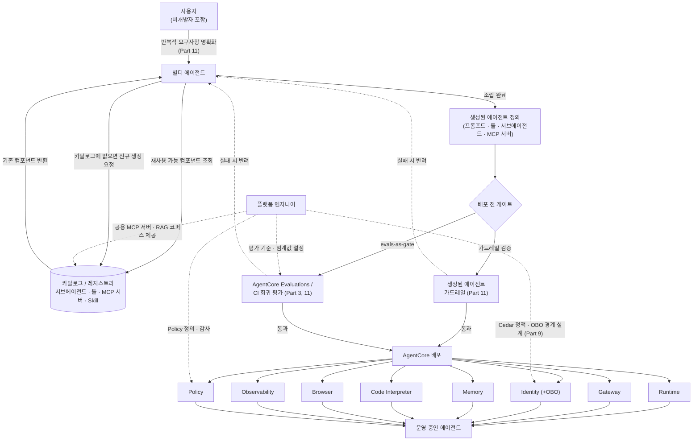

# 메타플랫폼 전체 그림

::: tip 이 장에서 얻는 것
- "에이전트를 만드는 에이전트" 파이프라인을 요구사항 대화 → 조립 → 배포 → 게이팅 → 운영의 5단계로 분해한 지도
- 각 단계가 이 책의 어느 Part(3, 9, 10, 11)와 맞물리는지에 대한 상호 참조
- AgentCore 구성요소(Runtime/Gateway/Identity/Memory/Code Interpreter/Browser/Observability/Policy/Evaluations)의 확인된 GA·preview 시점
- 플랫폼 엔지니어가 이 그림에서 담당하는 세 가지 책무: 카탈로그 운영, 세밀 권한 경계, 배포 게이트
:::

## 왜 문제가 되는가

지금까지의 "에이전트 애플리케이션"은 개발자가 요구사항을 코드로 옮기는 단일 산출물이었다. 메타플랫폼은 이 관계에 레이어를 하나 더 얹는다. 사용자(비개발자를 포함)가 빌더 에이전트와 대화하고, 빌더 에이전트가 그 대화를 바탕으로 또 다른 에이전트를 조립·배포한다. [애플리케이션이 아니라 플랫폼](/00-intro/what-is-agentic-platform)에서 다룬 구분— "우리가 만드는 것은 에이전트가 아니라 에이전트를 만드는 시스템"이라는 전제가 여기서부터 구체적인 파이프라인으로 내려온다.

이 구조는 새로운 위험 표면을 만든다. 빌더 에이전트는 정의상 IAM 역할·MCP 서버·서브에이전트·프롬프트를 조합해 새 실행 단위를 만들어내는 권한을 갖는다. 이는 곧 "코드를 배포할 권한을 가진 에이전트"이며, 잘못 설계하면 빌더 에이전트 자체가 권한 상승 경로가 된다. 동시에 사용자 입장에서는 요구사항이 처음부터 완전하지 않고, 대화를 통해서만 명확해진다는 문제도 있다. 이 장은 이 두 문제 — "요구사항이 어떻게 구체화되는가"와 "구체화된 요구사항이 어떻게 안전하게 실행 가능한 에이전트가 되는가" — 를 하나의 그림으로 묶어서 보여주는 데 목적이 있다. 각 단계의 세부 구현은 해당 Part에 위임하고, 이 장에서는 단계 간 인터페이스와 플랫폼 엔지니어의 위치만 명확히 한다.

## 핵심 개념

### 5단계 파이프라인

1. **요구사항 대화** — 사용자가 빌더 에이전트와 반복적으로 대화하며 요구사항을 명확화한다. 초기 요청은 대부분 불완전하거나 모호하므로, 빌더 에이전트는 명확화 질문·예시 제시·제약조건 확인을 반복한다. 세부 대화 설계는 [요구사항 대화](/11-builder-agent/requirements-dialogue)에서 다룬다.
2. **조립** — 빌더 에이전트가 명확화된 요구사항을 실행 가능한 컴포넌트 집합(서브에이전트, 툴, MCP 서버, Skill)으로 매핑한다. 이때 매번 새로 만드는 것이 아니라 카탈로그에서 기존 컴포넌트를 재사용하는 것을 우선하고, 없는 경우에만 신규 생성 경로를 탄다. 카탈로그·레지스트리 설계는 [카탈로그와 레지스트리](/11-builder-agent/catalog-registry)에서 다룬다.
3. **배포** — 조립된 에이전트 정의가 AgentCore의 각 구성요소를 통해 end-to-end로 배포된다. Runtime이 실행 환경을, Gateway가 툴 접근을, Identity가 신원과 위임을, Memory가 상태를, Code Interpreter와 Browser가 샌드박스 실행 환경을, Observability가 추적을, Policy가 세밀한 행동 통제를 담당한다. 구성요소별 심화는 [AgentCore 심화 개관](/10-agentcore/)의 각 챕터에서 다룬다.
4. **게이팅** — 배포 직전에 가드레일 검증과 evals-as-gate가 끼어든다. 여기를 통과하지 못하면 배포가 진행되지 않는다. [AWS 평가 서비스](/03-accuracy-eval/aws-evaluations), [생성된 에이전트 가드레일](/11-builder-agent/generated-agent-guardrails), [에이전트 CI/CD](/11-builder-agent/agent-cicd)에서 각각 평가 기준, 가드레일 정의, 파이프라인 배선을 다룬다.
5. **운영** — 배포 이후 플랫폼 엔지니어가 소유하는 영역이다. 플랫폼 엔지니어는 개별 에이전트를 만들지 않는다. 대신 공용 MCP 서버·RAG 코퍼스 같은 공용 리소스를 제공하고, Cedar·OBO(On-Behalf-Of) 기반의 세밀한 권한 통제를 설계·감사한다. [세밀 권한 제어 개관](/09-authorization/)이 이 책무를 다룬다.

아래 그림은 이 5단계가 서로 어떻게 물리는지, 그리고 플랫폼 엔지니어가 파이프라인의 어느 지점에 개입하는지를 보여준다.

이 그림에서 플랫폼 엔지니어는 점선으로 표시된 세 곳 — 카탈로그, Identity/Policy, 평가 임계값 — 에만 직접 개입한다. 나머지 실선 경로(사용자 대화부터 배포까지)는 빌더 에이전트와 AgentCore가 자동으로 처리한다. 플랫폼 엔지니어의 역할은 "에이전트를 만드는 것"이 아니라 "에이전트를 만드는 시스템의 경계를 설계하는 것"이다.

### AgentCore 구성요소: 확인된 사실과 시점

Amazon Bedrock AgentCore는 "임의의 프레임워크·모델·프로토콜로 만든 에이전트를 빌드·배포·운영하기 위한 에이전틱 플랫폼"으로 공식 정의된다.[^overview] 2025-07-16 preview로 발표되었고, 2025-10-13에 9개 AWS 리전에서 GA 되었다.[^ga] GA 시점에 VPC/PrivateLink/CloudFormation/태깅 지원이 추가되었고, Runtime은 최대 8시간 실행 윈도우와 완전한 세션 격리, A2A(Agent-to-Agent) 프로토콜 지원을 받았다.[^ga]

- **Runtime / Gateway / Identity / Memory / Code Interpreter / Browser Tool / Observability**는 공식 개요 문서에 나열된 핵심 구성요소다.[^overview] Gateway는 기존 API·Lambda를 MCP 도구로 변환해 노출하는 역할을 한다.[^gateway] Runtime/Gateway/Identity/Observability의 세부 동작은 [Runtime 심화](/10-agentcore/runtime-deep-dive), [Gateway 심화](/10-agentcore/gateway-deep-dive), [Identity 심화](/10-agentcore/identity-deep-dive), [Observability 심화](/10-agentcore/observability-deep-dive)에서 다룬다. Memory, Code Interpreter, Browser Tool의 세부 스펙(용량, 격리 모델 등)은 이 장에서 수치를 창작하지 않고 [Tools 심화](/10-agentcore/tools-deep-dive)로 위임한다 — 확인 필요.
- **Identity의 On-Behalf-Of(OBO) 토큰 교환**은 실제 기능이다. 기존 OAuth Credential Provider에 내장되어 있고 OAuth 2.0 Token Exchange(RFC 8693)를 구현하며, 인바운드 사용자 토큰을 에이전트 신원과 호출자 신원을 모두 담은 스코프 제한 다운스트림 토큰으로 교환한다.[^obo-docs] "What's New" 공지는 2026-04에 게시되었다.[^obo-news] 신규 기능이므로 스코프 매핑 API 등 세부는 devguide 최신판으로 재확인이 필요하다.
- **Policy**는 자연어로 작성한 정책을 Cedar로 컴파일해 Gateway를 지나는 에이전트-툴 트래픽에 적용하는 기능이다.[^policy-news] 2025-12-02에 Evaluations와 함께 preview로 발표되었고,[^preview-bundle] 2026-03에 GA 되었다.[^policy-ga] Guardrails를 Policy에 통합하는 기능은 2026-06에 GA,[^policy-guardrails] temporal policy·rate limiting은 2026-08에 발표되었다.[^policy-temporal] 발표 시점이 이 책의 집필 시점(2026-08)과 가까우므로, 실제 배포 시에는 최신 devguide로 세부 동작을 재확인해야 한다.
- **Evaluations**도 2025-12-02 preview,[^preview-bundle] 2026-03-31 GA로 확인된다.[^eval-ga] 13개 내장 평가자(helpfulness, tool selection, accuracy 등)를 제공하며, 프로덕션 트래픽을 지속 샘플링하는 online evaluation과 CI/CD 회귀 테스트용 on-demand evaluation 두 모드를 지원한다.[^eval-docs] 이는 [AWS 평가 서비스](/03-accuracy-eval/aws-evaluations)와 [에이전트 CI/CD](/11-builder-agent/agent-cicd)에서 다루는 evals-as-gate의 실행 기반이 된다.

::: warning 미정착 영역 — AgentCore Policy와 Amazon Verified Permissions의 관계
AgentCore Policy는 Cedar 정책 언어로 컴파일된다고 공식 자료에 명시되어 있다.[^policy-news] 반면 Amazon Verified Permissions는 이미 성숙한 별도 서비스로서 동일한 Cedar 언어를 사용하는 범용 인가 서비스다.[^avp] 두 서비스가 (a) AgentCore Policy가 내부적으로 Verified Permissions 엔진을 호출하는 구조인지, (b) Gateway에 붙는 별도의 Cedar 평가 엔진을 새로 구현한 것인지는 조사한 공식 문서에서 명확히 확인되지 않았다. 이 책에서는 두 서비스를 "Cedar라는 공통 언어를 공유하지만 별개로 취급해야 하는 서비스"로 다루고, 정확한 결합 관계는 각 팀이 배포 전 devguide에서 재확인할 것을 권장한다. Cedar·Verified Permissions 자체의 심화는 [Cedar와 Verified Permissions](/09-authorization/cedar-verified-permissions)에서 다룬다.
:::

::: warning 미정착 영역 — 빌더 에이전트의 자율성 범위
빌더 에이전트가 카탈로그에 없는 컴포넌트를 만날 때, "즉시 신규 생성 후 배포"까지 자율적으로 수행할지, 아니면 신규 생성 지점마다 인간 승인(HITL)을 강제할지는 조직마다 다르게 결정한다. 완전 자율 쪽은 반복 작업 처리량을 높이지만 카탈로그 오염과 권한 상승 경로를 늘린다. HITL 강제 쪽은 안전하지만 "비개발자가 대화만으로 에이전트를 만든다"는 메타플랫폼의 핵심 가치 제안을 약화시킨다. 이 트레이드오프에 대한 업계 표준은 아직 없다 — 각 조직의 리스크 허용도에 따라 결정 표의 기준으로 판단해야 한다.
:::

## 결정 표

| 상황 | 선택 | 이유 | 트레이드오프 |
|---|---|---|---|
| 빌더 에이전트가 카탈로그에 없는 MCP 서버가 필요하다고 판단 | 신규 생성은 별도 승인 워크플로를 거치게 하고, 카탈로그 재사용을 항상 먼저 시도 | 신규 생성마다 권한·엔타이틀먼트 검토가 필요하므로 무제한 자동 생성은 위험 | 승인 대기 시간만큼 사용자 경험이 느려짐 |
| 생성된 에이전트의 배포 전 검증 | 가드레일 검증 + evals-as-gate를 CI 파이프라인의 하드 블로킹 단계로 배선 | 경고만 표시하면 임계값 미달 에이전트가 그대로 프로덕션에 나갈 수 있음 | 회귀 평가 데이터셋 유지·갱신 비용 발생 |
| 생성된 에이전트가 다운스트림 API를 호출할 때 신원 전달 | Identity OBO로 사용자 신원을 보존한 스코프 제한 토큰 사용 | 에이전트 자체 신원만으로 호출하면 confused deputy 위험이 커짐 | 토큰 교환 왕복으로 인한 추가 지연 |
| 공용 리소스(MCP 서버, RAG 코퍼스) 소유권 | 플랫폼 엔지니어링 팀이 중앙에서 소유·버저닝, 개별 빌더 에이전트는 참조만 | 중복 구축 방지, 엔타이틀먼트 스코핑을 한 곳에서 강제 가능 | 중앙 팀이 병목이 될 수 있음 — 셀프서비스 등록 경로 필요 |
| Policy(Cedar) 변경 배포 방식 | 스테이징 환경에서 시뮬레이션 후 프로덕션 반영 | Policy는 실행 중인 에이전트의 행동 범위를 바꾸므로 코드 배포와 동일한 신중함 필요 | 시뮬레이션 환경 구축·유지 비용 |

## 실패 모드

| 증상 | 근본 원인 | 확인 방법 | 해결 |
|---|---|---|---|
| 배포된 에이전트가 예상 밖의 툴·리소스에 접근 | 카탈로그에 등록된 MCP 서버의 스코프가 필요 이상으로 넓게 설정됨 | Gateway 접근 로그와 실제 호출 툴 목록을 대조 | 스코프를 최소 권한으로 재정의, [세밀 권한 제어 개관](/09-authorization/) 기준 적용 |
| evals-as-gate를 통과했는데 프로덕션에서 회귀 발생 | on-demand evaluation 데이터셋이 실제 사용 분포를 대표하지 못함 | online evaluation 지표와 CI on-demand 지표를 주기적으로 비교 | online evaluation에서 발견된 실패 케이스를 CI 데이터셋에 정기 반영 |
| 빌더 에이전트가 동일 기능의 서브에이전트/툴을 반복 생성 (카탈로그 재사용 실패) | 카탈로그 검색 품질 저하 또는 등록 메타데이터 부재·불일치 | 카탈로그 재사용률(hit rate)을 계측해 하락 추세 확인 | 등록 스키마 강제, 임베딩 기반 검색 품질 재검증 — [카탈로그와 레지스트리](/11-builder-agent/catalog-registry) |
| 배포된 에이전트의 다운스트림 호출이 403으로 실패 | Identity Credential Provider의 스코프 매핑 오류, 또는 OBO 미적용으로 confused deputy 방지 로직 누락 | AgentCore Identity 로그와 OAuth token exchange 응답 코드 확인 | [OAuth 토큰 교환과 MCP](/09-authorization/oauth-token-exchange-mcp), [Confused deputy 문제](/09-authorization/confused-deputy) 참조해 위임 경로 재설계 |
| Policy(Cedar) 변경 후 정상 동작하던 에이전트가 갑자기 툴 호출 거부됨 | 정책 변경이 스테이징 시뮬레이션 없이 프로덕션에 직접 반영됨 | Policy 변경 이력과 거부된 호출의 타임스탬프 대조 | 정책 변경도 코드 배포처럼 스테이징 시뮬레이션·롤백 경로 확보 |

## 안티패턴

- ❌ 빌더 에이전트에 IAM 관리자급 권한을 부여해 필요한 리소스를 스스로 프로비저닝하게 한다 → ✅ 플랫폼 엔지니어가 사전 승인한 역할·정책 템플릿 카탈로그에서만 선택하게 한다.
- ❌ evals-as-gate를 "경고만 표시"로 설정해 배포를 막지 않는다 → ✅ 최소 회귀 임계값 미달 시 CI/CD 파이프라인에서 하드 블록한다([에이전트 CI/CD](/11-builder-agent/agent-cicd)).
- ❌ 요청마다 새 MCP 서버를 즉석 생성한다 → ✅ 카탈로그에서 기존 서버를 우선 재사용하고, 신규 생성은 명시적 승인 경로를 통과하게 한다.
- ❌ AgentCore Policy를 "한 번 설정하면 끝"이라고 가정하고 Cedar 정책을 검증 없이 프로덕션에 직접 배포한다 → ✅ 정책 변경도 스테이징에서 시뮬레이션한 뒤 배포한다.
- ❌ 플랫폼 엔지니어가 개별 생성 에이전트의 프롬프트·로직까지 직접 검토하려 한다 → ✅ 플랫폼 엔지니어는 경계(카탈로그, 권한, 게이트)를 설계하고, 개별 에이전트의 내용 검증은 evals-as-gate와 가드레일에 위임한다.

## 계측 (SLI)

- **카탈로그 재사용률**: 빌더 에이전트가 조립한 컴포넌트 중 신규 생성이 아닌 카탈로그 재사용 비율. 낮아지는 추세는 검색 품질 저하 또는 메타데이터 문제의 선행 지표.
- **게이트 통과율 / 차단율**: evals-as-gate와 가드레일 검증에서 배포가 차단된 비율. 지나치게 낮은 차단율은 임계값이 느슨하다는 신호일 수 있다.
- **OBO 토큰 교환 오류율**: Identity의 On-Behalf-Of 토큰 교환 실패 비율. 급증 시 스코프 매핑 또는 다운스트림 신뢰 관계 문제를 의심.
- **요구사항 대화 시작~운영 배포 소요 시간 (time-to-deployed-agent)**: 파이프라인 전체의 리드타임. 게이트나 승인 워크플로가 병목인지 판단하는 기준.
- **배포 후 Policy 위반 카운트**: Policy가 GA된 이후 실제로 차단한 위반 행동 수. 0에 가까우면 정책이 무의미하게 느슨하거나, 애초에 위험한 행동을 하는 에이전트가 없다는 뜻 — 둘을 구분하려면 의도적 red-team 요청으로 정책이 작동하는지 별도 검증이 필요하다.

## 체크리스트

- [ ] 빌더 에이전트의 컴포넌트 조립 권한이 카탈로그 화이트리스트로 제한되어 있는가
- [ ] 신규 컴포넌트 생성 경로에 명시적 승인 단계가 있는가, 아니면 완전 자율인가 — 조직의 리스크 허용도와 일치하는가
- [ ] 배포 전 evals-as-gate 임계값과 실패 시 하드 블록이 CI/CD에 실제로 연결되어 있는가 (경고만 표시하는 우회 경로가 없는가)
- [ ] 생성된 에이전트의 다운스트림 호출이 OBO로 사용자 신원을 보존하는가
- [ ] Cedar 기반 Policy 변경이 스테이징 시뮬레이션을 거쳐 프로덕션에 반영되는가
- [ ] 공용 MCP 서버·RAG 코퍼스의 엔타이틀먼트 스코핑이 카탈로그 등록 시점에 강제되는가
- [ ] Observability가 요구사항 대화 → 조립 → 배포 → 운영 전 구간의 trace를 하나로 연결하는가
- [ ] AgentCore 각 구성요소(Policy, Evaluations, Identity OBO 등 최근 발표된 기능)의 실제 동작을 최신 devguide로 재확인했는가 — 발표 시점과 배포 시점 사이 세부 스펙이 바뀔 수 있음

## 참고

- [^overview]: [What is Amazon Bedrock AgentCore](https://docs.aws.amazon.com/bedrock-agentcore/latest/devguide/what-is-bedrock-agentcore.html)
- [^gateway]: [Introducing Amazon Bedrock AgentCore Gateway](https://aws.amazon.com/blogs/machine-learning/introducing-amazon-bedrock-agentcore-gateway-transforming-enterprise-ai-agent-tool-development/)
- [^ga]: [Amazon Bedrock AgentCore is now generally available](https://aws.amazon.com/about-aws/whats-new/2025/10/amazon-bedrock-agentcore-available); [AWS Blog — Introducing Amazon Bedrock AgentCore](https://aws.amazon.com/blogs/aws/introducing-amazon-bedrock-agentcore-securely-deploy-and-operate-ai-agents-at-any-scale)
- [^obo-docs]: [On-Behalf-Of token exchange — AgentCore devguide](https://docs.aws.amazon.com/bedrock-agentcore/latest/devguide/on-behalf-of-token-exchange.html)
- [^obo-news]: [AWS What's New — Amazon Bedrock AgentCore (2026-04)](https://aws.amazon.com/about-aws/whats-new/2026/04/amazon-bedrock-agentcore/); [구현 블로그 — Implement On-Behalf-Of token exchange](https://aws.amazon.com/blogs/machine-learning/implement-on-behalf-of-token-exchange-for-multi-tenant-agents-with-amazon-bedrock-agentcore-gateway/)
- [^preview-bundle]: [AWS What's New — Amazon Bedrock AgentCore Policy & Evaluations preview (2025-12-02)](https://aws.amazon.com/about-aws/whats-new/2025/12/amazon-bedrock-agentcore-policy-evaluations-preview)
- [^policy-news]: [AWS Blog — Amazon Bedrock AgentCore adds quality evaluations and policy controls](https://aws.amazon.com/blogs/aws/amazon-bedrock-agentcore-adds-quality-evaluations-and-policy-controls-for-deploying-trusted-ai-agents/)
- [^policy-ga]: [AWS What's New — Policy for Amazon Bedrock AgentCore generally available (2026-03)](https://aws.amazon.com/about-aws/whats-new/2026/03/policy-amazon-bedrock-agentcore-generally-available/)
- [^policy-guardrails]: [AWS What's New — Amazon Bedrock AgentCore Policy Guardrails generally available (2026-06)](https://aws.amazon.com/about-aws/whats-new/2026/06/amazon-bedrock-agentcore-policy-guardrails-generally-available/)
- [^policy-temporal]: [AWS What's New — Temporal policies for AgentCore (2026-08)](https://aws.amazon.com/about-aws/whats-new/2026/08/temporal-policies-agentcore/)
- [^eval-ga]: [AWS What's New — AgentCore Evaluations generally available (2026-03-31)](https://aws.amazon.com/about-aws/whats-new/2026/03/agentcore-evaluations-generally-available)
- [^eval-docs]: [AgentCore Evaluations — devguide](https://docs.aws.amazon.com/bedrock-agentcore/latest/devguide/evaluations.html)
- [^avp]: [What is Amazon Verified Permissions](https://docs.aws.amazon.com/verifiedpermissions/latest/userguide/what-is-avp.html)
- 관련 챕터: [애플리케이션이 아니라 플랫폼](/00-intro/what-is-agentic-platform) · [요구사항 대화](/11-builder-agent/requirements-dialogue) · [카탈로그와 레지스트리](/11-builder-agent/catalog-registry) · [생성된 에이전트 가드레일](/11-builder-agent/generated-agent-guardrails) · [에이전트 CI/CD](/11-builder-agent/agent-cicd) · [AWS 평가 서비스](/03-accuracy-eval/aws-evaluations) · [AgentCore 심화 개관](/10-agentcore/) · [세밀 권한 제어 개관](/09-authorization/) · [Cedar와 Verified Permissions](/09-authorization/cedar-verified-permissions)
