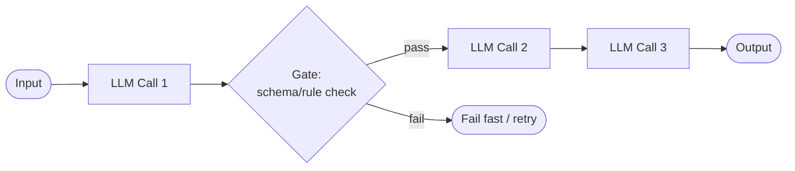
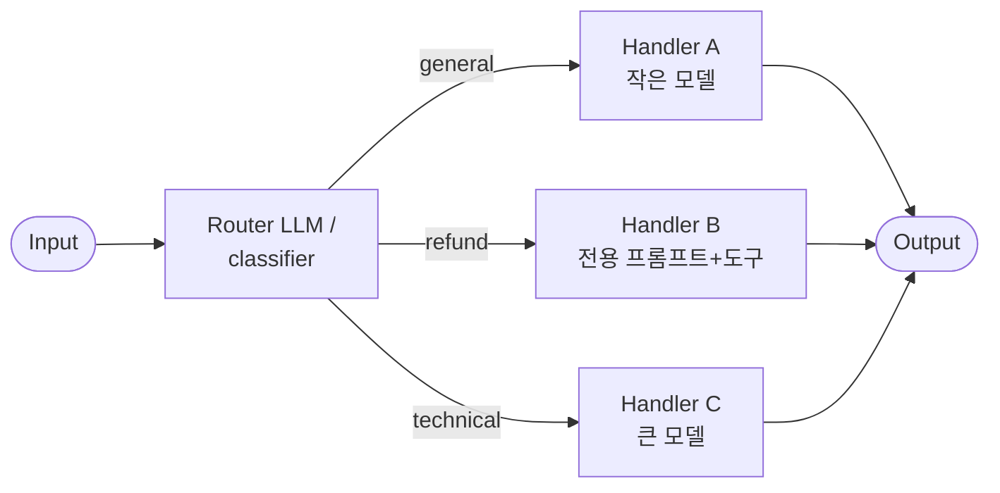
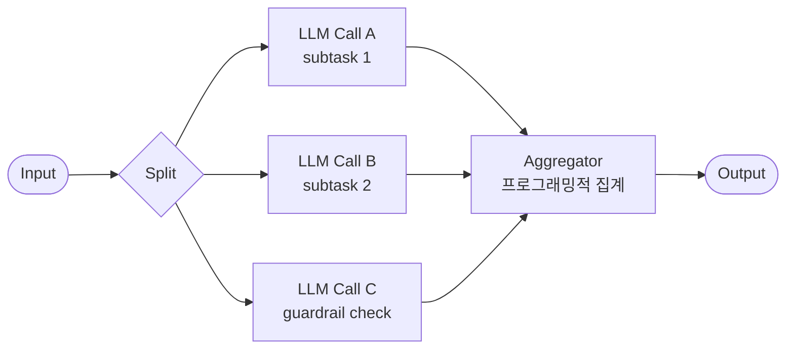
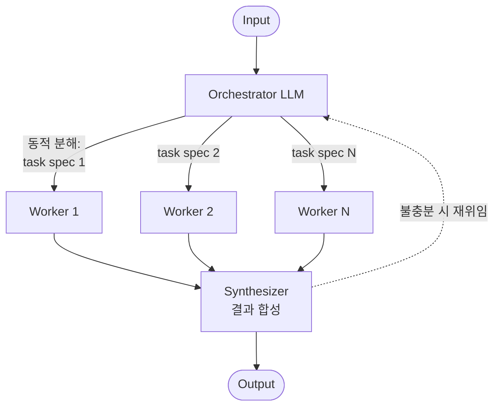
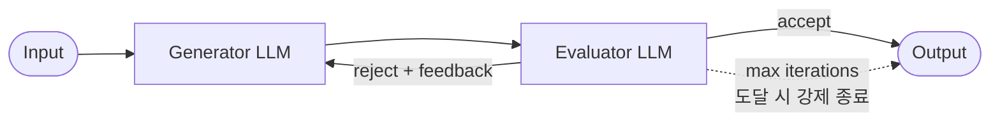

# 오케스트레이션 패턴

::: tip 이 장에서 얻는 것
- Anthropic "Building effective agents"가 정의한 5개 워크플로우 패턴의 구조·적용 조건·트레이드오프를 한 장의 결정 표로 압축한다.
- 각 패턴이 프로덕션에서 실제로 깨지는 지점 — orchestrator의 잘못된 분해, voting의 오답 수렴, chaining의 오류 누적 — 을 실패 모드 표로 정리한다.
- 패턴별로 무엇을 계측해야 하는지(SLI), 그리고 이 패턴들을 플랫폼의 템플릿/블루프린트로 카탈로그화하는 방법을 다룬다.
:::

> 이 장은 **패턴 카탈로그와 구현 시 고려사항**에 집중한다. "애초에 워크플로우로 충분한가, 에이전트가 필요한가"라는 상위 결정은 [에이전트 vs 워크플로우](/01-agent-design/agent-vs-workflow)에서, "단일 에이전트로 버틸 것인가, 멀티 에이전트로 갈 것인가"라는 논쟁은 [단일 vs 멀티 에이전트](/01-agent-design/single-vs-multi-agent)에서 다룬다.

## 왜 문제가 되는가

LLM 호출 하나로 끝나지 않는 작업은 결국 **여러 호출을 어떤 토폴로지로 연결할 것인가**라는 문제로 귀결된다. 이 토폴로지 결정은 정확도·지연·비용·디버깅 가능성을 동시에 좌우하는데, 프로덕션에서 흔히 보이는 실패는 두 극단에서 나온다.

첫째, **토폴로지 없이 하나의 거대한 프롬프트에 모든 것을 밀어 넣는 경우**. 단계별 검증 지점이 없으므로 중간 오류를 잡을 수 없고, 실패 시 전체를 재실행해야 하며, 어느 단계에서 품질이 무너졌는지 관측할 수 없다.

둘째, **필요 이상으로 복잡한 토폴로지를 처음부터 쌓는 경우**. Anthropic은 "가장 단순한 해법을 찾고, 필요할 때만 복잡도를 추가하라(find the simplest solution possible, and only increase complexity when needed)"를 핵심 원칙으로 제시한다([Building effective agents](https://www.anthropic.com/engineering/building-effective-agents)). 멀티스텝 구조는 비용과 지연을 명시적으로 지불하는 선택이며, 그 대가로 더 나은 태스크 성능을 사는 것이다. 실제로 Anthropic의 계측에 따르면 에이전트는 일반 챗 대비 약 4배, 멀티 에이전트 시스템은 약 15배의 토큰을 소비한다([How we built our multi-agent research system](https://www.anthropic.com/engineering/multi-agent-research-system)).

플랫폼 엔지니어 관점에서 이 문제가 특히 중요한 이유는, 조직 내 팀들이 같은 토폴로지 문제를 각자 다시 풀면서 **검증되지 않은 오케스트레이션 코드가 서비스마다 중복 축적**되기 때문이다. 패턴을 이름 붙여 카탈로그화하고, 각 패턴의 계측 지점과 실패 모드를 표준화해 두면 이 중복을 플랫폼 레벨에서 제거할 수 있다. 이 아이디어는 [빌더 에이전트의 카탈로그/레지스트리](/11-builder-agent/catalog-registry)에서 템플릿 시스템으로 구체화한다.

## 핵심 개념

Anthropic은 "Building effective agents"에서 **workflow**(코드가 미리 정의한 경로로 LLM과 도구를 오케스트레이션)와 **agent**(LLM이 스스로 프로세스와 도구 사용을 지시)를 구분하고, workflow 쪽에 5개의 조합 가능한 패턴을 제시했다([출처](https://www.anthropic.com/engineering/building-effective-agents)). 이 5개가 이 장의 정본(canonical) 카탈로그다. 참조 구현은 Anthropic cookbook의 agents 패턴 노트북에 공개되어 있다([anthropic-cookbook/patterns/agents](https://github.com/anthropics/anthropic-cookbook/tree/main/patterns/agents)).

### 1. Prompt chaining — 순차 분해

작업을 고정된 순서의 하위 단계로 분해하고, 각 LLM 호출이 이전 호출의 출력을 입력으로 받는다. 핵심은 단계 사이에 **프로그래밍적 검증 지점(gate)** 을 둘 수 있다는 것이다.

- **적용 조건**: 작업이 고정된 하위 태스크로 깔끔하게 분해될 때. 마케팅 카피 생성 → 번역, 아웃라인 생성 → 검증 → 본문 작성 같은 사례가 원문에 제시된다.
- **트레이드오프**: 지연을 지불하고 정확도를 산다. 각 호출이 단순해지므로 개별 스텝의 신뢰도는 올라가지만, 왕복 횟수만큼 end-to-end 지연이 늘어난다.
- **구현 고려사항**: gate는 반드시 **결정론적 코드**(schema validation, 정규식, 길이/포맷 체크)로 구현하라. gate까지 LLM으로 만들면 그것은 chaining이 아니라 evaluator-optimizer이고, 비용 구조가 달라진다. 중간 산출물은 전부 저장해서 부분 재실행(resume)이 가능하게 설계한다 — 이는 [신뢰성과 durable execution](/01-agent-design/reliability-durable-execution)의 체크포인트 설계와 직결된다.

### 2. Routing — 분류 후 위임

입력을 먼저 분류하고, 카테고리별로 특화된 프롬프트·모델·도구 세트로 보낸다. 관심사 분리(separation of concerns)가 목적이다.

- **적용 조건**: 입력 카테고리가 뚜렷이 구분되고, 카테고리별로 다른 처리가 더 나은 결과를 낼 때. 원문 예시는 고객 문의 유형별 분기, 그리고 쉬운 질문은 Haiku급·어려운 질문은 Sonnet급으로 보내는 모델 라우팅이다.
- **트레이드오프**: 분류 정확도가 전체 시스템의 상한이 된다. 분류기 자체의 지연·비용이 추가되므로, 카테고리 분포가 한쪽에 몰려 있다면 라우팅의 실익이 없다.
- **구현 고려사항**: 라우터의 출력은 자유 텍스트가 아니라 **enum으로 제약된 structured output**이어야 한다. "어느 쪽도 아님/모호함" 카테고리를 반드시 두고, 그 비율을 계측하라 — 이 비율이 올라가는 것이 라우팅 붕괴의 조기 신호다. 비용 절감 목적의 모델 라우팅은 [모델 라우팅](/02-performance/model-routing)에서 별도로 다룬다.

### 3. Parallelization — sectioning과 voting

여러 LLM 호출을 동시에 실행하고 결과를 프로그래밍적으로 집계한다. 두 변형이 있다.

- **Sectioning**: 서로 독립인 하위 태스크를 병렬 실행. 원문 예시는 본 처리와 guardrail 검사를 별도 호출로 분리하는 것.
- **Voting**: 같은 태스크를 여러 번 실행해 다양한 관점의 출력을 얻고 집계. 원문 예시는 코드 취약점 리뷰를 여러 프롬프트로 병렬 수행하는 것.

- **적용 조건**: 하위 태스크가 진짜로 독립일 때(sectioning), 혹은 단일 시도의 신뢰도가 낮아 여러 관점이 필요할 때(voting). voting의 이론적 배경으로는 self-consistency 계열 연구가 있다([Wang et al., 2022, arXiv:2203.11171](https://arxiv.org/abs/2203.11171)).
- **트레이드오프**: 호출 수에 비례해 비용이 늘어난다. sectioning은 wall-clock 지연을 줄이지만, voting은 지연은 그대로 두고 비용만 N배로 늘려 정확도를 산다.
- **구현 고려사항**: 집계 함수의 계약을 먼저 정의하라 — voting이라면 quorum(k-of-n), 동점 처리, 전원 불일치 시 폴백을 코드로 명시해야 한다. sectioning이라면 "독립"이라는 가정을 테스트로 강제하라: 한 하위 태스크의 출력이 다른 태스크의 입력에 몰래 필요해지는 순간 이 패턴은 조용히 chaining으로 퇴화하고, 병렬 실행은 stale 입력으로 오답을 만든다. 병렬화가 지연에 미치는 효과의 정량 분석은 [스트리밍과 병렬 도구 호출](/02-performance/streaming-parallel-tools)로 미룬다.

### 4. Orchestrator-workers — 동적 분해와 위임

중앙 orchestrator LLM이 태스크를 **동적으로** 분해하고, worker LLM들에게 위임한 뒤, 결과를 합성한다. parallelization과의 차이는 하위 태스크가 미리 정의되지 않고 입력에 따라 orchestrator가 결정한다는 점이다.

- **적용 조건**: 필요한 하위 태스크를 미리 알 수 없는 복잡한 작업. 원문 예시는 여러 파일을 수정하는 코딩 작업, 다중 소스 검색·분석 작업이다.
- **트레이드오프**: 유연성의 대가로 예측 불가능성과 비용을 지불한다. Anthropic의 리서치 시스템 사례에서 lead agent(Opus 4) + subagent(Sonnet 4) 구성이 단일 Opus 4 대비 내부 평가에서 90.2% 더 나은 성능을 냈지만, 토큰 소비는 챗 대비 약 15배였다([출처](https://www.anthropic.com/engineering/multi-agent-research-system)).
- **구현 고려사항**: 이 패턴의 품질은 **orchestrator가 worker에게 넘기는 task spec의 품질**이 결정한다. Anthropic은 초기 버전에서 모호한 지시("반도체 부족을 조사하라" 수준) 때문에 worker들이 작업을 중복하고, 빈틈을 남기고, 필요한 정보를 못 찾는 문제를 보고했다. task spec에는 목표·출력 포맷·사용할 도구·작업 경계(boundary)를 명시해야 한다. 또한 worker 수의 상한, worker당 도구 호출 예산을 코드 레벨에서 강제하라 — 초기 시스템은 단순 질의에 50개 이상의 subagent를 생성하는 폭주를 보였다(같은 출처). 이 패턴을 "멀티 에이전트"로 확장할 것인가의 조직적·아키텍처적 논쟁은 [단일 vs 멀티 에이전트](/01-agent-design/single-vs-multi-agent) 참조.

### 5. Evaluator-optimizer — 생성-평가 루프

한 LLM이 응답을 생성하고, 다른 LLM이 평가·피드백을 주는 루프를 돈다.

- **적용 조건**: 명확한 평가 기준이 존재하고, 반복 개선이 측정 가능한 가치를 줄 때. 원문 기준으로 두 가지를 확인하라: (1) 사람이 피드백을 주면 응답이 실제로 좋아지는가, (2) LLM이 그런 피드백을 줄 수 있는가. 예시는 뉘앙스가 중요한 문학 번역, 다회차 분석이 필요한 복잡한 검색이다.
- **트레이드오프**: 루프 1회마다 생성+평가 2회의 호출 비용과 지연이 추가된다. 평가 기준이 모호하면 루프는 개선 없이 비용만 태운다.
- **구현 고려사항**: **종료 조건을 3중으로** 걸어라 — (a) evaluator의 accept, (b) 최대 반복 횟수, (c) 개선 없음 감지(연속 N회 같은 지적 반복 시 중단). evaluator의 판정은 pass/fail이 아니라 rubric 기반 structured output으로 받아야 generator가 활용할 수 있다. evaluator 프롬프트 설계는 [LLM judge와 trajectory 평가](/03-accuracy-eval/llm-judge-trajectory)와 같은 원칙을 공유한다.

### 패턴은 조합된다

5개 패턴은 배타적 선택지가 아니라 **조합 가능한 빌딩 블록**이다. 원문도 "이 빌딩 블록들은 처방이 아니며, 조합하고 커스터마이즈하라"고 명시한다. 전형적 조합: routing으로 입장을 분기하고, 무거운 경로에서 orchestrator-workers로 분해하고, 최종 산출물에 evaluator-optimizer를 한 겹 씌우는 구조. 단, 조합할 때마다 아래 계측 요구사항도 곱으로 늘어난다는 점을 기억하라.

## 결정 표

| 상황 | 선택 | 이유 | 트레이드오프 |
|---|---|---|---|
| 하위 단계가 고정이고 순서가 자명함 | Prompt chaining | 단계 사이에 결정론적 gate를 박아 오류를 조기 차단 | 왕복 수만큼 지연 증가 |
| 입력 유형이 뚜렷이 갈리고 유형별 최적 처리가 다름 | Routing | 관심사 분리, 유형별 프롬프트·모델 최적화 | 분류 정확도가 상한, 분류기 지연 추가 |
| 하위 태스크가 상호 독립 | Parallelization (sectioning) | wall-clock 지연 단축, 관심사별 집중 | 독립성 가정이 깨지면 stale 입력으로 오답 |
| 단일 시도 신뢰도가 낮고 검증 비용이 큼 | Parallelization (voting) | 다중 관점 집계로 신뢰도 상승 | 비용 N배, 지연은 개선 없음 |
| 하위 태스크를 미리 알 수 없음 (open-ended 분해) | Orchestrator-workers | 입력에 따른 동적 분해·위임 | 토큰 비용 급증(챗 대비 ~15배 사례), 분해 품질에 전체가 종속 |
| 평가 기준이 명확하고 반복 개선이 유효함 | Evaluator-optimizer | 사람 리뷰 루프의 자동화 | 루프당 2회 호출, 기준 모호 시 무한 루프 위험 |
| 위 어느 것도 아니고 경로 자체를 예측할 수 없음 | (이 장 범위 밖) autonomous agent | LLM이 직접 프로세스 결정 | [에이전트 vs 워크플로우](/01-agent-design/agent-vs-workflow) 참조 |

## 실패 모드

| 증상 | 근본 원인 | 확인 방법 | 해결 |
|---|---|---|---|
| chaining 최종 출력 품질이 스텝 수를 늘릴수록 오히려 하락 | 초반 스텝의 오류가 gate 없이 후속 스텝으로 누적 전파 | 스텝별 중간 산출물을 저장·샘플링해 어느 스텝에서 품질이 꺾이는지 추적 | 각 스텝 뒤에 결정론적 gate 추가, 실패 시 fail-fast 후 해당 스텝만 재실행 |
| 특정 유형 요청만 체감 품질 급락 | Router 오분류 — 카테고리 경계가 모호하거나 분포가 학습 시점과 달라짐(drift) | 카테고리별 다운스트림 성공률 분리 계측, "unknown" 라우트 비율 추이 | 카테고리 재설계, 골든셋으로 라우터 단독 정확도 회귀 테스트, 모호 입력은 명시적 fallback 경로로 |
| sectioning 결과 합성 시 하위 결과끼리 모순 | "독립" 가정 위반 — 하위 태스크가 실제로는 공유 컨텍스트에 의존 | 합성 단계에서 모순 감지율 계측, 태스크 간 데이터 의존성 정적 점검 | 의존 있는 구간은 chaining으로 재편, 공유 컨텍스트를 각 병렬 호출에 명시적으로 주입 |
| voting이 자신 있게 오답으로 수렴 | 모든 투표자가 같은 모델·같은 프롬프트 → 오류가 독립이 아니라 상관됨. 다수결은 오류 독립 가정 위에서만 유효 | 정답이 알려진 평가셋에서 "만장일치 오답" 비율 측정 | 프롬프트·모델·컨텍스트를 다양화해 오류 상관을 낮추고, 만장일치라도 결정론적 검증(테스트 실행, schema 체크)을 통과해야 accept |
| orchestrator-workers 결과에 중복과 빈틈이 공존 | orchestrator의 잘못된 분해 — task spec이 모호해 worker들이 경계 없이 겹치거나 빠뜨림 (Anthropic이 초기 리서치 시스템에서 보고한 실패) | worker task spec 로깅 후 유사도 검사(중복), 최종 산출물 대비 커버리지 리뷰(빈틈) | task spec 템플릿에 목표·포맷·도구·경계를 필수 필드로 강제, orchestrator 프롬프트에 분해 휴리스틱 명시 |
| 단순 요청에 worker 폭주로 비용 급증 | orchestrator의 effort scaling 부재 — 요청 난이도와 무관하게 최대 분해 (초기 시스템에서 단순 질의에 50+ subagent 사례) | 요청당 worker 수·토큰 분포 모니터링, p99 이상치 알람 | worker 수·도구 호출 예산을 코드로 상한 설정, orchestrator에 난이도별 자원 배분 규칙 프롬프팅 |
| evaluator-optimizer가 개선 없이 최대 반복까지 돔 | 평가 기준 모호 또는 generator가 피드백을 반영 못 함, 혹은 evaluator가 매번 다른 지적 | 반복 회차별 evaluator 점수 곡선 — 평평하면 루프가 죽은 것 | rubric을 structured output으로 구체화, "개선 없음 N회" 조기 종료, 사람이 피드백을 줬을 때 실제로 좋아지는 태스크인지 재검증 |
| 패턴 도입 후 비용은 늘었는데 품질 지표는 그대로 | 단일 호출로 충분한 태스크에 과잉 토폴로지 적용 | 단일 호출 baseline과 A/B로 품질 delta 측정 | 패턴 제거. "복잡도는 필요할 때만 추가"가 원문의 제1원칙이다 |

## 안티패턴

- ❌ **프레임워크의 그래프 DSL부터 배우고 패턴을 끼워 맞춤** → ✅ 패턴을 먼저 몇 줄의 직접 코드(LLM 호출 + 제어 흐름)로 검증하고, 운영 요구(재시도, 체크포인트)가 생길 때 프레임워크를 평가한다. Anthropic도 추상화 계층이 디버깅을 어렵게 한다고 경고한다([출처](https://www.anthropic.com/engineering/building-effective-agents)). 프레임워크 선택 기준은 [프레임워크 지형도](/01-agent-design/framework-landscape) 참조.
- ❌ **gate·aggregator·종료 조건을 LLM에게 맡김** → ✅ 패턴의 제어 지점(chaining의 gate, parallelization의 집계, evaluator 루프의 종료)은 결정론적 코드로 구현한다. 제어 지점까지 확률적이면 패턴의 존재 이유인 예측 가능성이 사라진다.
- ❌ **voting 투표자를 동일 모델·동일 프롬프트로 복제** → ✅ 오류 독립성이 없는 다수결은 비용 N배짜리 단일 호출이다. 프롬프트 관점·모델·온도를 다양화하고, 만장일치도 결정론적 검증을 거친다.
- ❌ **orchestrator에게 자유 텍스트로 위임** → ✅ worker에게 넘기는 task spec을 schema(목표, 출력 포맷, 허용 도구, 경계, 예산)로 강제한다. 분해의 품질을 스키마가 하한선으로 받쳐 준다.
- ❌ **패턴 조합을 관측 없이 중첩** → ✅ 패턴을 한 겹 추가할 때마다 해당 계층의 SLI(아래 절)를 먼저 붙인다. 관측 없는 3중 중첩 토폴로지는 사실상 디버깅 불가능하다.
- ❌ **팀마다 같은 패턴을 재구현** → ✅ 검증된 패턴 구현을 플랫폼 템플릿으로 승격하고 [빌더 에이전트 카탈로그](/11-builder-agent/catalog-registry)에 등록해 재사용한다.

## 계측 (SLI)

패턴별로 "이 패턴이 값을 하고 있는가"를 답할 수 있는 최소 지표를 정의한다. 공통으로 요청당 총 토큰·총 비용·end-to-end 지연은 항상 수집한다는 전제 위에서:

| 패턴 | 핵심 SLI | 이 지표가 답하는 질문 |
|---|---|---|
| Prompt chaining | 스텝별 gate 통과율, 스텝별 재시도율, 부분 재실행 성공률 | 어느 스텝이 병목/오류원인가 |
| Routing | 라우트별 분포, 라우터 단독 정확도(골든셋), unknown/fallback 비율 | 분류가 여전히 유효한가, drift가 시작됐는가 |
| Parallelization (sectioning) | 병렬 구간 wall-clock vs 순차 환산 시간, 합성 단계 모순 감지율 | 병렬화가 실제 지연을 줄이는가, 독립성 가정이 유지되는가 |
| Parallelization (voting) | 합의율(만장일치/과반/불일치 분포), 만장일치-오답률(평가셋), 표당 한계 정확도 이득 | N을 늘릴 가치가 있는가 |
| Orchestrator-workers | 요청당 worker 수 분포(p50/p99), worker 중복 작업률, 커버리지 결손율, 재위임 횟수 | 분해가 건강한가, 폭주하고 있는가 |
| Evaluator-optimizer | 반복 회차 분포, 회차별 점수 개선 곡선, 최대 반복 도달률(강제 종료율) | 루프가 실제로 수렴하는가 |

두 가지 원칙:

1. **패턴 경계마다 span을 끊어라.** 분산 트레이싱에서 각 LLM 호출·gate·집계를 개별 span으로 잡고 패턴 이름을 attribute로 남기면, 위 SLI 대부분이 트레이스 집계로 자동 도출된다.
2. **품질 SLI는 baseline 대비로만 의미가 있다.** "voting 정확도 92%"는 정보가 아니다. "단일 호출 88% 대비 +4%p, 비용 5배"가 의사결정 가능한 정보다. baseline 측정 방법은 [평가 하네스](/03-accuracy-eval/eval-harness)에서 다룬다.

::: warning 미정착 영역
멀티스텝 워크플로우의 표준 계측 스키마는 아직 수렴 중이다. OpenTelemetry의 GenAI semantic conventions가 LLM 호출 단위의 span 규약을 정의해 가고 있으나 2026년 초 기준 상당 부분이 experimental 상태이며, "패턴 계층"(orchestrator-worker 관계, voting 집계 등)을 표현하는 합의된 규약은 없다. 당장은 사내 attribute 규약을 정해 일관되게 쓰되, 표준 확정 시 마이그레이션할 수 있게 계측 코드를 한 계층으로 격리해 두는 것을 권한다.
:::

## 체크리스트

패턴 도입 전:

- [ ] 단일 LLM 호출 + 좋은 프롬프트로 목표 품질에 못 미침을 **측정으로** 확인했다 (추측 아님).
- [ ] 결정 표에서 상황-패턴 매칭을 확인했고, 왜 이 패턴인지 한 문장으로 설명할 수 있다.
- [ ] 이 태스크가 workflow로 충분한지, agent가 필요한지 먼저 판단했다 ([에이전트 vs 워크플로우](/01-agent-design/agent-vs-workflow)).
- [ ] 추가되는 지연·비용 예산을 산정했고 제품 요구사항과 비교했다.

패턴별 구현:

- [ ] (chaining) 모든 스텝 사이에 결정론적 gate가 있고, 중간 산출물이 저장되어 부분 재실행이 가능하다.
- [ ] (routing) 라우터 출력이 enum으로 제약되어 있고, unknown/fallback 경로가 존재하며, 골든셋 회귀 테스트가 CI에 있다.
- [ ] (sectioning) 하위 태스크 독립성을 검증하는 테스트가 있고, 집계 함수가 모순을 감지한다.
- [ ] (voting) 투표자 간 오류 독립성을 확보했고(프롬프트/모델 다양화), quorum·동점·전원불일치 처리가 코드로 정의되어 있다.
- [ ] (orchestrator-workers) task spec이 schema로 강제되고, worker 수·도구 호출 예산에 코드 레벨 상한이 있다.
- [ ] (evaluator-optimizer) 종료 조건이 3중(accept / max iterations / 개선 없음)으로 걸려 있고, rubric이 structured output이다.

운영:

- [ ] 패턴 계층별 span과 SLI가 대시보드에 있고, baseline 대비 품질 delta를 주기적으로 재측정한다.
- [ ] worker 폭주·루프 폭주에 대한 비용 알람(p99 토큰/요청)이 설정되어 있다.
- [ ] 검증된 구현을 플랫폼 템플릿으로 추출해 [카탈로그](/11-builder-agent/catalog-registry)에 등록했다.

## 참고

- Anthropic, [Building effective agents](https://www.anthropic.com/engineering/building-effective-agents) — 이 장의 정본. 5개 패턴의 원 정의와 예시.
- Anthropic, [How we built our multi-agent research system](https://www.anthropic.com/engineering/multi-agent-research-system) — orchestrator-workers의 프로덕션 사례. 90.2% 성능 개선, 15배 토큰 소비, 초기 분해 실패 사례의 출처.
- Anthropic Cookbook, [patterns/agents](https://github.com/anthropics/anthropic-cookbook/tree/main/patterns/agents) — 5개 패턴의 참조 구현 노트북.
- Wang et al., [Self-Consistency Improves Chain of Thought Reasoning in Language Models](https://arxiv.org/abs/2203.11171) (arXiv:2203.11171) — voting 변형의 이론적 배경.
- 관련 장: [에이전트 vs 워크플로우](/01-agent-design/agent-vs-workflow) · [단일 vs 멀티 에이전트](/01-agent-design/single-vs-multi-agent) · [스트리밍과 병렬 도구 호출](/02-performance/streaming-parallel-tools) · [빌더 에이전트 카탈로그](/11-builder-agent/catalog-registry)
