# 지연의 해부

::: tip 이 장에서 얻는 것
- 에이전트 요청의 end-to-end 지연을 구성요소(TTFT, ITL/TPOT, prefill vs decode, 네트워크 홉, 툴 실행, 루프 반복)로 분해하는 정신 모델
- "에이전트 지연 = (LLM 호출 지연 × 루프 반복 횟수) + Σ 툴 실행 시간"이라는 구조식과, 왜 **가장 큰 레버가 모델 속도가 아니라 반복 횟수 축소**인지에 대한 논거
- prefill이 입력 길이에 비례하고 decode가 출력 토큰 수에 비례한다는 서빙 레벨의 사실이, 컨텍스트 다이어트([Part 5](/05-context/))와 프롬프트 캐싱([Part 4](/04-caching/))을 **지연 최적화 수단**으로 만드는 이유
- Part 2 나머지 챕터([툴 라운드트립](/02-performance/tool-roundtrips), [스트리밍과 병렬 툴](/02-performance/streaming-parallel-tools), [모델 라우팅](/02-performance/model-routing), [체크리스트](/02-performance/latency-checklist))의 지도
:::

## 왜 문제가 되는가

단일 LLM 챗봇의 지연 최적화는 비교적 잘 알려진 문제다. 그러나 에이전트는 다르다. Anthropic이 정의하듯 에이전트는 "환경 피드백(툴 호출 결과 등)에 기반해 루프 안에서 툴을 사용하는 LLM"이고, 같은 문서는 "agentic 시스템은 종종 더 나은 작업 성능을 위해 지연과 비용을 희생한다(Agentic systems often trade latency and cost for better task performance)"고 명시한다([Building Effective Agents](https://www.anthropic.com/research/building-effective-agents)). 즉 지연은 에이전트 아키텍처에 **구조적으로 내장된 비용**이다.

문제는 이 비용이 곱셈으로 불어난다는 점이다. 단일 호출에서 2초 걸리는 모델이 루프를 8번 돌면 모델 시간만 16초이고, 여기에 툴 실행 시간과 홉당 네트워크 오버헤드가 더해진다. 데모에서 "그럭저럭 빠르던" 에이전트가 프로덕션에서 수십 초짜리 응답을 만드는 전형적 경로다. Nielsen Norman Group의 고전적 응답 시간 한계에 따르면 약 1초를 넘으면 사용자의 사고 흐름(flow of thought)이 끊기고, 약 10초를 넘으면 주의 자체를 잃는다([Response Times: The 3 Important Limits](https://www.nngroup.com/articles/response-times-3-important-limits/)). 에이전트는 10초 한계를 상시적으로 위협하는 워크로드다.

지연을 줄이려면 먼저 **어디서 시간이 새는지 분해**할 수 있어야 한다. "모델이 느리다"는 진단은 대부분 틀렸거나, 맞더라도 가장 작은 레버를 가리킨다. 이 장은 Part 2 전체의 개념적 토대로서 그 분해를 수행한다.

## 핵심 개념

### 단일 LLM 호출의 지연: TTFT와 ITL/TPOT

LLM 추론 지연의 표준 분해는 두 지표다.

- **TTFT (Time To First Token)** — 요청 제출부터 첫 토큰 수신까지. NVIDIA의 벤치마킹 정의로는 "쿼리 제출부터 첫 토큰 수신까지의 시간"이며 요청 큐잉, prefill 처리, 네트워크 지연을 모두 포함한다([NVIDIA NIM LLM Benchmarking — Metrics](https://docs.nvidia.com/nim/benchmarking/llm/latest/metrics.html)).
- **ITL (Inter-Token Latency) / TPOT (Time Per Output Token)** — 연속 토큰 사이의 평균 간격. 같은 문서는 `ITL = (e2e_latency − TTFT) / (출력 토큰 수 − 1)`로 정의한다. 사용자가 체감하는 "모델의 속도"는 이 값이다([Databricks — LLM Inference Performance Engineering](https://www.databricks.com/blog/llm-inference-performance-engineering-best-practices)).

이 둘로 단일 호출의 전체 지연이 닫힌 식으로 표현된다:

```
단일 호출 지연 ≈ TTFT + TPOT × 출력 토큰 수
```

이 공식 자체가 Databricks의 추론 성능 가이드에 명시된 형태다(`latency = TTFT + TPOT × (생성할 토큰 수)`, 위 링크). 스트리밍 UI에서 사용자 체감을 지배하는 것은 TTFT이고, 총 소요 시간을 지배하는 것은 출력 토큰 수 × TPOT이다. 이 구분은 [스트리밍과 병렬 툴](/02-performance/streaming-parallel-tools) 챕터에서 "체감 지연 vs 실제 지연"을 다룰 때의 기초가 된다.

### prefill vs decode: 왜 입력 길이가 TTFT를 결정하는가

Transformer 추론은 두 단계로 나뉜다.

- **prefill** — 입력 프롬프트 전체를 한 번에 처리해 KV cache를 구축하고 첫 토큰을 산출하는 단계. **compute-bound**이며 비용이 입력 길이에 비례한다. NVIDIA 문서는 "긴 프롬프트는 TTFT를 증가시킨다 — attention 메커니즘이 생성 시작 전에 전체 입력 시퀀스로 KV cache를 만들어야 하기 때문"이라고 설명한다(위 NIM Metrics 문서).
- **decode** — 토큰을 하나씩 autoregressive하게 생성하는 단계. **memory-bandwidth-bound**이며 총 비용이 출력 토큰 수에 비례한다. Databricks 가이드의 표현으로 "첫 토큰 생성은 전형적으로 compute-bound이고, 이후 디코딩은 memory-bound 연산"이다.

이 구분은 서빙 스택에서도 1급 개념이다. vLLM은 chunked prefill을 "compute-bound(prefill)와 memory-bound(decode) 연산의 균형을 맞추기 위해" 큰 prefill을 조각내 decode 요청과 같은 배치에 넣는 기법으로 문서화하고 있고([vLLM — Optimization and Tuning](https://docs.vllm.ai/en/latest/configuration/optimization.html)), 두 단계의 간섭을 아예 별도 GPU 풀로 분리하자는 prefill/decode disaggregation 연구(DistServe, [arXiv:2401.09670](https://arxiv.org/abs/2401.09670))와 KV cache 관리로 서빙 처리량을 끌어올린 PagedAttention([arXiv:2309.06180](https://arxiv.org/abs/2309.06180))이 그 위에 서 있다. 셀프호스팅 관점의 상세는 [Part 4 vLLM KV cache](/04-caching/vllm-kv-cache)에서 다룬다.

플랫폼 엔지니어에게 중요한 함의는 두 가지다.

1. **입력 토큰이 길수록 TTFT가 나빠진다.** 시스템 프롬프트 + 툴 정의 + 대화 이력 + RAG 청크로 입력이 수만 토큰까지 부풀면, 그 비용은 매 루프 반복의 prefill에서 반복 지불된다. 컨텍스트 다이어트([Part 5 — 컨텍스트 엔지니어링](/05-context/context-engineering-discipline))는 정확도 문제만이 아니라 **지연 문제의 해법**이기도 하다.
2. **프롬프트 캐싱은 prefill을 건너뛰게 해 TTFT를 직접 개선한다.** 캐시 히트 시 프리픽스의 KV cache를 재사용하므로 해당 구간의 prefill 연산이 사라진다. Anthropic은 prompt caching이 "긴 프롬프트에서 비용을 최대 90%, 지연을 최대 85%까지" 줄인다고 발표했고([Anthropic — Prompt Caching 발표](https://claude.com/blog/prompt-caching)), 공식 문서 기준 캐시 읽기는 기본 입력 토큰 단가의 0.1배로 과금된다([Prompt Caching 문서](https://platform.claude.com/docs/en/build-with-claude/prompt-caching)). 상세 메커니즘과 캐시 미스의 근본 원인은 [Part 4](/04-caching/prompt-caching-basics)가 전담한다.

### 에이전트 지연의 구조식

에이전트 한 요청의 end-to-end 지연은 다음과 같이 전개된다.

```
E2E ≈ Σ_{i=1..N} [ 네트워크/게이트웨이 홉_i + TTFT_i + TPOT × 출력토큰_i + 툴실행_i ]
    = (평균 LLM 호출 지연 × 루프 반복 횟수 N) + Σ 툴 실행 시간 + (홉 오버헤드 × 홉 수)
```

여기서 N은 루프 반복(모델 호출) 횟수, 툴실행_i는 각 반복에서 실행된 툴들의 시간(순차라면 합, 병렬이라면 max)이다. 각 항의 성격이 다르다:

| 구성요소 | 비례 대상 | 담당 챕터 |
|---|---|---|
| TTFT (prefill) | 입력 토큰 수 (캐시 미스 구간) | [Part 4 캐싱](/04-caching/prompt-caching-basics), [Part 5 컨텍스트](/05-context/) |
| decode 시간 | 출력 토큰 수 × TPOT | [모델 라우팅](/02-performance/model-routing) (모델별 TPOT 차이) |
| 툴 실행 시간 | 툴 자체의 백엔드 성능, 순차/병렬 여부 | [스트리밍과 병렬 툴](/02-performance/streaming-parallel-tools) |
| 네트워크/게이트웨이 홉 | 클라이언트→게이트웨이→런타임→모델 API→MCP 서버의 홉 수 | [툴 라운드트립](/02-performance/tool-roundtrips) |
| **루프 반복 횟수 N** | **에이전트 설계 — 위 모든 항의 곱셈 계수** | [툴 라운드트립](/02-performance/tool-roundtrips), [Part 1 툴 설계](/01-agent-design/tool-design) |

핵심 논지는 마지막 행이다. **N은 다른 모든 항에 곱해지는 계수**이므로, TPOT를 20% 개선하는 것보다 반복을 8회에서 5회로 줄이는 것이 훨씬 크게 작동한다. 모델 속도는 벤더/하드웨어가 상당 부분 결정하지만, N은 툴 설계(한 번에 더 많은 일을 하는 coarse-grained 툴), 병렬 툴 호출, 프롬프트의 계획 유도 등 **플랫폼 팀이 직접 쥔 레버**다. 이것이 Part 2의 중심 논지이며, [툴 라운드트립](/02-performance/tool-roundtrips) 챕터가 이 레버를 집중적으로 다룬다.

### 지연 워터폴

3회 반복 에이전트 루프의 전형적 워터폴이다(수치는 축척 예시).

```mermaid
gantt
    dateFormat  X
    axisFormat  %L
    title 에이전트 루프 지연 워터폴 (1칸 = ms, 예시 축척)
    section 반복 1
    게이트웨이/네트워크 홉      :a1, 0, 80
    prefill (TTFT, cold)       :a2, after a1, 900
    decode (툴 호출 생성)       :a3, after a2, 400
    툴 실행 (검색 API)          :a4, after a3, 600
    section 반복 2
    게이트웨이/네트워크 홉      :b1, after a4, 80
    prefill (캐시 히트, 증분만) :b2, after b1, 250
    decode (툴 호출 생성)       :b3, after b2, 400
    툴 실행 (DB 쿼리)           :b4, after b3, 900
    section 반복 3
    게이트웨이/네트워크 홉      :c1, after b4, 80
    prefill (캐시 히트, 증분만) :c2, after c1, 300
    decode (최종 답변, 스트리밍) :c3, after c2, 1500
```



워터폴에서 읽어야 할 것: (1) 반복 1의 prefill이 가장 비싸고, 캐시 히트 시 이후 반복의 prefill은 새로 추가된 증분(직전 툴 결과)만 처리한다. (2) 툴 실행이 전체의 상당 부분을 차지하며 이 구간에 모델은 아무 일도 하지 않는다. (3) 최종 답변의 decode가 길다 — 스트리밍하면 이 구간의 체감 지연은 첫 토큰 이후 사라진다. (4) 반복이 하나 늘 때마다 홉 + prefill + decode + 툴 실행 한 세트가 통째로 추가된다.

### 홉의 해부

에이전트 플랫폼에서 한 번의 "모델 호출"은 실제로 여러 홉을 통과한다: 클라이언트 → (CloudFront/ALB) → 에이전트 런타임 → LLM 게이트웨이 → 모델 API, 그리고 툴 호출이면 런타임 → MCP 서버/게이트웨이 → 백엔드 API. 홉 하나하나는 수십 ms 수준이라도 반복 횟수 × 홉 수로 곱해지고, 특히 리전 간 호출이나 크로스리전 추론 프로파일이 끼면 홉당 비용이 커진다. 홉별 계측 없이 "모델이 느리다"고 결론 내리는 것은 이 장에서 경계하는 대표적 오진이다. 모델 API 자체의 지연 옵션(예: Bedrock의 latency-optimized inference, [AWS 문서](https://docs.aws.amazon.com/bedrock/latest/userguide/latency-optimized-inference.html))은 [모델 라우팅](/02-performance/model-routing)에서 다룬다.

::: warning 미정착 영역
"입력 토큰 1개와 출력 토큰 1개의 지연 기여 비율"은 서빙 스택·하드웨어·배칭 정책에 따라 크게 달라 일반화된 상수가 없다. Databricks 가이드는 자사 측정에서 "입력 512 토큰 추가가 출력 8 토큰 추가보다 지연을 덜 늘렸다"고 보고하지만(위 링크), 이는 특정 스택의 측정치다. 자신의 스택에서 입력 길이·출력 길이를 스윕한 자체 벤치마크 없이 이 비율을 설계 근거로 삼지 말 것.
:::

## 결정 표

| 상황 | 선택 | 이유 | 트레이드오프 |
|---|---|---|---|
| p95 E2E가 나쁜데 원인 불명 | 최적화 전에 **워터폴 계측부터** (스팬 분해) | 항별 기여를 모르면 레버 선택이 도박 | 계측 파이프라인 구축 비용 |
| 루프 반복이 5회 이상 | 반복 축소 우선 ([tool-roundtrips](/02-performance/tool-roundtrips)) | N은 모든 항의 곱셈 계수 | 툴 통합·재설계 필요 |
| TTFT가 지배적 + 입력이 길다 | 프롬프트 캐싱 + 컨텍스트 다이어트 | 캐시 히트 시 prefill 스킵, 최대 85% 지연 절감 보고([출처](https://claude.com/blog/prompt-caching)) | 프리픽스 안정성 규율 필요([Part 4](/04-caching/cache-miss-root-causes)) |
| 총 시간은 길지만 첫 토큰이 빠름 | 스트리밍으로 체감 지연 우선 개선 | 사용자 이탈은 체감 지연이 결정 | 스트리밍 파싱·에러 처리 복잡도 |
| decode 시간이 지배적 | 출력 길이 절제 + 작업별 모델 라우팅 | decode ∝ 출력 토큰 × TPOT | 작은 모델의 정확도 리스크([model-routing](/02-performance/model-routing)) |
| 툴 실행이 지배적 | 툴 백엔드 최적화 + 병렬 툴 호출 | 모델 최적화로는 해결 불가한 구간 | 병렬화 가능한 툴 조합인지 설계 검토 필요 |

## 실패 모드

| 증상 | 근본 원인 | 확인 방법 | 해결 |
|---|---|---|---|
| "모델이 느리다"고 결론 냈지만 모델 교체 후에도 그대로 | 지연의 지배 항이 툴 실행 또는 반복 횟수였음 | 트레이스에서 LLM 스팬 합 vs 툴 스팬 합 비교 | 워터폴 분해 후 지배 항부터 공략 |
| 세션이 길어질수록 매 턴이 점점 느려짐 | 대화 이력 누적으로 입력 토큰 증가 → prefill 비용 증가 (캐시 미스 시 전액 지불) | 턴 번호 대비 입력 토큰 수·TTFT 산점도 | 캐싱 정착([Part 4](/04-caching/prompt-caching-basics)) + compaction([Part 5](/05-context/compaction-summarization)) |
| p50은 괜찮은데 p95가 폭주 | 반복 횟수 분포의 롱테일 — 일부 요청이 10회+ 루프 | 요청별 반복 횟수 히스토그램 | 반복 상한(max iterations) + 툴 재설계 |
| 캐싱을 켰는데 TTFT가 안 좋아짐 | 캐시 미스 — 프리픽스에 동적 요소가 끼어 매 요청 cold prefill | `gen_ai.usage.cache_read.input_tokens`가 0인지 확인 | [Part 4 캐시 미스 근본 원인](/04-caching/cache-miss-root-causes) |
| 스트리밍인데 첫 토큰까지 수 초 침묵 | 최종 답변 전 루프 반복들이 스트리밍 밖에서 소모됨 | TTFT를 "요청 시작 기준"으로 측정(마지막 LLM 호출 기준이 아니라) | 중간 진행 상황 스트리밍([streaming-parallel-tools](/02-performance/streaming-parallel-tools)) |
| 홉당 수백 ms가 사라짐 | 게이트웨이/프록시의 버퍼링, 리전 간 왕복, TLS 재핸드셰이크 | 홉 경계마다 스팬 타임스탬프 비교 | 커넥션 재사용, 리전 co-location, 스트리밍 패스스루 |

## 안티패턴

- ❌ 계측 없이 "더 빠른 모델"로 교체부터 한다 → ✅ 워터폴 분해로 지배 항을 확인하고, N(반복 횟수)이 크면 그것부터 줄인다.
- ❌ TTFT를 마지막 LLM 호출 기준으로 측정해 "빠르다"고 보고한다 → ✅ 사용자 요청 시작 기준 E2E TTFT를 별도 SLI로 둔다.
- ❌ 평균(p50)만 본다 → ✅ 에이전트 지연은 반복 횟수 분포 때문에 꼬리가 두껍다. p95/p99와 반복 횟수 히스토그램을 함께 본다.
- ❌ 입력 토큰을 "비용 문제"로만 취급한다 → ✅ 입력 길이는 캐시 미스 구간의 prefill을 통해 TTFT에 직결된다. 컨텍스트 다이어트를 지연 백로그에도 올린다.
- ❌ 지연 예산 없이 기능(툴, 컨텍스트, 반복)을 계속 추가한다 → ✅ E2E 지연 예산을 항별로 배분하고, 새 툴/컨텍스트 추가 시 예산 심사를 거친다.

## 계측 (SLI)

Part 10의 [Observability 심화](/10-agentcore/observability-deep-dive)에서 다룬 `gen_ai.*` OTEL 스팬 위에 다음 SLI를 얹는다. OTel GenAI 시맨틱 컨벤션에는 `gen_ai.server.time_to_first_token`, `gen_ai.client.operation.duration` 등 지연 지표가 정의되어 있으나, 컨벤션 전체가 `Development` 상태이므로 속성명 하드코딩을 피하라는 해당 장의 경고가 그대로 적용된다([open-telemetry/semantic-conventions-genai](https://github.com/open-telemetry/semantic-conventions-genai)).

- **E2E TTFT p50/p95** — 사용자 요청 시작 기준 첫 가시적 출력까지. 체감 지연의 대표 SLI.
- **LLM 호출별 TTFT / ITL** — 호출 단위 prefill·decode 건강도. 입력 토큰 수와 조인해 "토큰당 prefill 시간" 추세를 감시.
- **루프 반복 횟수 분포** — 요청당 `invoke_llm` 스팬 수의 히스토그램. p95 반복 횟수가 늘면 툴 설계 회귀 신호.
- **툴 실행 시간** — `execute_tool` 스팬 duration을 툴 이름별 p50/p95로. 순차 합 vs 병렬 max도 구분.
- **홉당 지연** — 게이트웨이 진입→런타임, 런타임→모델 API 등 스팬 경계 간 갭.
- **캐시 read 토큰 비율** — `gen_ai.usage.cache_read.input_tokens` / 총 입력 토큰. TTFT 회귀의 1차 용의자 판별용([Part 4 캐시 지표](/04-caching/cache-metrics-economics)).

## 체크리스트

- [ ] 요청당 트레이스에서 LLM 스팬 합 / 툴 스팬 합 / 홉 갭 합의 비율을 답할 수 있다
- [ ] E2E TTFT(사용자 기준)와 호출별 TTFT를 구분해 계측한다
- [ ] 루프 반복 횟수 히스토그램이 대시보드에 있고, 반복 상한이 코드에 있다
- [ ] 입력 토큰 수 대비 TTFT 산점도로 prefill 비용 추세를 감시한다
- [ ] 캐시 read 토큰 비율을 TTFT SLI 옆에 나란히 둔다
- [ ] 새 툴/컨텍스트 추가 시 지연 예산 심사를 거친다
- [ ] p95/p99 기준으로 지연 SLO를 정의했다 (p50 아님)
- [ ] Part 2 나머지 챕터의 레버(반복 축소 → 스트리밍/병렬 → 라우팅) 우선순위를 팀이 공유한다

## 참고

- Anthropic, *Building Effective Agents* — <https://www.anthropic.com/research/building-effective-agents>
- Databricks, *LLM Inference Performance Engineering: Best Practices* — <https://www.databricks.com/blog/llm-inference-performance-engineering-best-practices>
- NVIDIA, *NIM LLM Benchmarking — Metrics* — <https://docs.nvidia.com/nim/benchmarking/llm/latest/metrics.html>
- vLLM, *Optimization and Tuning (chunked prefill)* — <https://docs.vllm.ai/en/latest/configuration/optimization.html>
- Kwon et al., *Efficient Memory Management for LLM Serving with PagedAttention* (vLLM) — <https://arxiv.org/abs/2309.06180>
- Zhong et al., *DistServe: Disaggregating Prefill and Decoding for Goodput-optimized LLM Serving* — <https://arxiv.org/abs/2401.09670>
- Anthropic, *Prompt Caching 발표* — <https://claude.com/blog/prompt-caching> / 문서 — <https://platform.claude.com/docs/en/build-with-claude/prompt-caching>
- AWS, *Bedrock Latency-Optimized Inference* — <https://docs.aws.amazon.com/bedrock/latest/userguide/latency-optimized-inference.html>
- OpenTelemetry, *GenAI Semantic Conventions* — <https://github.com/open-telemetry/semantic-conventions-genai>
- Nielsen Norman Group, *Response Times: The 3 Important Limits* — <https://www.nngroup.com/articles/response-times-3-important-limits/>
