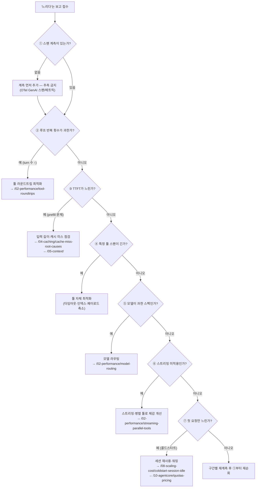

# 지연 체크리스트

::: tip 이 장에서 얻는 것
- "에이전트가 느리다"는 보고를 받았을 때 추측 없이 순서대로 점검하는 7단계 진단 런북
- 증상(TTFT 느림 / 총 시간 느림 / 특정 요청만 느림 / 모두 느림)별 우선 점검 대상을 매핑한 결정 표
- 잘못 짚기 쉬운 실패 모드 — "모델이 느리다"로 보이지만 실제 원인은 다른 곳에 있는 사례들
- Part 2 전체와 Part 4·5·8·10의 정본 챕터로 연결되는 최종 체크리스트
:::

## 왜 문제가 되는가

에이전트 지연 최적화가 어려운 이유는 최적화 기법이 부족해서가 아니라, **어느 구간이 느린지 모른 채 아무 기법이나 적용하기 때문**이다. 에이전트의 총 지연은 [지연 해부](/02-performance/latency-anatomy)에서 다뤘듯 여러 이질적인 구간 — prefill, decode, 툴 실행, 네트워크, 오케스트레이션 오버헤드 — 의 합이고, 게다가 에이전트 루프는 이 합을 반복 횟수만큼 곱한다. Anthropic도 에이전트 시스템의 본질적 트레이드오프를 명시한다 — "Agents can be used for open-ended problems … but their autonomous nature means higher costs, and the potential for compounding errors"이며, 에이전트 시스템은 "trade latency and cost for better task performance"하는 구조다([Anthropic, Building effective agents](https://www.anthropic.com/research/building-effective-agents)).

이 곱셈 구조 때문에 잘못된 진단의 비용이 크다. 실제 원인이 "루프가 12번 돈다"인데 프롬프트 캐싱부터 손대면, 캐싱이 완벽해도 체감 개선은 미미하다. 반대로 원인이 "캐시 미스로 매 turn 수만 토큰을 다시 prefill한다"인데 모델을 낮추면, 품질만 잃고 지연은 그대로다. 이 장은 Part 2의 마무리로서, 앞선 챕터들([지연 해부](/02-performance/latency-anatomy), [툴 라운드트립](/02-performance/tool-roundtrips), [스트리밍과 병렬 툴](/02-performance/streaming-parallel-tools), [모델 라우팅](/02-performance/model-routing))과 다른 Part의 정본 챕터들을 **진단 순서**라는 하나의 런북으로 묶는다.

## 핵심 개념

핵심 개념은 단 하나다: **진단에는 순서가 있고, 그 순서는 "측정 → 곱셈 항 → 덧셈 항 → 체감" 순이다.** 반복 횟수(곱셈 항)를 먼저 줄이고, 그다음 각 turn의 구간(덧셈 항)을 줄이고, 마지막으로 체감(perceived latency)을 개선한다.

### ① 계측 먼저 — 계측 없이는 추측 금지

첫 질문은 "무엇이 느린가"가 아니라 "어느 스팬이 느린가"다. 스팬 단위 계측이 없다면 어떤 최적화도 시작하지 않는다. OpenTelemetry GenAI semantic convention은 이 목적의 표준 신호를 이미 정의한다 — LLM 호출 스팬(`gen_ai` operation spans)과 함께 `gen_ai.server.time_to_first_token`, `gen_ai.client.operation.duration` 같은 메트릭이 규정돼 있다([OpenTelemetry, Semantic conventions for generative AI metrics](https://opentelemetry.io/docs/specs/semconv/gen-ai/gen-ai-metrics/)). 최소 요건: 요청 1건에 대해 turn별 LLM 호출 스팬, 툴 실행 스팬, TTFT가 트레이스 하나에서 보여야 한다. 구간 정의 자체는 [지연 해부](/02-performance/latency-anatomy)가 정본이다.

### ② 루프 반복 횟수 — 곱셈 항부터

트레이스에서 가장 먼저 세는 것은 turn 수다. turn당 지연이 정상이어도 turn이 10번이면 총 지연은 10배다. 반복이 많다면 개별 구간 최적화 전에 라운드트립 자체를 줄이는 것이 우선이다 — 툴 통합, 배치 호출, 병렬 실행 가능한 호출 식별. 정본: [툴 라운드트립](/02-performance/tool-roundtrips).

### ③ TTFT가 느리면 prefill 문제

TTFT(time to first token)는 prefill 단계가 지배한다 — prefill은 입력 전체를 한 번에 처리하는 compute-bound 연산이고, 이후 decode는 토큰 단위 순차 생성이다([NVIDIA, Mastering LLM Techniques: Inference Optimization](https://developer.nvidia.com/blog/mastering-llm-techniques-inference-optimization/)). 따라서 TTFT가 느리면 원인은 둘 중 하나다: **입력이 너무 길거나, 길어진 입력을 매번 다시 계산하고 있거나(캐시 미스)**. Anthropic은 prompt caching이 "long prompts에 대해 비용을 최대 90%, 지연을 최대 85%까지 절감"할 수 있다고 밝힌다([Anthropic, Prompt caching announcement](https://www.anthropic.com/news/prompt-caching)) — 뒤집어 말하면 캐시가 깨져 있으면 그만큼의 지연을 매 turn 새로 내고 있는 것이다. 캐시 미스 원인 진단은 [캐시 미스 근본 원인](/04-caching/cache-miss-root-causes), 입력 길이 자체의 절감은 [Part 5 컨텍스트 엔지니어링](/05-context/)이 정본이다.

### ④ 개별 툴이 느리면 툴 자체를 고친다

트레이스에서 특정 툴 스팬이 p95 기준으로 길게 나오면, 그건 LLM 문제가 아니라 그냥 느린 백엔드다. 여기서는 전통적인 최적화가 그대로 적용된다: DB 인덱스, 응답 페이로드 축소(툴 결과가 곧 다음 turn의 prefill 입력이므로 이중 효과), 타임아웃과 재시도 정책 정비, 느린 외부 API의 캐싱. LLM 쪽을 만지기 전에 툴을 먼저 고치는 편이 거의 항상 싸다.

### ⑤ 모델이 과한 스펙이면 라우팅

간단한 분류·추출·라우팅성 turn까지 최상위 모델로 처리하고 있다면, 해당 turn의 decode 속도와 큐 대기 모두에서 손해다. 요청 난이도별로 모델을 나눠 붙이는 설계는 [모델 라우팅](/02-performance/model-routing)이 정본이다. Bedrock을 쓴다면 일부 모델에 latency-optimized inference 옵션도 있다([AWS, Latency-optimized inference for foundation models in Amazon Bedrock](https://docs.aws.amazon.com/bedrock/latest/userguide/latency-optimized-inference.html)).

### ⑥ 스트리밍 미적용이면 체감부터

여기까지 왔는데도 "느리다"는 보고가 계속되면, 실제 지연과 **체감 지연**을 분리한다. 최종 응답을 버퍼링해 한 번에 내보내는 UI는 총 시간이 같아도 훨씬 느리게 느껴진다. 스트리밍 적용과 병렬 툴 실행으로 체감을 줄이는 방법은 [스트리밍과 병렬 툴](/02-performance/streaming-parallel-tools)이 정본이다.

### ⑦ 첫 요청만 느리면 콜드스타트

p50은 정상인데 세션 첫 요청 또는 유휴 후 첫 요청만 튄다면 콜드스타트다 — 런타임 기동, 세션 초기화, 캐시 워밍이 모두 첫 요청에 몰린다. 세션 재사용과 워밍 전략은 [콜드스타트와 세션 유휴](/08-scaling-cost/coldstart-session-idle), AgentCore Runtime의 세션 수명 주기·쿼터 제약은 [AgentCore 쿼터와 가격](/10-agentcore/quotas-pricing)이 정본이다.

## 결정 표

증상에서 출발해 우선 점검 대상을 좁힌다.

| 증상 | 우선 점검 대상 | 이유 | 정본 챕터 |
|---|---|---|---|
| TTFT만 느리고 이후 토큰은 정상 속도 | 입력 토큰 수, 캐시 read/write 비율 | TTFT는 prefill 지배 — 입력 길이와 캐시 미스가 양대 원인 | [캐시 미스 근본 원인](/04-caching/cache-miss-root-causes), [Part 5](/05-context/) |
| TTFT는 정상인데 총 시간이 느림 | turn 수, 툴 스팬 길이, 출력 토큰 수 | 곱셈 항(반복)과 덧셈 항(툴·decode) 중 어디가 큰지 트레이스로 분해 | [툴 라운드트립](/02-performance/tool-roundtrips) |
| 특정 요청만 느림 (p50 정상, p95/p99 급등) | 느린 요청의 트레이스 개별 열람 — 특정 툴, 재시도, 스로틀링, 콜드스타트 | 평균은 정상이므로 시스템 전반이 아니라 특정 경로의 문제 | [콜드스타트와 세션 유휴](/08-scaling-cost/coldstart-session-idle), [동시성·쿼터·스로틀링](/08-scaling-cost/concurrency-quotas-throttling) |
| 모든 요청이 균일하게 느림 | 모델 선택, 리전/엔드포인트, 프롬프트 총 길이의 구조적 증가 | 균일한 저하는 개별 버그가 아니라 구조적 선택(모델 스펙, 컨텍스트 비대)의 결과 | [모델 라우팅](/02-performance/model-routing), [Part 5](/05-context/) |
| 측정치는 개선됐는데 사용자 불만 지속 | 스트리밍 적용 여부, 첫 가시 출력까지의 시간 | 실제 지연이 아니라 체감 지연의 문제 | [스트리밍과 병렬 툴](/02-performance/streaming-parallel-tools) |
| 배포·스케일아웃 직후만 느림 | 캐시 히트율의 배포 상관, 신규 인스턴스 콜드스타트 | 새 인스턴스는 캐시도 세션도 비어 있다 | [캐시 미스 근본 원인](/04-caching/cache-miss-root-causes), [콜드스타트와 세션 유휴](/08-scaling-cost/coldstart-session-idle) |

## 실패 모드

"모델이 느리다"로 접수되지만 실제 원인이 다른 곳에 있는 대표 사례들이다.

| 증상 | 근본 원인 | 확인 방법 | 해결 |
|---|---|---|---|
| "모델이 느려졌다"는 보고, 그러나 모델·프롬프트 변경 없음 | 대화가 길어지며 컨텍스트가 누적 — 매 turn prefill 입력이 선형 증가 | 트레이스에서 turn별 입력 토큰 수를 시계열로 플롯 — 우상향이면 확정 | 컨텍스트 압축·오프로딩 — [Part 5](/05-context/) |
| turn당 지연은 SLO 이내인데 총 응답 시간이 SLO 초과 | 루프 반복 횟수 증가 — 툴 실패 후 재시도, 불필요하게 잘게 쪼개진 툴 호출 | 트레이스의 turn 수 분포를 기간 비교 — turn 수 자체가 늘었는지 확인 | 툴 통합·병렬화·재시도 정책 정비 — [툴 라운드트립](/02-performance/tool-roundtrips) |
| 캐싱을 켰는데 TTFT가 그대로 | 캐시 미스 — 프리픽스에 동적 내용이 섞여 매 요청 write만 발생 | `usage`의 `cache_read_input_tokens`가 0에 머무는지 확인 | 프리픽스 안정화 — [캐시 미스 근본 원인](/04-caching/cache-miss-root-causes) |
| p99만 주기적으로 튐 | 유휴 세션 만료 후 재기동(콜드스타트) 또는 쿼터 스로틀링 재시도 | p99 스파이크 시각과 세션 수명·스로틀링 이벤트 로그의 상관 확인 | 세션 keep-alive·워밍, 쿼터 증설 — [콜드스타트와 세션 유휴](/08-scaling-cost/coldstart-session-idle), [AgentCore 쿼터와 가격](/10-agentcore/quotas-pricing) |
| 대시보드상 총 지연은 줄었는데 체감 불만은 그대로 | 첫 가시 출력까지의 시간(TTFT 및 스트리밍 부재)은 그대로임 — 평균 총 시간만 최적화 | 사용자 관점 SLI(첫 토큰 표시 시각)를 별도 측정 | 스트리밍 적용 — [스트리밍과 병렬 툴](/02-performance/streaming-parallel-tools) |
| 최적화 시도마다 결과가 들쭉날쭉, 개선 여부를 확신 못 함 | 계측 부재 — 구간 분해 없이 end-to-end 시간만 보며 추측 | 트레이스 하나에서 turn·툴·TTFT 스팬이 보이는지 자문 | ①로 돌아가 OTel GenAI 계측부터 — [지연 해부](/02-performance/latency-anatomy) |

## 안티패턴

- ❌ 계측 없이 "아마 모델이 느린 것"이라 추정하고 모델부터 교체 → ✅ 스팬 계측을 먼저 넣고, 트레이스가 가리키는 구간만 손댄다.
- ❌ 총 지연 평균(p50) 하나로 상태를 판단 → ✅ TTFT / turn 수 / 툴 시간 / p95·p99를 분리해서 본다 — 증상 축이 다르면 원인도 다르다.
- ❌ 덧셈 항(개별 구간)부터 최적화 → ✅ 곱셈 항(루프 반복 횟수)을 먼저 확인한다. turn이 10번이면 구간 10% 개선은 전체에서도 10%지만, turn을 절반으로 줄이면 50%다.
- ❌ 캐싱·라우팅·스트리밍을 한 번에 적용하고 "빨라졌다" 선언 → ✅ 한 번에 하나씩 적용하고 같은 SLI로 전후 비교한다 — 무엇이 효과였는지 모르면 회귀 시 되돌릴 수도 없다.
- ❌ 체감 개선(스트리밍)을 실제 지연 개선의 대체재로 사용 → ✅ 스트리밍은 마지막 단계다. 루프·prefill·툴 문제를 가린 채 스트리밍만 입히면 총비용은 그대로 남는다.

## 계측 (SLI)

이 런북의 각 분기를 판정하려면 아래 SLI가 필요하다. Google SRE의 four golden signals에서 latency는 첫 번째 신호이며, "성공한 요청과 실패한 요청의 지연을 구분하라"는 원칙이 그대로 적용된다([Google, SRE Book — Monitoring Distributed Systems](https://sre.google/sre-book/monitoring-distributed-systems/)) — 에이전트에서는 실패 후 재시도가 지연 분포를 오염시키기 쉽다.

- **TTFT (p50/p95)** — ③ 분기 판정. OTel `gen_ai.server.time_to_first_token` 기반([OpenTelemetry, GenAI metrics](https://opentelemetry.io/docs/specs/semconv/gen-ai/gen-ai-metrics/)).
- **요청당 turn 수 분포** — ② 분기 판정. 평균이 아니라 분포로 — 꼬리의 긴 요청이 p99를 만든다.
- **턴별 입력 토큰 수 추이** — 컨텍스트 비대 탐지. 세션 내 우상향이면 Part 5 사안.
- **`cache_read_input_tokens` / `cache_creation_input_tokens` 비율** — 캐시 히트 판정. 정의와 대시보드는 [캐시 지표와 경제성](/04-caching/cache-metrics-economics) 참고.
- **툴별 실행 시간 (p95)** — ④ 분기 판정. 툴 이름 차원으로 분해.
- **첫 요청 vs 후속 요청 지연 분리** — ⑦ 분기 판정. 세션 첫 요청 플래그를 스팬 attribute로 남긴다.
- **첫 가시 출력까지의 시간(사용자 관점)** — ⑥ 분기 판정. 서버 TTFT와 별개로 클라이언트에서 측정.

## 체크리스트

"느리다"는 보고를 받으면 위에서 아래로 순서대로 점검한다. 각 항목의 세부 방법은 링크된 정본 챕터를 따른다.

**0단계 — 계측**
- [ ] 요청 1건의 트레이스에서 turn별 LLM 스팬·툴 스팬·TTFT가 모두 보인다 ([지연 해부](/02-performance/latency-anatomy))
- [ ] TTFT, turn 수, 툴별 시간, p95/p99가 대시보드에 분리돼 있다
- [ ] 성공 요청과 실패·재시도 요청의 지연이 분리 집계된다

**1단계 — 곱셈 항 (루프)**
- [ ] 요청당 turn 수 분포를 확인했고, 꼬리 요청의 트레이스를 열어봤다 ([툴 라운드트립](/02-performance/tool-roundtrips))
- [ ] 순차 호출 중 병렬화 가능한 툴 호출이 없는지 확인했다 ([스트리밍과 병렬 툴](/02-performance/streaming-parallel-tools))
- [ ] 툴 실패 → 재시도로 turn이 불어나는 경로가 없는지 확인했다

**2단계 — prefill (TTFT)**
- [ ] `cache_read_input_tokens` 비율이 기대치(프리픽스 안정 시 높음)에 부합한다 ([캐시 미스 근본 원인](/04-caching/cache-miss-root-causes))
- [ ] turn별 입력 토큰 수가 세션 내에서 무한 증가하지 않는다 — 압축/오프로딩 적용 ([Part 5](/05-context/))
- [ ] 시스템 프롬프트·툴 정의가 static → dynamic 순으로 정렬돼 있다 ([프롬프트 캐싱 기초](/04-caching/prompt-caching-basics))

**3단계 — 덧셈 항 (툴·모델)**
- [ ] p95 기준 가장 느린 툴을 식별했고, 툴 자체(쿼리·페이로드·타임아웃)를 먼저 최적화했다
- [ ] 툴 응답 페이로드가 필요 이상으로 크지 않다 (다음 turn prefill 입력이기도 하다)
- [ ] 단순 turn(분류·추출·라우팅)에 최상위 모델을 쓰고 있지 않다 ([모델 라우팅](/02-performance/model-routing))

**4단계 — 체감·콜드스타트**
- [ ] 사용자 대면 경로에 스트리밍이 적용돼 있다 ([스트리밍과 병렬 툴](/02-performance/streaming-parallel-tools))
- [ ] 세션 첫 요청과 후속 요청의 지연 차이를 측정했다 ([콜드스타트와 세션 유휴](/08-scaling-cost/coldstart-session-idle))
- [ ] 세션 유휴 타임아웃·수명 설정이 트래픽 패턴과 맞고, 쿼터 스로틀링이 지연으로 전가되지 않는다 ([AgentCore 쿼터와 가격](/10-agentcore/quotas-pricing), [동시성·쿼터·스로틀링](/08-scaling-cost/concurrency-quotas-throttling))

**마무리**
- [ ] 최적화는 한 번에 하나씩 적용하고, 같은 SLI로 전후를 비교해 효과를 기록했다

## 참고

- [Anthropic, Building effective agents](https://www.anthropic.com/research/building-effective-agents) — 에이전트 시스템이 지연·비용을 성능과 맞바꾸는 구조라는 원칙, 복잡성 최소화 권고.
- [Anthropic, Prompt caching announcement](https://www.anthropic.com/news/prompt-caching) — long prompts에서 비용 최대 90%·지연 최대 85% 절감 수치의 출처.
- [OpenTelemetry, Semantic conventions for generative AI metrics](https://opentelemetry.io/docs/specs/semconv/gen-ai/gen-ai-metrics/) — `gen_ai.server.time_to_first_token`, `gen_ai.client.operation.duration` 등 표준 계측 신호 정의.
- [NVIDIA, Mastering LLM Techniques: Inference Optimization](https://developer.nvidia.com/blog/mastering-llm-techniques-inference-optimization/) — prefill(compute-bound)/decode(memory-bound) 구분과 TTFT의 prefill 지배 구조.
- [Google, SRE Book — Monitoring Distributed Systems](https://sre.google/sre-book/monitoring-distributed-systems/) — four golden signals, 성공/실패 요청 지연 분리 원칙.
- [AWS, Latency-optimized inference for foundation models in Amazon Bedrock](https://docs.aws.amazon.com/bedrock/latest/userguide/latency-optimized-inference.html) — Bedrock 일부 모델의 지연 최적화 추론 옵션.
- 구간별 지연 정의는 [지연 해부](/02-performance/latency-anatomy), 라운드트립 절감은 [툴 라운드트립](/02-performance/tool-roundtrips), 체감 개선은 [스트리밍과 병렬 툴](/02-performance/streaming-parallel-tools), 모델 선택은 [모델 라우팅](/02-performance/model-routing)이 각 주제의 정본.
