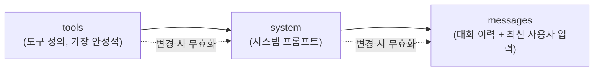

# 프롬프트 캐싱 기초

::: tip 이 장에서 얻는 것
- 캐시 키가 어떻게 파생되는지 (exact prefix match, `tools` → `system` → `messages` 순서)
- 가격 배수(cache write 1.25x/2.0x, cache read 0.1x)와 TTL 동작(기본 5분, 히트마다 리셋)
- 왜 캐시가 "조용히" 안 걸리는지 — 최소 토큰 미달이 에러를 내지 않는다는 함정
- Bedrock에서 Claude와 Nova가 각각 어떤 한계(체크포인트 수, TTL, 캐시 가능 토큰)를 갖는지
- 실무에서 바로 쓸 실패 모드 표와 체크리스트
:::

## 왜 문제가 되는가

Agentic 워크플로는 매 턴마다 같은 system prompt, 같은 tool definitions, 종종 같은 few-shot 예시를 반복해서 보낸다. 이 반복되는 prefix를 매번 처음부터 처리하면 비용과 지연 모두 손해다. prompt caching은 이 prefix를 서버 측에 저장해두고, 동일한 prefix가 다시 오면 재계산 없이 재사용하는 최적화다.

문제는 이 최적화가 **바이트 단위 exact prefix match**로 동작한다는 점이다. 타임스탬프 하나, 세션 ID 하나, JSON 키 순서 하나만 바뀌어도 캐시는 그 지점부터 통째로 무효화된다. 그리고 더 나쁜 것은 — 캐시가 걸리지 않아도 요청은 정상적으로 성공한다. 에러도, 경고도 없다. 그냥 조용히 full price로 처리된다. 플랫폼 엔지니어 입장에서 이것은 "기능이 꺼져 있어도 아무도 모른다"는 뜻이고, 이게 바로 이 장이 정본(canonical)으로 존재하는 이유다 — 이후 챕터(`cache-miss-root-causes`, `cache-metrics-economics`)는 여기서 정의한 수치와 메커니즘을 그대로 재인용한다.

## 핵심 개념

### 캐시 키는 어떻게 파생되는가

Anthropic API와 Bedrock 모두 캐시 키를 요청 바이트에서 **tools → system → messages 고정 순서**로 렌더링한 뒤 파생시킨다. 이 순서는 계층적이다 — 앞 단계가 바뀌면 뒤 단계의 캐시도 전부 무효화된다.



Bedrock 공식 문서는 이를 명시적으로 설명한다.

> "Cache checkpoints are processed in this order: `tools` → `system` → `messages`. The minimum cache size is evaluated against the cumulative tokens across all three sections combined ... Because the sections are chained, changing content in an earlier section invalidates the cache for later sections."
> — [Amazon Bedrock 공식 문서: Prompt caching for faster model inference](https://docs.aws.amazon.com/bedrock/latest/userguide/prompt-caching.html)

Anthropic API 쪽도 동일한 계층을 명시한다.

> "Cache prefixes are created in the following order: `tools`, `system`, then `messages`. This order forms a hierarchy where each level builds upon the previous ones."
> — [Anthropic 공식 문서: Prompt caching](https://platform.claude.com/docs/en/build-with-claude/prompt-caching)

실무적으로 이는 다음을 의미한다.

```jsonc
{
  "tools": [ /* 가장 안정적 — 배포 단위로만 바뀜 */ ],
  "system": [
    { "type": "text", "text": "…고정된 시스템 프롬프트…" },
    { "type": "text", "text": "", "cache_control": { "type": "ephemeral" } }
    // ↑ 캐시 breakpoint는 "캐시할 내용 뒤"에 위치하는 별도 블록
  ],
  "messages": [
    /* 여기부터 변동성 — 타임스탬프, 세션 토큰, 최신 질문은 breakpoint 이후로 */
  ]
}
```

캐시 히트 여부는 hash 비교로 판정되며, breakpoint까지의 모든 텍스트·이미지가 "100% identical"해야 한다.

### 가격 배수 — Anthropic API와 Bedrock 동일

| 연산 | 배수 (base input price 대비) |
|---|---|
| 5분 TTL 캐시 쓰기 (cache write) | 1.25x |
| 1시간 TTL 캐시 쓰기 (cache write) | 2.0x |
| 캐시 읽기 (cache read / hit) | 0.1x |

출처: [Anthropic 공식 문서: Prompt caching pricing](https://platform.claude.com/docs/en/build-with-claude/prompt-caching) — "5-minute cache write tokens are 1.25 times the base input tokens price, 1-hour cache write tokens are 2 times the base input tokens price, Cache read tokens are 0.1 times the base input tokens price."이 배수는 Anthropic API와 Amazon Bedrock에서 동일하게 적용된다(리전별 기본 단가 자체는 플랫폼마다 다르므로 절대 비용은 [Bedrock 가격 페이지](https://aws.amazon.com/bedrock/pricing/)를 따로 확인해야 한다).

이 배수는 손익분기(break-even) 계산의 근거가 된다. 캐시 쓰기 1회는 25%(5분 TTL) 또는 100%(1시간 TTL) 더 비싸므로, TTL 윈도 안에서 최소 2회 이상 재사용해야 순이익이 난다. 이 경제성 계산의 상세 공식은 `cache-metrics-economics` 챕터에서 이 장의 배수를 그대로 가져와 확장한다.

### TTL — 기본 5분, 히트마다 리셋

기본 TTL은 5분이며, 성공적인 캐시 히트마다 **추가 비용 없이** 리셋된다.

> "The cache is refreshed for no additional cost each time the cached content is used." "The lifetime is measured from the start of the request that writes or reads the cache entry, not from the end of its response."
> — [Anthropic 공식 문서: Prompt caching](https://platform.claude.com/docs/en/build-with-claude/prompt-caching)

즉, 세션 내에서 5분마다 최소 1회 호출이 발생하면 세션이 지속되는 동안 캐시는 계속 warm 상태를 유지한다. 반대로 5분 이상 idle 상태가 지속되면 다음 요청은 다시 cache write(1.25x)로 처리된다. TTL은 요청이 시작되는 시점부터 측정되므로, 응답이 스트리밍으로 수 분간 이어지는 워크로드에서는 다음 요청이 응답 종료 시점 기준이 아니라 이전 요청 시작 시점 기준으로 TTL 안에 들어와야 한다는 점을 놓치기 쉽다.

::: danger 가장 흔한 함정 — 최소 토큰 미달은 에러 없이 조용히 full price로 처리된다
캐시 breakpoint 앞의 프롬프트 prefix가 모델별 최소 토큰 수에 못 미치면, **요청은 정상적으로 성공하지만 캐시는 걸리지 않는다.**

> "Any requests to cache fewer than this number of tokens will be processed without caching, and no error is returned."
> — [Anthropic 공식 문서: Prompt caching](https://platform.claude.com/docs/en/build-with-claude/prompt-caching)

Bedrock도 동일하다: "If you try to add a cache checkpoint before meeting the minimum number of tokens, your inference will still succeed, but your prefix will not be cached." ([Amazon Bedrock 공식 문서](https://docs.aws.amazon.com/bedrock/latest/userguide/prompt-caching.html))

확인 방법은 단 하나 — 응답의 `cache_creation_input_tokens` / `cache_read_input_tokens`(Anthropic API) 또는 `cacheWriteInputTokens` / `cacheReadInputTokens`(Bedrock Converse API)가 둘 다 0이면 캐시가 전혀 작동하지 않은 것이다. 요청 로그만 봐서는 절대 알 수 없다.
:::

### 모델별 최소 캐시 가능 토큰

이 값은 캐시 breakpoint 앞의 **누적** prefix 토큰 수에 대한 기준이며, 모델마다 다르다. 2026-08 기준 Anthropic 공식 문서와 Bedrock 공식 문서가 일치하는 값은 다음과 같다.

| 모델 | 체크포인트 최소 토큰 |
|---|---|
| Claude Opus 4.5 | 4,096 |
| Claude Haiku 4.5 | 4,096 |
| Claude Sonnet 4.5 | 1,024 |
| Claude Sonnet 4.6 | 1,024 |
| Claude 3.7 Sonnet | 1,024 |

출처: [Anthropic 공식 문서: Prompt caching](https://platform.claude.com/docs/en/build-with-claude/prompt-caching), [Amazon Bedrock 공식 문서: Prompt caching](https://docs.aws.amazon.com/bedrock/latest/userguide/prompt-caching.html) — 두 문서 모두 Opus 4.5/Haiku 4.5를 4,096, Sonnet 4.5/Sonnet 4.6/3.7 Sonnet을 1,024로 명시한다. Opus 계열과 Haiku 계열이 더 높은 임계값을 갖고, Sonnet 계열은 상대적으로 낮다는 패턴을 기억해두면, 짧은 system prompt만 캐싱하려다 Opus/Haiku에서 조용히 실패하는 사고를 피할 수 있다.

::: warning 이 표는 모델이 나올수록 계속 바뀐다
Anthropic과 Bedrock 문서 모두 최근 모델(Opus 5, Fable 5, Opus 4.7/4.8 등)에서 최소 토큰 값을 더 낮추는 방향(예: 512~2,048)으로 조정해왔다. 이 표는 스냅샷이며, 새 모델을 도입할 때는 반드시 해당 모델의 공식 카드에서 재확인해야 한다.
:::

### Bedrock 전용 한계

Bedrock은 Anthropic API와 가격 배수·TTL 동작·캐시 키 순서를 공유하지만, 플랫폼 차원의 추가 제약이 있다.

- **체크포인트 최대 4개**: Claude 계열은 요청당 최대 4개의 `cachePoint`를 배치할 수 있다 ([Amazon Bedrock 공식 문서](https://docs.aws.amazon.com/bedrock/latest/userguide/prompt-caching.html)).
- **혼합 TTL 순서 제약**: 5분과 1시간 TTL을 같은 요청에 섞을 경우, **더 긴 TTL 체크포인트가 더 짧은 TTL 체크포인트보다 먼저** 나와야 한다. "Cache entries with longer TTL must appear before shorter TTLs (i.e., a 1-hour cache entry must appear before any 5-minute cache entries)." ([Amazon Bedrock 공식 문서](https://docs.aws.amazon.com/bedrock/latest/userguide/prompt-caching.html))
- **1시간 TTL GA**: Amazon Bedrock에서 1시간 TTL은 2026년 1월 26일 Claude Sonnet 4.5 · Claude Haiku 4.5 · Claude Opus 4.5에 대해 정식 출시(GA)되었다. "The 1-hour TTL prompt caching is generally available for Anthropic's Claude Sonnet 4.5, Claude Haiku 4.5, and Claude Opus 4.5 in all commercial AWS Regions and AWS GovCloud (US) Regions." ([AWS What's New, 2026-01-26](https://aws.amazon.com/about-aws/whats-new/2026/01/amazon-bedrock-one-hour-duration-prompt-caching))

> ⚠️ 비공식 출처 기반 — 공식 문서 교차확인 필요
> 다음 두 수치는 AWS 공식 문서 페이지에서 직접 확인되지 않았고, 서드파티 분석 글에서만 확인되었다. 공식 model card나 향후 문서 업데이트로 재검증이 필요하다.
> - **캐시 가능 토큰 상한 32,000**: Claude 계열에서 하나의 prefix에 캐싱할 수 있는 토큰의 총량이 32,000으로 제한된다는 서술 — [Caylent 블로그: Amazon Bedrock Prompt Caching](https://caylent.com/blog/prompt-caching-saving-time-and-money-in-llm-applications)
> - **Amazon Nova 한계**: Nova(Micro/Lite/Pro) 계열은 캐시 가능 토큰이 최대 20K, TTL은 5분 고정(1시간 미지원), tool 캐싱 미지원 — [Caylent 블로그](https://caylent.com/blog/prompt-caching-saving-time-and-money-in-llm-applications), [AWS re:Post: Nova Pro Bedrock Prompt Cache Usage](https://repost.aws/questions/QUGudA0owsTMS1BtKDMpWQ8w/nova-pro-bedrock-prompt-cache-usage)

## 결정 표

| 상황 | 선택 | 이유 | 트레이드오프 |
|---|---|---|---|
| 요청 빈도가 5분보다 잦은 워크로드 (예: 활성 세션의 agentic loop) | 5분 TTL (기본값) | 어차피 히트마다 리셋되므로 추가 비용 없이 warm 유지 | 없음 — 5분보다 자주 부르면 손해가 없다 |
| 요청 사이 간격이 5분~1시간인 워크로드 (긴 side-agent, 응답이 뜸한 대화) | 1시간 TTL | cache miss로 인한 재작성(1.25x) 재발을 방지 | 최초 쓰기 비용이 2.0x로 더 높음 — 재사용 횟수가 충분해야 손익분기를 넘음 |
| 세션당 요청 수가 1회뿐인 워크로드 | 캐싱 비활성화 | 쓰기만 발생하고 읽기가 없으면 오히려 25% 더 비쌈 | 캐시 인프라 관리 비용도 아낄 수 있음 |
| Bedrock에서 5분/1시간 캐시를 함께 쓰는 프롬프트 | 1시간 체크포인트를 5분 체크포인트보다 앞에 배치 | Bedrock의 혼합 TTL 순서 제약을 지켜야 캐시가 성립 | 프롬프트 구조를 TTL 우선순위에 맞춰 재배열해야 함 |
| Amazon Nova로 tool 정의를 자주 재사용하는 워크로드 | Claude 계열로 전환하거나 tool 정의를 system/messages로 재구성 | Nova는 tool 캐싱을 지원하지 않음(비공식 출처, 위 경고 참고) | Nova의 다른 비용 이점을 포기해야 할 수 있음 |
| system prompt가 모델의 최소 토큰 임계값보다 짧음 | 캐싱을 걸지 않거나, system prompt에 안정적인 few-shot/레퍼런스를 더해 임계값을 넘김 | 임계값 미달 시 조용히 캐시가 걸리지 않으므로 억지로 breakpoint를 넣어도 효과 없음 | 프롬프트를 인위적으로 늘리면 base 비용이 늘어남 — 실질적 재사용 이익과 비교 필요 |

## 실패 모드

| 증상 | 근본 원인 | 확인 방법 | 해결 |
|---|---|---|---|
| `cache_read_input_tokens`가 항상 0 | prefix가 모델 최소 토큰 미달, 또는 breakpoint 위치가 캐시할 내용보다 앞에 있음 | 매 응답의 `usage.cache_creation_input_tokens` / `cache_read_input_tokens`를 로깅 | prefix 토큰 수를 임계값 이상으로 확보하거나 breakpoint를 캐시 대상 콘텐츠 뒤로 이동 |
| 캐시가 걸렸다가 갑자기 매 요청 전량 cache write로 바뀜 | 5분(또는 1시간) TTL 만료, 혹은 시스템 프롬프트에 `datetime.now()` 같은 타임스탬프 삽입 | write:read 비율을 시계열로 추적 — write만 계속되면 invalidation 반복 | 타임스탬프·세션ID를 breakpoint 뒤로 이동, 호출 주기를 TTL 안으로 조정 |
| tool 정의를 하나만 바꿨는데 system/messages 캐시까지 전부 miss | tools → system → messages 계층 구조상 앞 단계 변경이 뒤 단계를 전부 무효화 | tool 정의 diff와 캐시 miss 급증 시점을 대조 | tool 정의는 배포 단위로만 변경하고 별도 caching 전략(explicit 체크포인트)으로 분리 |
| Bedrock에서 1시간 TTL 캐시가 적용 안 됨 | 5분 체크포인트가 1시간 체크포인트보다 앞에 배치됨(순서 제약 위반), 또는 모델이 1시간 TTL 미지원 | 요청 바디에서 `cachePoint` 순서와 대상 모델의 지원 TTL 확인 | 긴 TTL 체크포인트를 먼저 배치, 모델을 GA된 모델(Sonnet 4.5/Haiku 4.5/Opus 4.5 등)로 제한 |
| JSON 직렬화 순서 차이로 캐시가 매번 깨짐 | 같은 논리적 객체라도 키 순서·공백이 다르면 바이트 단위로 다른 prefix가 됨(exact prefix match) | 동일 요청을 두 번 만들어 바이트 diff 비교 | 직렬화 시 키 정렬 고정, 코드에서 캐시 대상 블록을 문자열로 캐싱해 재사용 |
| 세션당 1회만 호출하는데도 캐싱을 켜서 비용이 늘어남 | 쓰기 배수(1.25x/2.0x)만 발생하고 읽기(0.1x)가 없어 순손실 | 요청 수 대비 read:write 비율 확인 | 손익분기(최소 2회 이상 재사용)를 만족하지 못하는 경로는 캐싱 비활성화 |

## 안티패턴

- ❌ 세션 ID나 요청 타임스탬프를 system prompt 맨 앞이나 중간에 끼워 넣는다 → ✅ 정적 콘텐츠(tools, 고정 system prompt)를 앞에, 가변 콘텐츠(타임스탬프, 세션 토큰, 최신 사용자 입력)를 breakpoint 뒤에 배치한다.
- ❌ 캐시가 걸렸는지 확인하지 않고 "캐싱을 설정했으니 됐다"고 가정한다 → ✅ 매 응답에서 `cache_read_input_tokens`/`cache_creation_input_tokens`(또는 Bedrock의 `cacheReadInputTokens`/`cacheWriteInputTokens`)를 로깅하고 대시보드로 추적한다.
- ❌ 짧은 few-shot 예시 뒤에 무작정 breakpoint를 넣고 캐싱된다고 믿는다 → ✅ 모델별 최소 토큰 임계값을 먼저 계산하고, 임계값 미달이면 캐싱을 시도하지 않거나 프롬프트를 재구성한다.
- ❌ Bedrock에서 5분과 1시간 체크포인트를 아무 순서로나 배치한다 → ✅ 항상 더 긴 TTL 체크포인트를 앞에 둔다.
- ❌ 요청당 1회만 쓰이는 콘텐츠에 캐싱을 건다 → ✅ TTL 윈도 내 재사용 횟수를 먼저 추정하고, 손익분기(2회 이상)를 넘지 못하면 캐싱을 끈다.

## 계측 (SLI)

캐싱이 "설정되어 있다"와 "작동하고 있다"는 다른 문제다. 다음 지표를 SLI로 관리한다.

- **cache hit rate**: `cache_read_input_tokens / (cache_read_input_tokens + cache_creation_input_tokens + input_tokens)`. 이 값이 예상보다 낮으면 실패 모드 표를 따라 원인을 좁힌다.
- **write:read ratio**: 특정 시간창 내 write 이벤트 수 대비 read 이벤트 수. 1:1에 가까우면 캐싱이 손익분기를 겨우 넘는 수준이고, write만 반복되면 무효화가 발생하고 있다는 신호다.
- **TTL 만료 간격 분포**: 연속 요청 사이의 시간 간격을 히스토그램으로 보고, 5분(또는 1시간) TTL 경계를 넘는 요청의 비율을 추적한다. 이 비율이 높으면 TTL 상향(5분 → 1시간)을 검토할 신호다.
- **모델/엔드포인트별 최소 토큰 위반 카운트**: 요청 전송 전에 prefix 토큰 수를 계산해 임계값 미달 요청을 사전에 플래그하면, "조용한 실패"를 관측 가능한 이벤트로 바꿀 수 있다.

::: warning 미정착 영역
1시간 TTL(2.0x 쓰기 배수)을 도입할 손익분기 기준에 대한 업계 합의는 아직 없다. "재사용 횟수가 충분하면 무조건 유리하다"는 계산은 5분 TTL 대비 단순 비교에서는 맞지만, 실제로는 (1) 5분 TTL을 리셋 없이 유지하기 위한 heartbeat 호출 비용, (2) rate limit 소비 여부(캐시 히트는 Bedrock에서 rate limit에 포함되지 않는다는 서술이 있으나 이 장에서는 별도 검증하지 않음), (3) 워크로드의 실제 idle 분포 같은 변수에 따라 결론이 달라진다. 팀마다 다른 임계값을 쓰고 있으며, 이 장에서는 단일 기준을 제시하지 않는다. 구체적인 손익분기 공식과 사례는 `cache-metrics-economics` 챕터에서 다룬다.
:::

## 체크리스트

- [ ] tools/system/messages 순서로 정적 콘텐츠를 앞에, 가변 콘텐츠를 breakpoint 뒤에 배치했는가
- [ ] 대상 모델의 최소 캐시 가능 토큰 임계값을 확인하고, prefix가 이를 충족하는지 사전에 계산하는가
- [ ] 모든 요청/응답에서 cache read/write 토큰 수를 로깅하고 있는가 (0/0이 발생하면 알림이 뜨는가)
- [ ] system prompt, tool 정의에 타임스탬프·세션 ID·비결정적 값이 섞여 있지 않은가
- [ ] TTL(5분 vs 1시간)을 워크로드의 실제 요청 간격 분포에 맞춰 선택했는가
- [ ] Bedrock을 쓴다면 체크포인트 수가 모델별 최대(Claude 계열 4개)를 넘지 않는지, 혼합 TTL일 때 긴 TTL을 먼저 배치했는지 확인했는가
- [ ] 세션당 재사용 횟수가 손익분기(최소 2회 이상)를 넘는 경로에만 캐싱을 활성화했는가
- [ ] Amazon Nova를 쓴다면 tool 캐싱 미지원, 5분 고정 TTL 같은 플랫폼 차이를 감안했는가 (비공식 출처 — 공식 문서 재확인 권장)

## 참고

- [Anthropic 공식 문서: Prompt caching](https://platform.claude.com/docs/en/build-with-claude/prompt-caching) — 가격 배수, TTL, 최소 토큰 표, 캐시 키 순서, 최소 토큰 미달 시 동작
- [Amazon Bedrock 공식 문서: Prompt caching for faster model inference](https://docs.aws.amazon.com/bedrock/latest/userguide/prompt-caching.html) — 체크포인트 순서, 모델별 최소 토큰·최대 체크포인트, 혼합 TTL 순서 제약, Converse/InvokeModel 예시
- [AWS What's New: Amazon Bedrock now supports 1-hour duration for prompt caching (2026-01-26)](https://aws.amazon.com/about-aws/whats-new/2026/01/amazon-bedrock-one-hour-duration-prompt-caching) — 1시간 TTL GA 대상 모델(Sonnet 4.5, Haiku 4.5, Opus 4.5) 및 리전
- [AWS What's New: Simplified Cache Management for Anthropic's Claude models in Amazon Bedrock (2025-09)](https://aws.amazon.com/about-aws/whats-new/2025/09/cache-management-anthropics-claude-models-bedrock) — 단일 breakpoint로 최대 20개 블록까지 자동 탐색하는 simplified caching
- [Amazon Bedrock 가격 페이지](https://aws.amazon.com/bedrock/pricing/) — 플랫폼별 절대 단가(배수는 Anthropic API와 동일, 기본 단가는 별도)
- ⚠️ 비공식: [Caylent 블로그 — Amazon Bedrock Prompt Caching](https://caylent.com/blog/prompt-caching-saving-time-and-money-in-llm-applications), [AWS re:Post — Nova Pro Bedrock Prompt Cache Usage](https://repost.aws/questions/QUGudA0owsTMS1BtKDMpWQ8w/nova-pro-bedrock-prompt-cache-usage) — Claude 계열 32,000 토큰 캐시 상한, Nova 20K/5분 고정 TTL/tool 캐싱 미지원. 공식 model card 업데이트 시 재확인 필요.
