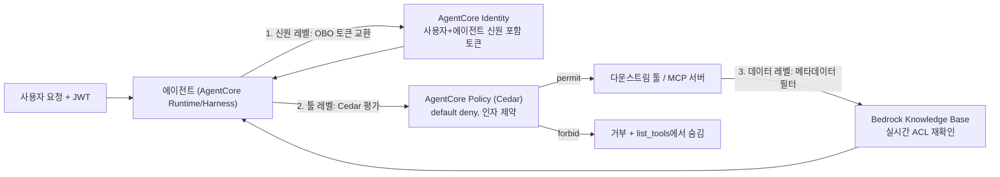

# 세밀 권한 제어 개관

::: tip 이 파트가 해결하는 통증점
[6대 통증점](/00-intro/six-pain-points) 중 **6번: 권한을 세밀하게 못 나눔**을 전담한다.
:::

에이전트가 서비스 신원으로 실행되면 감사 추적이 무너지고, 사용자 토큰을 그대로 전달하면 모든 다운스트림 툴이 confused deputy가 된다. 이 파트는 이 문제를 세 개의 독립된 레이어로 나눠 각각 방어한다 — 툴 레벨(Cedar), 신원 레벨(OBO), 데이터 레벨(RAG 엔타이틀먼트). 세 레이어가 겹쳐야 방어가 완성된다.

## 3중 방어 구조

- **툴 레벨** — [Cedar와 Verified Permissions](/09-authorization/cedar-verified-permissions): 어떤 툴을 호출할 수 있는가, 어떤 인자로. 환각된 인자도 정책으로 결정적으로 거부.
- **신원 레벨** — [툴별 On-Behalf-Of](/09-authorization/per-tool-obo), [OAuth 토큰 교환과 MCP](/09-authorization/oauth-token-exchange-mcp): 다운스트림 툴이 "누구를 대신해" 요청이 왔는지 알 수 있게 함.
- **데이터 레벨** — [RAG 엔타이틀먼트 스코핑](/09-authorization/rag-entitlement-scoping): 검색된 문서 자체가 호출자의 접근 권한을 벗어나지 않게 함.

세 레이어를 가로지르는 근본 문제가 [Confused deputy 문제](/09-authorization/confused-deputy)이고, 이를 운영에 반영하는 두 챕터가 [HITL과 감사](/09-authorization/hitl-audit)(되돌리기 어려운 액션의 승인)와 [Egress 제어](/09-authorization/egress-control)(툴이 실제로 어디로 네트워크 연결을 만들 수 있는지)다.

## 챕터 요약

| 챕터 | 한 줄 요약 |
|---|---|
| [툴별 On-Behalf-Of](/09-authorization/per-tool-obo) | 서비스 신원 실행의 감사 추적 붕괴 문제, STS 세션태그 스코핑 패턴 |
| [OAuth 토큰 교환과 MCP](/09-authorization/oauth-token-exchange-mcp) | RFC 8693 token exchange 프로토콜, MCP 인가 스펙 연동 |
| [RAG 엔타이틀먼트 스코핑](/09-authorization/rag-entitlement-scoping) | Knowledge Base 메타데이터 필터링과 실시간 ACL 재확인 |
| [Confused deputy 문제](/09-authorization/confused-deputy) | 1988년 고전 문제가 MCP/에이전트 환경에서 재현되는 방식 |
| [HITL과 감사](/09-authorization/hitl-audit) | 되돌리기 어려운 액션의 승인 게이트, Cedar temporal 정책과의 결합 |
| [Cedar와 Verified Permissions](/09-authorization/cedar-verified-permissions) | AgentCore Policy의 4개 집행점, default deny, 툴 필터링 |
| [Egress 제어](/09-authorization/egress-control) | VPC 네트워크 모드, allowlist 기반 아웃바운드 제어 |

## 결정 요약

- 3중 방어(Cedar+OBO+메타데이터 필터)를 MVP부터 넣을 것인가, 아니면 `LOG_ONLY`로 시작해 단계적으로 `ENFORCE`로 전환할 것인가
- 다운스트림 툴에 어떤 방식(2LO/3LO/token exchange/passthrough)으로 신원을 전파할 것인가
- 되돌리기 어려운 액션의 임계치(금액, 데이터 삭제 범위 등)를 어디에 둘 것인가
- 프로덕션 런타임을 PUBLIC 네트워크 모드로 둘 것인가 VPC 모드로 전환할 것인가

## 관련 다른 파트

- [Part 3 정확도와 평가](/03-accuracy-eval/tool-overload) — Cedar 툴 필터링이 정확도에도 기여하는 이유
- [Part 10 AgentCore 심화](/10-agentcore/identity-deep-dive) — Identity/Gateway의 인프라 세부사항
- [Part 12 보안·안전과 한국 금융 규제](/12-security-korea/) — 프롬프트 인젝션·MCP 공급망 공격과의 관계
