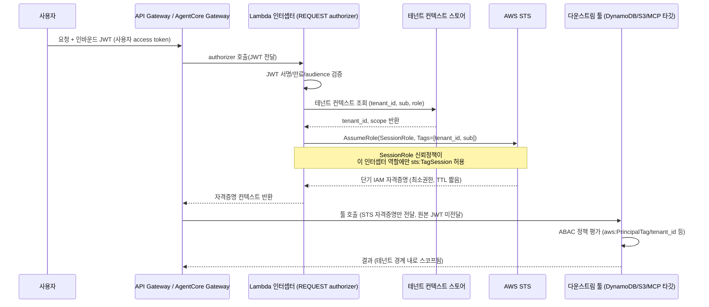

# 툴별 On-Behalf-Of

::: tip 이 장에서 얻는 것
- 에이전트가 다운스트림 툴을 호출할 때 왜 "서비스 신원으로 실행"과 "사용자 토큰 그대로 전달" 둘 다 실패인지, 그 사이에서 On-Behalf-Of(OBO) 토큰교환이 어떤 위치를 차지하는지 이해한다.
- RFC 8693(OAuth 2.0 Token Exchange)의 `act`(actor)/`sub`(subject) 클레임이 정확히 무엇을 의미하는지, delegation과 impersonation의 의미론적 차이를 원문 근거로 구분한다.
- Amazon Bedrock AgentCore Identity의 OBO 토큰교환 그랜트 타입(`TOKEN_EXCHANGE`/`JWT_AUTHORIZATION_GRANT`), Token Vault KMS 암호화, 사전통합 프로바이더 범위를 파악한다.
- AWS 리소스를 대상으로 할 때 쓰는 STS 세션태그 스코핑 패턴(Lambda 인터셉터 → 테넌트 컨텍스트 조회 → AssumeRole)의 아키텍처와 신뢰 경계를 시퀀스 다이어그램으로 파악한다.
- 이 장과 [confused deputy 문제](/09-authorization/confused-deputy), [OAuth 토큰 교환과 MCP](/09-authorization/oauth-token-exchange-mcp)의 역할 분담을 이해하고 필요할 때 서로 참조한다.
:::

## 왜 문제가 되는가

에이전트가 여러 다운스트림 툴(내부 API, SaaS, MCP 서버, AWS 리소스)을 호출할 때 "누구의 이름으로 호출하는가"라는 질문은 인가 설계의 첫 번째 갈림길이다. 실무에서 흔히 택하는 두 극단은 둘 다 실패한다.

**서비스 신원으로 실행하면 감사 추적이 무너진다.** 에이전트가 자기 자신의 client credentials(OAuth 2.0 client credentials grant, 흔히 "2LO"라 불림)로만 다운스트림을 호출하면, 다운스트림 시스템의 액세스 로그에는 "에이전트 서비스 계정이 호출했다"는 사실만 남는다. 실제로 어떤 사용자가 그 작업을 촉발했는지는 로그에서 사라진다. 사고 대응이나 컴플라이언스 감사에서 "이 데이터를 실제로 조회한 사람이 누구인가"에 답할 수 없게 되고, 사용자별 권한 경계(예: HR 앱에서 각 직원이 자기 급여만 볼 수 있는 정책)를 다운스트림이 강제할 방법 자체가 없어진다 — 에이전트 서비스 계정은 모든 사용자를 대신해 모든 데이터에 접근할 권한을 가져야 하기 때문이다.

**사용자 토큰을 그대로 전달하면 모든 다운스트림 툴이 confused deputy가 된다.** 인바운드 사용자 access token을 검증 없이 다음 홉에 그대로 넘기면, 그 토큰은 원래 발급된 audience(에이전트 자신)를 위한 것이지 다운스트림 리소스 서버를 위한 것이 아니다. 다운스트림이 그 토큰의 서명과 스코프만 보고 신뢰해버리면, 에이전트는 사용자의 권한을 그대로 대리하는 "혼란한 대리인(confused deputy)"이 되어 원래 사용자가 의도하지 않은 다운스트림 호출까지 그 토큰의 유효 범위 안에서 통과시키게 된다. 이 문제의 방어 패턴(audience 검증, 토큰 바인딩, 최소 스코프)은 [confused deputy 문제](/09-authorization/confused-deputy) 챕터에서 다룬다 — 이 장은 그 문제를 피하기 위한 아키텍처적 대안, 즉 **토큰을 그대로 넘기지 않고 매 홉마다 사용자 신원과 에이전트 신원을 함께 담은 새 토큰으로 교환하는 패턴**에 집중한다.

이 두 실패 축 사이에 있는 것이 On-Behalf-Of(OBO) 토큰교환이다. OBO는 인바운드 사용자 access token을 다운스트림 대상용으로 스코프된 새 토큰으로 교환하며, 그 교환된 토큰은 사용자 신원과 에이전트(또는 워크로드) 신원을 모두 포함한다. 다운스트림 리소스 서버는 이 두 신원을 모두 보고 자신만의 인가 결정을 내릴 수 있다 — 사용자에게 다시 로그인이나 동의를 요구하지 않으면서도.

## 핵심 개념

### RFC 8693의 delegation vs impersonation, 그리고 `act`/`sub` 클레임

RFC 8693(OAuth 2.0 Token Exchange)은 이 문제를 위한 HTTP/JSON 기반 Security Token Service(STS) 프로토콜을 정의하면서, delegation과 impersonation을 명확히 구분한다.

> "When principal A impersonates principal B, A is given all the rights that B has within some defined rights context and is indistinguishable from B in that context. [...] Delegation semantics are different than impersonation semantics [...] With delegation semantics, principal A still has its own identity separate from B, and it is explicitly understood that while B may have delegated some of its rights to A, any actions taken are being taken by A representing B. In a sense, A is an agent for B." ([RFC 8693 §1.1](https://www.rfc-editor.org/rfc/rfc8693))

에이전트가 다운스트림을 호출하는 상황은 정의상 **delegation**이다 — 에이전트(A)는 자기 자신의 신원을 유지한 채로 사용자(B)를 대신해 행동한다. 인상적인 점은 impersonation에서는 A가 B와 구분되지 않지만, delegation에서는 A와 B 둘 다 토큰 안에 남는다는 것이다. RFC 8693은 이를 JWT의 `act`(actor) 클레임으로 표현한다.

> "The 'act' (actor) claim provides a means within a JWT to express that delegation has occurred and identify the acting party to whom authority has been delegated." ([RFC 8693 §4.1](https://www.rfc-editor.org/rfc/rfc8693))

RFC가 제시하는 예시 토큰은 다음과 같은 구조다 — 토큰의 최상위 `sub`는 여전히 원 사용자(`user@example.com`)이고, `act` 클레임 안의 `sub`가 현재 행위자(actor, 여기서는 `admin@example.com`)를 가리킨다.

```json
{
  "aud": "https://consumer.example.com",
  "iss": "https://issuer.example.com",
  "exp": 1443904177,
  "nbf": 1443904077,
  "sub": "user@example.com",
  "act": {
    "sub": "admin@example.com"
  }
}
```

여러 홉을 거치는 delegation 체인은 `act` 클레임을 중첩해서 표현한다. 바깥쪽 `act`가 현재 행위자, 안쪽으로 중첩될수록 더 이전 행위자다. RFC는 접근 제어 결정에 있어 중요한 제약을 명시한다.

> "For the purpose of applying access control policy, the consumer of a token MUST only consider the token's top-level claims and the party identified as the current actor by the 'act' claim. Prior actors identified by any nested 'act' claims are informational only and are not to be considered in access control decisions." ([RFC 8693 §4.1](https://www.rfc-editor.org/rfc/rfc8693))

즉 다운스트림 리소스 서버가 봐야 하는 것은 (1) 최상위 `sub`(원 사용자)와 (2) 가장 바깥쪽 `act.sub`(현재 행위자, 보통 에이전트)뿐이다. 중간에 몇 단계를 거쳤는지는 감사·포렌식 목적의 이력일 뿐 인가 결정에 쓰여선 안 된다. 이 구조가 정확히 "사용자 + 에이전트 신원 둘 다를 포함하는 교환 토큰"의 근거다.

### AgentCore Identity의 OBO 토큰교환

Amazon Bedrock AgentCore Identity는 OAuth Credential Provider에 OBO 토큰교환을 내장 기능으로 제공한다. 에이전트가 다운스트림 토큰을 요청하면, AgentCore Identity가 인바운드 access token(상위 호출자를 대표)과 크리덴셜 프로바이더에 저장된 클라이언트 크리덴셜을 가지고 고객의 IdP/OAuth 인가 서버와 토큰교환 요청을 중개한다. 에이전트 개발자는 인바운드 토큰을 직접 다루거나 클라이언트 시크릿을 관리할 필요가 없다 — 최종 인가 결정(스코프 승인 여부, delegation 허용 여부)은 인가 서버가 내린다. ([AWS 공식 문서](https://docs.aws.amazon.com/bedrock-agentcore/latest/devguide/on-behalf-of-token-exchange.html))

지원되는 그랜트 타입은 두 가지다.

- **`TOKEN_EXCHANGE`** — `urn:ietf:params:oauth:grant-type:token-exchange`로 매핑되는 RFC 8693 표준 그랜트. 인바운드 JWT를 `subject_token`으로 제출하며, `actor_token_content` 설정(`M2M`/`AWS_IAM_ID_TOKEN_JWT`/`NONE`)에 따라 `actor_token`을 함께 보낼 수도, 보내지 않을 수도 있다.
- **`JWT_AUTHORIZATION_GRANT`** — `urn:ietf:params:oauth:grant-type:jwt-bearer`로 매핑되는 RFC 7523(JWT Profile for OAuth 2.0 Authorization Grants) §2.1 기반 그랜트. Microsoft Entra ID의 On-Behalf-Of 플로우처럼 자체 IdP가 RFC 8693을 직접 지원하지 않고 JWT bearer 그랜트 위에 OBO를 얹는 경우 이 모드를 쓴다. Microsoft 프로바이더는 `requested_token_use=on_behalf_of`를 자동으로 추가한다.

([AWS 공식 문서](https://docs.aws.amazon.com/bedrock-agentcore/latest/devguide/on-behalf-of-token-exchange.html))

런타임에서는 `GetWorkloadAccessTokenForJWT`로 인바운드 JWT를 워크로드 액세스 토큰으로 교환한 뒤, `GetResourceOauth2Token`을 `oauth2Flow=ON_BEHALF_OF_TOKEN_EXCHANGE`로 호출해 다운스트림용 토큰을 받는다. 이 워크로드 액세스 토큰이 "인바운드 토큰을 subject로 실어 나르는" 매개체가 된다.

AgentCore Identity는 자격증명을 **Token Vault**에 보관하며, 기본적으로 AWS owned KMS 키로 암호화하고 필요하면 customer managed key(CMK)로 바꿀 수 있다. CMK를 쓸 경우 토큰 볼트 ARN이 `EncryptionContext`에 실리며, 단일 리전 대칭 KMS 키만 지원한다(멀티 리전/비대칭 키 불가). ([AWS 공식 문서](https://docs.aws.amazon.com/bedrock-agentcore/latest/devguide/identity-data-encryption.html)) 또한 Google, GitHub, Slack, Salesforce, Microsoft, Atlassian, HubSpot 등 주요 SaaS에 대해 인가 서버 엔드포인트와 프로바이더별 파라미터가 사전 구성된 built-in 프로바이더를 제공해 개발 비용을 줄인다. ([AWS 공식 문서](https://docs.aws.amazon.com/bedrock-agentcore/latest/devguide/identity-idps.html))

### AgentCore Identity가 구분하는 세 가지 인증 패턴

AWS 공식 문서는 에이전트 인증을 세 패턴으로 나눠 설명하는데, 이는 "2LO/3LO"라는 업계 통칭과 대략 다음처럼 대응한다.

- **User-delegated access(OAuth 2.0 authorization code grant, 통칭 3LO)** — 사용자가 명시적으로 동의(consent) 화면을 거쳐 에이전트에 권한을 위임. 개인 데이터 접근(캘린더, 이메일 등)에 적합.
- **Machine-to-machine authentication(OAuth 2.0 client credentials grant, 통칭 2LO)** — 사용자 상호작용 없이 에이전트 자신의 신원으로 인증. 배치/시스템 작업에 적합하지만, 위에서 설명한 대로 감사 추적에 사용자 신원이 남지 않는다.
- **On-behalf-of token exchange(OAuth 2.0 token exchange)** — 이미 인증된 사용자의 인바운드 토큰을 다운스트림용 토큰으로 교환. 추가 동의 없이 사용자 신원과 에이전트 신원을 모두 다운스트림에 전달.

([AWS 공식 문서](https://docs.aws.amazon.com/bedrock-agentcore/latest/devguide/common-use-cases.html))

AWS 문서는 세 패턴이 상호 배타적이지 않다고 명시한다 — 하나의 에이전트가 내부 지식베이스 접근에는 client credentials를, 특정 사용자의 데이터 접근에는 OBO를, 최초 SaaS 연결에는 authorization code grant를 동시에 쓸 수 있다.

### STS 세션태그 스코핑 패턴: AWS 리소스를 다운스트림으로 둘 때

다운스트림이 OAuth 리소스 서버가 아니라 IAM으로 보호되는 AWS 리소스(DynamoDB, S3, 내부 Lambda 등)라면, RFC 8693 토큰교환 대신 **STS AssumeRole + 세션태그(ABAC)** 조합으로 같은 목표(사용자 컨텍스트를 다운스트림까지 최소권한으로 전파)를 달성할 수 있다.

패턴의 뼈대는 다음과 같다. API Gateway/AgentCore Gateway 앞단에 놓인 Lambda 인터셉터(REQUEST 타입 authorizer)가 인바운드 JWT를 검증하고, 그 클레임에서 테넌트 컨텍스트(테넌트 ID, 사용자 ID, 역할)를 조회한다. 인터셉터는 이 컨텍스트를 세션태그로 실어 `sts:AssumeRole`을 호출해 단기 IAM 자격증명을 발급받는다. 다운스트림 툴은 원본 JWT를 전혀 보지 못하고, 이 세션태그로 스코프된 단기 자격증명만 받는다 — 즉 JWT라는 장기 신뢰 토큰이 인터셉터 경계를 넘어가지 않는다.



이 패턴에서 보안의 핵심은 **누가 세션태그를 붙일 수 있는가**를 제한하는 것이다. AWS IAM 공식 문서는 세션태그를 사용할 때의 필수 조건을 명시한다.

> "When using session tags, the role trust policies for all roles connected to an identity provider (IdP) must have the sts:TagSession permission. The AssumeRole operation fails for any role connected to an IdP passing session tags without this permission." ([AWS 공식 문서](https://docs.aws.amazon.com/IAM/latest/UserGuide/id_session-tags.html))

즉 `SessionRole`의 신뢰 정책(trust policy)에서 `sts:TagSession` 액션을 허용하는 `Principal`을 **지정된 Lambda 인터셉터의 실행 역할 ARN 하나로만** 좁혀야 한다. 이렇게 하지 않으면 다른 어떤 컴퓨트 주체든 임의의 `tenant_id` 태그를 붙여 `AssumeRole`을 호출할 수 있고, 이는 곧 태그 위조를 통한 테넌트 경계 우회로 이어진다. `aws:PrincipalTag`, `aws:RequestTag`, `sts:TransitiveTagKeys` 같은 조건 키를 트러스트 정책과 다운스트림 리소스 정책 양쪽에 걸어, "이 인터셉터만 태그를 붙일 수 있고, 붙은 태그만 리소스 정책의 ABAC 조건과 일치해야 접근이 허용된다"는 이중 방어선을 구성하는 것이 표준 방식이다.

세션태그는 최대 50개, 키 128자/값 256자 제한이 있고 role chaining 시 기본적으로 다음 세션에 전파되지 않는다(`sts:TransitiveTagKeys`로 명시해야 전파). 이 제약은 세션태그에 담을 수 있는 컨텍스트의 양을 설계 초기에 제한하므로, "테넌트 ID + 사용자 ID + 최소한의 역할 정보"처럼 압축된 형태로만 태그를 구성해야 한다. ([AWS 공식 문서](https://docs.aws.amazon.com/IAM/latest/UserGuide/id_session-tags.html))

::: warning 미정착 영역
STS 세션태그 스코핑과 RFC 8693 OBO 토큰교환은 "사용자 컨텍스트를 다운스트림까지 최소권한으로 전파한다"는 목표는 같지만 신뢰 모델이 다르다 — 전자는 IAM 신뢰 정책과 ABAC 조건에, 후자는 OAuth 인가 서버의 토큰교환 정책 판단에 최종 결정을 위임한다. 두 패턴을 같은 요청 경로에서 함께 쓸 때(예: OBO로 교환한 토큰의 클레임을 다시 세션태그로 매핑해 STS AssumeRole을 호출) 어느 시점에 어떤 검증이 이뤄져야 하는지에 대한 표준화된 참조 아키텍처는 AWS 공식 문서에서 아직 단일 문서로 정리되어 있지 않다. 두 계층을 조합하는 경우 각 계층의 검증 책임을 명시적으로 문서화하고, 한쪽의 실패가 다른 쪽의 결정을 무효화하지 못하는지(fail-closed) 별도로 검증해야 한다.
:::

## 결정 표

| 상황 | 선택 | 이유 | 트레이드오프 |
|---|---|---|---|
| 다운스트림이 OAuth 리소스 서버이고 IdP가 RFC 8693/RFC 7523 중 하나를 지원 | AgentCore Identity credential provider의 OBO 모드(`TOKEN_EXCHANGE` 또는 `JWT_AUTHORIZATION_GRANT`) | 프로토콜 세부구현·클라이언트 시크릿 관리를 서비스가 대행, `act`/`sub`로 사용자+에이전트 신원 동시 전파 ([AWS 공식 문서](https://docs.aws.amazon.com/bedrock-agentcore/latest/devguide/on-behalf-of-token-exchange.html)) | IdP가 두 표준 모두 미지원이면 custom provider로 프로토콜을 직접 맞춰야 함 |
| 다운스트림이 GitHub/Slack/Salesforce/Google 등 AgentCore 사전통합 SaaS | built-in credential provider 사용 | 인가 서버 엔드포인트·파라미터가 프로바이더 문서 기준으로 사전 구성됨 ([AWS 공식 문서](https://docs.aws.amazon.com/bedrock-agentcore/latest/devguide/identity-idps.html)) | 프로토콜 세부설정을 바꿔야 하면 custom provider로 전환 필요 |
| 다운스트림이 IAM으로 보호되는 AWS 리소스(DynamoDB/S3 등) | Lambda 인터셉터 + STS AssumeRole 세션태그(ABAC) | JWT를 다운스트림에 노출하지 않고 단기 최소권한 자격증명으로 대체 ([AWS 공식 문서](https://docs.aws.amazon.com/IAM/latest/UserGuide/id_session-tags.html)) | 세션태그 위조 방지를 위한 트러스트 정책 설계·검증 부담, 태그 50개/128자 제한 |
| 사용자와 무관한 배치·시스템 작업(지식베이스 색인, 스케줄 작업) | Client credentials grant(M2M, 통칭 2LO) | 사용자 상호작용 불필요, 권한은 에이전트 레벨에서 일관되게 정의 ([AWS 공식 문서](https://docs.aws.amazon.com/bedrock-agentcore/latest/devguide/common-use-cases.html)) | 감사 로그에 사용자 신원이 남지 않음 — confused deputy 방지 메커니즘이 아니므로 사용자별 인가가 필요한 자원에는 부적합 |
| 사용자의 개인 데이터에 최초로 접근(캘린더/이메일 등)하며 명시적 동의가 필요 | Authorization code grant(통칭 3LO) | 세분화된 스코프에 대한 명시적 사용자 동의 | 매 서비스 최초 연결 시 동의 흐름 필요, 배치/무인 작업에는 부적합 |
| 여러 홉을 거치며 각 홉이 "누가 원 사용자이고 누가 현재 행위자인지" 알아야 함 | `act`/`sub` 클레임을 담은 composite 토큰 유지(교환마다 폐기하지 않음) | RFC 8693이 정의한 표준 delegation 표현으로 각 홉이 자체 인가 결정 가능 ([RFC 8693 §4.1](https://www.rfc-editor.org/rfc/rfc8693)) | 인가 서버가 composite 토큰 발급을 지원해야 하며, 발급 여부는 서버 정책에 달림 |

## 실패 모드

| 증상 | 근본 원인 | 확인 방법 | 해결 |
|---|---|---|---|
| 다운스트림 툴 로그에 사용자 식별자가 전혀 남지 않고 서비스 계정만 보임 | 에이전트가 사용자 컨텍스트가 필요한 호출까지 client credentials(M2M)로만 수행, OBO 미적용 | 다운스트림 액세스 로그의 principal/`sub` 필드 확인 | 사용자 대신 수행하는 호출은 OBO 토큰교환 또는 STS 세션태그로 사용자 컨텍스트를 명시적으로 전파 |
| 사용자가 원래 접근 권한이 없는 데이터를 에이전트를 통해 열람(confused deputy) | 인바운드 JWT를 audience 검증 없이 그대로 다운스트림에 패스스루, 다운스트림이 그 토큰의 스코프를 그대로 신뢰 | 다운스트림이 실제로 검사하는 `aud` 클레임과 그 값의 출처를 점검 | RFC 8693 토큰교환으로 다운스트림 audience에 스코프된 새 토큰을 발급받아 전달 — 상세 방어 패턴은 [confused deputy 문제](/09-authorization/confused-deputy) 참조 |
| OBO 토큰교환 요청이 `invalid_grant` 등으로 실패 | credential provider의 `onBehalfOfTokenExchangeConfig` 그랜트 타입(`TOKEN_EXCHANGE`/`JWT_AUTHORIZATION_GRANT`)이 IdP가 실제로 기대하는 프로토콜과 불일치 | IdP의 에러 응답 상세와 credential provider 설정을 나란히 비교, IdP 문서에서 RFC 8693 vs RFC 7523 지원 여부 확인 | IdP 문서에 맞는 grant type과 `actor_token_content`(`M2M`/`AWS_IAM_ID_TOKEN_JWT`/`NONE`)로 재설정 ([AWS 공식 문서](https://docs.aws.amazon.com/bedrock-agentcore/latest/devguide/on-behalf-of-token-exchange.html)) |
| 세션태그 기반 ABAC이 다른 테넌트의 리소스에도 접근을 허용 | `SessionRole` 트러스트 정책이 `sts:TagSession`을 특정 인터셉터 실행 역할로 제한하지 않아, 다른 컴퓨트 주체가 임의의 `tenant_id` 태그를 붙여 `AssumeRole` 가능 | 트러스트 정책의 `Principal`/`Condition` 검토, CloudTrail에서 `AssumeRole` 호출자 principal과 부착된 태그 확인 | `sts:TagSession` 권한을 지정된 인터셉터 실행 역할 ARN 하나로만 제한 ([AWS 공식 문서](https://docs.aws.amazon.com/IAM/latest/UserGuide/id_session-tags.html)) |
| 여러 홉을 거친 뒤 마지막 다운스트림에서 원 사용자를 특정할 수 없음 | 매 홉이 토큰을 교환할 때 이전 `act`/`sub` 체인을 버리고 자신을 최상위 주체로 새로 발급 | 최종 홉 토큰의 최상위 `sub`와 `act.sub` 값을 실제 원 사용자와 대조 | 교환 시 원 사용자의 `sub`를 유지하고 현재 행위자만 `act`로 갱신하는 composite 토큰 발급 정책을 인가 서버와 합의 |
| Token Vault에 저장된 다운스트림 크리덴셜이 노출되면 여러 테넌트/사용자의 자격증명이 동시에 위험해짐 | Token Vault를 AWS owned key(기본값)로만 암호화하고 CMK 로테이션·접근 감사 정책을 별도로 두지 않음 | Token Vault 암호화 설정(owned key vs CMK) 확인, CMK 키 정책의 접근 주체 검토 | 규제 요구가 있는 환경에서는 CMK로 전환하고 키 정책·로테이션을 명시적으로 관리 ([AWS 공식 문서](https://docs.aws.amazon.com/bedrock-agentcore/latest/devguide/identity-data-encryption.html)) |

## 안티패턴

- ❌ 에이전트가 사용자 컨텍스트가 필요한 다운스트림 호출까지 자신의 서비스 신원(client credentials)만으로 수행 → ✅ 사용자를 대신하는 호출은 반드시 OBO 토큰교환 또는 STS 세션태그로 사용자 신원을 함께 전파한다.
- ❌ 인바운드 사용자 access token을 검증·교환 없이 그대로 다음 홉(MCP 툴, 내부 API)에 패스스루 → ✅ 다운스트림 audience에 스코프된 새 토큰으로 교환한 뒤 전달해 confused deputy를 막는다.
- ❌ "OBO를 켰으니 다운스트림은 자동으로 안전하다"고 가정하고 다운스트림 리소스 서버의 인가 로직 점검을 생략 → ✅ RFC 8693은 신원 전파 메커니즘일 뿐이며, 전달된 `sub`/`act` 클레임을 실제로 검사해 인가 결정을 내리는 책임은 여전히 다운스트림에 있다.
- ❌ `SessionRole` 트러스트 정책에서 `sts:TagSession`을 넓은 범위(모든 Lambda 실행 역할 등)에 허용 → ✅ 지정된 인터셉터 실행 역할 ARN 하나로 좁혀 태그 위조 경로를 차단한다.
- ❌ `act` 클레임 체인 전체를 인가 결정에 사용(중첩된 이전 행위자까지 신뢰 범위에 포함) → ✅ RFC 8693 §4.1대로 최상위 `sub`와 가장 바깥쪽 `act`(현재 행위자)만 접근 제어에 사용하고, 중첩된 이전 행위자는 감사 목적의 정보로만 취급한다.

## 계측 (SLI)

- **OBO 토큰교환 성공률 / 실패 원인 분류**: 그랜트 타입 불일치, 스코프 거부, IdP 타임아웃 등으로 세분화. 다운스트림별로 나눠 IdP 설정 오류를 조기에 발견한다.
- **서비스 신원 전용 호출 비율("grey" 트래픽)**: 다운스트림 호출 중 `sub`/`act` 없이 순수 서비스 계정으로만 수행된 비율. 이 비율이 사용자 컨텍스트가 필요한 워크로드에서 예상보다 높으면 OBO 적용이 빠진 경로가 있다는 신호다.
- **STS `AssumeRole` TTL 대비 실제 사용 시간**: 세션태그로 발급한 단기 자격증명이 실제로 얼마나 오래 살아 있고 재사용되는지 — 지나치게 긴 TTL은 최소권한 원칙을 약화시킨다.
- **`sts:TagSession` 거부율**: 트러스트 정책 위반 시도(권한 없는 주체의 태그 위조 시도)를 조기 탐지하는 카나리 지표. 급격한 상승은 침해 시도 또는 설정 오류를 의미한다.
- **토큰교환/AssumeRole 지연시간(p50/p95)**: 다운스트림 호출 전체 레이턴시에서 OBO/STS 계층이 차지하는 비중. 캐싱 여부(토큰 재사용 가능 구간) 판단에 사용한다.

## 체크리스트

- [ ] 각 다운스트림 호출을 "사용자를 대신하는가, 시스템 자체 작업인가"로 명확히 분류했는가 — OBO/authorization code grant vs client credentials(M2M) 구분이 코드/설계 문서에 명시되어 있는가.
- [ ] 인바운드 사용자 토큰이 검증·교환 없이 그대로 다운스트림으로 흘러가는 경로가 있는지 전체 호출 그래프에서 점검했는가.
- [ ] IdP가 RFC 8693(`TOKEN_EXCHANGE`)과 RFC 7523(`JWT_AUTHORIZATION_GRANT`) 중 무엇을 지원하는지 사전에 확인하고 credential provider의 그랜트 타입을 맞췄는가.
- [ ] 여러 홉을 거치는 경로에서 `act`/`sub` 체인(또는 동등한 신원 전파 정보)이 유지되며, 접근 제어는 최상위 `sub`와 현재 `act`만 사용하도록 다운스트림이 구현되어 있는가.
- [ ] AWS 리소스를 대상으로 STS 세션태그를 쓴다면, `SessionRole` 트러스트 정책의 `sts:TagSession`이 지정된 인터셉터 실행 역할 하나로 제한되어 있는가.
- [ ] 다운스트림 리소스 서버의 인가 정책이 전달받은 신원 클레임/세션태그를 실제로 검사해 인가 결정에 반영하는지 확인했는가(전파만 하고 검사하지 않으면 무의미).
- [ ] 토큰교환/`AssumeRole` 호출에 대한 감사 로그가 사용자 신원과 에이전트(워크로드) 신원을 모두 기록하는가.
- [ ] Token Vault 암호화 설정(AWS owned key vs CMK)이 규제/데이터 민감도 요건에 맞게 선택되어 있는가.
- [ ] 이 장의 OBO 아키텍처가 [confused deputy 문제](/09-authorization/confused-deputy)의 방어 패턴, [OAuth 토큰 교환과 MCP](/09-authorization/oauth-token-exchange-mcp)의 프로토콜 세부사항과 문서상 상호 참조되어 있는가.

## 참고

- [On-behalf-of token exchange with AgentCore Identity — AWS 공식 문서](https://docs.aws.amazon.com/bedrock-agentcore/latest/devguide/on-behalf-of-token-exchange.html)
- [Supported authentication patterns (User-delegated / M2M / OBO) — AWS 공식 문서](https://docs.aws.amazon.com/bedrock-agentcore/latest/devguide/common-use-cases.html)
- [Provider setup and configuration (GitHub/Slack/Salesforce 등 사전통합) — AWS 공식 문서](https://docs.aws.amazon.com/bedrock-agentcore/latest/devguide/identity-idps.html)
- [Data protection in Amazon Bedrock AgentCore Identity — AWS 공식 문서](https://docs.aws.amazon.com/bedrock-agentcore/latest/devguide/identity-data-protection.html)
- [Data encryption (Token Vault, KMS owned key / CMK) — AWS 공식 문서](https://docs.aws.amazon.com/bedrock-agentcore/latest/devguide/identity-data-encryption.html)
- [RFC 8693: OAuth 2.0 Token Exchange — IETF](https://www.rfc-editor.org/rfc/rfc8693)
- [Passing session tags in AWS STS (`sts:TagSession`, trust policy 요건) — AWS 공식 문서](https://docs.aws.amazon.com/IAM/latest/UserGuide/id_session-tags.html)
