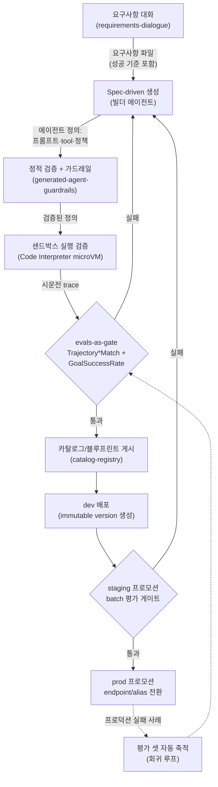

# 에이전트 CI/CD

::: tip 이 장에서 얻는 것
- 요구사항 대화 → spec-driven 생성 → 정적 검증·가드레일 → 샌드박스 실행 검증 → 카탈로그 게시 → dev/staging/prod 프로모션으로 이어지는 **빌더 파이프라인의 전체 그림**과 각 단계의 산출물·게이트 조건
- 요구사항 파일의 성공 기준을 `assertions`/`expectedTrajectory`로 변환해 AgentCore Evaluations batch 평가를 **CI 게이트(evals-as-gate)**로 편입하는 구체적 흐름
- 프로덕션 실패 사례를 평가 셋에 자동 축적하는 **회귀 루프**의 설계
- Harness의 immutable version + named endpoint, Runtime의 alias 기반 blue/green을 이용한 **버전 관리와 즉시 롤백** 전략
- "prompt = code" — 프롬프트 변경을 코드 변경과 동일한 리뷰·평가·프로모션 경로에 태우는 운영 원칙
:::

이 장은 [여섯 가지 통점](/00-intro/six-pain-points)에서 제시한 도입 로드맵 **3단계(게이트화)의 정본 구현**이다. 로드맵이 "batch 평가를 CI 배포 게이트로 편입한다"고 선언만 했다면, 이 장은 그 게이트를 어디에 어떤 순서로 꽂는지를 파이프라인 단위로 명세한다. 평가 서비스 자체(3계층 평가 모델, 13개 빌트인 평가자, 실행 유형)의 정본은 [AWS 평가 서비스](/03-accuracy-eval/aws-evaluations)이며, 이 장은 그것을 소비하는 쪽이다.

## 왜 문제가 되는가

전통적 소프트웨어의 CI/CD는 "빌드가 성공하고 테스트가 통과하면 배포한다"는 결정론적 계약 위에 서 있다. 에이전트는 이 계약의 두 전제를 모두 깬다.

첫째, **산출물 자체가 비결정적으로 생성된다.** 빌더 에이전트 플랫폼에서는 사람이 코드를 쓰는 것이 아니라, [요구사항 대화](/11-builder-agent/requirements-dialogue)로 확정된 요구사항 파일을 입력으로 에이전트 정의(프롬프트, tool 구성, 정책)가 생성된다. 같은 요구사항 파일에서도 생성 결과가 달라질 수 있으므로, "생성물이 요구사항을 만족하는가"를 검증하는 단계가 빌드 단계와 분리되어 파이프라인에 명시적으로 존재해야 한다.

둘째, **테스트 통과의 정의가 다르다.** 에이전트의 회귀는 컴파일 에러나 단위 테스트 실패로 잡히지 않는다. 프롬프트 한 줄 수정으로 tool 호출 순서가 바뀌고, 모델 버전 교체로 goal 달성률이 떨어지는 회귀는 **trajectory·goal 평가**로만 잡을 수 있다. 이 평가를 사람이 수동으로 돌리는 조직은 결국 돌리지 않게 되고, "대시보드에는 점수가 있는데 배포는 감으로 하는" 상태([AWS 평가 서비스](/03-accuracy-eval/aws-evaluations)의 안티패턴)에 도달한다. 평가가 배포를 **차단할 수 있는 권한**을 가져야 게이트다.

셋째, **변경의 단위가 코드가 아니다.** 에이전트에서 가장 빈번한 변경은 프롬프트·tool 설명·모델 파라미터이며, 이들은 파일 diff로는 사소해 보이지만 행동 변화는 코드 리팩터링보다 클 수 있다. 프롬프트 변경이 리뷰와 평가를 우회해 프로덕션에 직행하는 순간 파이프라인의 나머지 전부가 무의미해진다.

## 핵심 개념

### 전체 파이프라인

빌더 파이프라인은 여섯 단계로 구성되며, 각 단계는 명확한 산출물과 통과 조건을 갖는다.



단계별 계약:

1. **요구사항 대화** — 산출물은 구조화된 요구사항 파일이다. 이 파일에는 기능 명세만이 아니라 **성공 기준**(어떤 입력에 어떤 목표가 달성되어야 하는가, 어떤 tool이 어떤 순서로 호출되어야 하는가)이 반드시 포함되어야 한다. 이 성공 기준이 뒤 단계에서 평가 게이트의 ground truth로 변환되기 때문이다. 상세는 [요구사항 대화](/11-builder-agent/requirements-dialogue).
2. **Spec-driven 생성** — 빌더 에이전트가 요구사항 파일을 입력으로 에이전트 정의를 생성한다. 핵심 원칙은 **생성의 입력이 대화 로그가 아니라 파일이라는 것**이다. 파일이 정본(source of truth)이면 생성은 재현 가능하고, 재생성·회귀 비교·리뷰가 모두 파일 diff 위에서 이루어진다. 이는 Kiro 등이 정식화한 spec-driven development의 원칙 — 요구사항을 구조화된 spec 파일로 고정하고 구현을 spec에서 파생시키는 — 을 에이전트 생성에 적용한 것이다. ([Kiro Docs — Specs](https://kiro.dev/docs/specs/))
3. **정적 검증 + 가드레일** — 생성된 정의가 플랫폼 정책(허용 tool 목록, 권한 상한, 프롬프트 금지 패턴, Guardrails 부착 여부)을 만족하는지 실행 없이 검사한다. 상세는 [생성된 에이전트의 가드레일](/11-builder-agent/generated-agent-guardrails).
4. **샌드박스 실행 검증** — 생성된 에이전트를 프로덕션 권한 없이 실제로 구동해 본다. AgentCore Code Interpreter의 세션별 microVM(격리된 CPU·메모리·파일시스템, 세션 종료 시 완전 폐기)이 이 시운전의 실행 기반이다 — 생성된(= 신뢰할 수 없는) 코드와 tool 호출이 호스트나 다른 테넌트에 닿지 않는다. 격리 모델·네트워크 모드·쿼터는 [Tools 심화](/10-agentcore/tools-deep-dive)가 정본이다. 시운전에서 남긴 OTel trace가 다음 단계 평가의 입력이 된다.
5. **카탈로그/블루프린트 게시** — 게이트를 통과한 정의만 조직 카탈로그에 게시되어 재사용 가능한 블루프린트가 된다. 상세는 [카탈로그와 레지스트리](/11-builder-agent/catalog-registry).
6. **dev → staging → prod 프로모션** — 같은 immutable 버전이 환경을 따라 승격되며, 각 승격 지점에 평가 게이트가 선다.

### Evals-as-gate: 성공 기준 → ground truth → batch 평가 → 프로모션

게이트의 구체적 데이터 흐름은 다음과 같다.

**1단계 — 성공 기준을 평가 입력으로 변환한다.** 요구사항 파일의 각 성공 기준은 두 종류의 ground truth로 기계 변환된다.

- 목표 달성 기준 → `Builtin.GoalSuccessRate`의 **assertions**(세션이 만족해야 할 명제 목록)
- tool 호출 기준 → `Builtin.Trajectory*Match`의 **expectedTrajectory**(기대 tool 호출 시퀀스)

trajectory 평가자는 `TrajectoryExactOrderMatch` / `TrajectoryInOrderMatch` / `TrajectoryAnyOrderMatch` 세 가지 매칭 강도를 제공하며, 프로그램적 매칭이라 LLM을 호출하지 않는다(토큰 사용량 0) — 결정론적이고 저렴하므로 CI의 1차 게이트로 적합하다. ([AgentCore — Ground truth evaluations](https://docs.aws.amazon.com/bedrock-agentcore/latest/devguide/ground-truth-evaluations.html))

**2단계 — 시나리오 스위트를 실행해 trace를 만든다.** CI 잡이 평가 셋의 각 시나리오 입력으로 후보 버전을 호출한다(샌드박스 검증 단계에서는 Code Interpreter 기반 시운전, 프로모션 게이트에서는 dev/staging 환경의 실제 엔드포인트). 에이전트가 OTel 계측되어 있으면 실행 자체가 CloudWatch에 평가 가능한 스팬을 남긴다 — AgentCore Evaluations는 라이브 페이로드가 아니라 적재된 스팬을 평가하므로, **계측이 게이트의 전제 조건**이다. ([AgentCore — Batch evaluation](https://docs.aws.amazon.com/bedrock-agentcore/latest/devguide/batch-evaluations.html))

**3단계 — batch 평가를 동기 실행한다.** ground truth 기반 평가(Correctness의 `expectedResponse`, trajectory 매칭)는 online에서 지원되지 않으므로 게이트는 on-demand 또는 batch로 구성한다. batch는 `sessionMetadata`로 세션별 ground truth를 주입할 수 있고, CLI의 `--wait --json` 조합으로 CI 스텝이 결과를 동기적으로 받아 exit code로 변환할 수 있다. ([Start batch evaluation](https://docs.aws.amazon.com/bedrock-agentcore/latest/devguide/batch-evaluations-start.html))

```bash
# CI 게이트 스텝의 골격 (의사코드 수준 — 플래그는 batch-evaluations-start 문서 기준)
agentcore run batch-evaluation \
  --agent "$CANDIDATE_AGENT" \
  --evaluators "Builtin.TrajectoryInOrderMatch,Builtin.GoalSuccessRate" \
  --wait --json > eval_result.json

jq -e '.scores.GoalSuccessRate >= 0.90 and .scores.TrajectoryInOrderMatch >= 0.95' \
  eval_result.json || { echo "eval gate failed — promotion blocked"; exit 1; }
```

임계값(위 예시의 0.90/0.95)은 예시이며, 조직의 베이스라인 대비 상대 하락 폭으로 정의하는 편이 절대값보다 안정적이다 — 절대 임계는 평가 셋이 어려워지는 순간 전 파이프라인을 막는다.

**4단계 — RAG 계층은 Bedrock Evaluations로 별도 게이트를 건다.** 에이전트가 Knowledge Base를 사용한다면, retrieve-only / retrieve-and-generate 잡을 같은 CI에서 실행해 검색 품질 회귀와 생성 품질 회귀를 분리 판정한다. Bedrock Evaluations의 RAG 평가는 2025년 3월 GA다. ([AWS ML Blog — Evaluate models or RAG systems using Amazon Bedrock Evaluations, now generally available](https://aws.amazon.com/blogs/machine-learning/evaluate-models-or-rag-systems-using-amazon-bedrock-evaluations-now-generally-available/))

**5단계 — 통과 시에만 프로모션.** 게이트 통과가 곧 endpoint/alias 전환의 트리거다(아래 버전 관리 절). 환경별 승격에 수동 승인을 겹치려면 CI 플랫폼의 환경 보호 규칙(예: GitHub Actions environments의 required reviewers)을 평가 게이트 **뒤에** 배치한다 — 사람은 평가 결과를 보고 승인하는 것이지, 평가를 대신하는 것이 아니다. ([GitHub Docs — Using environments for deployment](https://docs.github.com/en/actions/deployment/targeting-different-environments/using-environments-for-deployment))

### 회귀 루프: 프로덕션 실패를 평가 셋으로 되먹임

평가 셋이 출시 시점 요구사항에 고정되어 있으면 게이트는 시간이 지날수록 현실과 괴리된다. 루프를 닫는 표준 패턴:

1. 프로덕션에서 online 평가(reference-free 평가자, 샘플링)와 사용자 피드백·에스컬레이션으로 실패 세션을 탐지한다.
2. 실패 세션의 trace를 검토(triage)해 "에이전트 결함"으로 분류된 건에 대해, 해당 세션의 입력과 **올바른** 기대 결과(assertions / expectedTrajectory)를 작성한다 — 이 라벨링이 루프에서 유일하게 사람이 개입하는 지점이다.
3. 그 케이스를 평가 셋 리포지토리에 PR로 추가한다. 평가 셋도 코드처럼 버전 관리·리뷰 대상이다.
4. 다음 버전은 이 케이스를 통과해야만 프로모션된다 — 한 번 발생한 실패는 두 번 배포되지 않는다.

이 구조에서 평가 셋은 "요구사항 파일에서 파생된 초기 셋 + 프로덕션 실패에서 축적된 회귀 셋"의 합집합이 되며, 후자의 성장 속도가 플랫폼 학습 속도의 지표다.

### 버전 관리와 롤백: immutable version + named endpoint

프로모션의 실체는 "새로 빌드"가 아니라 "**이미 평가된 불변 버전으로 포인터를 옮기는 것**"이어야 한다. 환경마다 다시 생성하면 평가한 것과 배포되는 것이 다른 산출물이 된다.

AgentCore Harness가 이 모델을 기본 제공한다: 하네스 설정을 업데이트할 때마다 **immutable version**이 생성되고(`list-harness-versions`), **named endpoint**(`create-harness-endpoint` — `DEFAULT` 이름은 예약)가 특정 버전을 가리킨다. 롤백은 endpoint를 이전 버전으로 다시 가리키는 것뿐이며 재빌드가 없다. ([AgentCore Harness documentation](https://docs.aws.amazon.com/bedrock-agentcore/latest/devguide/harness.html))

> ⚠️ 비공식 출처 기반 — 공식 문서 교차확인 필요
> 버전·endpoint 운영 세부(엔드포인트 API 목록, `DEFAULT` 예약 규칙, 리포인팅 롤백 절차)는 로컬 Harness 운영 레퍼런스의 "Versions and Endpoints" 정리를 따랐다. Harness는 빠르게 진화하는 서비스이므로 위 공식 devguide에서 최신 API 형태를 확인하라.

이 구조를 CI/CD에 매핑하면:

- **dev**: 게이트 통과한 정의로 새 버전 생성 → `dev` endpoint가 가리킴
- **staging**: 같은 버전 번호를 `staging` endpoint가 가리키도록 전환 (staging 게이트 통과 시)
- **prod**: `DEFAULT`(또는 `prod`) endpoint 전환. 장애 시 직전 버전으로 리포인팅 — 즉시 롤백

컨테이너 기반 Runtime 배포에서는 동일한 역할을 **alias 기반 blue/green**이 수행한다 — 신버전을 별도 기동해 검증한 뒤 alias만 전환하고, 실패 시 alias를 되돌린다. 절차와 트레이드오프(rolling update의 혼재 창, blue/green의 이중 기동 비용)는 [Runtime 배포 계약](/10-agentcore/runtime-deploy-contract)이 정본이다.

### Prompt = code

프롬프트·tool 설명·모델 파라미터 변경은 이 파이프라인에서 코드 변경과 **동일한 클래스의 변경**으로 취급한다. 운영 원칙:

- 프롬프트는 리포지토리의 파일이다. 콘솔에서 직접 수정하는 경로는 막는다(수정하면 정본과 배포본이 갈라진다).
- 프롬프트 변경 PR은 코드 리뷰 + 평가 게이트를 모두 통과해야 머지된다. "오타 수정"도 예외가 아니다 — 에이전트에서 diff 크기와 행동 변화 크기는 비례하지 않는다.
- 관리형 프롬프트 저장소를 쓴다면 버전 기능을 사용한다 — Bedrock Prompt Management는 프롬프트를 버전으로 스냅샷해 배포 단위로 관리하는 기능을 제공한다. ([Bedrock User Guide — Prompt management](https://docs.aws.amazon.com/bedrock/latest/userguide/prompt-management.html)) 단, 저장소가 어디든 "버전이 평가를 통과했는가"를 추적하는 것은 파이프라인의 책임이다.
- 모델 버전 교체(예: 프로바이더의 신모델 GA)도 프롬프트와 같은 경로를 탄다. 모델 변경은 사실상 전체 행동의 재생성이므로 full 평가 스위트가 필수다.

## 결정 표

| 상황 | 선택 | 이유 | 트레이드오프 |
|---|---|---|---|
| PR 단위 빠른 회귀 확인 | `Builtin.Trajectory*Match`만 (on-demand/batch) | 프로그램적 매칭, 토큰 0, 결정론적 — 수 분 내 판정 | 자연어 품질·목표 달성은 못 봄 |
| staging → prod 프로모션 게이트 | trajectory + `GoalSuccessRate` + (RAG 사용 시) Bedrock RAG eval 전체 스위트 | 프로모션은 빈도가 낮아 judge 비용을 감당 가능, 마지막 방어선 | LLM-judge 비용·시간, judge 자체의 분산 |
| trajectory 매칭 강도 선택 | 재시도·폴백이 있는 에이전트는 `InOrderMatch`, 엄격한 절차형은 `ExactOrderMatch` | 재시도로 인한 추가 호출이 정상인 에이전트를 Exact로 재면 위양성 실패 | InOrder는 불필요한 중간 호출 낭비를 못 잡음 |
| 게이트 임계값 정의 | 절대값보다 베이스라인 대비 하락 폭 | 평가 셋이 어려워져도 게이트가 전면 봉쇄되지 않음 | 베이스라인 점수의 저장·갱신 파이프라인 필요 |
| config 기반 에이전트(Harness)의 버전·롤백 | immutable version + named endpoint 리포인팅 | 재빌드 없는 즉시 롤백, 평가된 버전 = 배포된 버전 보장 | Harness(Strands 루프)로 표현 가능한 에이전트에 한정 |
| 컨테이너 기반 에이전트(Runtime)의 릴리스 | alias 기반 blue/green ([Runtime 배포 계약](/10-agentcore/runtime-deploy-contract)) | 전환 전 신버전 검증, alias 원복으로 즉시 롤백 | 이중 기동 동안 비용 증가 |
| 생성된 에이전트의 첫 실행 위치 | Code Interpreter microVM 샌드박스 ([Tools 심화](/10-agentcore/tools-deep-dive)) | 생성물은 신뢰 불가 코드 — 세션 격리·폐기로 피해 반경 0 | 프로덕션 권한·데이터가 없는 환경이므로 통합 수준 검증은 dev 환경에서 별도 수행 |

## 실패 모드

| 증상 | 근본 원인 | 확인 방법 | 해결 |
|---|---|---|---|
| 게이트가 항상 통과 — 명백한 회귀도 배포됨 | 평가 셋이 출시 시점에 고정돼 현실 커버리지 상실 | 평가 셋 최근 추가 이력 확인 — 수 개월간 커밋 0이면 확정 | 회귀 루프 가동: 프로덕션 실패 triage → 평가 케이스 PR을 운영 프로세스로 고정 |
| 게이트가 항상 실패 — 팀이 게이트를 우회하기 시작 | 절대 임계값 과다 / `ExactOrderMatch`를 재시도형 에이전트에 적용 | 실패 리포트에서 trajectory diff 확인 — 기대 시퀀스 사이 재시도 호출이 원인인지 | 베이스라인 상대 임계로 전환, 매칭 강도를 `InOrderMatch`로 완화 |
| CI에서 batch 평가가 "세션 없음"으로 빈 결과 | 후보 에이전트의 OTel 계측 누락 — 평가 대상 스팬이 CloudWatch에 없음 | 시나리오 실행 직후 해당 log group에서 스팬 존재 확인 | 계측을 생성 템플릿에 내장 — 계측 없는 정의는 정적 검증 단계에서 거부 ([AWS 평가 서비스](/03-accuracy-eval/aws-evaluations)) |
| online 게이트에서 trajectory 평가가 동작 안 함 | online 평가는 ground truth 미지원 | evaluation config의 실행 유형 확인 | reference 기반 평가자는 on-demand/batch로 이동 ([Batch evaluation](https://docs.aws.amazon.com/bedrock-agentcore/latest/devguide/batch-evaluations.html)) |
| staging은 통과했는데 prod 행동이 다름 | 환경별 재생성 — 평가된 산출물과 배포된 산출물이 다름 | dev/staging/prod의 버전 식별자 비교 | immutable version을 승격하는 모델로 전환 — 프로모션 = endpoint 리포인팅 |
| 프롬프트 hotfix 후 원인 불명 회귀 | 콘솔 직접 수정으로 정본(repo)과 배포본 분기 | 배포본 프롬프트와 repo HEAD diff | 콘솔 쓰기 권한 회수, 프롬프트 변경도 PR + 게이트 경로 강제 (prompt = code) |
| 프로모션마다 평가 비용 급증 | 전 게이트에 LLM-judge 전체 스위트 적용 | 게이트별 judge 호출량·토큰 집계 | PR 게이트는 trajectory(토큰 0) 위주, judge 스위트는 프로모션 게이트로 한정 |
| 샌드박스 시운전은 통과, dev 배포 후 tool 호출 전부 실패 | 샌드박스에 프로덕션 통합(Gateway, 실 API)이 없음 — 시운전이 검증한 범위 오해 | dev 환경 trace에서 tool 호출 에러 유형 확인 | 샌드박스 게이트는 "정의의 자체 무결성"까지만 담당한다고 명시, 통합 검증은 dev 게이트의 책임으로 분리 |

## 안티패턴

- ❌ 요구사항 대화 로그를 그대로 생성 입력으로 사용 → ✅ 대화의 산출물인 **요구사항 파일**이 유일한 생성 입력 — 재현 가능성과 diff 기반 리뷰가 파일에서 나온다.
- ❌ 성공 기준 없는 요구사항 파일을 통과시킴 → ✅ 성공 기준(assertions/expectedTrajectory로 변환 가능한 형태) 없는 파일은 생성 단계 진입 자체를 거부한다 — 기준이 없으면 뒤의 모든 게이트가 판정 근거를 잃는다.
- ❌ 평가 점수를 대시보드에 두고 프로모션은 사람이 결정 → ✅ 평가가 exit code로 배포를 차단하는 게이트가 되고, 사람의 승인은 게이트 **뒤**에 선다.
- ❌ 생성된 에이전트를 곧바로 dev 환경(실 권한 보유)에서 첫 구동 → ✅ 첫 구동은 항상 Code Interpreter microVM 샌드박스 — 생성물은 정의상 신뢰할 수 없는 코드다.
- ❌ 프롬프트 "사소한" 수정은 게이트 면제 → ✅ 프롬프트 diff 크기와 행동 변화는 비례하지 않는다. 모든 프롬프트 변경은 코드와 동일 경로.
- ❌ 환경마다 에이전트를 다시 생성해 배포 → ✅ 한 번 평가된 immutable version을 endpoint 리포인팅으로 승격한다.
- ❌ 실패 사례를 개별 버그로 수정하고 종료 → ✅ 수정과 함께 해당 사례를 평가 셋에 추가 — 게이트가 재발을 구조적으로 막는다.
- ❌ 로드맵 1단계(관측 기반) 없이 게이트부터 구축 → ✅ AgentCore Evaluations는 OTel 스팬을 평가한다. 계측이 없으면 게이트는 빈 셋을 평가하고 통과한다 ([여섯 가지 통점](/00-intro/six-pain-points)).

## 계측 (SLI)

파이프라인 자체를 관측 대상으로 삼는다.

- **게이트 통과율**: 게이트별(샌드박스/staging/prod) 통과 비율의 시계열. 급락은 생성기 회귀 또는 평가 셋 변경, 100% 고착은 평가 셋 노후화 신호다.
- **게이트 리드타임**: 요구사항 파일 확정 → prod endpoint 전환까지의 소요 시간. 단계별 분해로 병목(대개 judge 스위트 실행)을 식별한다.
- **평가 비용 / 배포 비율**: batch 결과에 포함되는 평가자별 토큰 사용량을 배포 건수로 나눠 추적 — trajectory 평가자 비중 확대가 이 비율을 낮춘다 ([AWS 평가 서비스](/03-accuracy-eval/aws-evaluations)의 비용 SLI와 동일 축).
- **회귀 셋 성장률**: 프로덕션 실패에서 평가 셋으로 편입된 케이스 수/주. 0이 지속되면 회귀 루프가 죽은 것이다.
- **롤백 빈도와 MTTR**: endpoint 리포인팅 발생 횟수와 장애 인지 → 리포인팅 완료까지의 시간. 롤백이 잦으면 staging 게이트가 prod의 실패 유형을 대표하지 못하는 것이다.
- **escaped regression**: prod에서 발견됐으나 어떤 게이트도 잡지 못한 회귀 건수 — 게이트 체계 전체의 최종 품질 지표.

## 체크리스트

- [ ] 요구사항 파일 스키마에 성공 기준 필드(목표 달성 명제, 기대 tool 시퀀스)가 필수로 정의되어 있는가
- [ ] 성공 기준 → `assertions`/`expectedTrajectory` 변환이 수작업이 아니라 파이프라인 코드인가
- [ ] 생성된 에이전트 정의에 OTel 계측이 템플릿 수준에서 내장되는가 (계측 없으면 정적 검증 거부)
- [ ] 첫 실행 검증이 Code Interpreter microVM 샌드박스에서 이루어지는가 ([Tools 심화](/10-agentcore/tools-deep-dive))
- [ ] PR 게이트(trajectory, 토큰 0)와 프로모션 게이트(judge 스위트 포함)가 비용 프로파일에 맞게 분리되어 있는가
- [ ] batch 평가가 `--wait --json`으로 CI exit code에 연결되어 실패 시 프로모션이 실제로 차단되는가
- [ ] 게이트 임계값이 베이스라인 상대 방식이고, 베이스라인 갱신 절차가 정의되어 있는가
- [ ] RAG를 쓰는 에이전트에 retrieve-only / retrieve-and-generate 분리 게이트가 있는가 ([AWS 평가 서비스](/03-accuracy-eval/aws-evaluations))
- [ ] 프로모션이 재생성이 아니라 immutable version의 endpoint/alias 전환인가 ([Runtime 배포 계약](/10-agentcore/runtime-deploy-contract))
- [ ] 롤백 절차(endpoint 리포인팅 / alias 원복)가 문서가 아니라 실행 가능한 스크립트로 존재하고, 훈련된 적이 있는가
- [ ] 프롬프트·tool 설명·모델 파라미터 변경이 코드와 동일한 PR + 게이트 경로를 강제받는가 (콘솔 직접 수정 차단)
- [ ] 프로덕션 실패 사례 → 평가 셋 편입 프로세스에 담당자와 SLA가 있는가
- [ ] 게이트 통과 산출물만 카탈로그에 게시되는가 ([카탈로그와 레지스트리](/11-builder-agent/catalog-registry))

## 참고

- [Amazon Bedrock AgentCore — Harness](https://docs.aws.amazon.com/bedrock-agentcore/latest/devguide/harness.html) — versions/endpoints 포함 Harness 정본 문서
- [Amazon Bedrock AgentCore — Ground truth evaluations](https://docs.aws.amazon.com/bedrock-agentcore/latest/devguide/ground-truth-evaluations.html) — assertions, expectedTrajectory, Trajectory*Match 평가자
- [Amazon Bedrock AgentCore — Batch evaluation](https://docs.aws.amazon.com/bedrock-agentcore/latest/devguide/batch-evaluations.html) / [Start batch evaluation](https://docs.aws.amazon.com/bedrock-agentcore/latest/devguide/batch-evaluations-start.html)
- [Amazon Bedrock AgentCore — Evaluation types](https://docs.aws.amazon.com/bedrock-agentcore/latest/devguide/evaluations-types.html)
- [AWS ML Blog — Evaluate models or RAG systems using Amazon Bedrock Evaluations, now generally available](https://aws.amazon.com/blogs/machine-learning/evaluate-models-or-rag-systems-using-amazon-bedrock-evaluations-now-generally-available/)
- [Amazon Bedrock — Prompt management](https://docs.aws.amazon.com/bedrock/latest/userguide/prompt-management.html)
- [Kiro Docs — Specs](https://kiro.dev/docs/specs/) — spec-driven development의 원형
- [GitHub Docs — Using environments for deployment](https://docs.github.com/en/actions/deployment/targeting-different-environments/using-environments-for-deployment)
- 책 내부: [AWS 평가 서비스](/03-accuracy-eval/aws-evaluations) · [Runtime 배포 계약](/10-agentcore/runtime-deploy-contract) · [Tools 심화](/10-agentcore/tools-deep-dive) · [여섯 가지 통점](/00-intro/six-pain-points) · [요구사항 대화](/11-builder-agent/requirements-dialogue) · [생성된 에이전트의 가드레일](/11-builder-agent/generated-agent-guardrails) · [카탈로그와 레지스트리](/11-builder-agent/catalog-registry)
