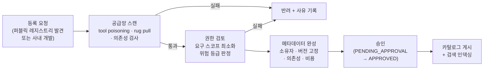

# 카탈로그와 레지스트리

::: tip 이 장에서 얻는 것
- 레지스트리(진실원)와 카탈로그(소비 뷰)를 분리하는 이유와 두 계층의 책임 경계
- 공식 MCP Registry(registry.modelcontextprotocol.io)와 조직 내부 레지스트리의 관계 — 퍼블릭에서 큐레이션해 내부로 미러링하는 공급망 모델
- AWS Agent Registry(AgentCore, Preview)의 실제 기능 범위: 등록 가능한 리소스 타입, 승인 워크플로, hybrid search, MCP endpoint
- 카탈로그 항목 메타데이터 스키마의 최소 필드 집합(소유자·위험 등급·승인 상태·버전·의존성·비용 프로파일)
- 신규 MCP 서버 온보딩 파이프라인(공급망 스캔 → 권한 검토 → 게시)과 재사용 우선 원칙의 계측 방법
:::

## 왜 문제가 되는가

[메타플랫폼 전체 그림](/00-intro/meta-platform-overview)의 조립 단계에서 빌더 에이전트는 "카탈로그에서 기존 컴포넌트를 재사용하고, 없는 경우에만 신규 생성한다"고 정의했다. 이 문장이 성립하려면 전제가 하나 필요하다: **조직 안에 무엇이 있는지에 대한 단일 진실원(single source of truth)이 존재해야 한다.** 이 전제가 무너진 조직의 증상은 일관적이다. 같은 사내 시스템을 감싸는 MCP 서버가 팀마다 하나씩 생기고, 거의 동일한 Skill이 서로 다른 저장소에 세 벌 존재하며, 어떤 에이전트가 어떤 MCP 서버에 의존하는지 아무도 답하지 못한다. 컴포넌트가 수십 개를 넘어서는 순간 "검색해서 재사용"은 "물어볼 사람을 수소문"으로 퇴화하고, 빌더 에이전트는 카탈로그가 비어 있으므로 매번 새로 만든다 — 중복 생성이 다시 카탈로그를 오염시키는 악순환이다.

두 번째 문제는 공급망이다. MCP 생태계는 퍼블릭 레지스트리와 GitHub에서 서버를 받아 붙이는 문화 위에 서 있는데, Invariant Labs의 조사에 따르면 공개 MCP 서버의 5.5%가 tool description에 악성 지시를 숨긴 tool poisoning 형태의 오염된 메타데이터를 포함하고 있었다([Invariant Labs — Introducing MCP-Scan](https://invariantlabs.ai/blog/introducing-mcp-scan)). 개별 개발자가 npm 패키지를 고르듯 각자 MCP 서버를 고르게 두면, 조직은 이 위험을 팀 수만큼 병렬로 감수하게 된다. 검증되지 않은 서버가 조직에 들어오는 경로를 하나로 좁히고 그 경로에 검사를 끼워 넣는 것 — 이것이 레지스트리가 보안 관점에서 수행하는 역할이다.

세 번째 문제는 이 책의 메타플랫폼 시나리오 중 세 번째, 즉 **비개발자가 Skill·MCP 서버·프롬프트를 만들거나 재사용하는 셀프서비스**다. 비개발자에게 GitHub 저장소 목록을 던져줄 수는 없다. 그들에게 필요한 것은 "승인된 것만 보이고, 자연어로 검색되고, 위험 등급과 소유자가 표시되는" 소비용 뷰다. [Platform Engineering for AI](/00-intro/platform-engineering-for-ai)에서 정의한 golden path — "승인된 블루프린트를 통한 셀프서비스, 그 밖의 모든 것은 리뷰 경유" — 를 실제로 집행하는 물리적 장치가 바로 카탈로그다.

## 핵심 개념

### 레지스트리와 카탈로그: 진실원과 소비 뷰의 분리

이 장에서 두 용어를 구분해 쓴다.

- **레지스트리(registry)**: 조직 내 모든 에이전트·MCP 서버·툴·Skill 레코드의 단일 진실원. 승인 전 초안과 폐기(deprecated)된 항목까지 전체 수명주기를 담는다. 쓰기는 온보딩 파이프라인을 통해서만 일어난다.
- **카탈로그(catalog)**: 레지스트리 위의 소비용 뷰. 승인(approved) 상태의 레코드만 노출하며, 인간(콘솔/UI)과 에이전트(API/MCP endpoint) 양쪽이 검색한다.

이 분리는 컨테이너 세계의 registry(ECR)와 서비스 카탈로그의 관계와 동형이다. 진실원에는 모든 것이 있고, 소비자에게는 승인된 것만 보인다. 하나의 시스템이 두 역할을 겸할 수 있지만(아래 AWS Agent Registry가 그렇다), 개념적 경계 — "레코드의 존재"와 "레코드의 노출"은 별개의 결정이다 — 는 유지해야 한다. 승인 워크플로가 이 경계에 끼어드는 게이트다.

### 공식 MCP Registry와 내부 레지스트리의 관계

공식 MCP Registry는 실존한다. [registry.modelcontextprotocol.io](https://registry.modelcontextprotocol.io/)에서 운영 중이며, 2025년 9월 8일 preview로 공개되었다([MCP Blog — Introducing the MCP Registry](https://blog.modelcontextprotocol.io/posts/2025-09-08-mcp-registry-preview/)). 핵심 성격은 다음과 같다.

- **자기 보고(self-reported) 메타데이터의 집중 게시처**: MCP 서버 유지보수자가 자기 서버의 정보를 직접 게시(publish)하고 유지한다([modelcontextprotocol.io/registry/about](https://modelcontextprotocol.io/registry/about)).
- **네임스페이스 인증**: 서버 이름은 reverse-DNS 형식(`io.github.owner/server` 등)을 따르고, 게시 시 GitHub 계정 또는 도메인 소유권 검증으로 네임스페이스를 인증한다 — 서버가 "주장하는 출처"에서 실제로 왔는지를 보증하는 publisher 개념이다([공식 Registry API 문서](https://github.com/modelcontextprotocol/registry/blob/main/docs/reference/api/official-registry-api.md)).
- **Preview 상태**: GA 전까지 breaking change나 데이터 리셋이 있을 수 있다고 명시되어 있으며, API는 v0.1에서 freeze된 상태다([modelcontextprotocol/registry GitHub](https://github.com/modelcontextprotocol/registry)).

여기서 플랫폼 엔지니어가 오해하기 쉬운 지점: **공식 MCP Registry는 조직 내부 레지스트리를 대체하지 않는다.** 네임스페이스 인증은 "이 서버가 그 GitHub 계정에서 왔다"를 보증할 뿐, 코드가 안전하다거나 조직 정책에 부합한다는 것을 보증하지 않는다. 메타데이터 자체가 자기 보고이므로 tool poisoning 검사도 게시자 몫이 아니다. 올바른 관계는 컨테이너 이미지의 Docker Hub ↔ 사내 ECR 관계와 같다.

> **퍼블릭 레지스트리(발견) → 공급망 검증(스캔·리뷰) → 내부 레지스트리로 미러링(승인·고정) → 카탈로그 노출(소비)**

퍼블릭에서 직접 소비하는 경로를 열어두면 rug pull(승인 후 원격 서버의 tool description이 바뀌는 공격)에 무방비가 된다. 내부 레지스트리에 미러링할 때는 검증 시점의 버전/커밋을 고정(pin)하고, 업스트림 갱신은 재검증을 거쳐서만 반영한다.

### AWS Agent Registry (AgentCore, Preview)

AWS는 이 내부 레지스트리 계층을 관리형으로 제공한다. **AWS Agent Registry**는 Amazon Bedrock AgentCore 하위의 조직 내 에이전트·툴·리소스 카탈로그·검색·거버넌스 서비스로, Preview로 공개되어 있다([AWS 공식 문서 — AWS Agent Registry (Preview)](https://docs.aws.amazon.com/bedrock-agentcore/latest/devguide/registry.html), [What's New 발표](https://aws.amazon.com/about-aws/whats-new/2026/04/aws-agent-registry-in-agentcore-preview)). 공식 문서 기준 기능 범위:

- **등록 가능한 리소스 타입**: MCP 서버, 에이전트(A2A agent card), 툴, agent skill, 커스텀 리소스([registry-concepts](https://docs.aws.amazon.com/bedrock-agentcore/latest/devguide/registry-concepts.html)).
- **승인 워크플로**: 레코드가 관리자 승인을 거쳐야 검색 가능(discoverable)해지는 거버넌스 모드를 지원하고, 기존 승인 워크플로와 연동할 수 있다([registry-key-capabilities](https://docs.aws.amazon.com/bedrock-agentcore/latest/devguide/registry-key-capabilities.html)).
- **검색**: semantic search와 keyword search를 결합한 hybrid search — "자연어로 유스케이스를 설명해서 찾는" 비개발자 시나리오를 직접 겨냥한다.
- **소비 인터페이스**: 콘솔 UI, AWS CLI/SDK, 그리고 **레지스트리 자체가 MCP 서버로 노출**되어 빌더 에이전트나 IDE가 MCP 프로토콜로 카탈로그를 질의할 수 있다. 접근 제어는 IAM과 OAuth(Custom JWT)를 지원한다.
- **URL 기반 자동 등록**: 라이브 MCP 서버/에이전트 endpoint에서 tool schema와 capability 설명을 자동 수집해 레코드를 만든다.

> ⚠️ 비공식 출처 기반 — 공식 문서 교차확인 필요
>
> 로컬 참고 자료 기준으로, 거버넌스 모드는 auto-approve(등록 즉시 discoverable — 격리된 개발 계정 전용)와 manual approval(프로덕션용) 두 가지이며, 레코드 상태는 `DRAFT` → `PENDING_APPROVAL` → `APPROVED`(또는 `REJECTED`)로 전이하고 `DEPRECATED`가 종료 상태다. 흔한 장애는 manual approval 모드에서 승인자가 없어 레코드가 `PENDING_APPROVAL`에 갇히는 것이다. 정확한 상태 머신과 API 명세는 [공식 문서](https://docs.aws.amazon.com/bedrock-agentcore/latest/devguide/registry-create-manage.html)로 확인하라.

두 가지 운영 주의사항. 첫째, Preview 서비스이므로 리전 가용성과 API가 변할 수 있다. 둘째, **네임스페이스 마이그레이션**이 진행 중이다 — Agent Registry는 새 `agent-registry` 네임스페이스로 출시되었고, 초기 public preview의 `bedrock-agentcore` 네임스페이스 지원은 2026년 9월 17일 중단 예정이다([AWS 문서](https://docs.aws.amazon.com/agent-registry/), [DevelopersIO 정리](https://dev.classmethod.jp/en/articles/aws-agent-registry-preview/)). endpoint·IAM 정책·SDK 호출이 옛 네임스페이스에 하드코딩되어 있다면 마이그레이션 대상이다.

### 카탈로그 항목의 메타데이터 설계

레지스트리의 가치는 레코드 스키마의 질에서 나온다. MCP Registry의 `server.json`이나 Agent Registry의 기본 필드(이름·설명·endpoint·타입)는 **발견**에는 충분하지만 **거버넌스**에는 부족하다. 내부 레지스트리 레코드에는 최소한 다음을 커스텀 메타데이터(태그/capabilities)로 강제해야 한다.

| 필드 | 내용 | 왜 필수인가 |
|---|---|---|
| 소유자(owner) | 팀 단위 소유자 + 에스컬레이션 경로 | 장애·취약점 발견 시 "누구 것인지 모르는 컴포넌트"는 폐기밖에 답이 없다 |
| 위험 등급(risk tier) | 읽기 전용 / 내부 쓰기 / 외부 부수효과 / 금전·PII 접촉 등 조직 정의 등급 | 빌더 에이전트가 조립 시 게이트 강도를 결정하는 입력([생성된 에이전트 가드레일](/11-builder-agent/generated-agent-guardrails) 참조) |
| 승인 상태(approval status) | draft / pending / approved / deprecated | 카탈로그 노출 여부의 유일한 판정 기준 |
| 버전(version) | 시맨틱 버전 + 검증 시점의 소스 커밋/이미지 digest 고정 | rug pull 방어와 재현 가능성. "latest"는 레코드가 아니다 |
| 의존성(dependencies) | 이 Skill/에이전트가 어느 MCP 서버·모델·업스트림 API를 쓰는지 | 취약한 MCP 서버 하나가 발견됐을 때 영향 반경(blast radius)을 역추적하는 유일한 수단 |
| 비용 프로파일(cost profile) | 호출당 예상 토큰/과금 리소스, 요금이 발생하는 업스트림 여부 | 비개발자 셀프서비스에서 비용 폭주를 사전 고지·통제하는 근거 |

::: warning 미정착 영역
에이전트/툴 카탈로그 메타데이터의 업계 표준 스키마는 아직 없다. MCP Registry의 server.json, A2A agent card, AWS Agent Registry의 레코드 스키마가 각각 다른 필드 집합을 갖고 있으며 상호 매핑 표준도 미정이다. 위 표는 저자가 컨테이너/패키지 레지스트리 관행에서 이식한 최소 집합이므로, 조직 채택 시 자체 스키마 문서로 명문화하고 표준 등장 시 매핑을 재검토하라.
:::

### 골든 패스 거버넌스: 승인된 것만 셀프서비스

[Platform Engineering for AI](/00-intro/platform-engineering-for-ai)의 golden path 정의 — **승인된 블루프린트를 통한 셀프서비스, 그 밖의 모든 것은 리뷰 경유** — 를 카탈로그가 물리적으로 집행한다. 규칙은 단순하다.

1. 빌더 에이전트와 비개발자 사용자가 보는 카탈로그에는 `approved` 레코드만 존재한다. 조립 파이프라인이 참조할 수 있는 컴포넌트의 전체 집합이 곧 golden path의 범위다.
2. 카탈로그에 없는 것을 요구하는 요청은 셀프서비스로 완결되지 않는다 — 신규 등록 요청으로 전환되어 온보딩 파이프라인(리뷰 경유)에 들어간다.
3. 위험 등급이 높은 레코드는 approved라도 소비자 제한(특정 팀/역할만 검색 가능)을 걸 수 있어야 한다. Agent Registry의 IAM/OAuth 기반 접근 제어가 이 지점에 대응한다.

이 구조에서 승인 워크플로는 관료제가 아니라 **셀프서비스의 전제 조건**이다. 승인이 느슨하면 카탈로그가 오염되어 셀프서비스 자체를 닫아야 하고, 승인이 과도하게 느리면 사용자가 플랫폼 밖에서 그림자 IT로 이탈한다. 그래서 승인 리드타임은 아래 SLI 절에서 일급 지표로 다룬다.

### 온보딩 파이프라인: 신규 MCP 서버가 카탈로그에 오르기까지

신규 MCP 서버(퍼블릭 미러링이든 사내 개발이든)의 등록 경로를 파이프라인으로 고정한다.

- **공급망 스캔**: mcp-scan 같은 도구가 tool description의 악성 지시(tool poisoning), cross-origin escalation, rug pull 패턴을 정적으로 검사하고, proxy 모드로 런타임 MCP 트래픽을 지속 감시할 수도 있다([invariantlabs-ai/mcp-scan](https://github.com/invariantlabs-ai/mcp-scan), [문서](https://invariantlabs-ai.github.io/docs/mcp-scan/)). 공격 유형별 상세와 국내 규제 맥락은 [MCP 공급망 보안](/12-security-korea/mcp-supply-chain)에서 다룬다.
- **권한 검토**: 서버가 요구하는 자격증명·스코프를 최소화하고 위험 등급을 판정한다. MCP 서버의 실제 자격증명 위임은 레지스트리가 아니라 [Gateway](/10-agentcore/gateway-deep-dive)와 Identity 계층의 몫이다 — 레지스트리 레코드에는 "무엇이 필요한가"만 기록하고, 자격증명 자체를 레코드에 넣지 않는다.
- **게시**: 승인과 동시에 검색 인덱스(semantic + keyword)에 반영되어 빌더 에이전트가 다음 조립부터 참조한다.

### 재사용 우선 원칙: 빌더 에이전트는 만들기 전에 검색한다

빌더 에이전트의 조립 프롬프트/워크플로에 다음 순서를 하드코딩한다: **카탈로그 semantic search → 매칭 평가 → (매칭 시) 재사용 → (미스 시) 신규 생성 경로**. Agent Registry가 hybrid search와 MCP endpoint를 제공하므로, 빌더 에이전트는 레지스트리를 자신의 툴 중 하나로 호출해 "요구사항을 자연어로 설명하고 후보를 받는" 형태로 구현할 수 있다. 이는 [Gateway의 semantic tool search](/10-agentcore/gateway-deep-dive)가 런타임에 툴을 고르는 것과 같은 패턴을 조립 타임에 적용한 것이다 — 런타임 검색은 "이 호출에 어떤 툴을 쓸까"를, 조립 타임 검색은 "이 에이전트에 어떤 컴포넌트를 넣을까"를 푼다.

재사용 판정에는 임계값이 필요하다. 유사도 상위 후보가 있어도 "요구사항의 80%만 덮는" 컴포넌트라면, 빌더 에이전트가 기존 컴포넌트 확장(소유자 팀에 변경 요청)과 신규 생성 중 무엇을 택할지의 정책이 있어야 한다. 기본값은 확장 우선이다 — 신규 생성은 카탈로그 엔트로피를 늘리는 비용을 수반하기 때문이다.

## 결정 표

| 상황 | 선택 | 이유 | 트레이드오프 |
|---|---|---|---|
| AWS 중심 조직, 에이전트·MCP 서버·Skill을 한 곳에서 카탈로그·검색 | AWS Agent Registry (Preview) | 승인 워크플로·hybrid search·MCP endpoint가 관리형으로 제공, IAM/OAuth 통합 | Preview — API·리전 제약, 네임스페이스 마이그레이션(2026-09-17 구 네임스페이스 중단) 추적 필요 |
| 멀티클라우드/온프레미스 혼재, 레지스트리를 직접 통제해야 함 | 자체 구축(레코드 저장소 + 검색 인덱스 + 승인 워크플로) | 스키마·거버넌스를 완전 통제, 벤더 종속 없음 | 승인 UI·semantic search·감사 로그를 전부 직접 구축·운영 |
| 퍼블릭 MCP 서버 도입 | 공식 MCP Registry에서 발견 → 스캔 → 내부 미러링 | 네임스페이스 인증으로 출처 보증, 내부 고정으로 rug pull 차단 | 미러 동기화·재검증 파이프라인 운영 비용 |
| 퍼블릭 MCP 서버를 endpoint 직결로 즉시 사용 | 하지 않는다 (실험 격리 계정 제외) | 자기 보고 메타데이터 + 원격 변경 가능 = 공급망 통제 불가 | 도입 리드타임 증가 — 온보딩 SLA로 상쇄 |
| 개발 환경의 등록 마찰 최소화 | auto-approve 모드, 단 격리된 개발 계정 한정 | 실험 반복 속도 확보 | 프로덕션/공유 계정에 적용하면 거버넌스 게이트가 사라짐 |
| 비개발자 셀프서비스 노출 범위 | approved + 위험 등급 하위 티어만 기본 노출 | golden path 집행 — 고위험 컴포넌트는 리뷰 경유 강제 | 노출 범위가 좁으면 그림자 IT 유인 증가 — 카탈로그 커버리지를 SLI로 감시 |

## 실패 모드

| 증상 | 근본 원인 | 확인 방법 | 해결 |
|---|---|---|---|
| 거의 동일한 Skill/MCP 서버가 카탈로그에 중복 등록 | 빌더 에이전트가 생성 전에 검색하지 않거나, semantic search 매칭 품질이 낮음 | 신규 등록 레코드와 기존 레코드의 임베딩 유사도 상위 쌍 정기 감사 | 조립 워크플로에 검색 단계 강제, 등록 시 유사 레코드 자동 제시 + 중복 병합 절차 |
| 등록 레코드가 승인 대기에서 무기한 정체 | manual approval 모드인데 승인자 부재 또는 알림 미배선 | 레코드 상태별 체류 시간 분포 조회(`PENDING_APPROVAL` 체류 시간) | 승인자 온콜 로테이션 지정, 승인 리드타임 SLA 공개, 개발 계정은 auto-approve 분리 |
| 승인 시점에는 안전했던 MCP 서버가 이후 악성 동작 (rug pull) | 내부 미러링 없이 원격 endpoint 직결 — 승인 후 tool description 변경을 감지 못함 | 승인 시점 스냅샷과 현재 라이브 tool schema의 diff 검사 | 검증 시점 버전/digest 고정, 업스트림 변경 시 자동 재검증 트리거, mcp-scan proxy 모드 상시 감시 |
| 취약점 공지 후 영향 범위 파악에 며칠 소요 | 레코드에 의존성 필드가 없어 "어느 에이전트가 이 MCP 서버를 쓰는지" 역추적 불가 | 임의 MCP 서버 하나를 골라 소비자 목록을 5분 내 뽑을 수 있는지 소방훈련 | 의존성 필드를 등록 필수로 강제, 조립 파이프라인이 의존성을 자동 기록 |
| 소유자 불명 컴포넌트가 카탈로그에 누적 | 소유자 필드가 개인 계정이거나 퇴사/조직개편으로 무효화 | 소유자 필드 유효성(활성 팀 여부) 정기 배치 검사 | 소유자는 팀 단위로만 허용, 무효 소유자 레코드는 자동 `DEPRECATED` 후보로 플래그 |
| 사용자·팀이 카탈로그를 우회해 자체 MCP 서버/LLM 키로 운영 (그림자 IT) | 온보딩 리드타임 과다 또는 카탈로그 커버리지 부족 | 조직 내 MCP endpoint·LLM API 키 인벤토리와 카탈로그 등록분 대조 | 온보딩 SLA 단축, 요청 빈도 높은 컴포넌트 우선 등록, 우회 경로는 네트워크/IAM으로 차단 |
| 구 네임스페이스(`bedrock-agentcore`) 하드코딩으로 마이그레이션 후 호출 실패 | Preview 네임스페이스 전환을 IaC/IAM 정책이 추적하지 못함 | IaC·정책에서 `bedrock-agentcore` 문자열 grep | `agent-registry` 네임스페이스로 endpoint·IAM·SDK 일괄 갱신([AWS 문서](https://docs.aws.amazon.com/agent-registry/)) |

## 안티패턴

- ❌ 퍼블릭 MCP Registry를 조직의 진실원으로 직접 사용 → ✅ 퍼블릭은 발견 계층으로만 쓰고, 검증·버전 고정을 거쳐 내부 레지스트리로 미러링
- ❌ 카탈로그를 위키 페이지/스프레드시트로 운영 → ✅ API·검색·승인 상태를 가진 레지스트리 — 빌더 에이전트가 프로그래밍 방식으로 질의할 수 없는 카탈로그는 조립 파이프라인에 존재하지 않는 것과 같다
- ❌ 등록 즉시 전 조직에 노출(전역 auto-approve) → ✅ auto-approve는 격리된 개발 계정 한정, 공유·프로덕션 환경은 manual approval
- ❌ 레코드에 자격증명·API 키를 메타데이터로 저장 → ✅ 레지스트리에는 "무엇이 필요한가"만, 자격증명은 Identity/Gateway 계층에서 위임
- ❌ 위험 등급 없이 모든 approved 레코드를 비개발자에게 균일 노출 → ✅ 위험 등급별 소비자 제한 — golden path의 범위는 퍼소나별로 다르게 그린다
- ❌ 빌더 에이전트의 신규 생성 경로를 검색 실패의 기본 폴백으로 방치 → ✅ 검색 미스 시 유사 후보 확장 검토를 먼저 제안하고, 신규 생성은 명시적 결정으로만
- ❌ `deprecated` 처리 없이 레코드 삭제 → ✅ 폐기 상태로 전이시켜 기존 소비자에게 마이그레이션 유예를 주고, 의존성 필드로 소비자에게 통지

## 계측 (SLI)

카탈로그·레지스트리의 건강도는 다음 지표로 감시한다. 이 지표들은 [Platform Engineering for AI](/00-intro/platform-engineering-for-ai)의 golden path 건강도 지표와 짝을 이룬다.

- **재사용률**: 빌더 에이전트 조립 건 중 카탈로그 기존 컴포넌트로 충족된 비율. 이 장의 핵심 결과 지표 — 하락 추세는 카탈로그 커버리지 부족 또는 검색 품질 저하 신호다.
- **카탈로그 검색 적중률**: 조립 시 semantic search가 사용자 채택으로 이어진 비율(제시된 후보가 실제 선택됨). 낮으면 메타데이터 품질(설명·태그)을 의심한다.
- **온보딩 리드타임**: 등록 요청 → 카탈로그 게시까지의 시간 분포(p50/p95). 승인 단계별 체류 시간을 분해해 병목(스캔 대기 vs 승인자 대기)을 식별한다.
- **승인 대기 레코드 수와 최장 체류 시간**: `PENDING_APPROVAL` 정체는 가장 흔한 운영 장애다.
- **메타데이터 완성도**: 필수 필드(소유자·위험 등급·의존성·비용 프로파일)가 채워진 레코드 비율. 100% 미만이면 등록 파이프라인의 강제가 새고 있는 것이다.
- **스캔 커버리지와 재검증 지연**: 카탈로그 내 MCP 서버 중 최근 재검증(스캔) 통과 시점이 정책 기한 내인 비율.
- **소유자 유효성**: 활성 팀에 매핑되는 소유자를 가진 레코드 비율.
- **그림자 IT 프록시 지표**: 조직 내 관측된 MCP endpoint/LLM API 키 대비 카탈로그 등록분 비율.

## 체크리스트

- [ ] 조직 내 에이전트·MCP 서버·툴·Skill의 단일 진실원 레지스트리가 지정되어 있는가 (AWS Agent Registry 또는 자체 구축)
- [ ] 레지스트리(전체 수명주기)와 카탈로그(approved만 노출)의 경계가 접근 제어로 집행되는가
- [ ] 퍼블릭 MCP Registry에서의 도입 경로가 "발견 → 스캔 → 내부 미러링(버전 고정) → 게시"로 고정되어 있고, 퍼블릭 직결 소비가 차단되어 있는가
- [ ] 신규 등록 파이프라인에 공급망 스캔(mcp-scan 등)과 권한 검토가 게이트로 배선되어 있는가 ([MCP 공급망 보안](/12-security-korea/mcp-supply-chain) 참조)
- [ ] 레코드 필수 메타데이터(소유자·위험 등급·승인 상태·버전 고정·의존성·비용 프로파일)가 스키마로 강제되는가
- [ ] auto-approve가 격리된 개발 계정에만 적용되고, 공유·프로덕션 환경은 manual approval인가
- [ ] 승인자 로테이션과 온보딩 리드타임 SLA가 공개되어 있는가
- [ ] 빌더 에이전트의 조립 워크플로가 "카탈로그 검색 → 재사용/확장 → 신규 생성" 순서를 강제하는가
- [ ] 임의 MCP 서버의 소비자(의존 에이전트) 목록을 5분 내 뽑을 수 있는가 (영향 반경 소방훈련)
- [ ] 승인 시점 tool schema 스냅샷과 라이브 schema의 diff 감시(rug pull 탐지)가 있는가
- [ ] 레지스트리 제어 평면 API 호출이 CloudTrail 등으로 감사되는가 (누가 등록·승인·폐기했는지)
- [ ] `bedrock-agentcore` → `agent-registry` 네임스페이스 마이그레이션 영향(endpoint·IAM·SDK)을 점검했는가
- [ ] 재사용률·온보딩 리드타임·메타데이터 완성도가 대시보드로 계측되는가

## 참고

- [Official MCP Registry](https://registry.modelcontextprotocol.io/) — 공식 레지스트리 (preview)
- [MCP Blog — Introducing the MCP Registry (2025-09-08)](https://blog.modelcontextprotocol.io/posts/2025-09-08-mcp-registry-preview/) — preview 공개 발표
- [modelcontextprotocol.io — The MCP Registry (About)](https://modelcontextprotocol.io/registry/about) — 레지스트리의 성격과 소비 모델
- [modelcontextprotocol/registry — Official Registry API](https://github.com/modelcontextprotocol/registry/blob/main/docs/reference/api/official-registry-api.md) — 네임스페이스 인증·publish API
- [AWS 공식 문서 — AWS Agent Registry (Preview)](https://docs.aws.amazon.com/bedrock-agentcore/latest/devguide/registry.html) 및 [Key capabilities](https://docs.aws.amazon.com/bedrock-agentcore/latest/devguide/registry-key-capabilities.html), [Concepts](https://docs.aws.amazon.com/bedrock-agentcore/latest/devguide/registry-concepts.html)
- [AWS What's New — AWS Agent Registry in Preview](https://aws.amazon.com/about-aws/whats-new/2026/04/aws-agent-registry-in-agentcore-preview)
- [AWS Blog — The future of managing agents at scale: AWS Agent Registry now in preview](https://aws.amazon.com/blogs/machine-learning/the-future-of-managing-agents-at-scale-aws-agent-registry-now-in-preview/)
- [Invariant Labs — Introducing MCP-Scan](https://invariantlabs.ai/blog/introducing-mcp-scan) · [MCP Security Notification: Tool Poisoning Attacks](https://invariantlabs.ai/blog/mcp-security-notification-tool-poisoning-attacks) · [mcp-scan GitHub](https://github.com/invariantlabs-ai/mcp-scan)
- 이 책의 관련 장: [메타플랫폼 전체 그림](/00-intro/meta-platform-overview) · [Platform Engineering for AI](/00-intro/platform-engineering-for-ai) · [Gateway 심화](/10-agentcore/gateway-deep-dive) · [MCP 공급망 보안](/12-security-korea/mcp-supply-chain) · [생성된 에이전트 가드레일](/11-builder-agent/generated-agent-guardrails)
