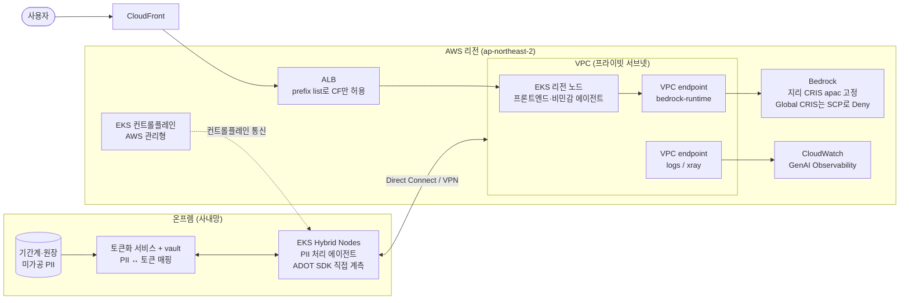

# 하이브리드 아키텍처

::: tip 이 장에서 얻는 것
- 규제(한국 금융 망분리 등)로 온프렘에 남아야 하는 컴포넌트와 클라우드로 보내도 되는 컴포넌트를 가르는 판단 기준
- EKS Hybrid Nodes로 온프렘 노드를 AWS 관리형 EKS 컨트롤플레인에 붙일 때의 실제 제약 — DDIL 부적합, CIDR 한도, 과금 방식
- 온프렘 → Direct Connect/VPN → VPC interface endpoint → Bedrock으로 이어지는 인터넷 미경유 추론 경로의 구성 요소와 함정
- LLM 라우팅 전 PII 토큰화·응답 복원(detokenization) 파이프라인 패턴
- Global CRIS의 데이터 레지던시 리스크와 지리 프로파일 고정 전략 — [Bedrock 추론 티어](/08-scaling-cost/bedrock-inference-tiers) 장과 연결
- 온프렘 에이전트까지 하나의 CloudWatch 관측 파이프라인에 태우는 방법과 그 제약(ADOT Collector 미지원)
:::

## 왜 문제가 되는가

에이전틱 AI 플랫폼의 가장 강한 인력은 클라우드에 있다. Frontier 모델은 Bedrock 같은 관리형 서비스로만 소비할 수 있고, AgentCore·Guardrails·CloudWatch GenAI Observability 같은 주변 인프라도 전부 클라우드 네이티브다. 반대 방향의 인력은 규제다. 한국 금융권의 망분리 규제([한국 금융 규제](/12-security-korea/korea-fsc-regulation) 장에서 상세히 다룬다)처럼 특정 데이터·시스템을 사내망 밖으로 내보내기 어려운 환경에서는, 고객 원장·핵심 업무 시스템·미가공 PII를 다루는 컴포넌트가 온프렘에 남아야 한다.

이 두 인력을 순진하게 타협하면 세 가지 방식으로 실패한다.

1. **전면 온프렘**: 자체 GPU로 오픈웨이트 모델만 돌리는 선택. 모델 품질·운영 부담·용량 계획을 전부 떠안고, frontier 모델 접근을 포기한다. 에이전트 품질이 모델 품질에 직결되는 이상 경쟁력 손실이 크다.
2. **전면 클라우드 + 사후 승인**: 규제 검토를 통과하지 못하거나, 통과하더라도 감사 시점에 "미가공 PII가 인터넷을 경유해 국외 리전에서 처리될 수 있다"는 지적으로 아키텍처를 재설계하게 된다.
3. **어설픈 하이브리드**: 온프렘 Kubernetes 클러스터와 클라우드 클러스터를 따로 운영하며 배포 파이프라인·관측·아이덴티티가 두 벌로 갈라진다. 운영 비용이 아키텍처의 이점을 잠식한다.

이 장이 다루는 하이브리드 아키텍처는 세 번째 실패를 피하는 것이 핵심이다. 컨트롤플레인·관측·아이덴티티는 하나로 통일하되, 데이터가 흐르는 경로만 규제 요건에 맞게 분리한다. 구체적으로는 (a) EKS Hybrid Nodes로 온프렘 컴퓨트를 클라우드 컨트롤플레인에 편입시키고, (b) Bedrock 호출을 PrivateLink 경유의 인터넷 미경유 경로로 고정하고, (c) 클라우드 모델로 나가는 데이터에서 PII를 토큰화하며, (d) 추론 처리 리전을 지리 경계 안에 고정하는 네 개의 축으로 구성된다.

## 핵심 개념

### EKS Hybrid Nodes — 온프렘 노드, 클라우드 컨트롤플레인

EKS Hybrid Nodes는 온프렘·엣지의 물리 서버나 VM을 EKS 클러스터의 노드로 편입시키는 기능이다. Kubernetes 컨트롤플레인은 AWS가 호스팅·관리하고, 노드만 온프렘에서 돈다. EKS add-ons, EKS Pod Identity, cluster access entries, extended Kubernetes version support 등 대부분의 EKS 기능을 하이브리드 노드에서 그대로 쓸 수 있고, 노드 자격 증명은 AWS Systems Manager 또는 IAM Roles Anywhere와 네이티브로 통합된다([공식 문서](https://docs.aws.amazon.com/eks/latest/userguide/hybrid-nodes-overview.html)).

하이브리드 아키텍처 관점에서 중요한 특성은 다음과 같다.

- **단일 클러스터 혼합 모드**: 하나의 EKS 클러스터에 하이브리드 노드와 리전 내 노드를 함께 붙여 burst-to-cloud 또는 온프렘 용량 증설이 가능하다. 온프렘에서 PII 전처리 파드를 돌리고, 같은 클러스터의 리전 노드에서 프론트엔드를 돌리는 구성이 배포 파이프라인 하나로 관리된다.
- **인프라 불가지론**: 물리/가상, x86/ARM을 가리지 않는 bring your own infrastructure 방식이다.
- **네트워킹**: 컨트롤플레인–노드 통신은 클러스터 생성 시 지정한 VPC·서브넷을 경유하며, 온프렘–VPC 연결은 AWS Site-to-Site VPN, Direct Connect, 자체 VPN 등 무엇이든 쓸 수 있다([공식 문서](https://docs.aws.amazon.com/eks/latest/userguide/hybrid-nodes-overview.html), [연결 옵션 백서](https://docs.aws.amazon.com/whitepapers/latest/aws-vpc-connectivity-options/network-to-amazon-vpc-connectivity-options.html)).

제약도 명확하다. 모두 [공식 문서](https://docs.aws.amazon.com/eks/latest/userguide/hybrid-nodes-overview.html)에 명시된 사항이다.

- **안정적 연결 필수**: 단절·간헐 연결(DDIL) 환경에는 부적합하다고 공식 문서가 못박고 있다 — 그런 환경은 EKS Anywhere가 대상이다. 네트워크 단절 시 노드 동작은 [별도 베스트 프랙티스 문서](https://docs.aws.amazon.com/eks/latest/best-practices/hybrid-nodes-network-disconnections.html)를 따라 설계해야 한다.
- **CIDR 한도**: 클러스터당 Remote Node Networks 15개 + Remote Pod Networks 15개 CIDR까지만 지원된다.
- **클라우드 인프라 위 실행 금지**: EC2, Local Zones, Outposts, 타 클라우드 위에서 하이브리드 노드를 돌리는 것은 지원되지 않으며, EC2에서 돌려도 하이브리드 노드 요금이 부과된다.
- **과금**: 선약정·최소 요금 없이, 노드가 클러스터에 붙어 있는 동안 해당 노드의 vCPU 자원에 대해 시간당 과금된다. 노드를 안 쓰면 클러스터에서 제거해야 과금이 멈춘다. 단가는 [EKS 가격 페이지](https://aws.amazon.com/eks/pricing/) 기준으로 확인하라.
- **리전**: GovCloud·중국 리전을 제외한 모든 상용 리전에서 사용 가능하다.

에이전트 워크로드 관점에서는 [AWS 컨테이너 블로그의 GenAI 추론 사례](https://aws.amazon.com/blogs/containers/run-genai-inference-across-environments-with-amazon-eks-hybrid-nodes/)처럼 온프렘 GPU에서 자체 호스팅 모델 추론을 돌리면서 같은 클러스터로 관리하는 확장도 가능하다 — 미가공 PII를 절대 밖으로 못 내보내는 워크로드의 최후 수단으로 온프렘 로컬 모델을 두는 구성이 여기 해당한다.

### PrivateLink로 Bedrock 프라이빗 연결 — 인터넷 미경유 추론 경로

Bedrock은 AWS PrivateLink 기반 interface VPC endpoint를 지원한다. 엔드포인트를 만들면 internet gateway, NAT, 퍼블릭 IP 없이 VPC 내부(그리고 VPC에 연결된 온프렘)에서 Bedrock API를 호출할 수 있다([공식 문서](https://docs.aws.amazon.com/bedrock/latest/userguide/vpc-interface-endpoints.html)). 하이브리드 구성의 추론 경로는 다음과 같이 고정된다.

```
온프렘 에이전트 → Direct Connect/Site-to-Site VPN → VPC interface endpoint(bedrock-runtime) → Bedrock
```

전 구간이 AWS 백본과 전용선/VPN 안에서 흐르고 퍼블릭 인터넷을 경유하지 않는다. 망분리 규제 대응 문서에서 "국외 인터넷 경유 없음"을 입증해야 할 때 이 경로가 근거가 된다. 구성 시 알아야 할 사실들:

- **엔드포인트가 API 평면별로 분리**되어 있다: `com.amazonaws.{region}.bedrock`(컨트롤플레인), `bedrock-runtime`(추론), `bedrock-agent`(Agents 빌드타임), `bedrock-agent-runtime`(Agents 런타임) 등. 추론만 쓰는 온프렘 워크로드에는 `bedrock-runtime`만 열면 된다([공식 문서](https://docs.aws.amazon.com/bedrock/latest/userguide/vpc-interface-endpoints.html)).
- **Private DNS**: 엔드포인트에 private DNS를 켜면 `bedrock-runtime.{region}.amazonaws.com` 기본 리전 DNS 이름이 그대로 엔드포인트로 해석되어 코드 변경이 필요 없다. 단 온프렘에서 이 이름을 쓰려면 온프렘 DNS가 VPC의 Route 53 Resolver(inbound endpoint)로 포워딩되어야 한다 — private DNS를 못 쓰는 환경이면 SDK의 `endpoint_url`로 엔드포인트 전용 URL(`{vpce-id}.bedrock-runtime.{region}.vpce.amazonaws.com`)을 명시한다.
- **엔드포인트 정책**: interface endpoint에 IAM 리소스 정책을 붙여 이 경로로 허용되는 액션(`bedrock:InvokeModel` 등)과 리소스를 제한할 수 있다. "이 전용 경로로는 특정 모델의 추론만 가능"을 네트워크 계층에서 강제하는 수단이다.
- Bedrock은 model customization·batch inference 등의 작업에도 VPC 보호를 지원한다([공식 문서](https://docs.aws.amazon.com/bedrock/latest/userguide/usingVPC.html)).

역방향 통제도 함께 설계하라. 프라이빗 경로를 만들었더라도 온프렘·VPC에서 인터넷으로 나가는 경로가 열려 있으면 SDK가 퍼블릭 엔드포인트로 폴백할 수 있다. 이그레스 통제(아웃바운드 차단 + 엔드포인트만 허용)와 `aws:SourceVpce` 조건의 IAM 정책으로 "이 엔드포인트를 경유하지 않은 Bedrock 호출은 거부"를 함께 강제해야 경로 고정이 완성된다.

### LLM 라우팅 전 PII 토큰화 — 보내기 전에 바꾸고, 받은 후에 되돌린다

프라이빗 네트워크 경로는 전송 구간을 보호할 뿐, 데이터 자체가 클라우드 모델에 도달한다는 사실은 바꾸지 못한다. 규제·내부 정책상 미가공 PII를 클라우드 모델에 보낼 수 없다면, 라우팅 직전에 PII를 토큰(placeholder)으로 치환하고 응답에서 복원하는 계층이 필요하다.

파이프라인은 네 단계다.

1. **탐지**: 프롬프트에서 PII 엔티티를 식별한다. Bedrock Guardrails의 sensitive information filter를 `ApplyGuardrail` API로 모델 호출과 독립적으로 실행해 탐지기로 쓸 수 있고([공식 문서](https://docs.aws.amazon.com/bedrock/latest/userguide/guardrails-sensitive-filters.html)), 주민등록번호·계좌번호처럼 한국 고유 식별자는 커스텀 regex 엔티티나 자체 탐지기로 보강한다.
2. **토큰화**: 탐지된 값을 결정적(deterministic) 토큰으로 치환한다. 같은 입력이 같은 토큰이 되어야 대화 여러 턴에 걸친 참조 일관성이 유지된다. 형식 보존 토큰(format-preserving token)을 쓰면 모델이 "이것이 계좌번호 형태의 값"이라는 문맥은 유지한 채 실제 값만 모르게 된다. 토큰↔원본 매핑은 온프렘(또는 격리 경계 안) vault에만 저장한다.
3. **추론**: 토큰화된 프롬프트만 PrivateLink 경로로 Bedrock에 보낸다.
4. **복원(detokenization)**: 모델 응답에 포함된 토큰을 vault 매핑으로 원본 값으로 되돌린 뒤 사용자에게 전달한다.

AWS ML 블로그의 [Integrate tokenization with Amazon Bedrock Guardrails for secure data handling](https://aws.amazon.com/blogs/machine-learning/integrate-tokenization-with-amazon-bedrock-guardrails-for-secure-data-handling/)(2025-09)이 정확히 이 패턴을 다룬다 — `ApplyGuardrail`로 PII를 탐지하고, 외부 토큰화 서비스로 형식 보존 토큰을 생성해 마스킹을 대체하고, LLM 호출 후 응답을 detokenize해 반환하는 Step Functions + Lambda 오케스트레이션이다. 하이브리드 구성에서는 이 토큰화·복원 계층을 EKS Hybrid Nodes 위(온프렘)에 배치해, 원본 PII와 매핑 vault가 물리적으로 사내망을 벗어나지 않게 한다.

::: warning 미정착 영역
토큰화가 규제 관점의 "가명처리"로 인정되는 범위 — 특히 매핑 vault를 조직이 직접 보유한 상태의 결정적 토큰화가 재식별 가능성 평가를 통과하는지 — 는 규제기관·감사인마다 해석이 갈리는 영역이다. 기술 패턴으로서의 토큰화와 법적 지위로서의 가명처리를 동일시하지 말고, 규제 대응 문서에는 준거 법령 해석을 별도로 받아 첨부하라. 관련 규제 논의는 [한국 금융 규제](/12-security-korea/korea-fsc-regulation) 장을 보라.
:::

또한 토큰화는 프롬프트 주입에 대한 방어가 아니다. 모델이 응답에 토큰을 그대로 노출하도록 유도당하는 것 자체는 무해하지만(토큰은 vault 없이 무의미), 복원 계층이 응답 전체를 무조건 detokenize하면 유도된 토큰 나열이 원본 PII 목록으로 복원되는 유출 경로가 된다. 복원은 "요청 컨텍스트에 원래 있던 토큰"으로 범위를 제한해야 한다.

### CRIS 데이터 레지던시 — 처리 리전을 지리 경계에 고정

용량 확보를 위해 Cross-Region Inference(CRIS)를 쓸 때, **Global 프로파일(`global.` 접두사)은 지원되는 모든 상용 리전으로 요청을 라우팅할 수 있다**([공식 문서](https://docs.aws.amazon.com/bedrock/latest/userguide/global-cross-region-inference.html)). 지리 프로파일 대비 저렴하지만 처리 리전을 지정할 수 없으므로, 국외 처리가 이슈인 하이브리드 구성에서는 사실상 배제 대상이다. 이 책의 CRIS 정본인 [Bedrock 추론 티어](/08-scaling-cost/bedrock-inference-tiers) 장의 결론을 그대로 적용한다.

- **지리 프로파일 고정**: `apac.` 접두사 프로파일은 요청을 해당 지리 경계 안의 리전으로만 라우팅한다([공식 문서](https://docs.aws.amazon.com/bedrock/latest/userguide/cross-region-inference.html)). 국외 처리 자체가 금지라면 지리 프로파일도 부족하므로 단일 리전 모델 ID로 격리한다.
- **Global CRIS 차단을 정책으로 강제**: Global CRIS 요청은 `aws:RequestedRegion`이 목적지 리전명이 아니라 `global`/`unspecified`로 설정되므로, 리전명 매칭 Deny SCP로는 막히지 않는다. `"aws:RequestedRegion": "unspecified"` 조건 + `inference-profile/global.*` ARN 매칭의 명시적 Deny를 써야 한다([공식 문서](https://docs.aws.amazon.com/bedrock/latest/userguide/global-cross-region-inference.html), [AWS ML 블로그](https://aws.amazon.com/blogs/machine-learning/securing-amazon-bedrock-cross-region-inference-geographic-and-global/)). 상세한 정책 문형과 실패 모드는 [Bedrock 추론 티어](/08-scaling-cost/bedrock-inference-tiers#핵심-개념) 장을 보라.
- PrivateLink 엔드포인트 정책에서 `inference-profile/global.*` 리소스를 허용 목록에서 빼면, 전용 경로 계층에서도 이중으로 차단된다.

### AgentCore Observability의 하이브리드 지원 — 관측 파이프라인은 하나로

하이브리드에서 가장 먼저 갈라지기 쉬운 것이 관측이다. AgentCore Observability는 이를 막아준다. **ADOT SDK와 IAM 자격 증명만 갖추면 AgentCore Runtime 밖 — 온프렘·타 클라우드 — 에서 도는 에이전트도 같은 CloudWatch GenAI Observability 파이프라인으로 텔레메트리를 보낼 수 있다**([공식 문서](https://docs.aws.amazon.com/bedrock-agentcore/latest/devguide/observability-configure.html)). EKS Hybrid Nodes 위의 온프렘 에이전트가 IAM Roles Anywhere/Pod Identity로 얻은 역할 자격 증명으로 CloudWatch에 직접 스팬을 쓰면, 클라우드의 프로덕션 에이전트와 같은 대시보드에서 트레이스·비용·SLI를 본다.

단 하나의 큰 제약: **ADOT Collector는 AgentCore 관측에서 지원되지 않는다.** ADOT SDK 직접 계측 또는 Lambda용 OTel Layer만 지원된다([공식 문서](https://docs.aws.amazon.com/bedrock-agentcore/latest/devguide/observability-configure.html)). 온프렘 Kubernetes에서 흔히 쓰는 "노드마다 Collector 배치 → 중앙 게이트웨이 → 백엔드" 패턴을 그대로 가져오면 스팬이 CloudWatch GenAI Observability에 도달하지 않는다. SDK가 CloudWatch/X-Ray 엔드포인트로 직접 전송해야 하므로, 온프렘 네트워크에서 해당 엔드포인트로의 아웃바운드 경로(logs·xray interface endpoint 경유 권장)를 열어야 한다. 스팬 구조·세션 전파·시맨틱 컨벤션의 성숙도 이슈는 [Observability Deep Dive](/10-agentcore/observability-deep-dive) 장이 정본이다.

### 진입점 원칙과 전체 그림

퍼블릭 진입점은 CloudFront → ALB/NLB → Target Group 경로 하나로 고정하고, 컴퓨트에 퍼블릭 IP나 퍼블릭 리스너를 직접 붙이지 않는다. ALB가 CloudFront에서 온 트래픽만 받도록 CloudFront managed prefix list로 보안 그룹을 제한하고 커스텀 헤더 검증을 더하는 구성이 공식 문서에 정리되어 있다([공식 문서](https://docs.aws.amazon.com/AmazonCloudFront/latest/DeveloperGuide/restrict-access-to-load-balancer.html)). 하이브리드라고 해서 예외가 아니다 — 오히려 온프렘 구간이 있다는 이유로 "임시" 퍼블릭 우회로가 생기기 쉬우므로 더 엄격히 지켜야 한다.

전체 아키텍처는 다음과 같다.



핵심은 **데이터 등급별로 경로가 갈린다**는 점이다. 미가공 PII는 온프렘 경계(회색 박스) 안에서만 존재하고, Direct Connect를 건너는 것은 토큰화된 프롬프트·응답과 텔레메트리뿐이다. 컨트롤플레인·배포·관측은 클라우드 하나로 통일되어 있다.

## 결정 표

| 상황 | 선택 | 이유 | 트레이드오프 |
|---|---|---|---|
| 미가공 PII를 다루는 에이전트 컴포넌트의 배치 | EKS Hybrid Nodes(온프렘) + 토큰화 계층 | PII·vault가 사내망을 벗어나지 않으면서 배포·관측은 클라우드와 통일 | 하이브리드 노드 vCPU 시간당 과금 + 온프렘 인프라 운영 부담 |
| 온프렘 클러스터 방식 선택 | 안정적 전용선/VPN 확보 가능 → EKS Hybrid Nodes; 단절 잦은 환경(DDIL) → EKS Anywhere | Hybrid Nodes는 상시 연결 전제 — 공식 문서가 DDIL 부적합 명시 | EKS Anywhere는 컨트롤플레인도 자체 운영 — 통합 이점 상실 |
| 온프렘 → Bedrock 호출 경로 | Direct Connect/VPN + `bedrock-runtime` interface endpoint + private DNS | 인터넷 미경유 입증 가능, 엔드포인트 정책으로 액션 제한 | Route 53 Resolver inbound endpoint 등 DNS 통합 작업 필요 |
| 추론 라우팅 프로파일 | 지리 CRIS(`apac.`) 고정 + Global CRIS Deny SCP; 국외 처리 전면 금지면 단일 리전 | 처리 리전을 지리 경계 안에 고정 — [추론 티어 장](/08-scaling-cost/bedrock-inference-tiers) 결론과 동일 | Global 대비 단가 높고 용량 풀 좁음 |
| PII 처리 전략 | 탐지(ApplyGuardrail + 커스텀 regex) → 결정적 토큰화 → 추론 → 범위 제한 복원 | 데이터 유용성 유지 + 원본은 vault 밖으로 안 나감 | 토큰화 서비스가 모든 추론의 경로상 의존성(가용성·지연) |
| 절대 클라우드로 못 보내는 워크로드 | 온프렘 GPU에서 자체 호스팅 모델(같은 EKS 클러스터) | 데이터가 아예 이동하지 않음 | 모델 품질·GPU 용량 계획 부담 — 최후 수단으로만 |
| 온프렘 에이전트 관측 | ADOT SDK 직접 계측 + IAM 역할 자격 증명 → CloudWatch | 클라우드·온프렘 단일 대시보드; Collector는 미지원이라 대안 없음 | 파드마다 AWS 엔드포인트로의 직접 아웃바운드 필요 |
| 퍼블릭 진입점 | CloudFront → ALB(prefix list 제한) → EKS 리전 노드만 | 컴퓨트 직접 노출 금지 원칙 — 온프렘 노드는 진입점이 될 수 없음 | 온프렘 서비스의 외부 노출은 반드시 클라우드 경유로 우회 |

## 실패 모드

| 증상 | 근본 원인 | 확인 방법 | 해결 |
|---|---|---|---|
| Bedrock 호출이 프라이빗 경로를 우회해 인터넷으로 나감 | private DNS 미설정 또는 온프렘 DNS가 리전 DNS 이름을 퍼블릭 IP로 해석 | 온프렘에서 `dig bedrock-runtime.{region}.amazonaws.com` — 응답이 endpoint ENI의 사설 IP인지 확인 | Route 53 Resolver inbound endpoint로 포워딩 구성, 또는 SDK `endpoint_url` 명시 + 이그레스에서 퍼블릭 경로 차단 |
| 지리 프로파일을 쓰는데 감사에서 "국외 처리 가능성" 지적 | 애플리케이션 어딘가가 `global.` 프로파일 사용 — 리전명 Deny SCP는 Global CRIS에 무효(`aws:RequestedRegion`이 `global`/`unspecified`) | CloudTrail에서 `inference-profile/global.*` ARN 호출 검색 | `"aws:RequestedRegion": "unspecified"` + `global.*` ARN 조건의 명시적 Deny SCP ([추론 티어 장](/08-scaling-cost/bedrock-inference-tiers) 참고) |
| 온프렘 에이전트 스팬이 CloudWatch에 안 보임 | ADOT Collector 기반 배치 — AgentCore 관측은 Collector 미지원 | 온프렘 텔레메트리 구성이 Collector 경유인지 SDK 직접 전송인지 확인 | ADOT SDK 직접 계측으로 전환, logs/xray 엔드포인트로의 아웃바운드 개방 ([Observability 장](/10-agentcore/observability-deep-dive) 참고) |
| 하이브리드 노드가 `NotReady`로 뒤집힘 | 전용선/VPN 단절 — Hybrid Nodes는 상시 연결 전제 | VPN 터널/DX 상태와 노드 상태 변화 시각 대조 | 이중화된 연결(DX + VPN 백업) 구성; 단절 시 동작은 [공식 베스트 프랙티스](https://docs.aws.amazon.com/eks/latest/best-practices/hybrid-nodes-network-disconnections.html) 기준으로 설계 |
| 안 쓰는 온프렘 노드에 EKS 요금이 계속 나옴 | 하이브리드 노드 과금은 클러스터 join~제거 기준 — 워크로드 유무 무관 | Cost Explorer에서 EKS Hybrid Nodes 항목 확인 | 유휴 노드는 클러스터에서 제거 ([공식 문서](https://docs.aws.amazon.com/eks/latest/userguide/hybrid-nodes-overview.html)) |
| 대화 멀티턴에서 모델이 동일 인물을 다른 사람으로 취급 | 토큰화가 비결정적 — 같은 PII가 턴마다 다른 토큰으로 치환됨 | 같은 입력 두 번 토큰화해 토큰 비교 | 세션(또는 테넌트) 범위의 결정적 토큰화로 전환 |
| 응답 복원 후 요청에 없던 PII가 노출됨 | detokenize가 응답의 모든 토큰 패턴을 무조건 복원 — 프롬프트 주입으로 타인 토큰 유도 가능 | 임의 토큰을 응답에 유도하는 red team 테스트 | 복원 범위를 해당 요청 컨텍스트에 존재했던 토큰으로 제한 |
| Pod CIDR 추가하다 클러스터 확장 막힘 | Remote Node/Pod Networks 각 15 CIDR 한도 초과 | EKS 클러스터 설정의 RemoteNetworkConfig 확인 | CIDR 블록을 크게 잡아 통합 — 사이트별 파편화 금지 |

## 안티패턴

- ❌ 망분리 대응을 "온프렘 클러스터 따로 + 클라우드 클러스터 따로"의 이중 플랫폼으로 구현 → ✅ EKS Hybrid Nodes로 컨트롤플레인·배포·아이덴티티·관측을 단일화하고, 데이터 경로만 분리한다.
- ❌ PrivateLink 엔드포인트를 만들어놓고 퍼블릭 경로를 열어둔 채 방치 → ✅ 이그레스 차단 + `aws:SourceVpce` 조건 IAM 정책으로 "엔드포인트 미경유 호출 거부"까지 강제해야 경로 고정이다.
- ❌ "PII는 Guardrails 마스킹이 걸러주니까 원문을 그대로 전송" → ✅ 클라우드로 보내기 전에 온프렘 계층에서 토큰화한다. 마스킹은 비가역이라 응답 복원이 안 되고, 탐지 누락 시 원문이 그대로 나간다.
- ❌ 단가 10% 절감 때문에 하이브리드 구성에서 Global CRIS 사용 → ✅ 레지던시 요건이 있는 순간 지리 프로파일 고정 + Global Deny SCP가 기본값이다 ([추론 티어 장](/08-scaling-cost/bedrock-inference-tiers)).
- ❌ 온프렘 관측을 기존 ADOT Collector 게이트웨이에 물려 CloudWatch로 릴레이 시도 → ✅ AgentCore 관측은 Collector 미지원 — SDK 직접 계측으로 설계한다.
- ❌ 온프렘 서비스를 급하다고 방화벽 포트포워딩으로 외부 노출 → ✅ 외부 노출은 항상 CloudFront → ALB 경유. 컴퓨트(온프렘 포함)에 퍼블릭 진입점을 직접 만들지 않는다.
- ❌ 하이브리드 노드를 EC2 위에 올려 "클라우드 이전 리허설" → ✅ 공식적으로 미지원이며 하이브리드 요금만 이중 부과된다. 클라우드 용량은 같은 클러스터의 리전 노드로 추가한다.

## 계측 (SLI)

하이브리드 특유의 SLI는 "경계를 건너는 지점"에 집중된다.

- **프라이빗 경로 준수율**: 전체 Bedrock 호출 중 VPC endpoint를 경유한 호출 비율. CloudTrail의 `vpcEndpointId` 필드 존재 여부로 산출한다. 목표는 100% — 1건이라도 미달이면 우회 경로가 열려 있다는 뜻이다.
- **Global 프로파일 호출 수**: `inference-profile/global.*` ARN에 대한 호출 카운트. SCP가 제대로 작동하면 항상 0이어야 하며, 0이 아니면 즉시 알럿.
- **경계 통과 지연(boundary latency)**: 온프렘 → endpoint → Bedrock 첫 토큰까지의 지연을 리전 내 호출과 분리해 측정. DX/VPN 구간 열화를 조기에 잡는다.
- **토큰화 계층 SLI**: 토큰화·복원 각각의 지연(p99)과 오류율, 그리고 탐지 누락률(주기적 샘플링 감사로 측정). 토큰화 서비스는 모든 추론의 경로상 SPOF이므로 가용성 SLO를 모델 SLO보다 높게 잡는다.
- **하이브리드 노드 상태**: `NotReady` 전환 빈도와 지속 시간, 컨트롤플레인–노드 연결 단절 이벤트. 연결 품질이 이 아키텍처 전체의 전제 조건이다.
- **관측 파이프라인 자체의 관측**: 온프렘 에이전트에서 방출한 스팬 수 대비 CloudWatch 도달 스팬 수. 텔레메트리 유실은 조용히 발생한다 — 특히 SDK 직접 전송 구조에서는 중간 버퍼가 없다.

## 체크리스트

- [ ] 데이터 분류표를 만들었다 — 어떤 데이터가 온프렘 경계를 벗어날 수 없고, 어떤 데이터가 토큰화 후 전송 가능한지 규제 근거([한국 금융 규제](/12-security-korea/korea-fsc-regulation) 참고)와 함께 문서화했다.
- [ ] 온프렘–VPC 연결이 이중화되어 있다(DX + VPN 백업 등) — Hybrid Nodes는 상시 연결 전제임을 확인했다.
- [ ] Remote Node/Pod Networks CIDR 설계가 15+15 한도 안에서 향후 사이트 증설을 수용한다.
- [ ] `bedrock-runtime` interface endpoint + private DNS(또는 명시적 `endpoint_url`)가 구성되었고, 온프렘에서 DNS가 endpoint 사설 IP로 해석됨을 실측했다.
- [ ] `aws:SourceVpce` 조건 IAM 정책과 이그레스 차단으로 퍼블릭 경로 폴백을 막았다.
- [ ] 엔드포인트 정책이 필요한 액션·리소스만 허용한다(Global 프로파일 ARN 제외 포함).
- [ ] 지리 CRIS 프로파일로 고정했고, `"aws:RequestedRegion": "unspecified"` + `global.*` ARN 조건의 Deny SCP를 배포·실호출 검증했다.
- [ ] PII 토큰화가 결정적이고, detokenize가 요청 컨텍스트 범위로 제한되며, vault는 온프렘 경계 안에 있다.
- [ ] 토큰 탐지 누락률을 주기적 샘플링으로 감사하는 절차가 있다.
- [ ] 온프렘 에이전트가 ADOT SDK 직접 계측(Collector 아님)으로 CloudWatch에 스팬을 보내고 있고, 방출 대비 도달률을 모니터링한다.
- [ ] 퍼블릭 진입점이 CloudFront → ALB 하나뿐이고, ALB 보안 그룹이 CloudFront prefix list로 제한되어 있으며, 어떤 컴퓨트에도 퍼블릭 IP가 없다.
- [ ] 유휴 하이브리드 노드를 클러스터에서 제거하는 운영 절차가 있다(과금은 join 기준).
- [ ] 감사 대응 문서에 인터넷 미경유 경로 증적(VPC Flow Logs, CloudTrail `vpcEndpointId`)과 처리 리전 고정 근거를 정리했다.

## 참고

- [Amazon EKS Hybrid Nodes overview — 공식 문서](https://docs.aws.amazon.com/eks/latest/userguide/hybrid-nodes-overview.html)
- [Best Practices for EKS Hybrid Nodes: network disconnections — 공식 문서](https://docs.aws.amazon.com/eks/latest/best-practices/hybrid-nodes-network-disconnections.html)
- [Amazon EKS Pricing](https://aws.amazon.com/eks/pricing/)
- [Network-to-Amazon VPC connectivity options — AWS 백서](https://docs.aws.amazon.com/whitepapers/latest/aws-vpc-connectivity-options/network-to-amazon-vpc-connectivity-options.html)
- [Protect your data using Amazon VPC and AWS PrivateLink (Bedrock) — 공식 문서](https://docs.aws.amazon.com/bedrock/latest/userguide/usingVPC.html)
- [Use interface VPC endpoints (AWS PrivateLink) for Amazon Bedrock — 공식 문서](https://docs.aws.amazon.com/bedrock/latest/userguide/vpc-interface-endpoints.html)
- [Remove PII from conversations by using sensitive information filters — 공식 문서](https://docs.aws.amazon.com/bedrock/latest/userguide/guardrails-sensitive-filters.html)
- [Integrate tokenization with Amazon Bedrock Guardrails for secure data handling — AWS ML Blog](https://aws.amazon.com/blogs/machine-learning/integrate-tokenization-with-amazon-bedrock-guardrails-for-secure-data-handling/)
- [Cross-Region inference — 공식 문서](https://docs.aws.amazon.com/bedrock/latest/userguide/cross-region-inference.html)
- [Global cross-Region inference — 공식 문서](https://docs.aws.amazon.com/bedrock/latest/userguide/global-cross-region-inference.html)
- [Securing Amazon Bedrock cross-Region inference: geographic and global — AWS ML Blog](https://aws.amazon.com/blogs/machine-learning/securing-amazon-bedrock-cross-region-inference-geographic-and-global/)
- [Add observability to your Amazon Bedrock AgentCore resources — 공식 문서](https://docs.aws.amazon.com/bedrock-agentcore/latest/devguide/observability-configure.html)
- [Restrict access to Application Load Balancers (CloudFront) — 공식 문서](https://docs.aws.amazon.com/AmazonCloudFront/latest/DeveloperGuide/restrict-access-to-load-balancer.html)
- [Run GenAI inference across environments with Amazon EKS Hybrid Nodes — AWS Containers Blog](https://aws.amazon.com/blogs/containers/run-genai-inference-across-environments-with-amazon-eks-hybrid-nodes/)
- 관련 장: [Bedrock 추론 티어](/08-scaling-cost/bedrock-inference-tiers) (CRIS 정본) · [Observability Deep Dive](/10-agentcore/observability-deep-dive) (ADOT/스팬 정본) · [한국 금융 규제](/12-security-korea/korea-fsc-regulation)
