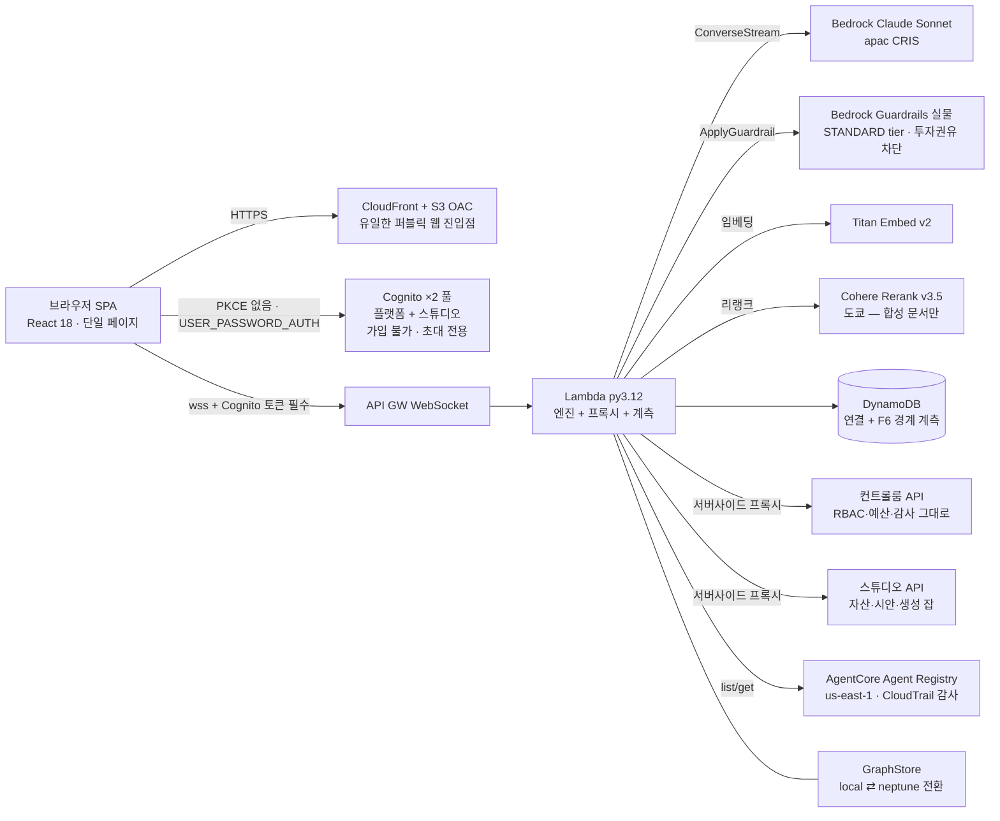

# 데모 아키텍처와 설계 결정

라이브: <https://d15n7n9ypt87h8.cloudfront.net/> (`demo@atomai.click` / `!234Qwer`)

## 전체 구성



## 핵심 설계 결정

| 결정 | 이유 | 책의 근거 |
|---|---|---|
| GraphRAG와 Vector RAG를 **같은 질문에 병렬 실행** | 비교군을 약화시키지 않고(하이브리드 BM25+dense+리랭커) 관계 추적의 차이만 보여준다 | Part 6 |
| 숫자는 **결정론적 계산엔진**만 생성, LLM은 설명 | 출력 검증기가 계산엔진에 없는 수치를 잡아낸다 — "숫자가 조용히 틀리는" 문제 차단 | Part 3 |
| **마스킹/토큰화 게이트** 후에만 경계 통과 | Bedrock에 전달된 실제 페이로드를 UI 토글로 공개, 개인식별자 반출을 정규식 실측 | Part 9·12 |
| Guardrails **실물** (목 금지) | STANDARD 티어 + APAC 크로스리전 프로파일 — 클래식 티어는 한국어 토픽 미탐지 | Part 12 |
| WebSocket `$connect`에서 Cognito 토큰 검증 | CloudFront가 wss를 프록시하지 못하므로, 무인증 연결 즉시 거부로 공개 노출 원칙 유지 | Part 9 |
| 컨트롤룸·스튜디오는 **서버사이드 프록시로 네이티브 통합** | CORS 우회가 아니라 사용자 본인 토큰을 전달 — 기존 백엔드의 RBAC·예산·감사가 그대로 시행 | Part 11 |
| `GraphStore` 인터페이스 + local/neptune 이중 구현 | Neptune 상시 과금 통제. UI가 현재 백엔드를 항상 표시 — 로컬로 시연하며 Neptune이라 말하지 않는다 | Part 8 |
| 합성데이터 시드 고정(20260902) | 3,317노드/8,520엣지 재현 가능. 개인 식별자는 생성 시점부터 토큰(CUST-/ACCT-) | Part 5 |

## S2 파이프라인 (F3)

```
질의 → ①입력 Guardrails → ②Semantic Layer 지표 해석(YAML 정의만 신뢰)
     → ③정확 조회(키 기반, 벡터 검색 없음) → ④결정론적 계산엔진(수식 단계 반환)
     → ⑤마스킹/토큰화 → ⑥Bedrock 스트리밍 설명 → ⑦출력 Guardrails + 수치 검증 → 재식별
```

각 단계가 UI에서 펼쳐지고, 온프렘(앰버)/클라우드(시안) 색 규칙이 전 화면 공통이다.

## 검증된 수치 (실측)

- S1: seed 신뢰도 80%, 영향 상품 12·화면 39·부서 7·문서 7, 환각 노드 ID 0건, 첫 토큰 3.1초
- S2: 5단계 8.5초, 우대금리 3.90%·한도 2억 — LLM 설명의 전 수치가 계산엔진 출력과 일치
- S4: 경계 통과 개인식별자 누계 **0건** (DynamoDB 기록 합산 — 하드코딩 아님)
- S5: 투자권유 질문 차단 / 정상 상담 통과 — 4케이스 검증 후 버전 발행

## 정직한 미완 (::: warning 미정착 영역)

::: warning 미정착 영역
- **온프렘 플레인의 물리 분리**(별도 VPC 프라이빗 서브넷 + ECS Fargate)는 Phase 3 예정 —
  현재 계산엔진·마스킹은 단일 Lambda 안의 논리 분리이며 UI에 그렇게 명시한다.
- **Neptune 전환**은 Phase 3 (현재 LocalGraphStore, UI 배지에 표시).
- **S3 "컴포넌트 Deprecate → 생성 반전" 시연**은 Phase 4 (Registry 뷰는 실물 연동 완료).
- 벡터 인덱스의 OpenSearch Serverless 이관은 온프렘 플레인 구성과 함께 진행.
:::

## 저장소 배치

| 경로 | 내용 |
|---|---|
| `platform/` | 이 데모 전체 (엔진·API·웹·CDK·시드·테스트) |
| `SPEC.md` | 요구사항 명세 원문 (Phase별 진행) |
| `demo/builder-harness/` | 자매 데모 — 에이전트 컨트롤룸 (한울증권) |
| `demo/uiux-studio/` | 스튜디오 백엔드 원본 (네이티브 통합의 소스) |

재현: `platform/README.md`의 Phase별 명령. 배포는 `platform/deploy.sh` 한 번.
