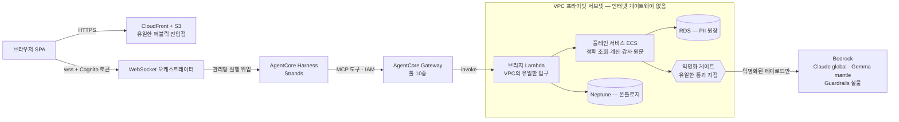

# 데모 아키텍처와 설계 결정

접속 정보는 [데모 안내](./index.md)를 따른다. 자격 증명은 승인된 비공개 경로에서 확인하고 문서에 값을 남기지 않는다.


## 인터랙티브 다이어그램 (archify)

- **[플랫폼 아키텍처 (인터랙티브)](https://www.atomai.click/AgenticAI-Platform/platform-architecture.html)** — Single Boundary VPC·중앙 MCP·거버넌스를 가이드 뷰 3장으로 탐색 (Play story 지원)
- **[S2 상담 파이프라인 워크플로우 (인터랙티브)](https://www.atomai.click/AgenticAI-Platform/s2-workflow.html)** — 정상 처리·차단·검증 근거
- **[UX Studio 검증 루프 (인터랙티브)](https://www.atomai.click/AgenticAI-Platform/ux-validation-loop.html)** — 규칙 검증·피드백·수정·재검증·승인의 경로별 범위와 목표. [완료 조건과 구현 대조](./ux-validation-loop)

## 전체 구성

연결된 인터랙티브 그림의 JSON·HTML은 개인정보 순서와 범위를 반영해 정리됐다. 아래 Mermaid는 이전 요약이므로 그 그림과 구분하며, 모든 요청이 Harness를 거친다는 뜻도 아니다. CloudFront의 웹 진입과 인증된 WebSocket 진입은 별도다. 현행 S2는 루트 `SPEC.md` §4-3과 [개인정보 처리 시나리오](./mydata-privacy)를 따른다.

`BankPlatformPlane`의 격리 VPC와 `BankPlatformPrivacy`가 재사용하는 기존 EKS VPC를 구분한다. 프라이버시 스택은 IAM Lambda 중계·내부 NLB·CPU 게이트웨이를 추가하며 GPU나 VPC 피어링을 새로 만들지 않는다. 구현은 `platform/infra/lib/privacy-stack.ts`, `platform/privacy/deploy/`에 있다.



## 핵심 설계 결정

| 결정 | 이유 | 책의 근거 |
|---|---|---|
| GraphRAG와 Vector RAG를 **같은 질문에 병렬 실행** | 비교군을 약화시키지 않고(하이브리드 BM25+dense+리랭커) 관계 추적의 차이만 보여준다 | Part 6 |
| 숫자는 **결정론적 계산엔진**만 생성, LLM은 설명 | 계산값과 모델 설명의 수치 차이를 검사한다. 현재 수치 검증은 Guardrails 처리 텍스트 전달 후 수행하므로 모든 잘못된 수치의 사전 차단을 뜻하지 않는다 | Part 3 |
| **데이터 배치와 호출 경계**: 원장은 비공개로 보관하고 모델 입력을 검사 | 원장 배치·질문 처리·정형 토큰화·출력 검증을 구분한다. 이 데모가 법적 익명화나 규제 적합성을 보증하지 않는다 | SPEC §3-2·§4-3 |
| Guardrails **실물** (목 금지) | 이전 시연은 STANDARD 티어와 APAC 프로파일을 사용했다. 현재 정책·버전·지원 범위와 실제 차단 결과는 별도 확인 | Part 12 |
| WebSocket `$connect`에서 Cognito 토큰 검증 | 별도 WebSocket 진입에서 무토큰·무효 토큰을 거부한다. 후속 메시지는 저장된 연결 신원을 사용하며 토큰을 매번 재검증하지 않는다 | Part 9 |
| 허용된 에이전트 경로는 **AgentCore Harness + Gateway** 사용 | 주 플랫폼의 모든 핸들러가 Harness를 실행하는 것은 아니다. Registry 자체 감사와 AgentCore 미러·CloudTrail은 구분한다 | SPEC §7·§11-4·§16 |
| S2 개인정보 탐지는 **사설 EKS 모델**, 설명은 **별도 Bedrock 모델** | Qwen이 기준 연결이며 Gemma/DeepSeek 개인정보 모델은 별도 등록·검증이 필요하다. Bedrock Gemma 설명 선택이 EKS Gemma 배포를 뜻하지 않는다 | SPEC §4-3·§11-1 |
| 컨트롤룸·스튜디오는 **서버사이드 프록시로 네이티브 통합** | 기존 연동은 해당 사용자 토큰을 전달한다. 제품별 인증·권한·저장·검수 한계는 그대로 남으며 주 React 작업실과 구분한다 | Part 11 |
| `GraphStore` 인터페이스 + local/neptune 이중 구현 | Neptune 상시 과금 통제. UI가 현재 백엔드를 항상 표시 — 로컬로 시연하며 Neptune이라 말하지 않는다 | Part 8 |
| 합성데이터 시드 고정(20260902) | 이전 기록은 3,317노드/8,520엣지였다. 현행 수는 실제 시드·백엔드에서 확인한다. 일반 원장 토큰(CUST-/ACCT-)과 PR3의 가상 식별자 검사 예제를 구분한다 | Part 5 |

## 데이터 배치 — 원장과 AI-Ready 파생

- **PII 원장**: 고객 데이터 플레인(PII VPC — 인터넷 차단 격리 서브넷의 RDS). 복제·벡터화하지 않고 키 기반 정확 조회만.
- **AI-Ready 파생 지식**: 규정↔상품↔화면↔부서의 합성 온톨로지(local/Neptune)와 Semantic Layer. React 공동 상품 지침은 비공개 S3 JSON·DynamoDB에 저장하며 Neptune 적재와 구분한다.
- **모델 호출 경계**: Bedrock으로 나가는 페이로드는 익명화 게이트 통과가 필수(F6이 실측). 외부 SaaS 모델에는 개인정보를 태우지 않는다.

## S2 파이프라인 (F3)

```
질의 → EKS sLLM 탐지·코드 치환 → ①처리된 질문의 입력 Guardrails → ②Semantic Layer
     → ③정확 조회 → ④결정론적 계산 → ⑤정형 필드 토큰화·독립 잔여 검사
     → ⑥게이트·Bedrock 설명 버퍼링 → ⑦출력 Guardrails → 처리된 설명 전달 → 수치 검증·재식별
```

각 단계가 UI에서 펼쳐진다. `onprem`은 기존 코드·이벤트 식별자이며 물리 IDC 배치의 증거가 아니다. 질문 원문은 인증 API·중계를 지나고 조회값은 인증 사용자 화면에도 전달되므로, 원장·모델의 사설 배치를 모든 사용자 데이터의 VPC 잔류로 설명하지 않는다. 정형 설명 자료에는 두 번째 sLLM 재작성을 수행하지 않으며, 검사 실패 시 중단하고 S2 공용 캐시는 사용하지 않는다.

## 검증된 수치 (실측)

아래는 **이전 시연 기록(측정일 미기재)**이며 이번 문서 정합성 점검에서 재실행하지 않았다. 현재 수치·지연 보장이나 전체 익명화의 증거로 사용하지 않는다.

- S1: seed 신뢰도 80%, 영향 상품 12·화면 39·부서 7·문서 7, 환각 노드 ID 0건, 첫 토큰 3.1초
- S2: 5단계 8.5초, 우대금리 3.90%·한도 2억 — LLM 설명의 전 수치가 계산엔진 출력과 일치
- S4: 경계 통과 개인식별자 누계 **0건** (DynamoDB 기록 합산 — 하드코딩 아님)
- S5: 투자권유 질문 차단 / 정상 상담 통과 — 4케이스 검증 후 버전 발행

## 정직한 미완 (::: warning 미정착 영역)

::: warning 미정착 영역
- 격리 ECS/RDS·Neptune·OpenSearch Serverless는 `platform/infra/lib/plane-stack.ts`에 이미 구현됐다. 이전 Phase 3 예정 표시는 현행 미구현 목록이 아니다. 배포 여부와 현재 백엔드는 별도 확인한다.
- Registry 승인 상태 변경·APPROVED 전용 조회·화면 생성도 구현돼 있다. 기존 S3의 컴포넌트 메타데이터/스텁 검사는 실제 React 작업실 릴리스 검수와 다르다.
- PR3의 모델 가용성·NLB 대상·로드밸런서 컨트롤러·NetworkPolicy 집행은 운영 확인이 필요하다. 사설 HTTP 구성이 애플리케이션 TLS나 전체 클러스터 격리를 입증하지 않는다.
- 미연결·미검증 상태는 실패 또는 확인 필요로 표시한다. 기존 보안·인가·수치 검증 한계를 문서 변경으로 허용하지 않는다.
:::

## 저장소 배치

| 경로 | 내용 |
|---|---|
| `platform/` | 이 데모 전체 (엔진·API·웹·CDK·시드·테스트) |
| `SPEC.md` | 요구사항 명세 원문 (Phase별 진행) |
| `demo/builder-harness/` | 자매 데모 — 에이전트 컨트롤룸 (한울증권) |
| `demo/uiux-studio/` | 스튜디오 백엔드 원본 (네이티브 통합의 소스) |

재현·배포는 `platform/README.md`를 따른다. PR3는 별도 사설 경로 구성과 중계 ARN 연결이 필요하므로 `platform/deploy.sh` 실행만으로 준비 완료라고 판단하지 않는다. 상세 전제는 `platform/infra/README-privacy.md`에 있다.
