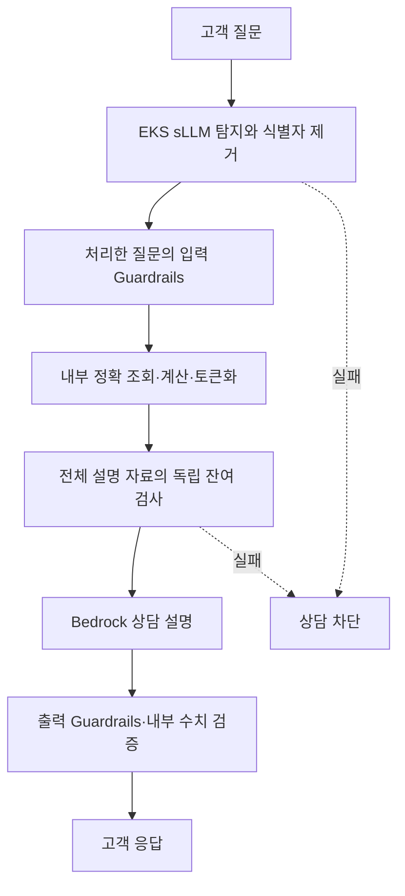

# 마이데이터 개인정보 처리 시나리오

마이데이터 상담에 사용하는 질문과 설명 자료에서 개인정보 식별자를 제거한 뒤 상담 모델에 전달한다.
**자유 문장의 개인정보 탐지는 EKS 소형 모델이 수행하며, 상담 설명을 만드는 Bedrock 모델과 별도로 선택한다.**
정형 고객정보는 내부 코드가 정해진 필드를 토큰화한다. 모델이 이미 계산된 금액이나 상품 조건을 개인정보로 다시 분류하지 않도록 역할을 분리한다.

이름·연락처 등을 가린 것만으로 완전한 익명성을 확보했다고 판단하지 않는다.
처리 결과에는 실제 모델, 탐지 유형·건수, 규칙 검사, 독립 개체명 인식(NER, Named Entity Recognition) 검사의 구성 여부와 실패 이유를 구분해 표시한다.
NER는 문장에서 이름·주소 같은 개체를 찾는 추가 검사이며, 미구성이면 이 검사를 수행하지 않았다는 뜻이다.

## 화면에서 실행하기

1. **마이데이터 상담**에서 필수 프라이버시 모델의 상태를 조회한다.
2. 사용 가능한 모델을 선택한다. 미등록 모델이나 응답하지 않는 모델은 선택할 수 없다.
3. **합성 입력 예시**의 이름·주소, 전화·이메일, 계좌·금액 보존 중 하나를 질문에 채운다.
4. 상담을 실행하고 **질문 프라이버시 처리 → 설명 자료 최종 개인정보 검사** 근거를 확인한다.
5. 개인정보 처리에 실패하면 상담을 중단한다. 이전 고객 응답이나 규칙 전용 결과로 대체하지 않는다.

예시의 인물·주소·연락처·계좌와 금융 수치는 가상 데이터다. 먼저 이 합성 시나리오로 연결과 차단 동작을 확인한다.
상담 질문은 최대 500자이며, 서버가 긴 질문을 잘라서 일부만 검사하지 않는다.

## 실제 처리 순서

모델은 식별자의 종류와 입력 안의 정확한 문자열만 제안한다. 코드는 제안의 형식·범위·겹침을 검사한 뒤 실제 치환을 수행한다.
모델 응답이 잘렸거나 형식이 잘못된 경우, 존재하지 않는 문자열을 제시한 경우, 금액·금리·기간이 달라진 경우에는 통과시키지 않는다.
검증된 처리 토큰은 다시 개인정보로 분류하지 않는다. 탐지·검사용 보기에서는 해당 토큰만 같은 길이의 빈 값으로 바꾸고, 설명 모델에 전달할 자료에는 토큰을 유지한다.
사용자가 처리 토큰 형식을 새 질문에 직접 넣는 것은 거부하므로, 임의의 원문을 검사에서 제외할 수 없다.
처리 후 토큰 때문에 문장이 길어져 검사 한도를 넘으면 일부를 잘라 통과시키지 않고 상담을 중단한다.

질문은 입력 Guardrails보다 먼저 처리하며, 조회·계산으로 만든 설명 자료도 설명 모델에 전달하기 전에 다시 검사한다.
마이데이터 실행은 개인별 조회값과 회신이 포함되는 공용 이벤트 캐시를 읽거나 쓰지 않는다.

## 제거와 복원의 구분

| 대상 | 처리 |
|---|---|
| 새 질문에서 탐지한 자유 텍스트 식별자 | 요청별 임의 토큰으로 제거. 복원 매핑을 반환하거나 저장하지 않음 |
| 기존 내부 플레인의 고객 식별 토큰 | 기존 내부 매핑으로 고객 회신에서 복원할 수 있음. 원본을 설명 모델에 전달하지 않음 |
| 원금·금리·납입기간 | 치환 전후 보존 여부를 검사. 상담 계산의 기준은 기존 결정론적 계산엔진 |
| 프라이버시 검사 영수증 | 모델·버전·유형·건수·지연·상태를 기록. 모델 원문 응답과 탐지한 원본 문자열은 포함하지 않음 |

클라우드 계측에는 처리된 질문의 해시·길이와 사용자 식별 해시도 남는다.
기존 내부 플레인의 감사 저장소는 처리된 질문이 포함된 프롬프트와 고객 정보 복원 매핑을 보관한다.
이 내부 감사 자료는 검사 영수증과 별개이며, 접근 권한·암호화·보존 기간을 별도로 관리해야 한다.

따라서 전체 시스템을 ‘복원이 불가능한 완전 익명화 시스템’으로 표시하지 않는다.
실제 데이터의 간접 식별 가능성과 탐지 누락은 별도로 평가해야 한다.

## 모델 선택과 버전

초기 연결 대상은 기존 EKS의 **Qwen3-8B**다. **Gemma 4·DeepSeek**는 교체 후보이며,
엔드포인트·모델 ID·리비전과 사설 통신 정책이 등록되고 실제 모델 조회가 성공해야 사용할 수 있다.
다른 모델의 탐지 정확도나 호환성을 Qwen 결과로 대신하지 않는다.

모델 리비전이 `unverified`이면 실제 가중치 버전을 확인하지 못했다는 뜻이다. 이를 승인된 튜닝 모델로 해석하지 않는다.
독립 NER가 연결되지 않았다면 **미구성**으로 표시하며, sLLM 탐지와 규칙 검사만 수행한 범위를 숨기지 않는다.

Bedrock Gemma를 설명용 모델로 선택하는 것은 EKS의 Gemma 개인정보 처리 모델을 배포했다는 뜻이 아니다.
실행 화면에서 두 모델의 역할과 호출 경로를 각각 확인한다.

## 선택 사항: SageMaker 튜닝

기본 모델의 평가에서 부족한 사례를 찾았을 때 튜닝을 준비한다.
저장소의 `platform/privacy/training` 도구는 승인된 학습·평가 JSONL을 검증하고 SageMaker `CreateTrainingJob` 요청을 준비한다.

1. 학습·평가 예제의 중복과 잘못된 라벨을 검사한다.
2. 승인된 학습 이미지와 모델 아티팩트, 암호화된 S3 위치, 역할·사설 네트워크를 지정한다.
3. 준비한 요청을 승인된 환경에서 실행한다. 준비 도구 자체는 AWS 호출·업로드·학습을 수행하지 않는다.
4. 별도 평가 데이터로 유형별 탐지 재현율, 과잉 제거, 금융 수치 보존과 지연을 비교한다.
5. 통과한 모델 아티팩트와 버전을 고정하고 EKS에 배포한 뒤 모델 목록에 등록한다.

제공된 소량의 합성 예제는 형식과 처리 흐름을 확인하는 용도다. 통계적으로 충분한 튜닝 데이터나 정확도 보증 자료가 아니다.
학습 요청 준비, 학습 완료, 평가 통과, 운영 배포 승인은 서로 다른 상태로 관리한다.

## 운영 연결 확인

개인정보 처리 경로는 IAM 전용 Lambda 중계 → 내부 로드밸런서 → EKS 처리기 → 사설 모델 서비스로 구성한다.
공용 모델 엔드포인트나 Lambda Function URL을 만들지 않는다.
로드밸런서 컨트롤러와 네트워크 정책의 실제 집행을 확인한 뒤 연결 완료로 판단한다.
HTTP는 기존 VPC 내부에서 사용하며, 이 구성만으로 애플리케이션 TLS나 전체 클러스터 격리를 달성했다고 표시하지 않는다.

실행 전 확인할 항목은 모델 응답, 차단 동작, 역할별 접근, 원문이 없는 로그, 캐시 비사용, 금융 수치 보존이다.
기존에 만들어진 마이데이터 이벤트 캐시는 새 경로에서 재생하지 않으며, 잔존 기록의 정리는 별도 운영 절차로 확인한다.
