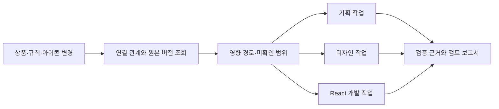
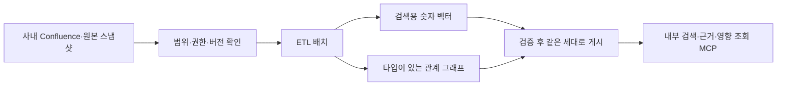

# 업무별 작업실과 온톨로지

<WorkbenchTour />

::: tip 이 페이지에서 확인할 수 있는 것
직무별 메뉴, 상품 변경의 영향 경로, 사내 위키의 배치 수집, Skill 제작,
합성 연금 상담과 내부 보고서의 연결 흐름을 설명합니다.
영상은 로컬 합성 시연 환경에서 실제 애플리케이션 API를 사용해 촬영했습니다.
배포 환경의 외부 연결이나 모델 가용성을 증명하는 영상은 아닙니다.
:::

## 왜 필요한가

상품 조건 하나가 바뀌면 상품기획서뿐 아니라 업무 절차, 화면의 문구, 안내 가이드,
React 컴포넌트까지 영향을 받을 수 있습니다. 각 팀이 파일과 위키를 따로 찾아보면
무엇을 확인했고 무엇을 놓쳤는지 공유하기 어렵습니다.

이 작업실은 변경 요청과 자료 간 관계, 담당 작업, 검증 근거를 하나의 프로젝트에
연결합니다. 담당자는 자신의 메뉴에서 작업을 시작하고, 다른 직무에 넘길 때도
변경 대상과 프로젝트 문맥을 유지합니다.

## 변경 요청이 실제 작업이 되는 과정

1. **상품기획서**에 조건과 흐름을 저장하고, 팀이 사용할 지침을 게시합니다.
2. **변경 요청·영향 분석**에서 대상과 기준안·제안안·이유를 기록합니다.
3. 분석 결과의 대상마다 **근거 경로, 원본 버전, 담당 역할**을 확인합니다.
4. **디자인 스튜디오와 개발 작업**에서 변경을 수행하고 검증 자료를 남깁니다.
5. **보고서 작업실**에서 해당 변경의 자료와 검토할 항목을 모읍니다.

‘전체 영향’의 범위는 **등록하고 검증한 관계**까지입니다. 연결이 누락됐거나
원본이 오래됐으면 미확인 범위로 취급합니다. 예시 관계는 가상 상품의 합성 자료이며,
고객 저장소를 자동 분석했다는 뜻이 아닙니다.

### 디자인 자산과 개발 전달

컴포넌트·패턴·절차·정책 규칙·UX 용어·화면 메타데이터를 구분하고 관련 자료를
찾을 수 있게 연결합니다. 실제 화면 생성은 기존 React 작업실을 사용합니다.
산출물 화면에서는 실행 라운드, 기능 검사, 화면 검사, 사용자 승인과 릴리스 기록을
각각 확인합니다.

현재 기본 React 패키지는 플랫폼에 포함된 패키지입니다. 사내 컴포넌트 공급,
고객 Git 저장소 연결, 원본 디자인과의 비교 기준은 별도 입력이 필요합니다.
원본 이미지가 없는 화면을 ‘디자인 일치 검증 완료’로 표시하지 않습니다.

## 사내 Confluence는 어떻게 연결되는가

운영자는 **지식 원본 등록**에서 승인된 연결 ID와 수집 범위를 관리하고,
**수집·ETL 배치**에서 실제 처리 결과를 확인합니다. 사용자 요청으로 임의의
위키 주소나 비밀값을 넣어 서버가 가져오게 하지 않습니다.

원본의 내용·버전·접근 정책을 보관하고, 벡터와 그래프를 모두 준비한 뒤
같은 세대의 인덱스로 게시합니다. 이후 읽기에서도 현재 권한과 삭제 상태를
확인합니다. 과거 인덱스로 돌아가더라도 철회한 접근 권한이 되살아나면 안 됩니다.

현재 구현은 **비공개 파일 기반 인덱스와 feature hashing 벡터**입니다.
OpenSearch·Neptune 또는 의미 임베딩 모델로 표시하지 않습니다.
현재 연결할 사내 Confluence는 없으며, 실제 연결 없이
[연결 준비 문서](https://github.com/Atom-oh/AgenticAI-Platform/blob/main/platform/workbench/CONFLUENCE.md)를
제공합니다. 이후 필요한 사내망 경로, Space, 권한 매핑과 검증 절차를 정리했습니다.

MCP 등록 페이지는 내부 검색·근거·영향 분석·승인 Skill 조회의 제공 범위를
관리합니다. 등록만으로 AgentCore Gateway 자원이나 네트워크 연결이 생성되지는
않습니다. 기존 AgentCore 빌더·Runtime 경로와 이 지식 작업실의 준비 상태를
각각 확인해야 합니다.

## Skill 제작과 연금·보고서 시나리오

### 반복할 업무를 Skill로 만들기

**Skill 제작실**에서 업무 목적과 실제 지시문, 원본 참조, 사용할 도구와 동작 예시를
작성합니다. 직접 작성과 구성된 모델의 초안 생성을 구분합니다.
검증 화면에서는 패키지 형식 검사와 행동 평가를 별도로 표시합니다.

수정하면 이전 검증·승인이 무효화됩니다. 승인된 버전을 조회하는 경로는
버전과 콘텐츠 해시를 확인합니다. 이름이 같거나 이전에 승인됐다는 이유로
바뀐 지시문을 그대로 사용하지 않습니다. 도구 선언은 도구 사용 권한이 아닙니다.

### 합성 MyData 연금 상담

페르소나를 고르면 대시보드에서 가상 연금 계좌와 인사이트를 확인합니다.
적립액, 은퇴까지 남은 기간, 수령 기간과 수익률 가정을 바꾸면 서버가 다시 계산합니다.
사용자는 인사이트에서 상담으로 이어가 진단·계획·적립·운용·인출 관점의 설명을
확인하고, 실제 답변에 직원 평가를 남깁니다.

평가 의견은 준비된 항목에서 선택할 수 있습니다. 자유 의견을 쓰는 경우에는
사설 개인정보 처리가 먼저 필요하며, 처리가 준비되지 않으면 원문을 저장하지 않습니다.

기준 응답은 저장된 계산 사실의 안내입니다. 모델은 질문에 맞는 지표를 선택합니다.
지표 이름·금액·부호·원화 단위는 서버가 작성하며, 모델이 덧붙인 금융 주장은 표시하지
않습니다. 자유 입력의 모델 요청은 사설 개인정보 처리 경로가 필요하며,
준비되지 않았으면 명확하게 실패합니다.

세금·수수료·물가·국민연금 등이 제외된 **가정 기반 계산 예시**입니다.
운영 고객 데이터나 실제 투자 권유, 법적 익명화 완료를 의미하지 않습니다.

### 은행 내부 심사·경영·규정 보고서

변경 영향, 연금 평가, 경영, 심사, 규정 검토용 초안을 생성합니다.
선택한 변경 요청·상담·문서의 출처와 버전을 기록하고, 제공하지 않은 근거를
만들어 채우지 않습니다. 보고서는 비공개 Markdown으로 보관하며 정확한
콘텐츠 해시와 현재 원본 버전을 확인한 뒤 승인합니다.

자동 신용판단이나 규정 해석 결과가 아닙니다. 보고서의 업무 적합성과 판단은
은행 담당자의 검토 대상입니다. 원본이 바뀌거나 권한이 철회되면 해당 근거를
계속 사용할 수 있는지도 다시 확인합니다.

## 결정 표

| 하고 싶은 일 | 시작할 곳 | 확인할 근거 |
|---|---|---|
| 상품 조건 개정 | 상품기획서 → 변경 요청 | 게시 지침과 기준안·제안안 |
| 아이콘·컴포넌트 교체 | 변경 요청·영향 분석 | 사용 경로와 연결이 빠진 범위 |
| 화면 제작·수정 | 디자인 스튜디오 | 규칙·실제 소스·브라우저 검증 |
| 사내 지식 수집 | 운영 센터 | 수집 범위·유효 권한·배치·게시 세대 |
| 반복 업무 표준화 | Skill 제작실 | 지시문·행동 예시·검증·승인 해시 |
| 연금 상담 품질 검토 | 연금 상담 | 합성 데이터·계산 가정·답변·직원 평가 |
| 내부 보고서 검토 | 보고서 작업실 | 출처·버전·미확인 항목·승인 내용 |

## 실패 모드

| 증상 | 확인할 부분 | 다음 행동 |
|---|---|---|
| 운영 메뉴가 보이지 않음 | 검증된 운영자 그룹과 현재 프로젝트 | 프로젝트 소유자와 플랫폼 운영자 권한을 구분 |
| 위키 수집 실패 | 승인 연결·사내망 경로·원본 접근 정책 | 실패한 배치를 확인하고 연결 조건을 보완 |
| 영향 대상이 적거나 없음 | 인덱스 범위·누락 관계·원본 최신성 | ‘영향 없음’으로 확정하지 말고 연결을 조사 |
| Skill 승인이 거부됨 | 현재 버전·원본·검증 상태 | 정확한 내용을 다시 검증 |
| 모델 답변이 표시되지 않음 | 개인정보 처리·모델·출력 검사 | 실패 원인을 확인하고 기준 응답과 구분 |
| 보고서 승인이 거부됨 | 원본 버전 변경·미확인 근거 | 최신 자료로 새 초안 생성 |

## 계측과 체크리스트

수집에서는 성공·실패 문서 수와 미수집 범위, 게시 세대와 원본 최신성을 확인합니다.
영향 분석에서는 근거가 있는 경로와 미확인 연결을, 생성에서는 실제 모델 실행 여부와
검증 결과를 확인합니다. 직원 평가와 보고서 수치는 저장된 실제 기록에서 집계해야 합니다.

- [ ] 프로젝트와 역할이 맞고 다른 프로젝트의 자료가 섞이지 않는다.
- [ ] 예시·실제 연결·미설정 상태가 구분돼 있다.
- [ ] 변경 대상의 경로와 원본 버전을 확인했다.
- [ ] 행동 평가 미실행을 통과로 취급하지 않는다.
- [ ] 연금 가정과 제외 항목을 확인했다.
- [ ] 보고서의 미확인 항목과 승인 대상 내용을 확인했다.

## 참고

- [디자이너 작업실 사용법](./studio-designer-guide)
- [마이데이터 개인정보 처리](./mydata-privacy)
- [작업실 구현 계약](https://github.com/Atom-oh/AgenticAI-Platform/blob/main/platform/workbench/CONTRACT.md)과 [구현·연결 조건](https://github.com/Atom-oh/AgenticAI-Platform/blob/main/platform/workbench/README.md)은 저장소의 개발 문서입니다.
- [영상 자막 다운로드](/media/ontology-workbench.vtt)
