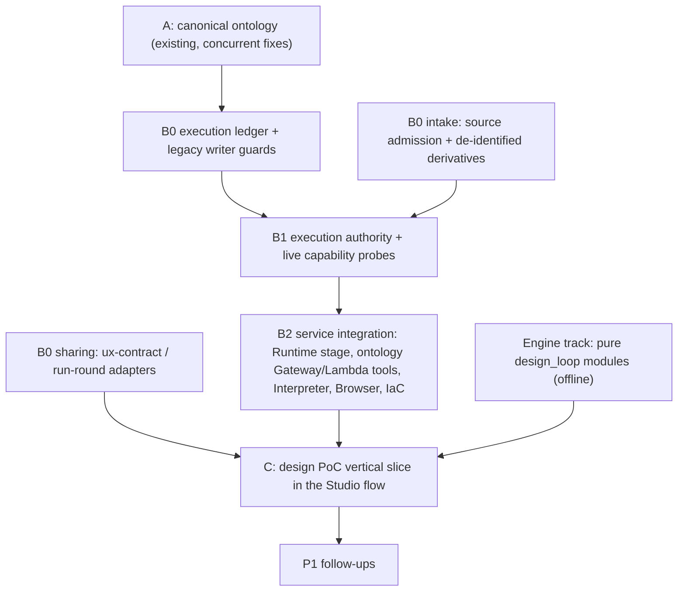

# Design Ontology UX PoC — Delivery Roadmap (AgentCore first)

> **For agentic workers:** This is the index for a plan series. Execute the unit plans in the order below with superpowers:subagent-driven-development or superpowers:executing-plans. Each unit plan uses checkbox (`- [ ]`) steps.

**Goal:** Build a PoC that covers the customer goals in [`REQUIREMENTS.md`](../../../REQUIREMENTS.md) v0.7:
- a design ontology built from the customer's requirements
- AI generation of UX flow and GUI
- verification and human approval
- React code that is shared with the development team

The PoC runs on the platform's AgentCore execution architecture from the start.

**Decision (2026-09-24):** The user chose to build the AgentCore platform first. The B0–B2 execution units from [`platform/docs/ARCHITECTURE.md`](../../../platform/docs/ARCHITECTURE.md) ("Implementation ownership and delivery sequence") land and pass their gates first. The design PoC is then delivered as the first **C (application cutover) vertical slice**. The PoC does not run as a legacy Lambda `design` job.

**Why this replaces the 2026-09-23 plan:** An independent Codex (`openai.gpt-6-astra`) review of the single-file plan returned *rework*, with 22 Major findings and 1 Minor. The findings were spot-checked against the code. The main causes were:
- bypassing the execution contract
- sending un-admitted customer text to the model
- HTML/React fidelity that was never actually shared
- fail-open verification
- underspecified Studio state flow

The finding map below records where each one is fixed.

**UX direction:** The customer was satisfied with the existing Studio demo flow. The problem was completeness. `platform/web/src/studio/Studio.tsx:13-19` defines five tabs, and their order and labels stay unchanged:

| Tab id | Label |
|---|---|
| `workspace` | UX 설계 작업실 |
| `play` | UX 만들어보기 · 플레이그라운드 |
| `process` | 프로세스·흐름 생성 |
| `gallery` | 시안 갤러리 |
| `assets` | 디자인 자산 |

The `ProcessStudio` sequence 명세서 → PRD → 흐름 → 리뷰 also stays. Only the engine behind those screens and the panels inside them change.

## Unit order and dependencies

| # | Plan | Unit | Live AWS? | Gate / exit evidence |
|---|---|---|---|---|
| 1 | [B0 execution ledger](2026-09-24-b0-execution-ledger.md) | B0 | No | RUN-01–05 O-mode, importing the real legacy writers; reviewed PR |
| 2 | [B0 intake and admission](2026-09-24-b0-intake-admission.md) | B0 intake | No (IAM admin entry point is deployed later with B1) | SRC-01/05/06, AUTH-01/08 O-mode/API negatives; reviewed PR |
| 3 | [B0 sharing adapters](2026-09-24-b0-sharing-adapters.md) | B0 sharing | No | AUTH-07/08, HAND-02–05 design subset O-mode/API; reviewed PR |
| 4 | [Engine track](2026-09-24-engine-design-loop.md) | Supports C | No | Pure-module tests; **not wired** to any executor, route or UI until B2 exits |
| 5 | [B1 authority and probes](2026-09-24-b1-authority-probes.md) | B1 | **Yes** | G0-RUNTIME/IDENTITY/INTERPRETER/BROWSER/MEMORY/MODELS/ADMISSION stop/go records |
| 6 | [B2 service integration](2026-09-24-b2-service-integration.md) | B2 | **Yes** (deploy) | AUTH-02–06/09, GEN-02/03, INT/BROW cases, IAM negatives; reviewed PR; defaults retained |
| 7 | [C design PoC slice](2026-09-24-c-design-poc-slice.md) | C | **Yes** (cohort) | GEN-01/04/05, HAND-01–05, ONT-02/03/05, IMP-01 design subset; vertical acceptance; §8 success criteria |
| 8 | [P1 follow-ups](2026-09-24-p1-followups.md) | After C | — | Outline only |

**Parallel-track rule.** Plans 1–4 can run in parallel. Plan 4 (engine) is pure Python and
TypeScript with injected model callables and no AWS dependency. It may only be imported by
tests until plan 6 exits. After that, plan 7 wires it in as a Runtime stage. This keeps the
"AgentCore first" decision without leaving the engine idle.

**Live-step rule.** Every step marked **live** requires all of the following before any AWS call:
- the single deployment owner named in AGENTS.md
- a fresh `aws sts get-caller-identity` whose account matches the target stack
- explicit user confirmation

A live step records its evidence in a private dated assessment copied from
`platform/docs/ONTOLOGY_AGENTCORE_VALIDATION.md`, never in Git.

**Concurrency rule.** The branch `feat/ontology-agentcore-workflow` carries uncommitted Unit A
ontology fixes. Work in these plans uses a separate worktree created from `origin/main` after
those fixes merge. If they are unmerged when B0 starts, create the worktree from the pushed
branch head and rebase before each PR. Never edit the Unit A files in another session's tree.

## Goal → unit map

| Goal (REQUIREMENTS §2) | Delivered in | P0 requirement IDs |
|---|---|---|
| G1 화면 자산화 | Engine (ontology adapter, derivation, guideline rules), C (asset UI, versions) | O-01–O-08 |
| G2 설계서 없는 기획→화면 | B0 intake (admitted derivatives), Engine (PRD, cases, route, composition, GUI), C | P-01–P-03, U-01–U-04, G-01–G-03 |
| G3 믿을 수 있는 AI 생성 | Engine (coverage, verification graph, edit stability), B2 (Browser tester), C | G-04, V-01–V-05 |
| G4 코드가 붙은 디자인 | Engine (convention, codegen), B2 (Interpreter compile), B0 sharing + C (approval manifest, release, zip) | A-01, R-01–R-03 |
| G5 변경에 강한 구조 | C (impact over the authorized ontology API) | C-01 |
| G6 한곳에서 함께 | C (shared Studio context, anchored discussion) | W-01 |

Every P0 ID from REQUIREMENTS §5 has at least one delivering task. The unit plans list IDs per
task. The P1/P2 IDs are in the [P1 follow-ups outline](2026-09-24-p1-followups.md):
- O-09–O-11
- P-04
- G-05, G-06
- R-04, R-05
- C-02–C-04
- W-02–W-04

## Codex review finding → fix map

Finding numbers refer to `review.md` of the 2026-09-23 plan review.

| # | Finding (short) | Fix | Plan / task |
|---|---|---|---|
| 1 | Legacy `design` job bypasses the execution contract | No `design` task in `Worker.handle`. Every model/tool step is an `agentcore-execution` job through `execution_ledger.py`, dispatched to Runtime under a signed capability. Contract edits ship with each interface | B0 ledger T2–T9; B1 P1–P2; B2 S2–S7; C C2–C4 |
| 2 | Boundary gate does not anonymize documents | Private intake produces identifier-normalized derivatives under `source-admission/1`; `pages_for` is the only text source for models; PII blocks until the privacy adapter is reviewed; the payload test asserts no deny-listed term | B0 intake I3–I6; Engine E6/E7; C C2 |
| 3 | Public identifier guard ineffective | Root-scoped `public-safety.yml`, fail-closed without its private config; `deploy-docs.yml` depends on it and scans the built site and filenames; cleanup includes this plan series | Engine E1/E2 |
| 4 | Publication breaks adapter IDs; `IMPLEMENTS` misuse | `ontology_ux.rewrite` applied inside `publish_candidate`; `Knowledge.aliases`; Screen→PageTemplate uses `COMPOSES`; `IMPLEMENTS` stays code→design | Engine E3/E4 |
| 5 | Procedure order and completeness lost | `Ontology.procedure_snapshot` reads PART_OF/NEXT plus the dependency closure with coverage; the adapter builds membership before transitions; truncation makes knowledge incomplete | Engine E4 |
| 6 | Analyzer consumption and fixtures incorrect | Real `analyze.cjs` output via `local_runner`; order by (line, column); identity is resolved package/target + symbol; string revisions | Engine E5 |
| 7 | Guideline interfaces mismatched; wrong reviewer; provenance lost | Single `cited_pages` key shape over admitted derivatives; PolicyRule `extraction`/`citation` properties; `model-inferred` producer only via execution completion; planner/owner review (decision D-1) | Engine E3/E6; C C2 |
| 8 | "Verbatim" check accepts changed values | Exact value-in-quote spans for financial fields; citations required for every mandatory PRD item; `literal-financial-value` composition finding; display through bindings only | Engine E7/E10 |
| 9 | Branch coverage passes with missing paths | `flow.expected` derived from the PRD and approved rules independently of transitions; traversal with dead-end/ambiguous/loop; truncation blocks | Engine E8/E15 |
| 10 | Composition validation too weak | Required slots, non-empty allow-lists, nested `COMPOSES`, typed binding catalog, literal/bound exclusivity, adapt-scope, candidate findings | Engine E3/E10 |
| 11 | Verification fails open | Missing reviewer/tester → `blocked` (no regeneration); required browser failures critical; `approvable` separate from escalation | Engine E16; B2 S5; C C3 |
| 12 | Stability proof misses changes | Full masked-document comparison with target identity/location; Browser layout boxes outside the edit | Engine E14; B2 S5; C C4 |
| 13 | React fidelity unimplemented | No HTML renderer: preview = the react-kit project compiled by `compile.cjs` (Interpreter) and observed by Browser; release reuses the exact-source rebuild and 2% screenshot gate; handoff bytes = release source bytes | Engine E12/E17; B2 S4/S5; C C3/C4 |
| 14 | Screen identity and packaging do not compose | Persistent screen registry; selected-variant export; explicit state paths; duplicate-path rejection | Engine E17 |
| 15 | JSX escaping; path traversal | JSX expression attributes via `json.dumps`; fixed-name local runner; normalized, contained convention paths; kit source policy enforced inside the compiler | Engine E5/E12/E17; B2 S4 |
| 16 | Worker `result`; ZIP through JSON; `key_for` misuse | No legacy job; handoff stored with `put_blob_once` and served through the chunked binary download pattern; correct `key_for(owner, kind, id, suffix)` | C C2/C4 |
| 17 | Approval freshness incomplete | Approval manifest covering PRD, flow, snapshot, compositions and states, verification receipts, convention, catalog, source/bundle, admissions, model and backend; rechecked at dispatch, completion, release, handoff and export | C C4 |
| 18 | Impact call contradicts the API | Delegates to `ontology_api` `POST impact` with its exact fields and generation check | C C5 |
| 19 | Runtime image lacks `workspace` modules | Four pure modules copied unmodified into `_ctx/workspace/`; built-image import and selftest | B2 S1 |
| 20 | Studio flow state not specified | `StudioScope` shared by all tabs; `useProjectScope` extracted from `Workspace`; screen list/get routes; legacy WS contract tests and recovery tests | C C1/C6 |
| 21 | Anchors cannot resolve design records | `_anchor` resolves `designId` → product, plus screen/transition/rule anchors with revision staleness; discussion panel | C C5/C6 |
| 22 | P0 claims without delivery | Foundation keeps `token` (claim corrected); Pattern/PageTemplate code layers allowed; `classify` selects strategy; O-06 versions/diff; V-05 rejections become candidates; O-05 uses the independent golden oracle; C-01 stays in C | Engine E3/E9/E16/E18; C C4/C5 |
| 23 | Weak test expectations | Asserts actual job codes (`gate-refused`, `unstable-edit` as a job result), the exact export name, and `GateRefused` through `engine.gate` rather than `make_deps` | Engine E17; B2 S2; C C3/C4 |

## Review round 2 (2026-09-24)

A second Codex review of this series returned *rework*: 7 prior findings fixed, 16 partially fixed and 21 new Majors (N1–N21). The fixes are made in place in the unit plans and marked "review round 2" there:

| Plan | Fixes |
|---|---|
| Ledger | Staged coordinator (N1); linked-job fence (N2); actor-scoped requests, random ids and authority epochs (N3); operation idempotency (N4); receipt schema and terminal rules (N5); input/output handles with server hashing (N6); concurrency, token and daily-cost controls (N7) |
| B1 | Capability `exp` independent of the lease, with heartbeats (N8); stale control records in an authorized probe project (N20) |
| Intake | Schema, kind and signature reconciliation (N9); `resolve` instead of `authorize` (N10); the 20 MP and ICC profile, with SVG blocked (N19); `normalize_text` for prompt strings (#2) |
| Sharing | Upstream lineage and actual contract fields (N10) |
| Engine | Edge eligibility and a real publication fixture (N11); DSL-conformant contract packing (N12); typed list/callback adapters (N13); `appliesWhen` and a generic `next` action (N14); per-state pages (N16); token-boundary spans (#8); the `llm_judge` key (#11); hashed filename output (#3) |
| B2 | Import-closure packaging (#19); per-checkpoint boxes (#12); the IAM matrix and spend alarm (N18, N7); the model tool allowlist (N21); prompt normalization and heartbeats (#2, N8) |
| C | Flow approval that creates approved contracts, the mining route and exact run/round fields (N15); compose rounds for the exact selection (N16); ledger-backed release (N17); revision-bound anchors (#21); node history and three layers (#22) |

## Review round 3 (2026-09-24)

A third Codex review returned *rework*. Resolved: 8 round-1 and 10 round-2 findings. Remaining: partial fixes, plus 14 new Majors (F1–F14). They are fixed in place and marked "review round 3":

| Plan | Fixes |
|---|---|
| Ledger | Human-authorized approval/export writer (F1); per-operation terminal predicates (F4); compact operation records (F5); authority in `inputHash`, admit revalidation and the project-version fence (N3); quota release on every terminal state and fail-closed costguard (N7); separate transfer budget (N6) |
| Intake | Code-collection and prompt-text admissions (F12, F2); `resolve` in the reviewer path (N10); `api-dist` packaging and the import smoke test (F14) |
| Engine | Unit-bearing token-boundary spans (#8); eligibility-gated evidence (#9); a literal `pageId` (F7); `checked` for Checkbox and page props (N13); the generic `next` accepted by validation (N14); a composition-specific serializer (F6); one DSL contract with (screen, state) rules and a capacity finding (F8, N16); the kit text-scale task E12a (F11); rebuild before every re-verify (F10); a real-checker PASS fixture (#11); checkpoint-based layout stability (#12); Foundation layers (#22); unapproved dependencies block (N11) |
| B1 | Raw backdated control records in an API-created probe project (N20) |
| B2 | No deny-list in Runtime, with private-side normalization (F2); write grants for staged ontology, round and release objects (N18); the complete pure-module allowlist (#19) |
| C | One contract per flow (F8); one run per execution (F9); lineage re-authorization on every artifact chunk (F3); Git expected base (F13); code-collection mining (F12); top-level criteria (N15); admitted edit instructions (F2); the deploy-time web scan (#3) |

## Review round 4 (2026-09-24)

A fourth Codex review returned *rework*. Every round-3 finding except F1/F2/F3/F11/F12/F14 was resolved. It added 10 new Majors (X1–X10). They are fixed in place and marked "review round 4":
- serialization depth 14 with a full-seed publication test (X1)
- product `ontologyHash` kept, plus a separate `designSnapshotHash` (X2)
- reviewer-admitted prompt text, with auto-admission deferred to D-5 (X3)
- legacy `/runs` routes closed for design records (X4)
- no-prefill interaction rules (X5)
- the `evidence.assemble` build+Browser join (X6)
- a self-contained handoff project with a convention index, per D-6 (X7)
- unitless line-heights kept (X8)
- library revision ids in fixtures (X9)
- a per-page judge context (X10)

The partials were closed as follows:
- the human-writer ordering (F1)
- actor-scoped freshness (F3)
- the collection request shape and producer (F12)
- the Worker image copy (F14)
- sign and period boundaries (#8)
- candidate Screen members (#5)
- `appliesWhen` carried into candidates (N14)
- intent `callId` replay (N4)
- cancel quota release (N7)
- API SSM and invoke grants (N18)
- `browser_core` packaging (#19)
- `stateProps` and the Screen code layer (#22)
- legacy public publishers (#3)

The round-4 fixes have not been re-reviewed. Run another read-only review before execution starts.

## Review round 5 (2026-09-24)

The fifth Codex review returned *rework*. It found 7 new Majors (Y1–Y7) plus partials. All are fixed in place and marked "review round 5":
- a resumable, reviewer-admitted edit request (Y1)
- `stateProps` validated, retained and applied (Y2)
- published mandatory notice pages integrated through the normal contract gates (Y3)
- an explicit `intake-image` worker task for asset images (Y4)
- the completion-scope preflight at admission (Y5)
- per-page checkpoint text for the benchmark (Y6)
- retired-key verification separate from signing (Y7)
- partials:
  - trusted design markers survive contract edits
  - admission-bound ontology free text
  - a content-based publish scan
  - a PRD-compatible checklist adapter
  - approval report fields in the evidence assembler
  - a transformed-layout type check
  - document ACL on the document record
  - retry quota re-acquisition
  - ObserverFn invoke grants
  - N2 kept as the contract specifies, report-only

## Review round 6 (2026-09-24)

The sixth review returned *rework*, with 7 new Majors (Z1–Z7). All are fixed and marked "review round 6":
- persistent UI page ids of ≤ 40 characters (Z1)
- a batched, hash-cached judge with per-operation call ceilings and a preflight (Z2)
- a correct `documents.jobs` guard placement (Z3)
- a terminal `finish` action and terminal rules (Z4)
- whitespace-fragmented notice assertions that match the existing coverage gate (Z5)
- a packaged checklist resource tested inside the image (Z6)
- `intake-image` in the worker's atomic-completion set (Z7)

The partials were closed as follows:
- exact-text admission binding for ontology free text (#2)
- unknown linkage refused and reported, with a stated legacy orphan behavior change (N2)
- signed receipt `iat`/`exp` (Y7)

## Review round 7 (2026-09-24)

The seventh review found 73 of 82 prior findings fixed and 6 new Majors (AA1–AA6). All are fixed and marked "review round 7":
- the unknown-linkage refusal is limited to repair of existing linkage, and is transaction-aware (AA1)
- `rules_v2` deterministic predicates on the new model (AA2)
- manifest and prior-artifact handles through the ledger (AA3)
- a composition-independent contract frozen at flow approval (AA4)
- complete reviewer-input hashes for judge reuse (AA5)
- version-bound frontend accept/reject (AA6)

The partials were closed as follows:
- the op-entry bound derived from the call ceiling (Z2)
- a 4 000-character `expectText` DSL extension for notices (Z5)

## Review round 8 (2026-09-24)

The eighth review found 81 prior findings fixed, 7 partial, and 5 new Majors (AB1–AB5). All are fixed and marked "review round 8":
- single-attempt storage and model transport, with facade-owned retries (AB1)
- server-configured, registry-verified resolver profiles (AB2)
- enum values only from the trusted kit catalog, otherwise admission-bound (AB3)
- logical pages for unpaginated documents (AB4)
- the reviewed diagram and table transcription path `intake.transcribe` for O-02 (AB5)

The partials were closed as follows:
- a per-operation call budget and a corrected test bound (Z2)
- Gateway handle tools and receipt input roots (AA3)
- a judge cache key over the exact payload (AA5)

## Review round 9 (2026-09-24)

The ninth review found 90 prior findings fixed, 3 partial, and 3 new Majors (AC1–AC3). All are fixed and marked "review round 9":
- a gate-compatible vision derivative with private Worker OCR (AC1)
- reviewed transcriptions published as library document revisions, with a region-bearing citation schema (AC2)
- the integrity-checked axe bundle packaged in the Runtime image (AC3)

The partials were closed as follows:
- the 60-call cap applies to model-visible tools only (Z2)
- `resolverProfileId` only (AB2)
- the transcription chain now reaches planner approval (AB5)

## Review round 10 (2026-09-24)

The tenth review found 92 prior findings fixed, 4 partial, and 4 new Majors (AD1–AD4), all in the O-02 transcription and packaging edges. They are fixed and marked "review round 10":
- a trusted `publish_transcription` library adapter with separate planner/owner approval (AD1)
- upstream image and admission revalidation in `Sources.resolve` for transcriptions (AD2)
- vision bytes through chunked admission-bound handles (AD3)
- the axe member digest recorded separately from the tarball integrity (AD4)

The partial Z2 now carries an explicit `ontology-tools/1` amendment, with a conservative fallback until it merges.

## Review round 11 (2026-09-24)

The eleventh review found 98 prior findings fixed and 3 new Majors (AE1–AE3), with AD2 still partial. They are fixed and marked "review round 11":
- recursive resolution of `uxModel` references in `procedure_snapshot` (AE1)
- `entryScreenId` and `navigation: forward|back|cancel` for back navigation with retained state (AE2)
- random design ids with a per-product design index (AE3)
- transcription lineage enforced in the library's own read accessors (AD2)

## Review round 12 (2026-09-24)

The twelfth review found 98 prior findings fixed and 3 new Majors (AF1–AF3), with AD2 still partial. They are fixed and marked "review round 12":
- structural strings are catalog-verified or opaque-tokenized in the Lambda, and binding paths are limited to a fixed catalog (AF1)
- closure seeds batched at 20 (AF2)
- approved generated usage published as `Screen USES asset` edges for impact (AF3)
- upstream observations included in the library transaction fences (AD2)

## Review round 13 (2026-09-24)

The thirteenth review found 102 prior findings fixed and 1 new Major (AG1), with AF1 and AD2 partial. They are fixed and marked "review round 13":
- the snapshot fingerprint excludes the design's own generated-usage partition, which is bound separately as `usageHash` (AG1)
- server-assigned ordinal binding segments with exact catalog membership (AF1)
- policy, provenance and grant versions in the library fences (AD2)

## Review round 14 (2026-09-24)

The fourteenth review found 105 prior findings fixed and 3 new Majors (AH1–AH3), with AD2 and AF3 partial. They are fixed and marked "review round 14":
- a human-authorized approval transaction that stages usage publication without reopening the execution (AH1, AF3)
- generation and freshness snapshots exclude generated-usage partitions (AH2)
- the Git export keeps `connectionHash`/`confirmPublic`, and adds a server-side base-HEAD lookup (AH3)
- intake observations propagated into `Sources.observed` for ontology commits (AD2)

## Review round 15 (2026-09-24)

The fifteenth review found 106 prior findings fixed and 3 new Majors (AI1–AI3), with AD2 still partial. They are fixed and marked "review round 15":
- `merge_transaction` normalization for the combined approval transaction (AI1)
- a reserved `design-usage-` namespace written only by the design-approval origin (AI2)
- API access to exactly the registered Git secret ARNs for the HEAD lookup (AI3)
- owner-preserving propagation of intake observations (AD2)

## Review round 16 (2026-09-24)

The sixteenth review found **all 113 prior findings fixed**, and 2 new Majors. They are fixed and marked "review round 16":
- case-dependent node visibility (`visibleWhen`), bound to `uxModel.conditions`, rendered per case, and checked per case in coverage and the Browser (AJ1)
- an exact-type execution discriminator enforced at every new-ledger entry point (AJ2)

## Review round 17 (2026-09-24)

The seventeenth review found 114 prior findings fixed, with AJ1 partial, and 1 new Major (AK1). They are fixed and marked "review round 17":
- `visibleWhen` becomes `{when, negate}` with whole-expression negation and one shared evaluator (AJ1)
- cursor-bounded, revocation-checked derivative page batches under the 512 KiB tool limit (AK1)

## Review round 18 (2026-09-24)

The eighteenth review found **all 116 prior findings fixed**, and 1 new Major (AL1): the seed needed 21 rules against the 20-rule limit. It is fixed and marked "review round 18": branch and visibility checks are packed into bounded rules without dropping any assertion, giving 16 rules for the seed, with coverage enumerated in the test.

## Review round 19 (2026-09-24)

The nineteenth review found **all 117 prior findings fixed**, and 2 new Majors. They are fixed and marked "review round 19":
- PageTemplate reverse-derivation from nested JSX structure, through the analyzer's `parent`/`depth` fields and E5a `mine_templates` (AM1)
- reconciler read, verification-key and Memory-deletion grants, with deletion executed under that principal (AM2)

## Review round 20 (2026-09-24)

The twentieth review found 117 prior findings fixed and 2 partial (AM1, AM2), plus 2 new Majors. They are fixed and marked "review round 20":
- analyzer identities resolved to asset and Screen ids before template construction, with unmapped identities kept explicit (AN1)
- using-screen discovery over declared `COMPOSES` **and** approved `USES` usage (AN2)
- reconciler source, ontology and staging grants, with a complete `source.analyze` recovery test under that principal (AM2)

## Review round 21 (2026-09-24)

The twenty-first review found 119 prior findings fixed, with AN1 partial, and 2 new Majors. They are fixed and marked "review round 21":
- dispatcher read-only validation grants for admission verification (AO1)
- deny-list parameter configuration and grants for both legacy publishers, with positive tests (AO2)
- wholly unmapped regions omitted from template candidates, never emitted as empty allow-lists (AN1)

## Review round 22 (2026-09-24)

The twenty-second review found 122 prior findings fixed, with AM1 partial, and 2 new Majors. They are fixed and marked "review round 22":
- validator-compatible template slot names (`slot1`) with a code-layer publication test (AP1, AM1)
- a derivative resolver rewritten with the same path mapping, binding both hashes (AP2)

## Review round 23 (2026-09-24)

The twenty-third review found **all 125 prior findings fixed**, and 2 new Majors. They are fixed and marked "review round 23":
- a private package-name mapping applied jointly to imports and derivative resolver keys, with correspondence checked against the authoritative profile (AQ1)
- template capacity enforced before graph construction, with oversized structures recorded as coverage and not aborting the batch (AQ2)

## Review round 24 (2026-09-24)

The twenty-fourth review found 126 prior findings fixed, with R1-8 partial, and 2 new Majors. They are fixed and marked "review round 24":
- financial boundaries checked at the value's span in the full admitted page, so shortened quotes cannot hide digits, signs or units (R1-8)
- Runtime `GetResourceOauth2Token` scoped to the ontology Gateway provider (AR1)
- collection paths validated against the ontology 500-character limit before and after normalization (AR2)

## Review round 25 (2026-09-24)

The twenty-fifth review found **all 129 prior findings fixed**, and 1 new Major (AS1). It is fixed and marked "review round 25": accessibility inspection runs at every page, state and visibility checkpoint before navigation or case changes, so transient conditional states cannot escape inspection.

## Review round 26 (2026-09-24)

The twenty-sixth review found **all 130 prior findings fixed**, and 1 new Major (AT1). It is fixed and marked "review round 26": the Interpreter role gets `s3:GetObjectVersion`, conditioned on the pinned `s3:VersionId`, in both B1 and B2, and both audits and the staging denial tests are updated to match.

## Review round 27 (2026-09-24)

The twenty-seventh review found 131 prior findings fixed and 2 new Majors. They are fixed and marked "review round 27":
- registry-allocated, bounded test ids (`f<n>`, `n<n>`) used consistently across codegen, contract, edits and Browser (AU1)
- the authenticated Browser profile bound into approval, with drift invalidating approval at approval, release and export (AU2)

## Review round 28 (2026-09-24)

The twenty-eighth review found 132 prior findings fixed, with AU2 partial, and 2 new Majors. They are fixed and marked "review round 28":
- Worker deny-list configuration and an exact SSM grant for image admission (AV1)
- one shared financial-quantity grammar (`만원`, `억원` and other units) for extraction and composition literals (AV2)
- the Browser engine version captured over authenticated CDP, with a profile hash computed from verified configuration (AU2)

## Review round 29 (2026-09-24)

The twenty-ninth review found **all 135 prior findings fixed**, and 2 new Majors. They are fixed and marked "review round 29":
- the exported `flow.test.cjs` accepts an absent node for `expectVisible false`, matching the verifier and keeping duplicate-target rejection, and the handoff runs `npm test` (AW1)
- bounded source-quote excerpts, ≤ 2 000 characters, alongside complete 4 000-character notice assertions (AW2)

## Review round 31 (2026-09-24)

The round-30 fixes had not been written when round 31 ran; a script anchor failed. They are now applied, together with the round-31 findings, all marked in place:
- published page ids up to 64 characters preserved, with short-key derived ids (AX1)
- component-specific Select and RadioGroup actions with ordinal options (AX2)
- per-operation Interpreter file limits: analyze 100/100 KiB/2 MiB, compile 24/128 KiB (AY1)
- same-execution retry refused after the deadline or authorization expiry, with a superseding admission instead (AY2)

## Review round 32 (2026-09-24)

The thirty-second review found **all 141 prior findings fixed**, and 3 new Majors. They are fixed and marked "review round 32":
- one registry target mapping used by every consumer, with no remaining `<pageId>-…` formulas (AZ1)
- entity-decoded HTML text and attribute scanning in `scan_string` for publication (AZ2)
- admission measures the exact serialized analyzer request against the CLI's 4 MB limit (AZ3)

## Review round 33 (2026-09-24)

The thirty-third review found 143 prior findings fixed, with AZ3 partial, and 2 new Majors. They are fixed and marked "review round 33":
- the analysis profile is the intersection of the decoded limits and the serialized CLI envelope, recorded in the contract (AZ3)
- approval-time Memory events go through a transactional outbox delivered by the reconciler (BA1)
- a Memory session index and `{sessionId, eventId}` bindings for recall and deletion (BA2)

## Review round 34 (2026-09-24)

The thirty-fourth review found **all 146 prior findings fixed**, and 2 new Majors. They are fixed and marked "review round 34":
- `case-select` is always rendered, including for single-case projects (BB1)
- outbox delivery with conditional claiming, a stable `clientToken` and post-create reconciliation (BB2)

## Review round 35 (2026-09-24)

The thirty-fifth review found **all 148 prior findings fixed**, and 2 new Majors. They are fixed and marked "review round 35":
- a transactional due-work index (`exec_due`) through which the scheduled reconciler discovers expired jobs, outbox records and deletions across projects (BC1)
- publication scanning over text reconstructed across inline elements (BC2)

## Review round 36 (2026-09-24)

The thirty-sixth review found 148 prior findings fixed, BC1 and BC2 partial, and 2 new Majors in the work index. They are fixed and marked "review round 36":
- `targetOwner` field, and tombstone removal within `put_many` (BD1)
- due-time-ordered ids with cursor-continued reading until the first future entry (BD2)
- text and attributes collected separately for inline reconstruction (BC2)

## Review round 37 (2026-09-24)

The thirty-seventh review found **all 152 prior findings fixed**, and 3 new Majors. They are fixed and marked "review round 37":
- refusal reports are indexed for the reconciler, whose `resolve_orphan` rechecks linkage before failing a proven legacy orphan (BE1)
- file scanning of complete content, so multiline tags and comments are covered (BE2)
- decoded JavaScript/JSON string-literal views catch escaped identifiers in inline scripts and bundles (BE3)

## Review round 38 (2026-09-24)

The thirty-eighth review found **all 155 prior findings fixed**, and 2 new Majors. They are fixed and marked "review round 38":
- no literal cap, and an explicit `ScanIncomplete` that blocks publication and fails the CLI with exit 2 (BF1)
- orphan recovery fences job absence and all orphanhood observations in its transaction (BF2)

## Review round 39 (2026-09-24)

The thirty-ninth review found 156 prior findings fixed, with BE3 partial, and 1 new Major. They are fixed and marked "review round 39":
- JavaScript line continuations (LF, CRLF, CR, U+2028, U+2029) are removed before decoding (BE3)
- trusted `memory.sessions` and `memory.bindEvent` tools with server-derived namespaces give the Runtime index access without table access (BG1)

## Review round 40 (2026-09-24)

The fortieth review found 157 prior findings fixed, with BE3 partial, and 1 new Major. They are fixed and marked "review round 40":
- a fail-closed script scan: escapes decoded over the whole text, and script contexts get comment-stripped, concatenation-collapsed views (BE3)
- `memory.sessions` returns the server-derived `actorId`, produced with a dedicated KMS HMAC key held only by the tool and reconciler functions (BH1)

## Review round 41 (2026-09-24)

The forty-first review found 158 prior findings fixed, with BE3 partial, and 1 new Major. They are fixed and marked "review round 41":
- script scanning now **adds** views: collapsed with and without comment stripping, plus a letters-only view, so no transformation can remove content. Scripts that construct strings at runtime (`fromCharCode`, `atob`, `eval`, …) are unpublishable (`ScanIncomplete`) (BE3)
- due-index ids hash `{targetOwner, kind, ref}` (BI1)

## Review round 42 (2026-09-24)

The forty-second review found 159 prior findings fixed, with BE3 partial, and 2 new Majors. They are fixed and marked "review round 42":
- script views only for explicit contexts (HTML `<script>`, `.js/.mjs/.cjs`), with the substring dynamic-call rejection removed, so the repository self-scan is clean (BJ1)
- unreadable or undecodable text files → `ScanIncomplete` (BJ2)
- runtime-constructed text is closed by a **rendered** scan: publishable HTML is rendered in the existing isolated Browser, and its final DOM text and attributes are scanned (BE3)

## Review round 43 (2026-09-24)

The forty-third review found 161 of 162 prior findings fixed, with BE3 partial, and 2 new Majors (BK1, BK2) about the rendered scan's dependencies and resources. The rendered scan is replaced by a bounded, deterministic policy (review round 43):
- legacy public drafts are **sanitized to inert static HTML** before scanning and publishing (no scripts, handlers, active URLs or CSS generated content), then scanned with raw, entity, inline, attribute and CSS-unescaped views (BE3)
- built sites are compiled from reviewed tracked sources and scanned statically, so no renderer dependency or resource manifest is needed (BK1, BK2)

## Review round 44 (2026-09-24)

The forty-fourth review found **all 164 prior findings fixed**, and 2 new Majors. They are fixed and marked "review round 44":
- data URLs: SVG is decoded and scanned recursively, raster images are kept only when their hash is in the approved public-asset registry, and everything else is removed (BL1)
- a `.css` language path with whole-stylesheet CSS-escape decoding (BL2)

## Review round 45 (2026-09-24)

The forty-fifth review found 165 prior findings fixed, BL1 partial, and 1 new Major. Both are fixed and marked "review round 45":
- SVG data URLs with MIME parameters (`;charset=utf-8`) and any letter case are decoded; any unparsed `data:image/svg` form or undecodable payload fails closed (BL1)
- CSS gets a letters-only view of the unescaped stylesheet, so adjacent `content` strings such as `"\41" "CME"` are detected in style blocks, tracked stylesheets and copied public assets (BM1)

## Review round 46 (2026-09-24)

The forty-sixth review found 165 prior findings fixed, BJ1 and BM1 partial, and 1 new Major. All are fixed and marked "review round 46":
- CSS gets a joined string-token view that keeps contents such as spaces, `@` and `/`, so `"Acme " "Bank"` and `"@acme" "/ui"` are reconstructed (BM1)
- strict SVG data-URL rejection applies only to actual resources: attributes, style blocks and stylesheets of publishable markup and built sites. Markdown, source code and the scanner itself decode parseable URLs but do not block on textual mentions. The self-scan sentinel is generated at run time, so the whole-repository self-scan is clean (BN1, BJ1)

## Review round 47 (2026-09-24)

The forty-seventh review found 166 prior findings fixed, BM1 and BN1 partial, and 1 new Major. All are fixed and marked "review round 47":
- a single case-insensitive extension classifier (`classify`), including `.htm`, used by both CLI modes. Built-site files of unknown type are scanned as text when they decode and otherwise make the scan incomplete (BO1)
- no built file is skipped. Unknown types are scanned as text, published ZIPs member by member, and media only when their hash is in the reviewed `scripts/public-assets.sha256` registry. The current guidebook and web-app outputs (video, captions, source ZIPs) are acceptance inputs (BO1)
- a minimal CSS tokenizer (comments, strings, `url()`): quoted text inside comments is no longer a string token, so adjacent strings are joined correctly (BM1)
- strict SVG rejection applies only to parsed resource URLs: URL-bearing attributes, `url()` tokens and data-URL strings. Descriptive attributes, comments and prose are scanned as text (BN1)

## Review round 48 (2026-09-24)

The forty-eighth review found 167 prior findings fixed, BL1 and BO1 partial, and 1 new Major. All are fixed and marked "review round 48":
- an actual resource URL is parsed as a whole (the complete header, then the entire payload after the first comma), so quotes inside SVG markup cannot truncate it. SVG mentions in bundles and text are decoded with every plausible terminator (BP1, BL1)
- tree mode scans unknown tracked types (`.vue`, `.sh`, `.jsonl`, extensionless) as text, and an undecodable unknown file makes the scan incomplete. Audio joins the media registry types (BO1)

## Review round 49 (2026-09-24)

The forty-ninth review found 168 prior findings fixed, BL1 and BP1 partial, and 1 new Major. All are fixed and marked "review round 49":
- URLs are normalized by the WHATWG rules (tabs and newlines removed, C0/space trimmed) and classified with a WHATWG `data:` URL processor (MIME trimmed and case-insensitive, whole body). The sanitizer and the scanner share both functions (BQ1, BL1)
- complete JS string literals are parsed as URL candidates, so payloads with quotes and spaces in bundles are decoded completely. Regression fixtures encode the forbidden text (BP1)

## Review round 50 (2026-09-24)

The fiftieth review found 169 prior findings fixed, BL1 and BP1 partial, and 1 new Major. All are fixed and marked "review round 50":
- SVG data URLs are also extracted from the whole-text and per-script JS-unescaped views, so quotes in comments, regex literals or template expressions cannot hide an escaped `\x64ata:` literal. Tests cover each prefix with an encoded scheme and body through file, inline-script and `--site` scanning (BR1, BL1, BP1)

## Review round 51 (2026-09-24)

The fifty-first review found 171 prior findings fixed, BL1 partial, and 1 new Major. Both are fixed and marked "review round 51":
- the CSS tokenizer reads identifiers with their escapes, so `\75rl(` and `u\72 l(` are recognized as `url(`. SVG mentions in each CSS-unescaped sheet are a backstop (BS1, BL1)

## Review round 52 (2026-09-24)

The fifty-second review found all 173 prior findings fixed, and 1 new Major. It is fixed and marked "review round 52":
- inlined image, audio, video and PDF data URLs are decoded and must be byte-identical to a reviewed entry in `scripts/public-assets.sha256`, like standalone media. This applies in HTML, CSS, JS, archive members and tracked sources, and is tested through a real Vite build of an imported small PNG with registered and unregistered controls (BT1)

## Review round 53 (2026-09-24)

The fifty-third review found 173 prior findings fixed, BT1 partial, and 2 new Majors. All are fixed and marked "review round 53":
- data-URL bodies are classified by their bytes, not their label. Recognized media under any MIME type (`application/octet-stream`, `text/plain`, none) is registry-checked, text bodies are scanned, fonts pass, and unrecognized binary resources fail closed (BU1, BT1)
- `deploy.sh` packages the scanner as `common/public_scan_core.py` with `common/public-assets.sha256`, and `public_scan.py` passes that registry explicitly. It is tested from the assembled artifact without repository mounts (BU2)

## Review round 54 (2026-09-24)

The fifty-fourth review found 175 prior findings fixed, BL1 partial, and 1 new Major. Both are fixed and marked "review round 54":
- an embedded document that remains at the nesting limit (`MAX_NESTING = 3`) raises `ScanIncomplete`, and the sanitizer removes over-depth resources. Exact-limit and one-over tests run through `scan_string`, `scan_text` and `--site` (BV1, BL1)

## Review round 55 (2026-09-24): approve

The fifty-fifth review found **all 177 prior findings fixed** and no new Critical or Major finding. Verdict: **approve**. The approval covers the plans only, not implementation or live readiness. The open decisions below remain recorded exit conditions.

## Open decisions and explicit gaps

| ID | Decision or gap | Current handling |
|---|---|---|
| D-1 | REQUIREMENTS O-04 says UX designers confirm rules. Current authority (`ontology_store.py:720-728`, `publishing-handoff/1`) makes PolicyRule approval planner/owner | Plans keep the current authority. Designers comment; planners approve. Reconcile the requirement or the owning contract before C exits; do not change it in code silently |
| D-2 | The privacy-service redaction adapter for source documents is unreviewed (`AGENTCORE_CONTRACT.md:726-733`) | Inputs whose inspection finds PII are blocked. Customer guides without PII pass through identifier normalization with a reviewer grant |
| D-3 | The customer component package is absent; the platform kit substitutes | The G4 "component match with real operating screens" metric is recorded as not measurable in the PoC. Type-check and render comparison use the platform kit |
| D-5 | Automatic admission of actor-authored edit instructions (prompt text) | v1 requires reviewer admission (`promptText: "review"`). Automatic admission needs an owning-contract amendment approved by the platform security operator |
| D-6 | R-01 physical screen-ID path layout vs. the react-kit source policy (`src/pages/*` only) | The approved project keeps kit paths. Meta is inside each page. `convention/screens.json` + `apply.cjs` in the handoff apply the customer layout after approval, and the result is type-checked |
| D-4 | Deployment account and single deployment owner for live steps | Recorded in the private assessment before B1. Every live step verifies `sts get-caller-identity` against it and gets explicit user confirmation |
| Q-01–Q-06 | REQUIREMENTS §9 open questions | Q-01 targets are needed before the C7 measurement. Q-02 (core organism level) and Q-03 (promotion threshold) parameterize E5 `mine` and E3 levels. Q-04 sets the handoff boundary in E17. Q-05/Q-06 are out of scope for this series |

## Global constraints (apply to every unit plan)

**Public safety and secrets**
- Public repo, guidebook, demo and videos contain no customer company/app/product names, real screen IDs, customer package names, internal URLs, personal or department names, or internal management numbers (REQUIREMENTS §7.3). Seeds and fixtures are synthetic.
- `samples/` and tenant data stay out of Git. Tenant conventions and the identifier denylist load from private storage or env.
- Never write the shared demo password or `AKIA…`-style keys into any file.

**Model boundary**
- Every bank model call passes the measured boundary: `engine/gate.py` in engine handlers, `BoundaryGateHook` in Runtime. Only admitted derivatives may reach a model. Never log raw prompts, source text or entity originals.

**Human authority and determinism**
- AI never approves. Model ontology writes enter as candidates through `Ontology.publish_candidate`, and only human `review_node` by the contract-required role changes review state.
- Design approval is a designer/owner action bound to an exact manifest.
- Monetary values, rates and terms are copied verbatim from cited admitted source spans.

**Execution and platform**
- The selected backend is frozen at admission. An unavailable service returns an explicit error; there is no silent fallback to Lambda.
- The legacy `design_*` WebSocket path keeps working, labelled as legacy, until cutover.
- Cognito stays invitation-only (`selfSignUpEnabled: false`). CloudFront is the only public ingress.

**Documentation and code**
- Interface, authority and wire-schema changes update the owning contract in the same task:
  - `AGENTCORE_CONTRACT.md`
  - `ONTOLOGY_CONTRACT.md`
  - `REACT_CONTRACT.md`
  - `docs/CONTRACTS.md`
  - `documents/CONTRACT.md`
- Proposed modules stay labelled "planned" until code lands.
- Korean product UI strings; concise English development docs.

**Tests**
- pytest and node tests stay offline, with no Bedrock or network. From `platform/`, `python3 -m pytest tests/ -q` stays green after every task.

## Verification of this plan series

- Each unit plan cites `path:line` only after checking it against the tree it was written from, which is `origin/feat/ontology-agentcore-workflow` at `e097cee` plus the uncommitted Unit A edits.
- Before execution starts, run the Codex read-only review over all unit plans, and resolve Critical/Major findings in the plans.
