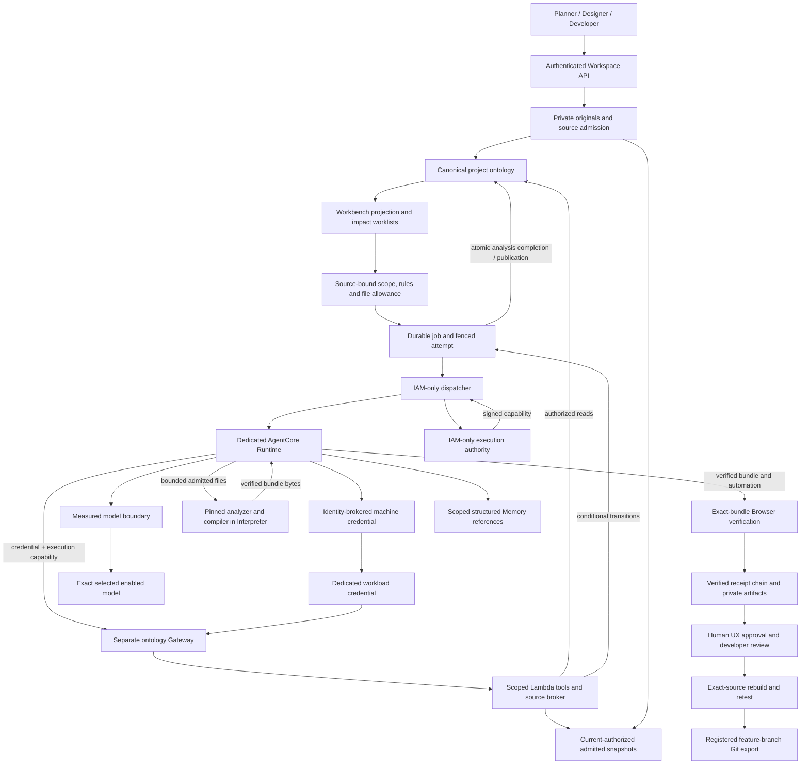

# Platform architecture and ontology execution design

Date: 2026-09-23. Status: implementation baseline; service activation gated.
Scope: the bank platform and its project workspaces. The separate demos and
educational guidebook retain their own scope.

The user requested actual ontology/AgentCore implementation and required the
review outcomes to be reflected in the overall design before coding. This
document connects the existing modules, the required extension and the delivery
sequence. It is the design entry point, not evidence of deployment.

## Authority and reading order

[SPEC](../../SPEC.md) defines requirements. Module contracts define interfaces:
[platform](CONTRACTS.md), [ontology](../workspace/ONTOLOGY_CONTRACT.md),
[execution](../workspace/AGENTCORE_CONTRACT.md),
[React](../workspace/REACT_CONTRACT.md),
[internal documents](../documents/CONTRACT.md) and
[workbench](../workbench/CONTRACT.md).
This design connects those authorities; a conflict requires an explicit
reconciliation, not a silent exception.

The [dated plan](ONTOLOGY_AGENTCORE_PLAN.md) retains sequence and review history.
The [acceptance specification](ONTOLOGY_AGENTCORE_VALIDATION.md) defines the
case evidence and completion rules. Kiro's completed documentation reviews
establish document consistency, not Runtime execution, complete implementation
or permission to skip service gates.

Here, data admission approves bytes for transfer, execution admission creates
an authorized job, and production admission enables a verified cohort. Their
records and decisions remain distinct.

## Platform boundaries

| Area | Responsibility and authority | Integration rule |
|---|---|---|
| Web/API and identity | Korean role workspaces; verified Cognito actor and current project membership | Request/model fields cannot choose an actor, owner, permission or execution backend |
| Internal document library | Private immutable originals, extraction, source audiences and approved revisions | S1 and other consumers recheck the library's current source authority; no shared private-analysis cache |
| Workspace product and design ontology | Canonical project manifest, historical product publications and reviewed source/design/code mappings | Preserve product IDs/hashes; canonical identity and authority stay in workspace records |
| Workbench | Authorized knowledge/graph projection, change worklists, Skills and synthetic business workflows | In canonical mode, consume the workspace manifest; import legacy declarations explicitly |
| Bank reference graph and private services | Separate local/Neptune reference graph, deterministic financial services and the private MyData path | No automatic project import, shared authority, new ontology-tool access or permission expansion |
| React delivery | Source policy, trusted kit/compiler, verification, human approval, private release and registered Git export | Extend the existing run/round/release records and exact-revision gates |
| Registry and legacy Studio | Asset declarations, existing generation/prototype paths and scenario agents | Registration is not service readiness; prototype approval is not React approval; shared seeding/reset remains IAM-admin-only |
| New ontology execution | Runtime, scoped Gateway/Lambda tools, Identity, Interpreter, Browser and structured Memory | Dedicated service resources and authority; no silent fallback when selected |
| Legacy execution | Existing Lambda worker/verifier and bank Harness/Gateway clients | Retain defaults and drain existing work under its admitted backend during rollout |

The bank impact graph, workspace ontology and workbench projection are three
distinct responsibilities. Storage technology does not make their permissions
interchangeable. Optional bank-reference import needs a reviewed, versioned
authority adapter and source grant before it can supply project context.
That optional integration is outside the current delivery scope and needs an
owning schema/contract amendment before adding a source kind or implementation.

## End-to-end workflow

1. Store immutable HTML/image/code/document originals privately. Keep imported
   source status separate from platform approval. Normalize and classify inputs
   before admitting data to AgentCore.
2. Analyze syntax and source references without executing imported programs,
   hooks or build settings. Preserve unresolved/dynamic references and limits.
3. Publish reviewed mappings into a versioned canonical manifest; workbench
   views and impact worklists read that authorized snapshot.
4. Freeze a proposed change's sources, relevant rules, kit, allowed files and
   context fingerprint. A shared image change exposes witnessed dependencies
   and rule refs to recheck; it does not amend those rules.
5. Admit an execution with a server-selected backend and exact inputs. Dispatch
   a current attempt into Runtime under a signed execution capability.
6. Fetch authorized context through scoped tools, invoke the selected model
   through `engine/gate.py`, compile with the trusted archive, and verify the
   same bundle through the authenticated Browser automation channel.
7. Validate signed observations independently before making a result reviewable.
   Human publishing approval and developer frontend acceptance remain separate.
8. Rebuild/retest approved source without model regeneration. Copy/download and
   Git export recheck current authority and preserve actual bytes and hashes.

Every supplied source remains in derivative lineage. A model cannot remove a
source from revocation obligations by claiming it was unused.

## Data and permission design

### Canonical records and projections

The workspace `ontology` record and `project-current` manifest are canonical.
Immutable partitions and indexes precede one conditional publication.
Existing product-publication IDs and hashes remain historical partitions.
Workbench canonical mode projects that authority; legacy mode keeps its
existing behavior. `PROJECT_ONTOLOGY_MODE` is operator configuration, never a
request-level authority choice, and initially defaults to `legacy`.

Design levels are Foundation, Atom, Molecule, Organism, Pattern, PageTemplate,
Screen and Procedure. Icon is a Foundation subtype. Source/code observations,
declared mappings, model candidates and human approval are distinct evidence
and review states. Use the direction, provenance, revision and coverage rules
in `platform-ontology/1` and `source-analysis/1`.

Use current source membership/audience and exact source revisions on reads,
pagination, analysis, publication, review, download, release and export.
Monotonic authority epochs prevent remove/re-add membership from resurrecting
an old authorization. Unrelated title/comment writes do not revoke authority.

Cross-project sharing requires origin source authority, the relevant publisher
capability, an exact-revision publication, a destination-owner grant and current
upstream permissions. Organization publishing capabilities are IAM-administered;
project ownership does not create them. Revocation blocks new access immediately,
fences attempts, quarantines derivatives and schedules cleanup/recall work.
It cannot recall already delivered Git commits or bytes.

### Data admission and model routing

Source access and non-sensitive data admission are separate checks. Admit only
synthetic, public or explicitly reviewed internal-non-sensitive snapshots under
a versioned policy. Unclassified/sensitive inputs and identity originals block.
Required redaction takes place in the private privacy service and creates a
separately hashed derivative before any AgentCore transfer.

The private-intake maintainer owns format/PII inspection, image normalization
and the admission record. A platform security operator administers the versioned
policy. When human review is required, including internal-non-sensitive review,
the named reviewer needs its explicit grant and current source access.
Synthetic/public inputs may use policy-approved trusted provenance checks.
Project ownership, an upload field or a model
label cannot confer this authority or widen a source audience. The admission
record binds source/derivative hashes, policy revision, applicable reviewer
revision and allowed data class. Missing policy, inspection, required reviewer
authority or required privacy
service blocks admission and transfer.

Policy revisions, trusted provenance registrations and reviewer grants follow
`source-admission/1` in the execution contract. Only IAM-only administrative
entry points may write them. Project/workspace APIs and the in-app operator
group cannot create this authority. Private intake verifies current records
against the verified actor. Trusted provenance means an exact server-owned
fixture registration or policy-approved public source reference/hash.

The final model payload still passes independent measured boundary inspection.
Preserve deterministic financial values and the existing private MyData path.
This extension does not move Tier 2 inference, private identity mappings or
customer-profile tools into Runtime, Interpreter, Browser or Memory.

Preserve the user's model selection. Verify provider ID, inference profile,
account/region route and boundary adapter before enabling a model. An unavailable
requested model remains explicitly unavailable; no guessed alias or replacement.
A declared verified model set may receive scoped admission under the execution
gates, while full requested-model completion remains incomplete.

### Service authority

| Component | Permitted responsibility | Enforcement |
|---|---|---|
| Authenticated API | Admit/cancel authorized operations and handle human review | Current actor/source checks, exact criteria and conditional writes; no capability-signing request privilege |
| Private intake and admission reviewers | Inspect/normalize source data and admit eligible snapshots under `source-admission/1` | IAM-only policy/provenance/grant administration; no project API or operator-group write privilege; current verified actor/source checks, inspection and exact artifact binding |
| Workspace publication/source authority | Publish/grant/withdraw exact shared revisions and resolve supported handoff source kinds | Human publisher/destination-owner capabilities; upstream ACL intersection; IAM-only remediation routing; no Runtime approval privilege |
| Dispatcher and execution authority | Allocate fenced attempts and issue bounded capabilities from admitted records | IAM-only issuer, dedicated KMS capability key, current authorization and key registry |
| Runtime | Orchestrate actual stages and allowlisted boundary-routed model calls | No direct canonical-store/ledger writes; dedicated identity/budget; allowlisted metadata-only telemetry and verified sink configuration |
| Identity and new Gateway | Broker a dedicated machine credential and authenticate scoped tool access | Dedicated issuer/client/scope/audience and Gateway execution role; existing bank Gateway configuration unchanged |
| New Lambda tools/source broker | Resolve the capability and current project/source/operation scope on every call | Signature/ledger/session/expiry verification; bounded references/handles; no model-selected actor, bucket key or endpoint |
| Interpreter | Run fixed trusted parser/compiler operations and read approved tool archives | Exact archive version/hash and platform profile; no source-store, model or private-plane access |
| Browser | Observe the exact immutable bundle and required behavior/a11y results | Authenticated automation, isolated no-egress network and exact-resource fulfillment |
| Dedicated Memory | Store bounded structured decisions and source/evidence references | Same actor/project pseudonym, no extraction strategies, current ref checks, TTL and deletion lifecycle |
| Watchdog/reconciler | Recover or fail interrupted attempts within bounded authorization | IAM-only backend; same ledger writer; cannot generate, mint user authority or fabricate completion |

Only the IAM-only dispatcher requests a capability after allocating the exact
attempt/session/fence. The execution authority performs signing from that
admitted record. The user-facing API does not mint or request a capability.

The machine credential authorizes the workload; it is not project/user
authorization. Lambda independently verifies the execution capability. Runtime
inserts `_executionAuthorization` only after validating model arguments against
the filtered schema. Credentials and capability values never enter prompts,
Memory, logs, source archives or Browser pages.

The Runtime maintainer and model-boundary maintainer jointly own telemetry.
Before activation, inspect application instrumentation, Runtime/service tracing,
exporters and configured log/trace destinations. Only allowlisted metadata may
be emitted; source text, prompts, responses, tool payload contents, identity
originals and capability values must not appear. No Tier 2 data enters optional
insights/Evaluations/Policy routes. Prove exclusion with synthetic source/token
canaries in G0-RUNTIME/G0-IDENTITY and AUTH-05/GEN-03 evidence. Include
Interpreter/Browser session logs and exporters in their service gates. Unsupported
capture controls or unverified sinks block activation; this does not require
enabling optional observability products.

## Durable execution and evidence design

Use the existing workspace job store and one logical transition writer,
`workspace/execution_ledger.py`. Existing Lambda job claiming is not a substitute
for the new execution/attempt/lease protocol. The API, dispatcher, trusted tool
facade and reconciler use fixed server-owned caller roles.

Unit A analyses remain on `Worker.handle → ontology_jobs.process` with their
existing atomic job/artifact publication and explicit offline adapter.
That legacy writer must never receive a cloud analyzer factory. B implements
the Runtime/Interpreter transport; C routes new AgentCore analyses through
`execution_ledger.py`. B0 retires obsolete cloud-factory comments before adapter
work begins. Backend and schema version identify
the single writer for each record; never let both workers claim/write one job.
Existing jobs drain under the old path, without in-flight state migration.
B0 defines the reserved `agentcore-execution` task and `executionSchemaVersion`
discriminator and implements conditional rejection in both actual legacy
claim/16-minute expiry and new-ledger paths. RUN-01 O-mode tests import those
real paths; a malformed/unknown discriminator never falls back to legacy.
No shared-table probe may create new-schema records until deployed guards are
verified. C owns application dispatch/read routing and live repetition of the
existing mutual-exclusion checks.
B0 inventories and protects all legacy job-status writers, not only claim and
expiry, plus linked artifact/receipt completion and read-repair paths.
Marked execution artifacts or artifacts linked to new/reserved jobs are never
mutated by legacy repair, including missing-job cases. Unknown linkage is
reported to the new reconciler without changing completion state.
Its guard PR is co-reviewed by the ontology maintainer and preserves
the concurrent Unit A fixes. One platform-runtime deployment owner records
the worker/API revision hashes and RUN-01 live guard/legacy-control evidence
before B1 shared-table probes. Until then, probes use isolated disposable tables.
Installation is first verified by matching deployed revisions to the reviewed
guard. The deployment owner's single inert, quarantinable synthetic control
record is then permitted for RUN-01 live refusal/legacy-control verification
and cleanup; general B1 shared-table probes wait for that result.
Rollback of the guard first stops new-schema work and drains/quarantines its
records; an unguarded legacy deployment must never receive those records.
Malformed records are reported through metadata-only misroute/quarantine
signals owned by that maintainer, without automatic legacy conversion.

Admission binds request identity, canonical input hash, actor/project/source
authority, selected model, backend/config/execution-profile revisions and deadline.
Attempt and transfer/completion records bind the exact consumed data-admission
decision IDs/revisions and admitted artifact hashes.
Attempts have distinct random IDs, Runtime session binding and monotonic fences.
Duplicate admission/dispatch cannot create a second current attempt.

The required lifecycle is `queued → dispatched → running`, followed by validated
`succeeded`/`needs_changes`, explicit `failed`/`cancelled`/`expired`, or bounded
`recovery_required`. Preserve the execution contract's deadlines, leases,
heartbeat, retry and budget limits; verify service compatibility in Phase 0.
Store those defaults under a versioned execution profile rather than treating
unproven timing values as immutable service guarantees.

Record intent and reserve budget before every individual model invocation,
including a repair round. Unknown potentially
billed outcomes require recovery or a freshly authorized explicit retry, never
automatic replay. Cancelled, expired, revoked or superseded attempts cannot
publish current graph, Memory, approval or release evidence.

Write immutable objects before publishing pointers. Coupled job/artifact/graph
changes use the existing `Storage.put_many` transaction and current source/
authority fences, without sequential fallback. Coupled ontology/job/artifact
commits follow the ontology contract's single-submit rule (`retry_conflicts=False`);
contention returns to the authorized caller for fresh checks. A separately
reviewed `before_attempt` guard may apply to new-ledger-only operations, with
fresh authority/deadline checks before each permitted retry. Here,
new-ledger-only excludes ontology, artifact and request-marker mutations.

For source analysis, `ontology.publish` creates only a staged immutable plan.
`execution.finish` validates evidence and combines the ledger's prepared
conditional writes/checks with ontology/artifact/request-marker publication in
one transaction, using the existing trusted completion-write composition point.
The terminal job/artifact carries the receipt pointer; no graph-only publish
or separate later terminal update is permitted. Reserve the ontology contract's
non-source transaction budget at admission by rejecting an over-budget request
unchanged with `execution-completion-scope` and its limits. The server never
trims inputs; only the requester may submit a new smaller authorized request
and request ID. Freeze/hash only that accepted request and retain every
required source condition. The complete `execution.finish` transaction is
single-submit. Its trusted Lambda facade may retry proven contention at most
twice after fresh checks within the deadline; exhaustion and unknown outcome
follow the execution contract's explicit failure/reconciliation rules.
Finish-time overflow returns `execution-completion-scope` without a publication
transaction and requires a newly authorized smaller request.

Completion validates the receipt chain, signature/key state, current attempt,
service/session/nonce associations, required stages, profile allowlists and
private object existence/hashes. A model-authored pass flag, resource READY
status or a cloud-looking receipt is not execution evidence. Sign observations
with a key distinct from the capability key.

## Implementation ownership and delivery sequence

Baseline inspection: `e097cee8b8a62dbc1d675e112edd401a8072fb46`, 2026-09-23.
The working tree also contains concurrent ontology code fixes. Preserve and
review those independently when integrating; this table is not a certification
of their current tests, merged state or deployment.

| Unit | Modules / change boundary | Baseline and required next work | Exit evidence |
|---|---|---|---|
| A: canonical data | Ontology maintainer; `workspace/ontology_*.py`, `source-analyzer/`, workbench projection | Foundation exists; the worker admits only the explicit offline analyzer. Reconcile source/authority fixes and retain legacy defaults | Fixed parser/impact oracle and authorization/atomicity negatives; reviewed PR A |
| B0: execution protocol and writer guards | Required `workspace/execution_ledger.py`, execution/evidence schemas and actual legacy claim/expiry guards; platform-runtime owner | Implement discriminator fences before new records, bounded transitions, per-call intent/recovery and profile/admission bindings. Test-key verifiers require explicit offline opt-in; production rejects them | RUN-01–05 O-mode cases importing actual legacy guards plus conditional-storage fakes, expiry/cancellation/malformed-evidence negatives; reviewed B-chain PR; no cloud-readiness claim |
| B0 intake: private data admission | Planned private admission/image modules under `source-admission/1`; private-intake and security-policy owners, with privacy/infra owner for redaction routing | Implement IAM-only policy/provenance/grant administration, private checks and exact derivatives. Source-document redaction needs its own caller/network/contract verification | SRC-01/05/06 and AUTH-01/08 O-mode/API negatives; reviewed B-chain PR. G0-ADMISSION owns L evidence; missing required privacy blocks |
| B0 sharing: publication and source adapters | Planned workspace publication/grant adapters and remediation worker; ontology/workspace-release owners | Implement shared-publication authority and `published-asset`/`ux-contract`/`run-round` adapters with owning-contract APIs, source ACLs and withdrawal; uninstalled adapters remain unavailable | AUTH-07/08, ONT-04/09, IMP-05 and HAND-02–05 O-mode/API checks; reviewed B-chain PR. L/U evidence remains required for C |
| B1: execution authority and capability probes | Durable issuer/key registry and disposable probes; identity/runtime owners, with private-intake owner for transfers | Require reviewed B0 intake administration, inspection and probe-scope decision records, plus deployed B0 writer guards before shared-table probes. Verify durable keys/service topology and retire probe resources | Reviewed B-chain PRs; G0-ADMISSION/identity/runtime/service evidence and stop/go records; probe permission is not full intake completion |
| B2: service integration | Runtime adapter, ontology Lambda/source broker and scoped IaC; runtime/identity/verifier/model-boundary owners | Integrate proven transports, capabilities, transfers, receipts and metadata-only telemetry. Verify the new Runtime model entry point against existing obligations | G0 plus AUTH-05/GEN-03 telemetry evidence, reproducible compiler/browser evidence and IAM negatives; reviewed B-chain PR; defaults retained |
| C: application cutover | Workspace dispatch/jobs, intake/generation/release, workbench and frontend readiness | Connect the real backend and exact context/evidence bindings after applicable gates. Preserve existing approval/export APIs | Vertical positive/negative acceptance, private staging, limited synthetic cohort, rollback and reviewed PR C |
| Production admission | Operator configuration, runbooks and live evidence | Enable only the verified cohort/model set; drain work on its original backend | Required CI/review and current live evidence; explicit full-plan gaps; no automatic local fallback |

The first coding unit is B0's offline protocol foundation after this design is
recorded and reviewed. It must not be connected as a production executor until
the applicable authorization, service and completion gates pass. Preserve the
plan's independently reviewed A/B/C boundaries; B0/B1/B2 subdivide B for delivery,
not to bypass those reviews. The B0 intake and sharing work may proceed as
separately reviewed offline/API units, but C cannot exit without them. B0's
RUN O-mode evidence belongs to those RUN cases; it does not mark the distinct
23-case ontology/intake offline level complete.
That level is the 22 ONT/SRC/IMP cases plus ROLL-01. The private-intake owner
owns G0-ADMISSION; the ontology owner coordinates its SRC-05/06 offline portions.
Disposable fixture probes need the protected probe path, not completed customer
intake/sharing APIs. Full activation still needs all applicable gate evidence.
The 54-case integrated level is all 57 cases except ROLL-02, ROLL-03 and ROLL-04.
C also reconciles the React Git-export contract's expected-base and response
schema fields before enabling its upgraded export path.

Implementation details that alter a wire schema, storage authority, role or
acceptance assertion must update the owning contract with the code. Label
proposed modules as planned; record verified paths/commands when code lands.
Proposed paths and harnesses are not installed services.

## Review outcomes incorporated into the implementation baseline

The first eight rows close the original Major findings. The final row groups
subsequent documentation clarifications; it is not a ninth Major issue.

The architecture reviews additionally required explicit private-intake and
sharing ownership, Runtime telemetry controls, IAM-only admission-policy
administration, a private-admission gate and exclusive analysis-job writer
routing. Those decisions are recorded above and in the owning contracts.
The later reviews additionally bound staging-only publication to atomic
completion, reserved transaction slots, protected all linked legacy repair
paths, bound input-admission/profile evidence and prohibited offline
source-analysis rollback.

| Review issue | Design obligation | Acceptance coverage |
|---|---|---|
| Canonical-only tests could hide a premature default switch | Test explicit canonical, explicit legacy and unset/default mode; reject caller override | ONT-01, ROLL-02 |
| A mutable offline denominator could conceal gaps | Fixed offline 23, integrated 54 and full-plan 57 case sets; independent O-mode metric | Completion levels and result template |
| Correct parser output did not prove non-execution | Observe marker/process/network canaries with a trusted control | SRC-02–03 |
| Mixed revisions could create false completion | Bind counted evidence to the final candidate/deployment; recheck authority and profile freshness | Evidence rules, RUN-04, all G0 gates |
| Conflicting evidence modes could hide failures | Deterministic status precedence and no partial PASS | Result aggregation |
| Bank Gateway compatibility was weaker than isolation | Preserve its resource/authorizer/target/IAM configuration; use separate ontology resources | AUTH-06, ROLL-01 |
| Unavailable models could look fully implemented | Separate positive invocation and negative selection checks; explicit scoped admission and full-plan gaps | GEN-02, G0-MODELS |
| Export role denial was implicit | Test designer/planner/nonmember/agent denials; only developer/owner exports ready source | HAND-05 |
| Import/reference/ownership details could drift across documents | Keep exact reserved source kinds, omitted/null versus empty selection behavior, contract headings and gate role/limit mapping explicit | ONT-04/08, limit register, G0 mappings |

The acceptance specification remains the complete test procedure. Copy it into
a private dated assessment and update case evidence as implementation proceeds.
Document review PASS is never copied into implementation PASS.

## Change and rollout discipline

Before changing a module, identify its owning contract, authority boundary,
required caller paths, acceptance case IDs and applicable gate. Record the
implementation revision and actual evidence after completing the unit.
Do not label absent, skipped, offline-only or blocked service checks as passed.

Retain encrypted private source/evidence stores, original hashes and audit
metadata. Admission rollback pauses new AgentCore work and deliberately selects
a compatible legacy backend for new work; it cannot restore revoked access.
For source analysis, no production legacy analyzer exists: rollback blocks new
analyses and never enables the offline test adapter as a production substitute.
Keep the legacy isolated verifier until jobs drain and rollback is demonstrated.

Customer deployment remains a separate decision requiring real integration,
frontend acceptance, security validation and authorized deployment. A ready
publishing package, successful code review or source Git export does not grant it.
