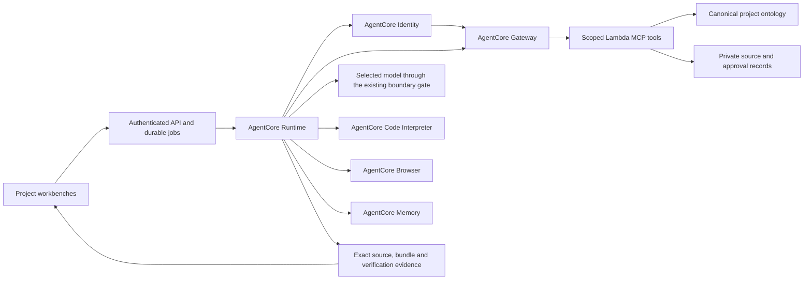

# Ontology-centered AgentCore implementation

Date: 2026-09-21. Status: offline/data implementation started; service integration gated, revision 4.
Authority: the user's platform clarification and explicit request to implement
AgentCore Code Interpreter, Browser, Memory, Gateway with Lambda MCP targets,
and Identity. This document is the implementation plan; a completed checklist
requires current test and deployment evidence.

Revision 4 addresses three independent plan-review rounds by
`claude-fable-5.1` and `gpt-5.6-sol`. Both agreed with the direction and requested
more precise contracts. The revised plan requires a new review before consensus
is recorded. It incorporates the user's repository-specific Kiro review and
explicit instruction to implement the findings. Both reviewers agree on the
direction; their latest plan verdict remains REVISE, with offline contract work
and disposable spikes permitted. The concrete contracts and tests below close
those decisions as implementation proceeds. No service integration or deployment
is certified by this document.

## Product objective

Build an Agentic AI Platform that connects work across planning, regulation,
UI/UX and frontend engineering. The supplied UI/UX material is a representative
input and acceptance case, not the application to reproduce.

The main workflow is:

1. Register exported HTML, images, design guidance and existing source files.
2. Retain immutable originals; identify, classify and connect reusable assets.
3. Connect assets to published products, regulations, procedures and actual code.
4. Analyze a proposed change against those relationships and source revisions.
5. Generate or modify React publishing source with the selected model.
6. Compile and inspect the exact source and its rendered behavior.
7. Let designers and frontend developers review, discuss, copy and download the
   source, or export an approved release to a registered Git destination.
8. Record the accepted revision and its relationships for later reuse.

Uploading a file is not approval. Downloading a component package is not this
entire workflow. Rendering an ontology visualization is not evidence that every
dependency has been discovered.

## Canonical ontology

The canonical authority is the **workspace project ontology**, extending the
`ontology` records and immutable project-scoped JSON projections published by
`workspace/collaboration.py`. Retain its membership, source IDs and approval
bindings. Add a project-wide manifest with source partitions: existing product
guidelines, eight-level design mappings and code/resource nodes. Existing
per-product publication IDs/hashes remain stable historical partitions.

`workbench/knowledge.py` becomes the authorized typed-graph/search/impact
projection of that canonical manifest. Import existing workbench declarations
through a reviewed adapter retaining namespace/provenance; after cutover they
are not a competing write authority. The bank impact graph in `graph/store`
(local/Neptune) remains an explicitly separate reference source. It is not
automatically joined, copied or authorized for a project. Selected references
require an allowed, version-bound import. New eight-level/code nodes belong
to the workspace canonical manifest, and workbench views/worklists derive from it.

The classification progresses from foundational resources to complete workflows:

```text
Foundation / Icon
  → Atom → Molecule → Organism → Pattern → PageTemplate → Screen → Procedure
```

These eight levels describe the design-to-workflow connection, not eight tabs or individual
components. Products, regulations, policies, source documents, code files,
tests and responsible teams connect across the design levels.

The graph must represent at least:

| Relationship | Meaning |
|---|---|
| composes / uses | A larger design element depends on a smaller element |
| implements | A code file or export implements a design element or screen |
| imports / references | Source code depends on another module or asset |
| governed-by | A product, screen or procedure is constrained by a rule |
| part-of / next | Membership and ordered procedure transitions |
| derived-from | Exact source artifact, document/page or code revision |
| owned-by | Responsible team; ownership does not itself propagate impact |

Reuse canonical project IDs and retain original design, developer and external
IDs as mappings. Node and edge evidence includes source revision/hash,
extraction method, review state and unresolved references. An explicit mapping
is declared evidence; an extracted import is structural evidence; a visual
interpretation is a candidate until reviewed.

Original binaries and source documents stay in private artifact storage.
The ontology stores identity, relationships and provenance, with bounded
retrieval of the original evidence. Current source permissions and tombstones
are checked on reads; a historical graph cannot restore revoked access.

## Source and code ingestion

Reuse the existing bounded upload, parsing and resumable corpus preparation.
Connect completed project assets and published product guidance to the canonical
ontology. Preserve original statuses separately from platform review.

For code, analyze actual TypeScript/TSX syntax, imports, exported symbols,
JSX component use and static asset references. Do not execute imported code.
Resolve relative paths conservatively and retain dynamic/unresolved references
as unknown coverage. The analyzer must retain the source path, byte hash and
location of each discovered dependency.

For HTML/images, preserve file and page identity, dimensions, extracted structure
and source evidence. Image-only input does not prove component semantics or
business behavior. Matching and model proposals must remain reviewable.

Asset changes produce new immutable revisions. Updating an image must reveal
the dependent elements, screens, procedures and code files, plus applicable
rules to recheck. An image change does not automatically amend those rules.
Unmapped code and truncated traversal must remain visible.

## AgentCore execution architecture



| Service | Required operational responsibility |
|---|---|
| Runtime | Execute durable, project-bound workflows and record actual stages |
| Gateway → Lambda MCP | Retrieve authorized ontology/source context and impact evidence through callable tools |
| Identity | Bind the workload to the verified actor and broker the configured outbound credential used by Gateway access |
| Code Interpreter | Analyze source and run the trusted React compiler with pinned dependencies |
| Browser | Inspect the exact static bundle using the existing assertion and accessibility checks |
| Memory | Persist scoped workflow decisions and source/evidence references across runtime sessions |

AgentCore is the execution path, not a cosmetic badge on local work. Once a
deployment selects this backend, an unavailable service blocks the affected
operation; it must not silently fall back to the prior Lambda implementation.
Keep the local adapters for deterministic offline tests and explicitly labelled
legacy paths.

The current Workspace API can retain its durable queue and dispatch transport.
The job execution itself must take place in Runtime. Reuse the existing approved
contract, model boundary, source-file policy, compiler, verifier and release
logic rather than introducing a second approval system.

## Identity and tool authority

The application continues to validate its Cognito user and current project
membership. AgentCore Identity does not replace application authorization.

The backend binds each execution to its verified actor, project, allowed
operation and expiry. Runtime derives its Identity context from that record,
not from model-authored arguments. AgentCore Identity brokers a dedicated
machine credential for the Gateway audience; credentials stay in memory and
are never stored in job results, memory events, source ZIPs or browser pages.

Create a **separate ontology Gateway and separate Lambda MCP target**.
The existing bank Gateway retains `AWS_IAM` inbound and `GATEWAY_IAM_ROLE`
target credentials, preserving current Harness/scenario clients.
Do not reuse or extend `agentcore/gateway_tools.py` for this workflow.
The new Gateway uses the dedicated Identity/JWT topology below.

Its execution role invokes only the new target. The new Lambda and Runtime
have no plane/bridge invocation, Registry write/reset or customer-profile
lookup permission. Package imports, IAM and network policy enforce the boundary;
an agent `allowedTools` list alone cannot do so. Preserve SPEC §11-4's
non-sensitive AgentCore scope and the separate private MyData path.

The target resolves the canonical execution record
and checks current project membership, source access and operation scope on
every call. An execution ID is a reference, not standalone authorization.
Model-visible tools must not accept an alternative actor, owner or project.

Do not connect a customer Git, Figma or Confluence service without a configured,
authorized endpoint and effective source access mapping. Exported files remain
the supported starting input.

## Compiler and browser boundary

Prepare a hash-verified tool archive from the pinned repository compiler,
component package and dependencies. Transfer it to the Code Interpreter session
without runtime package installation. Generated source is data for that compiler,
not a command, build configuration or package hook.

Distribute the large dependency bundle as a versioned immutable **S3 tool
archive**. The dedicated Interpreter execution role can read only approved,
non-customer tool-archive keys/versions. It has no source-store, plane, Registry,
model-invocation or broad S3 permission. Verify SANDBOX-mode S3 access in Phase 0.
Use authenticated file APIs for bounded job inputs/outputs; `writeFiles`
supports both text and binary content but is not the bulk toolchain path.

Probe actual sandbox architecture, OS and Node version. Build the archive
for that platform, including the correct native esbuild binary; do not reuse
an ARM64 worker dependency tree on an unknown architecture. Pin package/tool
bytes. Record and compatibility-gate the service-managed Node version rather
than claiming that the application pins it.

Code Interpreter commands are fixed platform operations. Keep file, process,
payload and execution limits. Record the actual service/session identity,
tool-archive hash, catalog hash and source/bundle hashes.

Browser sessions use an isolated VPC with no arbitrary internet egress.
The verifier fulfills only the exact approved bundle resources and blocks other
requests. Runtime credentials and source-store credentials never enter the page.
Connect through the authenticated automation channel, run the existing
assertion DSL, and retain real screenshots, accessibility and functional evidence.
Session start alone is not a passed check.

## Memory and model boundary

Memory is execution continuity, not the authority for products, regulations,
permissions or approvals. Persist bounded structured decisions and references,
not entire source documents, raw prompts or identity originals. Derive actor
and session namespaces from the verified project/actor context.

Before reusing a remembered decision, revalidate its referenced source and
approval revisions. An obsolete memory must not override a newer ontology.
Use explicit structured events without an unmeasured automatic model extraction
path. Any later semantic-memory strategy requires the same boundary inspection
as other bank model calls.

Create a dedicated Memory resource with **no long-term extraction strategies**.
Do not reuse the Harness `SEMANTIC` configuration or its Memory resources.
Use structured events with extraction disabled where supported and prove that
configuration in Phase 0. Existing Harness Memory is outside this cutover.

Preserve the user's selected model. Verify each requested Sonnet, Opus and
GPT-5.6 Sol account/region inference profile and boundary adapter.
**GPT-5.6 Sol is not in the current platform allowlist.** Add an exact provider
ID only after its existence, invocation and permitted route are verified.
Otherwise leave it unavailable; do not add a guessed alias or substitute
Astra/Fable. A Kiro model ID is not evidence of a Bedrock inference profile.
The model writes
design/composition/state code. Code Interpreter executes trusted tooling;
Browser supplies observed evidence.

The private MyData processing path and deterministic financial calculations
retain their existing boundaries. This change must not route raw identifiers
through AgentCore or permit models to invent financial values.

## Generation and handoff

Generation consumes a source-bound ontology context: selected design elements,
approved component package, published product/rule revisions, procedure/state
requirements and any existing React baseline. Record the context fingerprint.
Changes to relevant sources require fresh validation.

Keep new design, reuse and scoped modification available. Apply a reviewed
file-change allowance when modifying existing code. Repair against the same
criteria and retain each failed round's evidence.

Frontend review must provide rendered behavior, source-file browsing,
copy/download, actual added/modified/deleted files, dependency impact and
verification results. Keep publishing approval separate from frontend acceptance
and real API/authentication integration.

Approval binds the exact source, kit, ontology context, rules, bundle and
evidence. Release rebuilds that approved source without asking a model to
regenerate it. Git export retains the registered-destination and feature-branch
restrictions.

## Normative contracts for implementation

The contracts below resolve the previously open architectural choices.
Machine-readable schemas and adapters must implement these decisions rather than
introduce different authority or state semantics. They do not prove a deployed
service supports the chosen design; the Phase 0 gates test that separately.

### platform-ontology/1

`Foundation` is one level; `Icon` is its resource subtype. The other seven
levels are `Atom`, `Molecule`, `Organism`, `Pattern`, `PageTemplate`, `Screen`
and `Procedure`. Procedure is a workflow level, not a larger visual component.
Existing `Component` IDs remain compatibility aliases with explicit level
mappings. Unmapped components remain unclassified.

A node contains `id`, `scope`, `type`, `subtype?`, `revision`, `contentHash`,
`sourceRefs`, `provenance`, `reviewState` and `tombstone`. Scope is either
`{kind:project, projectId}` or `{kind:published, publicationId}`.
An edge contains `id`, `type`, exact source/target node IDs and revisions,
`sourceRefs`, `provenance`, `reviewState` and `tombstone`.

A source reference contains `sourceKind`, `sourceId`, `revision`, `sha256`,
`audienceRevision` and a location when applicable: document page, source
path/export/line, or image region. Implemented source-kind identifiers are
`asset`, `document-revision`, `product-guideline`, `workbench-document` and
`package`. Imported code revisions use `asset` with an exact import revision,
byte hash and file location. `published-asset`, `ux-contract` and `run-round`
are reserved for their separately installed authority adapters and fail closed
until those adapters exist.
IDs are stable within a scope; revision hashes identify immutable content.
Original IDs live in namespace mappings. Ambiguity cannot silently select
the first match.

| Edge | Direction and constraint |
|---|---|
| `COMPOSES` | Strictly lower visual levels from Screen through Atom; level skipping is permitted. Foundation dependencies use `USES`, never `COMPOSES`. |
| `USES` | Any design level, Product, Procedure or code → referenced resource. Atom → Foundation/Icon, Procedure → Screen and Product → Procedure are valid dependencies. |
| `IMPLEMENTS` | Code file/export → design element or Screen; many-to-many is permitted. |
| `IMPORTS`, `REFERENCES` | Code → module/resource. Record cycles and visit them once; these are not visual composition. |
| `GOVERNED_BY` | Product/Screen/Procedure/design usage → exact rule revision. |
| `PART_OF` | Screen → Procedure, Procedure → Product; many-to-many membership. |
| `NEXT` | Screen → Screen within a Procedure, with condition ID and retained-state specification. Loops/back navigation are permitted. |
| `DERIVED_FROM` | Resource/relation → source evidence; provenance, not impact propagation. |
| `OWNED_BY` | Resource → responsible team; terminal assignment metadata, not a dependency. |

Dependency edges run from dependent to prerequisite; impact walks the reverse.
Procedure order alone does not establish a code/policy dependency.
Level-invalid extracted edges remain candidate findings with source locations,
and cannot become approved composition.

| Level | Classification and existing-vocabulary mapping |
|---|---|
| Foundation | Non-interactive color/typography/spacing/grid/elevation/icon/graphic/motion resources. Existing token/icon records map by reviewed subtype; raw SVG is Foundation/Icon. |
| Atom | Small reusable control/display unit without a business sequence. Existing Component may map here only after review; a React Icon wrapper is an Atom. |
| Molecule | Small composition serving one local interaction, such as labelled input/help/error. Existing SM `molecules` are source candidates with their SM ID/path retained. |
| Organism | Bounded task section composed of smaller units. Existing SM `organisms` are source candidates, not automatically approved implementations. |
| Pattern | Reusable interaction/composition contract with at least two independently reviewed usages. Existing graph/Registry Pattern IDs remain aliases. |
| PageTemplate | Product-independent slot/region contract. Do not create one merely because two screenshots look similar. |
| Screen | Concrete route/state identity. Existing Screen/ScreenMeta IDs map explicitly and retain their separate specification/implementation meaning. |
| Procedure | Ordered/conditional screen interaction including back/cancel behavior; existing Procedure/Flow vocabulary maps by reviewed semantics. |

Ambiguous classifications and same-level visual nesting are quarantined until
the owner chooses a lower-level decomposition or justified non-composition
`USES` relation. Model confidence does not approve a mapping. Preserve old IDs,
record exact source→canonical mappings and reject collisions; unclassified
legacy records remain readable without claiming a validated eight-level mapping.

Provenance values are `parser-extracted`, `declared`, `model-inferred` and
`verified-build`; these are evidence methods, not approval states.
The review lifecycle is `candidate → reviewed → approved → deprecated`, with
rejection and supersession recorded. Only an authorized human advances design
or policy approval. A structurally confirmed import may still refer to a
candidate design element.

Schema migration requires explicit version mapping, collision checks and
compatibility tests. Tombstoning creates a new revision and immediately
excludes the resource from new use. Historical evidence is not rewritten.

### Shared-publication authority

Cross-team work in one project uses current membership and source audiences.
Cross-project reuse requires an exact-revision publication and grant.

The source owner proposes publication. A designated design-system publisher
approves design publications; the responsible policy owner approves policies.
A destination project owner accepts a grant naming publication revisions and
permitted roles. These are explicit application capabilities, never permissions
inferred from an agent/service identity.

Effective access intersects current membership, publication grant and upstream
source policy. Grants cannot widen a restricted upstream audience. Organization
publication requires a separately authorized source-policy change; ordinary
uploads or project ownership do not create it. A new revision needs a new grant
binding or explicit renewal. Withdrawal immediately invalidates downstream reuse.

Impact crosses shared boundaries only through authorized references. Return
only authorized dependents and evidence; do not disclose hidden IDs, names or
exact counts. Coverage says `restricted-or-unmapped`, never “no impact.”
Internal routing may create work in the affected project's authorized worklist
without exposing that project to the initiating caller.

Project roles remain the authoritative owner/planner/designer/developer roles.
Organization-level `design_publish` and `policy_publish` capabilities are
separate grants assigned through IAM-only administration; project owners cannot
self-grant them. Origin source authority is also required. Destination acceptance
requires destination ownership. Explicit deny, upstream restriction, expiry and
revocation override allows.

Withdrawal is prospective enforcement, not recall of delivered bytes. At the
next access/stage boundary, fence affected attempts, quarantine derivatives,
invalidate effective approval/readiness and deny new retrieval/download/export.
Stop active services best-effort; already-sent model input cannot be unsent.
Late output is non-current. Preserve historical approval metadata marked stale
or withdrawn. Derivative lineage includes every supplied source/model input;
an LLM claim that a source was unused cannot remove it.

Downloaded ZIPs and exported Git commits cannot be remotely recalled. Record
distribution/recall-needed events and scoped remediation work; do not force
rewrite Git history or claim remote deletion. Current access remains blocked
even if asynchronous deletion or recipient remediation is incomplete.

### source-analysis/1

Static analysis runs in Code Interpreter using the pinned **TypeScript compiler
API parser** in a trusted Node tool that returns bounded JSON observations.
Python regular expressions do not replace TS/TSX parsing.
Local execution is an offline test adapter. The analysis unit is a collection
root plus an explicit file manifest and resolver configuration, not a basename.

| Input | Supported observation / boundary |
|---|---|
| TS/TSX/JS/JSX | Parse imports, re-exports, exported symbols, JSX usage and literal asset references. Parse errors block complete coverage. |
| Relative modules | Resolve against the collection manifest; reject path escape and ambiguous extension/case/Unicode matches. |
| Aliases/packages | Use an approved versioned alias/workspace/package-exports map; never execute configuration or invent an unsupplied SDK. |
| CSS/SCSS | Parse literal imports and `url()` references with locations. SCSS evaluation, interpolation and loader execution remain unresolved. |
| JSON | Parse approved manifest reference fields; arbitrary strings are not assumed to be paths. |
| Generated files | Record generator/tool version and source mapping; missing mappings stay unknown. |
| Dynamic imports/URLs and framework transforms | Preserve unresolved references; no automatic network/package lookup. |

Initial budgets: 100 text files and 2 MiB per unit, 100 KiB per text file,
60 seconds of parser execution. Partition larger corpora with a collection
manifest and continuation cursor. Cross-unit resolution uses that manifest;
a completed unit is not a completed repository analysis.

The image comparison unit is an original asset revision or an explicitly
located region. Return byte hash, dimensions, format, coordinates and source
location. Exact byte matches are structural evidence. Visual/semantic similarity
is a candidate with method/model/version recorded; no numeric threshold
automatically approves a relation in version 1. A reviewer confirms the canonical
target and meaning.

Impact uses breadth-first reverse traversal, deduplicates scoped node/revision
and edge IDs, and returns witness paths. Limits are 500 visited nodes, 1,000 edges,
12 dependency hops and 50 actionable work items per invocation. Report all
limiting reasons. Missing collections, dynamic references, parse errors,
inaccessible boundaries and unreviewed mappings prevent a complete-impact claim.
Limits change only through a reviewed contract/configuration revision.

A change set fixes its ID/scope/kind, old exact source reference, new reference
or tombstone, lineage ID, requested scope and base manifest generation.
Cross-ID replacement/rename requires a reviewed lineage mapping.
Analyze one authorized snapshot: first seed canonical nodes whose `sourceRefs`
match the old source revision/region or lineage. This reverse provenance-index
lookup is the seed step; `DERIVED_FROM` itself is not a propagation edge.

| Change | Propagation |
|---|---|
| Image/token/design/code/kit | Reverse `USES`, `COMPOSES`, `IMPORTS`, `REFERENCES`, `IMPLEMENTS` |
| Rule/product condition | Reverse `GOVERNED_BY`, then structural dependencies above |
| Procedure transition | Seed Procedure and changed Screen endpoints, then structural dependencies; other member screens without a proven edge are potential revalidation candidates |
| Permission/grant/tombstone | Invalidate descendants through persisted lineage; filter the reported impact by current authorization |

Procedure→Screen and Product→Procedure `USES` edges are necessary to claim
those dependency paths; `PART_OF` or screen order alone cannot establish them.
Traverse candidate edges separately and label paths containing them potential.
Distinguish observed structural, approved declared, candidate and unknown
evidence. Candidate tasks request investigation, not a confirmed code change.
Changed manifest/source/audience fences make analysis stale before mutation
or approval; never merge edges from different generations into one result.

Code analysis is a durable ingestion job under the same concurrency/budget
policy. Original storage may complete while analysis waits. Interpreter failure
leaves the original stored but analysis failed/unavailable, not indexed/approved.
Report measured usage per job instead of assuming a fixed upload cost.

### execution-capability/1 and Identity topology

The authenticated API admits a job after checking user identity, membership and
operation scope. The dispatcher obtains a short-lived signed execution capability
from the platform authorization service. Use a dedicated asymmetric signing key:
the API/dispatcher can request capability signing; Runtime/Gateway/tools can
verify but cannot mint capabilities.

Required claims are issuer, audience, verified actor reference, project ID,
execution ID, attempt ID, Runtime session ID, workload identity, permitted
operations/resource references, authorization expiry, issue time, expiry and
unique capability ID. Audience is the platform Lambda MCP boundary. Expiry is
no later than user authorization expiry or execution deadline and never more
than 15 minutes after issue. Renewal requires fresh backend authorization.

Deliver the capability in the authenticated Runtime invocation. Store only its
digest and validation claims in the job ledger, not the bearer value.
Trusted Runtime code inserts it in a reserved MCP authorization envelope.
The Gateway wire schema explicitly declares required
`_executionAuthorization: {capability, operationId}`. Runtime creates a separate
model-visible schema that removes the reserved property and required entry,
rejects any model-supplied reserved field, and inserts the capability itself
immediately before the Gateway call. Gateway therefore validates a declared
wire field; Lambda verifies its signature and ledger binding rather than a
caller-supplied trusted marker. Raw discovery may expose the envelope's schema,
never a token value. Model-visible discovery, prompts, Memory, logs and artifacts
contain neither the envelope values nor credentials.
Phase 0 must prove this schema filtering and canary-token log exclusion.

Gateway validates the workload credential. Lambda independently validates the
capability signature, issuer, audience, expiry, workload binding and current
attempt against the ledger, then rechecks membership, resource audience and
operation scope. Capability A cannot access execution/resource B even with the
same machine credential. An execution ID is not authorization.

Generate execution/attempt IDs with at least 128 bits of randomness and bind
`runtimeSessionId` in both the signed capability and the ledger. Validate Gateway,
target and tool identifiers supplied in Lambda context against configuration.
Do not assume a `bedrockAgentCoreSessionId` field is available or equal to the
Runtime session ID: the documented Lambda context does not guarantee it.
If a supported service session field is observed in Phase 0, it is supplementary
binding evidence, not a replacement for the signed capability. Expiry,
cancellation, revocation and attempt replacement reject further protected work.

Runtime has no unrestricted canonical source/ontology-store access; data
operations use scoped tools. Mutations carry a deterministic operation ID and
request digest. Identical retry returns the durable result; the same ID with
different content is a conflict. Cancelled, expired, revoked or superseded
attempts cannot mutate state. Read retry still requires current access.
Operators do not gain a general application source-read bypass.

The selected credential topology is:

```text
Verified application actor → Runtime workload identity
  → Identity workload token → configured OAuth2 machine-credential provider
  → Gateway JWT authorizer → Gateway IAM execution role → Lambda MCP
```

Use a dedicated machine client/issuer and Gateway audience/scope, separate from
interactive application login. The provider credential authorizes the workload;
the execution capability restricts project/user/operation. Do not assume the
Identity workload token itself is a Gateway bearer token.
Phase 0 must prove the broker/provider/Gateway chain and swapped-capability
rejection. Unsupported topology blocks integration until plan revision/review;
do not substitute unauthenticated access, an unused token-mint call or a silent
IAM-only path.

Select a dedicated Cognito machine app client with client-credentials and a
dedicated tool scope as the OAuth issuer profile. Identity brokers that client
credential; Gateway validates its configured issuer, allowed machine client and
scope, plus audience when present in the verified token profile. This applies
only to the new ontology Gateway, never the existing IAM bank Gateway.

The capability issuer is a new IAM-only `execution-authority` backend module.
It derives claims from an admitted job and current authorization, never arbitrary
Runtime arguments. A managed asymmetric KMS key signs capabilities; only the
API/dispatcher role may request signing. Runtime evidence uses a separate key
and cannot mint capabilities. A versioned key registry fixes algorithm, key ID,
purpose, public-key fingerprint, validity and active/retired/revoked state.
Verifiers obtain keys only from configured KMS/registry entries, never token URLs.
Rotation stops old-key signing and retains verification through token expiry.
Authoritative key-revocation state is checked at protected operations; a cached
public key is not cached authorization. Compromised keys invalidate current
attempt/evidence readiness. Routine retired keys retain historical verification.
V1 has no in-session capability renewal: require a freshly authorized attempt.

### ontology-tools/1

Schemas reject unknown fields. Business arguments below exclude the reserved
authorization envelope; the model sees only authorized read tools.

| Tool | Input / output | Scope |
|---|---|---|
| `ontology.context` | Selected IDs/cursor → nodes, edges, source refs, context hash | Read; ≤50 nodes/100 edges per page |
| `ontology.source` | Exact source ref/range → bytes or text, hash and range metadata | Read; ≤256 KiB, no arbitrary URL |
| `ontology.impact` | Change ID/expected graph revision → witness paths, coverage, work-item refs | Authorized change-analysis operation |
| `ontology.publish` | Candidate artifact ref/hash/expected generation → published generation | Trusted ingestion only; not model-visible |
| `execution.stage` | Attempt/stage/operation ID/receipt ref → transition | Trusted Runtime control only |
| `execution.finish` | Final manifest ref/hash/expected ledger version → terminal state | Trusted Runtime; independent receipt validation |

Responses are ≤512 KiB. Cursors bind actor, project, resource selection, graph
generation and audience revisions. Authority/generation changes invalidate them.
A job has at most 60 tool calls and 4 MiB retrieved text, also subject to existing
smaller model-context limits. Errors disclose no unauthorized resource details
or upstream response bodies. Models cannot select endpoints, credential providers,
accounts or roles.

Authority-only changes increment membership/grant/audience versions even when
graph content does not change. Cursors bind those versions independently from
manifest generation. Thus revocation does not wait for content reindexing.

### Memory retention and authorization lifecycle

Memory actor namespaces are keyed pseudonyms derived from organization, project
and verified actor using a managed HMAC key; session ID is execution ID.
No implicit cross-project/actor retrieval is permitted. Events contain schema
version, approved decision kind, resource/version refs, outcome and timestamps.
No free-form source documents, prompts, credentials or identity originals.

Initial event TTL is 30 days, configurable downward. Longer retention requires
operator policy approval. Revocation immediately blocks application retrieval
and queues deletion of affected Memory events/sensitive derivatives. Audit
deletion retries/completion. A tombstone may retain non-content audit hashes
under the configured policy; there is no historical-content bypass in this
version. Cleanup failure does not restore access.

At ingestion, context retrieval, compilation dispatch, review, copy/download,
release and Git export, check current membership and effective source audience.
Generation, approval, release and export additionally check exact relevant
source/kit/rule/graph-context/evidence revisions. Membership/source revocation,
tombstoning, grant withdrawal and relevant dependency/rule changes invalidate
current readiness. Keep historical approval metadata without allowing stale
or inaccessible content to be reused/downloaded. Reproducibility does not
override revocation; audit metadata and source access are separate permissions.

### Atomic publication and reproducible evidence

Write immutable source/graph/evidence objects before publishing a pointer.
Publish a manifest generation in one compare-and-swap transaction that checks
current authorization, source audience/revision fences and previous manifest
version. Failed publication leaves unreferenced staging objects for cleanup.
Readers never combine halves of separate generations.

Source/bundle hashes are SHA-256 over canonical UTF-8 JSON of sorted
`{path, sha256}` entries, hashing actual file bytes. Reject unsafe/ambiguous
paths and retain original paths as provenance. ZIP entries have sorted paths,
fixed timestamps/modes, no host paths or generated timestamps. Record ZIP byte
hash separately. Receipt timestamps are outside deterministic content hashes.

Receipts contain schema version; execution/attempt/stage IDs; actor/project
references; source/context hashes; model ID; compiler/tool-archive/runtime profile;
Browser/verifier profile; service/session identifiers; result hashes/status;
timings/usage; and previous-receipt hash. Trusted Runtime evidence uses a signing
key distinct from the capability key. Model output cannot sign or supply a
passed receipt. Completion checks signature, current attempt, required stages,
private object existence and hashes before success.

Record actual Node/compiler/browser versions. A managed browser/profile change
makes prior approval historical and requires verification under the new profile.
Phase 0 proves deterministic source-to-bundle rebuilding under the chosen
profile; service names and package versions alone do not prove reproducibility.

The trust basis is `trusted-adapter-observation`, not AWS cryptographic execution
attestation. The trusted computing base comprises the reviewed Runtime adapter,
pinned parser/compiler, independent Browser verifier and completion validator.
For each operation, capture the authenticated service/session identity,
operation nonce, exact input hashes, request/task IDs, observed status/exit code
and bounded raw-result hashes. Validate task/session association using service
status/read APIs where supplied. Reject malformed, wrong-session, wrong-nonce,
expired-attempt or mismatched-hash results. Model-authored pass flags are not
adapter observations.

Browser uses request interception over its authenticated automation channel to
fulfill the immutable bundle bytes; no general private web server or external
fetch fallback. Capture bundle manifest/hash, actual browser/profile, viewport,
independent assertion/a11y results, screenshots and blocked requests. Required
fonts are approved local bundle resources or part of the verified browser
profile. Page-authored postMessage results are not verifier evidence.
Completion validates the signed observation chain, allowlisted adapter/tool
profile, current key/attempt and object hashes. Inadequate service evidence
produces incomplete, never a claimed service-native attestation.

### publishing-handoff/1

Extend existing scoped runs, rounds, blobs, releases and registered Git export
APIs; do not create an unrelated handoff store. Responses identify schema version.
The manifest contains project/work item, base revision, model, ontology context
hash/coverage, component/toolchain versions, source/bundle hashes, added/modified/
deleted files with before/after hashes, mappings, evidence refs, publishing
approval, frontend acceptance and unresolved API/authentication integration.
Treat rename as delete/add unless an exact reviewed mapping proves continuity.

The publishing lifecycle is
`draft → validating → needs_changes|reviewable → approved → releasing → ready`.
Failed/indeterminate required checks cannot reach approved.
Frontend acceptance is a separate version-bound record.
Planners own published product/rule guidance; designers own UX approval;
developers prepare/export releases; project owners hold those capabilities.
Agents and service identities cannot approve business/UX content.

An authorized designer/owner approves the generated-file allowance with the
criteria. Retain the current 24-file/128 KiB generated-source limit and approved
path policy. Reject changes outside that allowance; do not replace unrelated
source, packages, build settings or trusted styles.

UI states distinguish queued/running/failed, needs-changes, unknown/truncated
coverage, stale evidence, reviewable, approved, releasing and ready. Failed rounds
remain inspectable. Copy/download preserves verified bytes after current access
checks; deny unauthorized delivery rather than silently redacting code while
keeping its hash. Verify ranges, total size and final hash for chunked downloads;
partial bytes are not a complete ZIP.

Concurrent review uses expected source/contract/record versions. Git export uses
a registered repository/feature branch and expected base commit. Identical retry
returns the verified commit; occupied branches/changed bases are conflicts.
Timeouts or guessed commit URLs are not success.

| Artifact/state | Copy/download | Approval/release/export gate |
|---|---|---|
| Trusted component reference | Current authorized readers may obtain exact package bytes | Package provenance is not a generated-screen approval |
| Draft/failed candidate | Authorized designer/developer/owner may inspect/export as explicitly unverified source | No ready release or approved Git export |
| Reviewable candidate | Current authorized project readers; required checks pass and selected-scope blockers are resolved | Designer/owner may approve exact publishing source; agents cannot |
| Approved publishing source | Current authorized readers | Authorized release role starts deterministic rebuild/retest |
| Ready publishing package | Current authorized readers obtain verified package | Developer/owner may export to registered feature branch with data-audience checks |
| Frontend accepted | Exact source/package acceptance by developer/owner is recorded separately | Acceptance does not authorize deployment |
| Customer/production deployment | Outside publishing readiness | Requires separate frontend acceptance, integration/security tests and authorized deployment decision; unresolved API/auth integration blocks this classification |
| Stale/withdrawn/quarantined | Deny if source access was revoked; otherwise historical/diagnostic access only, clearly labelled | No current approval, ready release or export |

Frontend acceptance is not required merely to create a ready **publishing
package**. Unresolved external API/auth integration remains explicit and blocks
an integrated/deployed claim, not source handoff. A frontend rejection creates
needs-changes and removes effective delivery readiness for that revision while
preserving its history. Unknown coverage outside the approved scope remains
visible; an unresolved required screen, behavior or source binding cannot be
waived by renaming it optional.

### platform-execution/1

The durable ledger is the existing workspace DynamoDB job store. A shared
`workspace/execution_ledger.py` module is the single logical transition writer,
using conditional versions and `TransactWriteItems` for coupled updates.
The authenticated API calls it for admission/cancellation; the IAM-only
dispatcher calls it for attempt allocation; the new Lambda MCP facade calls it
for capability-authorized Runtime stages; an IAM-only watchdog/reconciler calls
it for bounded recovery transitions. Caller kind is fixed by the trusted handler,
never read from model/user arguments. Runtime has no direct ledger write IAM
permission. Backend roles retain only their reviewed datastore/control rights.
Transport acceptance is not success.

Invocation fields are schema version, execution/attempt IDs, Runtime session ID,
signed capability, immutable input-manifest ref/hash, selected model, absolute
deadline and backend-config revision. Queue messages contain no raw source
documents or reusable credentials.

| State | Transition owner / condition |
|---|---|
| `queued` | API admission after authorization/idempotency |
| `dispatched` | Dispatcher atomically allocates attempt and lease |
| `running` | Runtime claims the matching attempt through the ledger tool |
| `succeeded` / `needs_changes` | Completion validates stage receipts and result manifest |
| `failed` / `cancelled` / `expired` | Actual failure, explicit cancellation, deadline or authority expiry |
| `recovery_required` | Watchdog observes lost lease or unknown external-call outcome |

A logical request key plus canonical input hash controls admission. Attempts
have distinct IDs and fencing numbers. Superseded attempts cannot publish current
evidence or alter terminal results. Initial deadline is 14 minutes, heartbeat
30 seconds and lease 90 seconds, subject to Phase 0 proving service compatibility.
Each stage reserves remaining budget; do not start a round that cannot finish.
Earlier authorization expiry shortens the deadline.

Retry idempotent reads/transfer chunks at most twice within budget. Record model
call intent and budget reservation before invocation. Unknown model outcomes
enter recovery-required; do not automatically repeat a potentially billed call
or claim exactly-once model execution. Explicit retry creates a fenced attempt.
Idempotent graph/Git side effects reconcile their durable result first.

Cancellation fences the attempt, blocks new model/tool dispatch and best-effort
stops Interpreter/Browser sessions. Late receipts are non-current diagnostics.
A crash retains verified partial evidence and last stage; the watchdog cannot
fabricate success. Correlate execution, attempt, capability digest, model call
and service sessions using allowlisted metadata logs, never source text/tokens.

All recovery transitions use the same ledger writer. The watchdog may request
`recovery_required`, failed, expired or cancelled, but cannot request generation
or fabricate completion. Reconciliation is an IAM-only backend operation:
recover signed, matching service/evidence records and recheck current
authorization. Only the still-current, unexpired attempt may reconcile to
succeeded/needs-changes, and only with the full completion contract.

The recovery window is at most five minutes and never extends the execution
deadline. Unresolved work becomes failed/expired with unknown-outcome metadata.
Explicit retry requires the original requester or project owner to have current
operation/source permission; acknowledge an unknown potentially billed outcome.
It creates a new fenced attempt, not an automatic model replay. Changed inputs
or criteria require a new approved request. Late results from superseded attempts
are quarantined diagnostics and cannot update current graph, Memory decisions,
approval or release. Retain metadata/evidence under the stated retention policy.

## Dependency and migration register

The repository baseline for implementation is `8b9268b`. These are named
compatibility dependencies, not assertions of currently operating services.

| Authority / interface | Owner | Required compatibility |
|---|---|---|
| `SPEC.md` §7-1, `workspace/REACT_CONTRACT.md` | Platform + UX/FE | Extend context/backend receipts; retain exact approval/release gates |
| `workspace/CONTRACT.md`, `GUIDELINES.md` | Intake | Add projection hooks; preserve originals, budgets, IDs and source statuses |
| `workbench/CONTRACT.md` | Ontology/workbench | Project the workspace canonical ontology; preserve source ACLs and worklists |
| `workspace/storage.py` job/CAS interfaces | Platform runtime | Versioned attempts/fences; no sequential publication fallback |
| `react-kit/manifest.cjs`, `policy.cjs`, `compile.cjs` | Frontend platform | Pin archive/profile; no substitution for an absent customer SDK |
| `workspace/browser.py` / React verifier | Verification | Replace transport; preserve assertion DSL and evidence criteria |
| `engine/gate.py` / model catalog | Model boundary | Preserve inspection/selection; qualify actual provider IDs |
| Release/Git interfaces | Release | Exact-source rebuild, current access and conflict handling |
| New execution-authority / KMS key registry | Platform identity | Signed execution capabilities, key rotation/revocation and negative isolation tests |
| `docs/CONTRACTS.md`, `platform/README.md` | Platform integration | Actual service roles, RPC/receipt schemas and legacy/backend labels |
| `docs/REVIEW_CONTEXT.md`, SPEC §11-4 | Platform review/security | Distinguish the three graphs, separate Gateways and non-sensitive AgentCore scope |

Record complete baseline file/blob hashes and supported schema versions before
adapter work. Update owning contracts and compatibility tests together.
Dual-read adapters may preserve historical metadata but cannot promote it to
new approval. Migrate to a staging generation, compare identity/authority/paths,
then publish atomically. Rollback cannot roll back revocation.

## Phase 0: mandatory capability gates

### Resolved implementation choices

The first stage includes disposable bootstrap harnesses/resources and offline
contract code; these are needed to run the gates. Production adapters/cutover
come afterward. The offline ontology gate uses fixed TS/TSX/HTML/CSS/image
fixtures with expected identities, import/JSX bindings, reverse paths, ambiguity,
authority filtering, truncation and atomic-publication failure outcomes.

Model invocation runs inside the new Runtime container through the shipped
`engine/gate.py` boundary and its existing checks. Its IAM role has only
allowlisted model/profile invocation and scoped budget-record permissions;
Interpreter/Browser have no model permission. Source and boundary receipts flow
through the same signed stage-evidence/ledger path. No model call occurs through
the legacy bank tools target.

Memory decisions are per actor within a project. An application index identifies
up to 20 recent execution sessions for that same actor namespace, within retention.
Runtime retrieves bounded structured events from those sessions and revalidates
their source references before reuse. Shared team decisions are published
canonical ontology records, not implicit cross-actor Memory access.

Human mapping mutations use the authenticated `/ontology/partitions` and
`/ontology/nodes/:id/review` APIs in `workspace/ONTOLOGY_CONTRACT.md`.
The same canonical source/manifest fences govern these writes; Runtime MCP
tools cannot call the human-approval path. Business-source projections are
changed by their owning product/document publication APIs. Cross-project
remediation is written by an IAM-only routing worker through the shared
worklist writer, using publication/usage records rather than caller-supplied
destination project IDs. It returns no hidden destination content to the origin.

AgentCore data admission permits only synthetic, public or explicitly reviewed
internal-non-sensitive snapshots under a versioned deployment policy.
Unclassified, restricted-sensitive and identity-original inputs are blocked.
Private intake performs format/PII inspection before an AgentCore transfer;
required redaction happens through the private privacy service outside AgentCore
and produces a separately hashed derivative. Original mappings remain private.
The model boundary independently checks the final outgoing model payload.
Source permission and non-sensitive classification are separate requirements.

Canonical source bytes reach Runtime only through scoped artifact handles issued
by the new source-broker Lambda after current access/admission checks.
Transfers use 256 KiB chunks with offset, total size, chunk hash and whole-object
hash. Trusted binary transfer has a separate limit of 512 chunks/128 MiB per job;
it is not model-visible retrieval and does not spend the model-context allowance.
Read/write handles bind execution, attempt, stage, resource and expiry; they
cannot name arbitrary bucket keys. Runtime stages only that attempt's data,
verifies complete hashes, passes bounded files to Interpreter, and supplies
verified bundle bytes to Browser interception. Cancellation/revocation fences
further transfer and queues staging cleanup. Observer signatures come from the
trusted adapter, with no credentials in transferred files.

Image analysis is private pre-admission normalization using the pinned image
parser profile. V1 accepts PNG/JPEG and sanitized non-active SVG, at most 20 MiB,
20 megapixels and 8,192 pixels on either dimension. Reject animation, unsupported
color profiles, external SVG resources and decompression/parse failures.
Record original hash, EXIF orientation transform, sRGB/alpha handling,
normalization profile and normalized pixel/image hashes. Regions use integer
top-left coordinates after normalization and must fit the normalized image.
Similarity candidates require a separate permitted model/tool receipt and
human review; no automatic confidence threshold creates an approved relation.
The original bytes are preserved; normalization is an identified derivative.

The configured maximum repair rounds remains an upper bound. Before each round,
reserve model/compile/browser worst-case budgets plus cleanup against the actual
remaining deadline. Faster completed stages can permit more rounds; otherwise
stop with explicit budget-exhausted/needs-changes evidence. Never weaken checks
or claim all requested rounds ran. These timing assumptions are measured in
Phase 0 rather than treated as a service guarantee.

These bounded spikes are the first implementation work. Use synthetic inputs
and disposable resources in an explicitly verified deployment account/region.
Plan statements are not passing receipts. Feature integration and production
cutover wait for every applicable gate.

| Gate | Measurable pass evidence | Failure decision |
|---|---|---|
| Offline ontology/analyzer | Fixed expected eight-level mappings, code/image references, witness paths and blocked/revoked/ambiguous/truncated cases all pass | Correct schema or implementation before enabling canonical projection |
| Code Interpreter | Fetch exact-version S3 archive ≤64 MiB compressed/256 MiB expanded and verify hash within 120s; record OS/architecture/Node; compile with matching native dependencies in ≤60s without package install; deny source-bucket access; two rebuilds have identical hashes | Stop; revise archive/runtime strategy and repeat. No relabelled local compiler. |
| Browser | Authenticated automation, exact-bundle fulfillment in no-egress VPC, blocked external HTTP/WebSocket, behavior/a11y/Korean fonts verified in ≤120s, actual profile/screenshots | Stop; resolve service/network/profile constraints. No public-network fallback. |
| Identity/Gateway | Identity-brokered credential accepted by dedicated audience/scope; valid capability invokes Lambda; swapped execution/project, expired token and revoked membership rejected | Stop until chosen topology is proven. No decorative Identity or anonymous Gateway. |
| Runtime/ledger | Duplicate dispatch has one current attempt; crash after evidence enters recovery-required; cancellation fences late publication | Fix protocol before real job integration. |
| Memory | Structured scoped event storage/retrieval without extraction; another actor/project denied; stale references excluded; deletion recorded | Block selected-backend admission until isolation/retention pass. |
| Models/region/quotas | Resolve enabled provider IDs, boundary-routed synthetic calls, region/network compatibility and measured quotas/budgets | Mark requested model unavailable; no silent substitution. |

Record account/region, service/API versions, tool/profile hashes and timestamp in
private evidence. Initial concurrency is one execution per actor and two per
project. Retain the daily cost gate; require an explicit per-execution token
budget and service-spend alarm before production admission. No unbounded retry
or automatic concurrency expansion.

Use encrypted private stores, TLS and least-privilege keys/roles for capabilities
and evidence. Record/approve any cross-region provider route in deployment policy;
Runtime region alone is not a data-residency guarantee.

Gate owners are the platform-runtime maintainer (Runtime/Interpreter), verifier
maintainer (Browser), platform-identity maintainer (Identity/Gateway), ontology
maintainer (Memory/source bindings), and model-boundary maintainer (models).
The implementation record names the responsible reviewer before a gate runs.
Each gate saves its configured limits, fixture hashes, observed measurements,
negative-case outcomes and stop/go decision. Production integration cannot
proceed with an unowned or unmeasured gate.
Interpreter/Browser gates govern generation and handoff rows; Identity/Runtime
govern every protected execution; Memory governs reuse; ontology/code fixtures
govern classification and impact; all gates govern deployment admission.

## Vertical acceptance case and rollout

Use one synthetic product, one published rule, one shared image, a declared
eight-level mapping, two dependent screens and their real React/CSS sources.
Register exported HTML/image/source, review mappings, and propose an image
revision. Show both affected screen paths and exact code references plus a
deliberately dynamic unresolved reference. Generate the allowed delta, compile
in Code Interpreter, verify in Browser, record Memory references, review/copy/
download and rebuild the approved source. Capture actual Identity/Gateway/Lambda
and Runtime receipts.

Repeat with an authorized publication grant and then its revocation. Negative
cases cover private cross-project IDs, capability swapping, revoked membership,
stale rules, altered compiler archive, malformed browser evidence, Runtime crash,
duplicate dispatch, cancellation and partial download. None may produce a
current approved/ready result.

Roll out through offline contract fixtures, disposable Phase 0 spikes, private
staging acceptance, a limited synthetic production project, then broader
admission. Complete applicable code review/CI before production code publication.
Live acceptance and rollback evidence precede general admission; merge is not
that gate.

Backend selection is a versioned operator setting fixed at job admission.
Its initial default is **the current Lambda backend**. AgentCore is enabled only
for the explicit staged cohort after the gates pass. Keep the existing
PRIVATE_ISOLATED browser Lambda as the legacy backend during migration; label it
`Lambda · isolated legacy verifier`. Label the new path `AgentCore Runtime ·
Code Interpreter · Browser`, with actual receipts. Do not delete legacy resources
until active jobs drain and rollback verification is complete.
Drain existing jobs on their original backend; do not migrate an in-flight
attempt. Display actual backend/service evidence. Rollback pauses AgentCore
admission and deliberately selects a compatible previous backend for new work,
labelled legacy execution. Existing AgentCore jobs fail or reconcile explicitly;
no per-call automatic fallback.

Deliver at least three independently reviewed PRs: **A**, canonical ontology,
vocabulary mappings, analyzer and reverse-impact contracts with offline tests;
**B**, AgentCore adapters, dedicated IAM/Identity/Gateway/Memory/Browser/Interpreter
infrastructure and Phase 0 receipts; **C**, cohort cutover, actual job/UI wiring
and end-to-end acceptance. PR A does not claim AgentCore execution, PR B does not
enable the production default, and PR C does not bypass A/B reviews or gates.

## Implementation sequence

1. Record this plan and extend the applicable interface contracts.
2. Complete the offline ontology/analyzer gate and disposable service probes.
   Complete the remaining Phase 0 service gates before adapter activation/cutover.
3. Implement canonical ontology projection, eight-level mappings, source/code
   extraction, reverse impact and generation-context selection.
4. Implement AgentCore service adapters and scoped Gateway Lambda tools.
5. Provision Runtime, Interpreter, isolated Browser, Memory, Identity and
   authenticated Gateway resources with least-privilege roles.
6. Connect durable workspace jobs, ingestion, generation and release to the
   AgentCore adapters; expose actual readiness and evidence in the workbenches.
7. Validate the vertical case and negative isolation/failure cases.
8. Complete staged rollout and latest-HEAD review/CI. Merge and publication
   remain separate from validated operating-service readiness.

## Acceptance evidence

| Case | Required evidence |
|---|---|
| Input registration | HTML/image/source originals retained with hashes and source-bound graph nodes |
| Cross-team context | Published product and rule evidence connected to design and code |
| Eight-level composition | Inspectable mappings with supported composition directions and explicit unknowns |
| Image change | Reverse dependency paths reach actual code references and affected screens |
| Code analysis | Known static imports/JSX/assets found; dynamic and missing references are not falsely resolved |
| Generation | Selected model and ontology context appear in the execution receipt |
| Code Interpreter | Actual session executes the pinned analyzer/compiler; invalid source fails |
| Browser | Actual AgentCore session runs behavior and accessibility checks against the same bundle |
| Gateway and Identity | Identity-brokered credential reaches the authenticated Gateway and scoped Lambda tools |
| Memory | A later execution retrieves a permitted prior decision; stale/revoked references are excluded |
| Handoff | Source can be reviewed, copied/downloaded and rebuilt with matching hashes |
| Isolation and sharing | Exact-revision authorized sharing succeeds; unauthorized cross-project, revoked-grant/role, expired-execution and stale-source requests fail |
| Failure behavior | Missing service, malformed receipt or incomplete checks block success without fallback |
| Deployment | Current account/resource identity and authenticated live end-to-end receipts, separate from CI |

Use synthetic acceptance data in public tests. Customer archives, extracted
review material, credentials and private production receipts remain outside Git.
Record any unimplemented acceptance row explicitly; a resource in READY state
does not complete that row.
