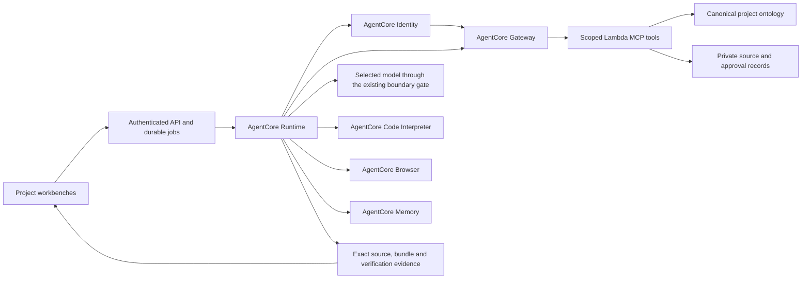

# Ontology-centered AgentCore implementation

Date: 2026-09-21. Status: offline/data implementation started; service integration gated, revision 4.
Authority: the user's platform clarification and explicit request to implement
AgentCore Code Interpreter, Browser, Memory, Gateway with Lambda MCP targets,
and Identity. This document is the implementation plan; a completed checklist
requires current test and deployment evidence.

Documentation update, 2026-09-23: use
[the completion validation document](ONTOLOGY_AGENTCORE_VALIDATION.md) as the
acceptance specification. Copy its tables into a private dated assessment,
including disposable Phase 0 probes, staging acceptance and the final decision.
This navigation update does not change revision 4's implementation requirements.

Implementation entry point, 2026-09-23:
[the platform architecture](ARCHITECTURE.md) connects this plan and its contracts
to the overall platform, incorporates the acceptance-review outcomes, and names
the next implementation units. Its existence does not satisfy the service gates
or replace the review history below.

Revision 4 addresses three independent plan-review rounds by
`claude-fable-5.1` and `gpt-5.6-sol`. Both agreed with the direction and requested
more precise contracts. The revised plan requires a new review before consensus
is recorded. It incorporates the user's repository-specific Kiro review and
explicit instruction to implement the findings. Both reviewers agree on the
direction; their latest plan verdict remains REVISE, with offline contract work
and disposable spikes permitted. The concrete contracts and tests below close
those decisions as implementation proceeds. No service integration or deployment
is certified by this document.

## Product objective

Build an Agentic AI Platform that connects work across planning, regulation,
UI/UX and frontend engineering. The supplied UI/UX material is a representative
input and acceptance case, not the application to reproduce.

The main workflow is:

1. Register exported HTML, images, design guidance and existing source files.
2. Retain immutable originals; identify, classify and connect reusable assets.
3. Connect assets to published products, regulations, procedures and actual code.
4. Analyze a proposed change against those relationships and source revisions.
5. Generate or modify React publishing source with the selected model.
6. Compile and inspect the exact source and its rendered behavior.
7. Let designers and frontend developers review, discuss, copy and download the
   source, or export an approved release to a registered Git destination.
8. Record the accepted revision and its relationships for later reuse.

Uploading a file is not approval. Downloading a component package is not this
entire workflow. Rendering an ontology visualization is not evidence that every
dependency has been discovered.

## Canonical ontology

The canonical authority is the **workspace project ontology**, extending the
`ontology` records and immutable project-scoped JSON projections published by
`workspace/collaboration.py`. Retain its membership, source IDs and approval
bindings. Add a project-wide manifest with source partitions: existing product
guidelines, eight-level design mappings and code/resource nodes. Existing
per-product publication IDs/hashes remain stable historical partitions.

`workbench/knowledge.py` becomes the authorized typed-graph/search/impact
projection of that canonical manifest. Import existing workbench declarations
through a reviewed adapter retaining namespace/provenance; after cutover they
are not a competing write authority. The bank impact graph in `graph/store`
(local/Neptune) remains an explicitly separate reference source. It is not
automatically joined, copied or authorized for a project. Selected references
require an allowed, version-bound import. New eight-level/code nodes belong
to the workspace canonical manifest, and workbench views/worklists derive from it.

The classification progresses from foundational resources to complete workflows:

```text
Foundation / Icon
  → Atom → Molecule → Organism → Pattern → PageTemplate → Screen → Procedure
```

These eight levels describe the design-to-workflow connection, not eight tabs or individual
components. Products, regulations, policies, source documents, code files,
tests and responsible teams connect across the design levels.

The graph must represent at least:

| Relationship | Meaning |
|---|---|
| composes / uses | A larger design element depends on a smaller element |
| implements | A code file or export implements a design element or screen |
| imports / references | Source code depends on another module or asset |
| governed-by | A product, screen or procedure is constrained by a rule |
| part-of / next | Membership and ordered procedure transitions |
| derived-from | Exact source artifact, document/page or code revision |
| owned-by | Responsible team; ownership does not itself propagate impact |

Reuse canonical project IDs and retain original design, developer and external
IDs as mappings. Node and edge evidence includes source revision/hash,
extraction method, review state and unresolved references. An explicit mapping
is declared evidence; an extracted import is structural evidence; a visual
interpretation is a candidate until reviewed.

Original binaries and source documents stay in private artifact storage.
The ontology stores identity, relationships and provenance, with bounded
retrieval of the original evidence. Current source permissions and tombstones
are checked on reads; a historical graph cannot restore revoked access.

## Source and code ingestion

Reuse the existing bounded upload, parsing and resumable corpus preparation.
Connect completed project assets and published product guidance to the canonical
ontology. Preserve original statuses separately from platform review.

For code, analyze actual TypeScript/TSX syntax, imports, exported symbols,
JSX component use and static asset references. Do not execute imported code.
Resolve relative paths conservatively and retain dynamic/unresolved references
as unknown coverage. The analyzer must retain the source path, byte hash and
location of each discovered dependency.

For HTML/images, preserve file and page identity, dimensions, extracted structure
and source evidence. Image-only input does not prove component semantics or
business behavior. Matching and model proposals must remain reviewable.

Asset changes produce new immutable revisions. Updating an image must reveal
the dependent elements, screens, procedures and code files, plus applicable
rules to recheck. An image change does not automatically amend those rules.
Unmapped code and truncated traversal must remain visible.

## AgentCore execution architecture



| Service | Required operational responsibility |
|---|---|
| Runtime | Execute durable, project-bound workflows and record actual stages |
| Gateway → Lambda MCP | Retrieve authorized ontology/source context and impact evidence through callable tools |
| Identity | Bind the workload to the verified actor and broker the configured outbound credential used by Gateway access |
| Code Interpreter | Analyze source and run the trusted React compiler with pinned dependencies |
| Browser | Inspect the exact static bundle using the existing assertion and accessibility checks |
| Memory | Persist scoped workflow decisions and source/evidence references across runtime sessions |

AgentCore is the execution path, not a cosmetic badge on local work. Once a
deployment selects this backend, an unavailable service blocks the affected
operation; it must not silently fall back to the prior Lambda implementation.
Keep the local adapters for deterministic offline tests and explicitly labelled
legacy paths.

The current Workspace API can retain its durable queue and dispatch transport.
The job execution itself must take place in Runtime. Reuse the existing approved
contract, model boundary, source-file policy, compiler, verifier and release
logic rather than introducing a second approval system.

## Identity and tool authority

The application continues to validate its Cognito user and current project
membership. AgentCore Identity does not replace application authorization.

The backend binds each execution to its verified actor, project, allowed
operation and expiry. Runtime derives its Identity context from that record,
not from model-authored arguments. AgentCore Identity brokers a dedicated
machine credential for the Gateway audience; credentials stay in memory and
are never stored in job results, memory events, source ZIPs or browser pages.

Create a **separate ontology Gateway and separate Lambda MCP target**.
The existing bank Gateway retains `AWS_IAM` inbound and `GATEWAY_IAM_ROLE`
target credentials, preserving current Harness/scenario clients.
Do not reuse or extend `agentcore/gateway_tools.py` for this workflow.
The new Gateway uses the dedicated Identity/JWT topology below.

Its execution role invokes only the new target. The new Lambda and Runtime
have no plane/bridge invocation, Registry write/reset or customer-profile
lookup permission. Package imports, IAM and network policy enforce the boundary;
an agent `allowedTools` list alone cannot do so. Preserve SPEC §11-4's
non-sensitive AgentCore scope and the separate private MyData path.

The target resolves the canonical execution record
and checks current project membership, source access and operation scope on
every call. An execution ID is a reference, not standalone authorization.
Model-visible tools must not accept an alternative actor, owner or project.

Do not connect a customer Git, Figma or Confluence service without a configured,
authorized endpoint and effective source access mapping. Exported files remain
the supported starting input.

## Compiler and browser boundary

Prepare a hash-verified tool archive from the pinned repository compiler,
component package and dependencies. Transfer it to the Code Interpreter session
without runtime package installation. Generated source is data for that compiler,
not a command, build configuration or package hook.

Distribute the large dependency bundle as a versioned immutable **S3 tool
archive**. The dedicated Interpreter execution role can read only approved,
non-customer tool-archive keys/versions. It has no source-store, plane, Registry,
model-invocation or broad S3 permission. Verify SANDBOX-mode S3 access in Phase 0.
Use authenticated file APIs for bounded job inputs/outputs; `writeFiles`
supports both text and binary content but is not the bulk toolchain path.

Probe actual sandbox architecture, OS and Node version. Build the archive
for that platform, including the correct native esbuild binary; do not reuse
an ARM64 worker dependency tree on an unknown architecture. Pin package/tool
bytes. Record and compatibility-gate the service-managed Node version rather
than claiming that the application pins it.

Code Interpreter commands are fixed platform operations. Keep file, process,
payload and execution limits. Record the actual service/session identity,
tool-archive hash, catalog hash and source/bundle hashes.

Browser sessions use an isolated VPC with no arbitrary internet egress.
The verifier fulfills only the exact approved bundle resources and blocks other
requests. Runtime credentials and source-store credentials never enter the page.
Connect through the authenticated automation channel, run the existing
assertion DSL, and retain real screenshots, accessibility and functional evidence.
Session start alone is not a passed check.

## Memory and model boundary

Memory is execution continuity, not the authority for products, regulations,
permissions or approvals. Persist bounded structured decisions and references,
not entire source documents, raw prompts or identity originals. Derive actor
and session namespaces from the verified project/actor context.

Before reusing a remembered decision, revalidate its referenced source and
approval revisions. An obsolete memory must not override a newer ontology.
Use explicit structured events without an unmeasured automatic model extraction
path. Any later semantic-memory strategy requires the same boundary inspection
as other bank model calls.

Create a dedicated Memory resource with **no long-term extraction strategies**.
Do not reuse the Harness `SEMANTIC` configuration or its Memory resources.
Use structured events with extraction disabled where supported and prove that
configuration in Phase 0. Existing Harness Memory is outside this cutover.

Preserve the user's selected model. Verify each requested Sonnet, Opus and
GPT-5.6 Sol account/region inference profile and boundary adapter.
**GPT-5.6 Sol is not in the current platform allowlist.** Add an exact provider
ID only after its existence, invocation and permitted route are verified.
Otherwise leave it unavailable; do not add a guessed alias or substitute
Astra/Fable. A Kiro model ID is not evidence of a Bedrock inference profile.
The model writes
design/composition/state code. Code Interpreter executes trusted tooling;
Browser supplies observed evidence.

The private MyData processing path and deterministic financial calculations
retain their existing boundaries. This change must not route raw identifiers
through AgentCore or permit models to invent financial values.

## Generation and handoff

Generation consumes a source-bound ontology context: selected design elements,
approved component package, published product/rule revisions, procedure/state
requirements and any existing React baseline. Record the context fingerprint.
Changes to relevant sources require fresh validation.

Keep new design, reuse and scoped modification available. Apply a reviewed
file-change allowance when modifying existing code. Repair against the same
criteria and retain each failed round's evidence.

Frontend review must provide rendered behavior, source-file browsing,
copy/download, actual added/modified/deleted files, dependency impact and
verification results. Keep publishing approval separate from frontend acceptance
and real API/authentication integration.

Approval binds the exact source, kit, ontology context, rules, bundle and
evidence. Release rebuilds that approved source without asking a model to
regenerate it. Git export retains the registered-destination and feature-branch
restrictions.

## Owning contracts

[The execution contract](../workspace/AGENTCORE_CONTRACT.md) contains the requirements
adopted by SPEC §7-2, including authorization, capability gates and staged rollout.
[The ontology implementation contract](../workspace/ONTOLOGY_CONTRACT.md) defines
the current data/API interfaces. This dated plan does not change either contract.
The plan-review outcomes above are historical; they do not certify deployment.

## Dependency and migration register

The repository baseline for implementation is `8b9268b`. These are named
compatibility dependencies, not assertions of currently operating services.

| Authority / interface | Owner | Required compatibility |
|---|---|---|
| `SPEC.md` §7-1, `workspace/REACT_CONTRACT.md` | Platform + UX/FE | Extend context/backend receipts; retain exact approval/release gates |
| `workspace/CONTRACT.md`, `GUIDELINES.md` | Intake | Add projection hooks; preserve originals, budgets, IDs and source statuses |
| `workbench/CONTRACT.md` | Ontology/workbench | Project the workspace canonical ontology; preserve source ACLs and worklists |
| `workspace/storage.py` job/CAS interfaces | Platform runtime | Versioned attempts/fences; no sequential publication fallback |
| `react-kit/manifest.cjs`, `policy.cjs`, `compile.cjs` | Frontend platform | Pin archive/profile; no substitution for an absent customer SDK |
| `workspace/browser.py` / React verifier | Verification | Replace transport; preserve assertion DSL and evidence criteria |
| `engine/gate.py` / model catalog | Model boundary | Preserve inspection/selection; qualify actual provider IDs |
| Release/Git interfaces | Release | Exact-source rebuild, current access and conflict handling |
| New execution-authority / KMS key registry | Platform identity | Signed execution capabilities, key rotation/revocation and negative isolation tests |
| `docs/CONTRACTS.md`, `platform/README.md` | Platform integration | Actual service roles, RPC/receipt schemas and legacy/backend labels |
| `docs/REVIEW_CONTEXT.md`, SPEC §11-4 | Platform review/security | Distinguish the three graphs, separate Gateways and non-sensitive AgentCore scope |

Record complete baseline file/blob hashes and supported schema versions before
adapter work. Update owning contracts and compatibility tests together.
Dual-read adapters may preserve historical metadata but cannot promote it to
new approval. Migrate to a staging generation, compare identity/authority/paths,
then publish atomically. Rollback cannot roll back revocation.

## Capability and rollout gates

Follow the capability gates and vertical acceptance case in the owning execution
contract. Keep private account/service receipts separate from offline tests and
code-review results. Complete the applicable gates before production admission.

## Implementation sequence

1. Record this plan and extend the applicable interface contracts.
2. Complete the offline ontology/analyzer gate and disposable service probes.
   Complete the remaining Phase 0 service gates before adapter activation/cutover.
3. Implement canonical ontology projection, eight-level mappings, source/code
   extraction, reverse impact and generation-context selection.
4. Implement AgentCore service adapters and scoped Gateway Lambda tools.
5. Provision Runtime, Interpreter, isolated Browser, Memory, Identity and
   authenticated Gateway resources with least-privilege roles.
6. Connect durable workspace jobs, ingestion, generation and release to the
   AgentCore adapters; expose actual readiness and evidence in the workbenches.
7. Validate the vertical case and negative isolation/failure cases.
8. Complete staged rollout and latest-HEAD review/CI. Merge and publication
   remain separate from validated operating-service readiness.

## Acceptance evidence

| Case | Required evidence |
|---|---|
| Input registration | HTML/image/source originals retained with hashes and source-bound graph nodes |
| Cross-team context | Published product and rule evidence connected to design and code |
| Eight-level composition | Inspectable mappings with supported composition directions and explicit unknowns |
| Image change | Reverse dependency paths reach actual code references and affected screens |
| Code analysis | Known static imports/JSX/assets found; dynamic and missing references are not falsely resolved |
| Generation | Selected model and ontology context appear in the execution receipt |
| Code Interpreter | Actual session executes the pinned analyzer/compiler; invalid source fails |
| Browser | Actual AgentCore session runs behavior and accessibility checks against the same bundle |
| Gateway and Identity | Identity-brokered credential reaches the authenticated Gateway and scoped Lambda tools |
| Memory | A later execution retrieves a permitted prior decision; stale/revoked references are excluded |
| Handoff | Source can be reviewed, copied/downloaded and rebuilt with matching hashes |
| Isolation and sharing | Exact-revision authorized sharing succeeds; unauthorized cross-project, revoked-grant/role, expired-execution and stale-source requests fail |
| Failure behavior | Missing service, malformed receipt or incomplete checks block success without fallback |
| Deployment | Current account/resource identity and authenticated live end-to-end receipts, separate from CI |

Use synthetic acceptance data in public tests. Customer archives, extracted
review material, credentials and private production receipts remain outside Git.
Record any unimplemented acceptance row explicitly; a resource in READY state
does not complete that row.
